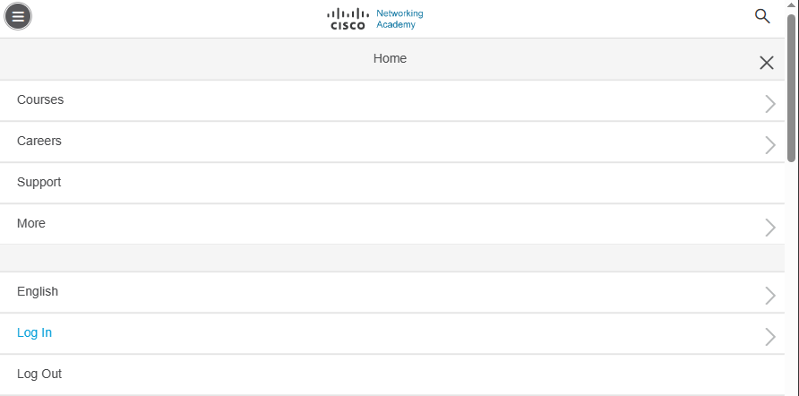
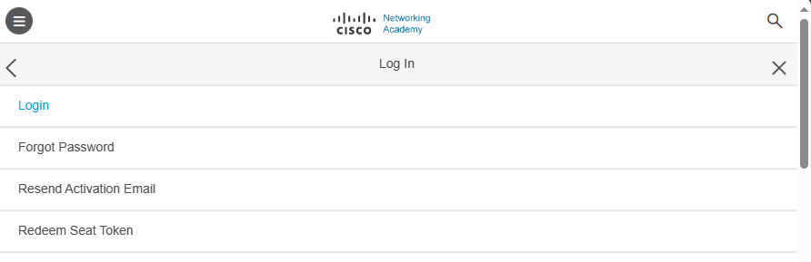
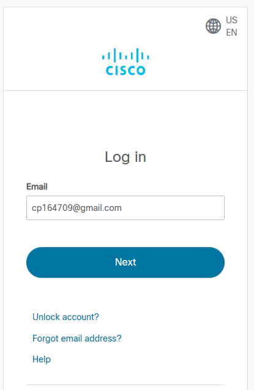
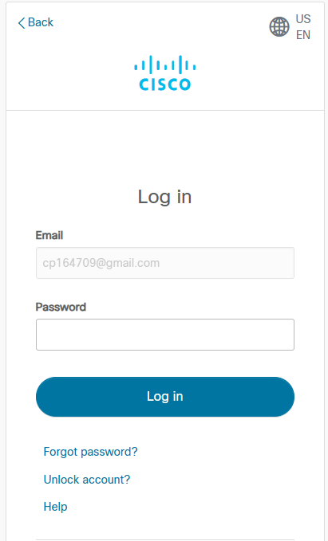
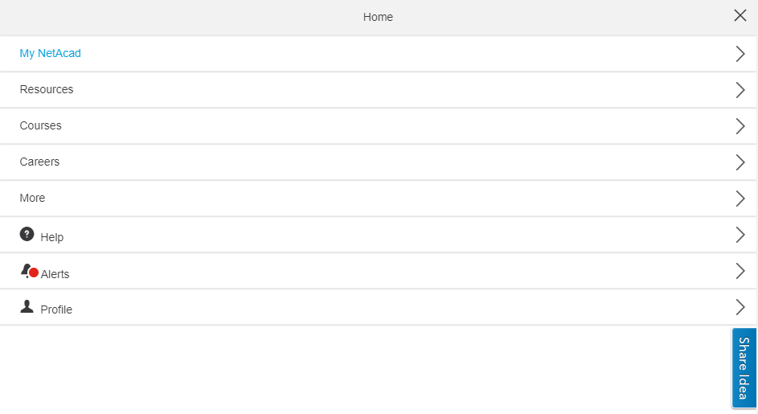
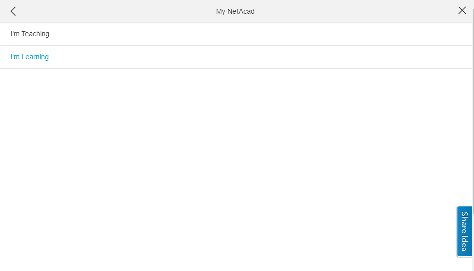
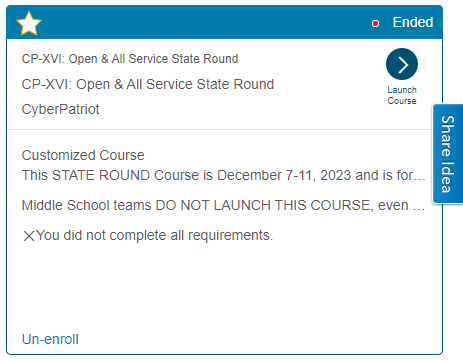
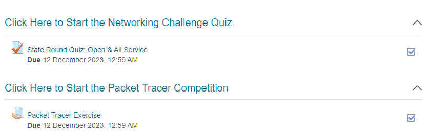

# STEAM Academy CyberPatriot Documentation

## Contents

- [Virtual Machines](#virtual-machines)
	- [Getting Started with the VMs](#getting-started-with-the-vms)
  - [Images](#images)
	  - [Windows 10](Windows_10.md)
	  - [Windows Server](Server.md)
	  - [Ubuntu 22](Ubuntu.md)
	  - [Debian](Debian.md)
- [Cisco Networking Academy](#cisco-networking-academy)
	- [Getting Started with PT](#getting-started-with-pt)
  - [Networking Academy](#networking-academy)
  - [Useful Modules](#useful-modules)
- [Net Academy Quiz](#net-academy-quiz)
	- [How to Complete the Quiz](#how-to-complete-the-quiz)

---

# Virtual Machines

### Getting Started with the VMs

- Where to download VM images
- Loading the images into VMware
   
>:warning: **DO NOT HAVE TWO INSTANCES OF ONE IMAGE OPEN SIMULTANEOUSLY** :warning:

- Entering the UID
- Understanding the README, scoring sheet, and forensics questions
- Stop scoring

>:warning: **DELETE THE IMAGES WHEN YOU ARE DONE** :warning:

---

### Images

- [Windows 10](Windows_10.md)
- [Windows Server](Server.md)
- [Ubuntu](Ubuntu.md)
- [Debian](Debian.md)

# Cisco Networking Academy

### Getting Started with PT

### Networking Academy

- **Logging In**

	1. Navigate to [Networking Academy](www.netacad.com)
	2. At the top left of the screen select the sandwich icon.

	

	3. Select "Log In"
      
	

	4. Select "Login"
 
	

	5. Enter your team's email address (Ex. cp164709@gmail.com) and choose "Next"

	

	6. Enter your team's password then press "Log In"
				
	

- **Launching the Course**

	1. At the top left of the screen select the sandwich icon.

	

	2. Select "My NetAcad"

	

	3. Select "I'm Learning"

	

	4. Look for the "course" which applies to the round of CyberPatriot your are
      taking part in, then select "Launch Course"

	

	5. Choose either the Packet Tracer activity or the Networking Challenge Quiz

	
	
- Downloading the project
- Opening the project
- Brief tour
- Saving and submitting the project

### Useful Modules

- [Module 16 \(VPN\)](Packet_Tracer/Module16.md)
- [Module 17 \(ASA\)](Packet_Tracer/Module17.md)
	- Unfinished
- [Module 18 \(Firewalls\)](Packet_Tracer/Module18.md)
	- Unfinished

# Net Academy Quiz

### How to Complete the Quiz

- Logging into Networking Academy
- Opening the quiz
- Answering the questions
- Submitting the quiz

