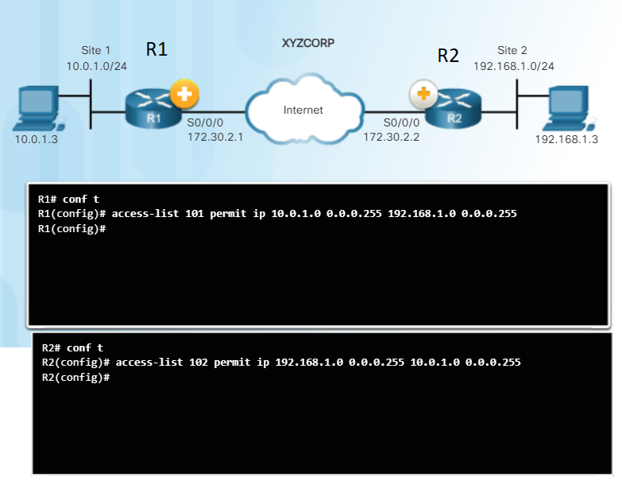

[Back](/README.md)

# IPsec

## IPsec Components

### Confidentiality

> Confidentiality involves encrypting the data. The longer the key the more secure the encryption is.

- DES
	- Uses a 56 bit key
- 3DES
	- Uses 3 56 bit keys per 64 bit block
  - More secure than DES
- AES
	- Provides more security than DES
  - More computationally efficient than DES
  - Offers keys of 128 bit, 192 bit, or 256 bit
- SEAL
	- SEAL is a stream cipher
  - Encrypts data continuously as opposed to blocks of data
  - Uses a 160 bit key

### Integrity

> Integrity ensures that the data sent is exactly what is recieved.

- MD5
	- Uses 128 bit shared secret key
  - The message and key are combined and run through the HMAC-MD5 hashing algorithm
  - outputs a 128 bit hash
- SHA
	- Recommended to use at least SHA-256
  - Uses a 160 bit secret key
  - The message and key are combined then run through the HMAC-SHA-1 hash algorithm
  - outputs a 160 but hash

### Authentication

> Authentication ensures that the person on the other end of the VPN is who they say they are.

- PSK
	- A pre-shared secret key is manually entered into each computer
  - Not very scaleable
- RSA
	- The local device gets a hash and encrypts it using a private key
  - The encrypted has is attached to the message and sent with the message
  - At the remote end the has is decrypted using the public key
  - A hash is recomputed and if it matches the decrypted hash then it is genuine
  - Both peers must authenticate the opposite peer before the tunnel is secure

### Secure Key Exchange (Diffie-Hellman)

> Allows two peers to establish a shared secret key even though it is over an insecure channel.
> 

- DH 1-5
	- uses 768, 1024, and 1536 bits
  - not rocommended since 2012
  - only supports DES and 3DES
- DH 14, 15, 16
	- uses 2048, 3072, and 4096 bits
  - recommended until 2030
- DH 19, 20, 21, 24
	- uses 256, 284, 521 and 2048 bits
  - uses Elliptical Curve Cryptography (ECC) to reduce time for key generation

RFC 4869 defines a set of cryptographic algorithms to adhere to National Security Agency (NSA) standards for classified information. Called Suite B, it includes these specified algorithms:

- Encryption should use AES 128 or 256-bit keys
- Hashing should use SHA-2
- Digital Signatures should use Elliptic Curve Digital Signature Algorithm (ECDSA) with 256- or 384-bit prime moduli
- Key exchange should use Elliptic Curve Diffie-Hellman (ECDH)

### IPsec Protocol

> The choice of either using Authentication Header(AH) or Encapsulation Security Protocol (ESP)
> determines which other protocols are possible

- AH
	- uses IP protocol 51
  - provides data authentication and integrity
  - does not provide any confidentiality (encryption)
  - 
- ESP
	- uses IP protocol 50
  - provides confidentiality and authentication
  - both confidentiality and authentication are optional but one must be used
  - 

## IPsec Negotiation Steps

1. An ISAKMP tunnel is initiated when "interesting traffic is sent"

> Traffic is considered interesting when it travels between
> the peers and meets the criteria that are defined in an ACL.

2. IKE Phase 1 begins

> Peers negotiate on an ISAKMP SA policy.
> When both peers agree a tunnel is created.

3. IKE Phase 2 begins

> The IPsec peers use the authenticated secure tunnel to negotiate the IPsec SA policy.
> The negotiation of the shared policy determines how the IPsec tunnel is established.

4. IPsec tunnel is created

> Data is transferred between peers based on the IPsec SAs.

5. IPsec tunnel terminates

> The tunnel is terminated either when it is manually deleted or the lifetime expires.

## ACL Configuration

# ISAKMP Policy
`show crypto isakmp policy`

Show the current policy

`crypto isakmp policy`

configure the isakmp policy

configure the HAGLE

> Hash  
> Authentication  
> Group  
> Lifetime  
> Encryption

## Example

	R1(config)# crypto isakmp policy 1
	R1(config-isakmp)# authentication pre-share
	R1(config-isakmp)# group 24
	R1(config-isakmp)# lifetime 3600
	R1(config-isakmp)# encryption aes 256
	R1(config-isakmp)# end
	R1# show crypto isakmp policy

	Global IKE policy
	Protection of priority 1
		encryption algorithm:   AES - Advanced Encryption Standard (256 bit keys).
		hash algorithm:         Secure Hash Standard
		authentication method:  Pre-Shared Key
		Diffie-Hellman group:   #24 (2048 bit, 256 bit subgroup)
		lifetime:               3600 seconds, no volume limit

configure pre-shared key

`crypto isakmp key <keystring> address <peer-address>`

`crypto isakmp key <hostname> address <peer-hostname>`

`peer-address` and `peer-hostname` should be the IP addresses of the opposite router

## Define Interesting Traffic

It is required to define what traffic is "interesting"
This is traffic that isakmp will allow through

## Configure IPSec Transform Set

`crypto ipsec transform-set <name> esp-aes esp-sha-hmac`

## Crypto Map

`crypto map  <map-name> <seq-num> ipsec-isakmp`

> The commands for R1 and R2 are almost identical
>
> Replace the following lines

`R1(config-crypto-map)# match address 101` becomes `R2(config-crypto-map)# match address 102`

`R1(config-crypto-map)# set peer 172.30.2.2` becomes `R2(config-crypto-map)# set peer 172.30.2.1`

interface the outgoing port

run `crypto map <map-name>`

use `show crypto map` to verify that everything is set up properly

test the connection by sending interesting traffic  
to do this run `ping ip <destination> source <user>`

Example:  

