[Back](/Docs.md)

# NetAcademy/CyberPatriot Packet Tracer Module 18
> :warning: Incomplete. See Net Academy CCNA Security: chapters 4-7, and 11 for more information.

## 4.0.1.1 - Implementing Firewall Technologies

Types of firewalls include:
- packet filtering
- stateful
- application gateway
- proxy
- address translation
- host-based
- transparent
- hybrid

## 4.1.1.1 - Introduction to Access Control Lists

What are ACLs?
- Used for mitigating network attacks and controlling network traffic
- Admins can use ACLs to define and control classes of traffic on networking devices to meet security requirements
- Can be defined for Layer 2, Layer 3, Layer 4, Layer 7 of the Open Systems Interconnection (OSI) model
- Most common types of ACLs use IPv4 and IPv6 addresses and Transmission Control Protocol (TCP) and User Datagram Protocol (UDP) port numbers
- Standard and extended IPv4 ACLs can be named or numbered
- IPv6 ACLs must use a name

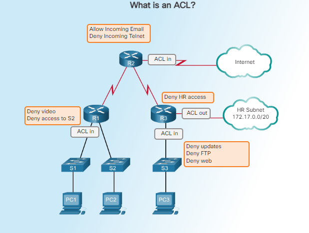

## 4.1.1.2 - Configuring Numbered and Named ACLs

- ACLs are sequential lists of permit or deny statements known as access control entries (ACEs), or ACL statements
- ACEs can be created to filter traffic based on criteria like: the source address, destination address, the protocol, and port numbers
- Standard ACLs match packets by examining the source IP address field in the IP header of that packet, these are used to filter packets based on Layer 3 source info
- Extended ACLs match packets based on Layer 3 and Layer 4 source and desination information
- Layer 4 can include TCP and UDP port information
- Extended ACLs are more flexible and offer more control

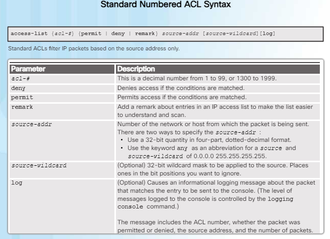

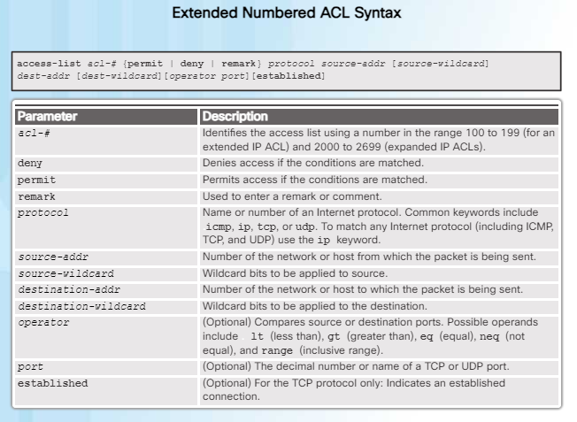

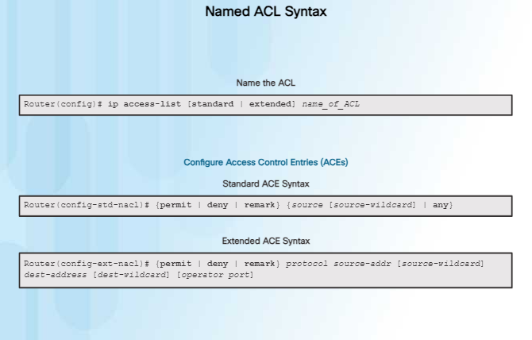

## 4.1.1.3 - Applying an ACL

- Figure 1 shows the syntax to apply an ACL to an interface or vty lines (Virtual Terminal, or Virtual Teletype)

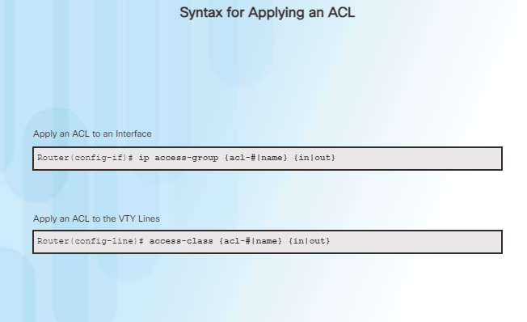

*Figure 1*

- Figure 2 shows a named standard ACL applied to outbound traffic

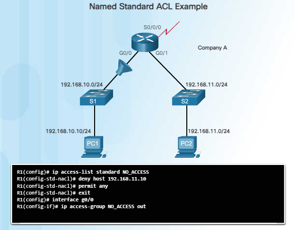

*Figure 2*

- Figure 3 shows two named extended ACLs, one named SURFING and the other, BROWSING. SURFING is applied to inbound traffic and BROWSING is applied to outbound traffic.

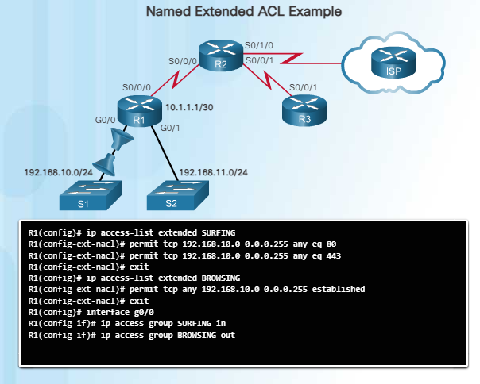

*Figure 3*

- Figure 4 shows a named standard ACL applied to inbound traffic on the vty lines, with logging enabled. Logging should only be used when the network is under attack, as it drastically affets the performance of the device.

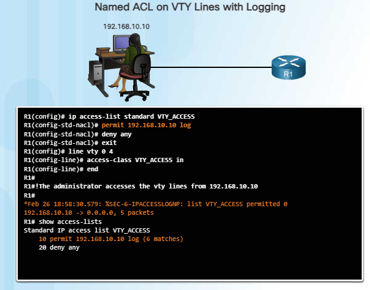

*Figure 4*

## 4.1.1.4 - ACL Configuration Guidelines

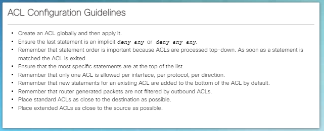

## 4.1.1.5 - Editing Existing ACLs

- Sequence numbering is in instances of 10 by default
- Each number is assigned to an ACE
- ACLs can be edited using the sequence numbers
- If no sequence number is specified for a new ACE, it is placed at the bottom of the list and given a number automatically

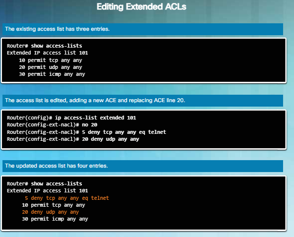

## 4.1.1.6 - Sequence Numbers and Standard ACLs

- IOS uses a hashing function to determine the order of host statements (those with specific IPv4 addresses)
- The order is optimized for searching, not in order of addresses

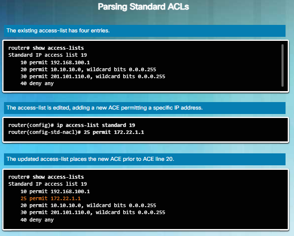

