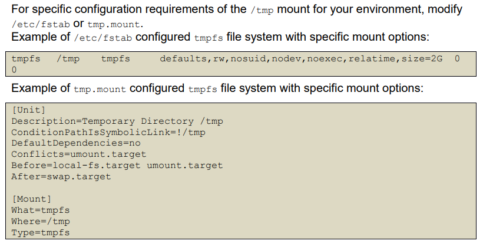

# Ubuntu 22

## Contents

### Other Pages
- [Main Page](README.md)
- [Windows 10](Windows_10.md)
- [Windows Server](Server.md)
- [Debian](Debian.md)

### Sub Headings
- [Ubuntu 22](#ubuntu-22)
	- [Contents](#contents)
		- [Other Pages](#other-pages)
		- [Sub Headings](#sub-headings)
	- [1 Initial Setup](#1-initial-setup)
		- [1 Filesystem Configuration](#1-filesystem-configuration)
			- [1 Disable Unused Filesystems](#1-disable-unused-filesystems)
			- [2 Configure tmp](#2-configure-tmp)
			- [3 Configure var](#3-configure-var)
			- [4 Configure var tmp](#4-configure-var-tmp)
			- [5 Configure var log](#5-configure-var-log)
			- [6 Configure var log audit](#6-configure-var-log-audit)
			- [7 Configure home](#7-configure-home)
			- [8 Configure dev shm](#8-configure-dev-shm)
			- [9 Disable Automounting](#9-disable-automounting)
			- [10 Disable USB Storage](#10-disable-usb-storage)
		- [2 Configure Software Updates](#2-configure-software-updates)
		- [3 Filesystem Integrity Checking](#3-filesystem-integrity-checking)
		- [4 Secure Boot Settings](#4-secure-boot-settings)
		- [5 Additional Process Hardening](#5-additional-process-hardening)
		- [6 Mandatory Access Control](#6-mandatory-access-control)
			- [1 Configure AppArmor](#1-configure-apparmor)
		- [7 Command Line Warning Banners](#7-command-line-warning-banners)
		- [8 GNOME Display Manager](#8-gnome-display-manager)
		- [9 Ensure updates patches and additional security software are installed](#9-ensure-updates-patches-and-additional-security-software-are-installed)
	- [2 Services](#2-services)
		- [1 Configure Time Synchronization](#1-configure-time-synchronization)
			- [1 Ensure Time Synchronization is in use](#1-ensure-time-synchronization-is-in-use)
			- [2 Configure chrony](#2-configure-chrony)
			- [3 Configure systemd-timesyncd](#3-configure-systemd-timesyncd)
			- [4 Configure ntp](#4-configure-ntp)
		- [2 Special Purpose Services](#2-special-purpose-services)
		- [3 Service Clients](#3-service-clients)
		- [4 Ensure Nonessential Services are Removed or Masked](#4-ensure-nonessential-services-are-removed-or-masked)
	- [3 Network Configuration](#3-network-configuration)
		- [1 Disable Unused Network Protocols and Devices](#1-disable-unused-network-protocols-and-devices)
		- [2 Network Parameters Host Only](#2-network-parameters-host-only)
		- [3 Network Parameters Host and Router](#3-network-parameters-host-and-router)
		- [4 Uncommon Network Protocols](#4-uncommon-network-protocols)
		- [5 Firewall Configuration](#5-firewall-configuration)
			- [1 Disable unused network protocols and devices](#1-disable-unused-network-protocols-and-devices)
			- [2 Network Parameters Host Only](#2-network-parameters-host-only)
			- [3 Network Parameters Host and Router](#3-network-parameters-host-and-router)
			- [4 Uncommon Network Protocols](#4-uncommon-network-protocols)
			- [5 Firewall Configurations](#5-firewall-configurations)
				- [1 Configure UncomplicatedFirewall](#1-configure-uncomplicatedfirewall)
				- [2 Configure nftables](#2-configure-nftables)
				- [3 Configure iptables](#3-configure-iptables)
					- [1 Configure iptables software](#1-configure-iptables-software)
					- [2 Configure IPV4 iptables](#2-configure-ipv4-iptables)
					- [3 Configure IPV6 ip6tables](#3-configure-ipv6-ip6tables)
	- [4 Logging and Auditing](#4-logging-and-auditing)
		- [1 Configure System Accounting (auditd)](#1-configure-system-accounting-auditd)
    		- [1 Configure System Accounting auditd](#1-configure-system-accounting-auditd)
		- [2 Configure Logging](#2-configure-logging)
	- [5 Access Authentication and Authorization](#5-access-authentication-and-authorization)
		- [1 Configure time-based job schedulers](#1-configure-time-based-job-schedulers)
		- [2 Configure SSH Server](#2-configure-ssh-server)
		- [3 Configure privilege escalation](#3-configure-privilege-escalation)
		- [4 Configure PAM](#4-configure-pam)
		- [5 User Account and](#5-user-account-and)
	- [6 System Maintenance](#6-system-maintenance)
		- [1 System File Permission](#1-system-file-permission)
		- [2 Local User and Group Settings](#2-local-user-and-group-settings)

---

> Commands starting with `#` may require you to start the command with `sudo` instead.

> Many instructions contain commands both to check and change settings. Many settings will be already set so you do not need to run the commands to fix them. There are some commands where you don't need to check, but the instructions have still been included. It is recommended to run the commands to check unless you know what the command does.

## 1 Initial Setup
### 1 Filesystem Configuration
#### 1 Disable Unused Filesystems
1. Ensure mounting of cramfs filesystems is disabled (Automated)

Run the following script to check if the filesystem is installed
``` bash
#!/usr/bin/env bash
{
	l_output="" l_output2=""
	l_mname="cramfs" # set module name
	# Check how module will be loaded
	l_loadable="$(modprobe -n -v "$l_mname")"
	if grep -Pq -- '^\h*install \/bin\/(true|false)' <<< "$l_loadable"; then
		l_output="$l_output\n - module: \"$l_mname\" is not loadable: \"$l_loadable\""
	else
		l_output2="$l_output2\n - module: \"$l_mname\" is loadable: \"$l_loadable\""
	fi
	# Check is the module currently loaded
	if ! lsmod | grep "$l_mname" > /dev/null 2>&1; then
		l_output="$l_output\n - module: \"$l_mname\" is not loaded"
	else
		l_output2="$l_output2\n - module: \"$l_mname\" is loaded"
	fi
	# Check if the module is deny listed
	if grep -Pq -- "^\h*blacklist\h+$l_mname\b" /etc/modprobe.d/*; then
		l_output="$l_output\n - module: \"$l_mname\" is deny listed in: \"$(grep -Pl -- "^\h*blacklist\h+$l_mname\b" /etc/modprobe.d/*)\""
	else
		l_output2="$l_output2\n - module: \"$l_mname\" is not deny listed"
	fi
	# Report results. If no failures output in l_output2, we pass
	if [ -z "$l_output2" ]; then
		echo -e "\n- Audit Result:\n ** PASS **\n$l_output\n"
	else
		echo -e "\n- Audit Result:\n ** FAIL **\n - Reason(s) for audit failure:\n$l_output2\n"
		[ -n "$l_output" ] && echo -e "\n- Correctly set:\n$l_output\n"
	fi
}
```
Run the following script to remove the filesystem

``` bash
#!/usr/bin/env bash
{
	l_mname="cramfs" # set module name
	if ! modprobe -n -v "$l_mname" | grep -P -- '^\h*install \/bin\/(true|false)'; then
		echo -e " - setting module: \"$l_mname\" to be not loadable"
		echo -e "install $l_mname /bin/false" >> /etc/modprobe.d/"$l_mname".conf
	fi
	if lsmod | grep "$l_mname" > /dev/null 2>&1; then
		echo -e " - unloading module \"$l_mname\""
		modprobe -r "$l_mname"
	fi
	if ! grep -Pq -- "^\h*blacklist\h+$l_mname\b" /etc/modprobe.d/*; then
		echo -e " - deny listing \"$l_mname\""
		echo -e "blacklist $l_mname" >> /etc/modprobe.d/"$l_mname".conf
	fi
}
```


2. Ensure mounting of squashfs filesystems is disabled (Automated)

> Snap packages use this filesystem

Run the following script to check if the filesystem is installed
``` bash
#!/usr/bin/env bash
{
	l_output="" l_output2=""
	l_mname="squashfs" # set module name
	# Check how module will be loaded
	l_loadable="$(modprobe -n -v "$l_mname")"
	if grep -Pq -- '^\h*install \/bin\/(true|false)' <<< "$l_loadable"; then
		l_output="$l_output\n - module: \"$l_mname\" is not loadable: \"$l_loadable\""
	else
		l_output2="$l_output2\n - module: \"$l_mname\" is loadable: \"$l_loadable\""
	fi
	# Check is the module currently loaded
	if ! lsmod | grep "$l_mname" > /dev/null 2>&1; then
		l_output="$l_output\n - module: \"$l_mname\" is not loaded"
	else
		l_output2="$l_output2\n - module: \"$l_mname\" is loaded"
	fi
	# Check if the module is deny listed
	if grep -Pq -- "^\h*blacklist\h+$l_mname\b" /etc/modprobe.d/*; then
		l_output="$l_output\n - module: \"$l_mname\" is deny listed in: \"$(grep -Pl -- "^\h*blacklist\h+$l_mname\b" /etc/modprobe.d/*)\""
	else
		l_output2="$l_output2\n - module: \"$l_mname\" is not deny listed"
	fi
	# Report results. If no failures output in l_output2, we pass
	if [ -z "$l_output2" ]; then
		echo -e "\n- Audit Result:\n ** PASS **\n$l_output\n"
	else
		echo -e "\n- Audit Result:\n ** FAIL **\n - Reason(s) for audit failure:\n$l_output2\n"
		[ -n "$l_output" ] && echo -e "\n- Correctly set:\n$l_output\n"
	fi
}

```
Run the following script to remove the filesystem

``` bash
#!/usr/bin/env bash
{
 l_mname="squashfs" # set module name
 if ! modprobe -n -v "$l_mname" | grep -P -- '^\h*install \/bin\/(true|false)'; then
	echo -e " - setting module: \"$l_mname\" to be not loadable"
	echo -e "install $l_mname /bin/false" >> /etc/modprobe.d/"$l_mname".conf
 fi
 if lsmod | grep "$l_mname" > /dev/null 2>&1; then
	echo -e " - unloading module \"$l_mname\""
	modprobe -r "$l_mname"
 fi
 if ! grep -Pq -- "^\h*blacklist\h+$l_mname\b" /etc/modprobe.d/*; then
	echo -e " - deny listing \"$l_mname\""
	echo -e "blacklist $l_mname" >> /etc/modprobe.d/"$l_mname".conf
 fi
}

```

3. Ensure mounting of udf filesystems is disabled (Automated)

> Microsoft Azure uses this filesystem

Run the following script to check if the filesystem is installed
``` bash
#!/usr/bin/env bash
{
	l_output="" l_output2=""
	l_mname="udf" # set module name
	# Check how module will be loaded
	l_loadable="$(modprobe -n -v "$l_mname")"
	if grep -Pq -- '^\h*install \/bin\/(true|false)' <<< "$l_loadable"; then
		l_output="$l_output\n - module: \"$l_mname\" is not loadable: \"$l_loadable\""
	else
		l_output2="$l_output2\n - module: \"$l_mname\" is loadable: \"$l_loadable\""
	fi
	# Check is the module currently loaded
	if ! lsmod | grep "$l_mname" > /dev/null 2>&1; then
		l_output="$l_output\n - module: \"$l_mname\" is not loaded"
	else
		l_output2="$l_output2\n - module: \"$l_mname\" is loaded"
	fi
	# Check if the module is deny listed
	if grep -Pq -- "^\h*blacklist\h+$l_mname\b" /etc/modprobe.d/*; then
		l_output="$l_output\n - module: \"$l_mname\" is deny listed in: \"$(grep -Pl -- "^\h*blacklist\h+$l_mname\b" /etc/modprobe.d/*)\""
	else
		l_output2="$l_output2\n - module: \"$l_mname\" is not deny listed"
	fi
	# Report results. If no failures output in l_output2, we pass
	if [ -z "$l_output2" ]; then
		echo -e "\n- Audit Result:\n ** PASS **\n$l_output\n"
	else
		echo -e "\n- Audit Result:\n ** FAIL **\n - Reason(s) for audit failure:\n$l_output2\n"
		[ -n "$l_output" ] && echo -e "\n- Correctly set:\n$l_output\n"
	fi
}
```
Run the following script to remove the filesystem

``` bash
#!/usr/bin/env bash
{
	l_mname="udf" # set module name
	if ! modprobe -n -v "$l_mname" | grep -P -- '^\h*install \/bin\/(true|false)'; then
		echo -e " - setting module: \"$l_mname\" to be not loadable"
		echo -e "install $l_mname /bin/false" >> /etc/modprobe.d/"$l_mname".conf
	fi
	if lsmod | grep "$l_mname" > /dev/null 2>&1; then
		echo -e " - unloading module \"$l_mname\""
		modprobe -r "$l_mname"
	fi
	if ! grep -Pq -- "^\h*blacklist\h+$l_mname\b" /etc/modprobe.d/*; then
		echo -e " - deny listing \"$l_mname\""
		echo -e "blacklist $l_mname" >> /etc/modprobe.d/"$l_mname".conf
	fi
```

#### 2 Configure tmp
1. Ensure /tmp is a separate partition (Automated)

Run the following command and verify the output shows that `/tmp` is mounted.

```
# findmnt --kernel /tmp
TARGET SOURCE FSTYPE OPTIONS 
/tmp tmpfs tmpfs rw,nosuid,nodev,noexec,inode6
```

Ensure that systemd will mount the `/tmp` partition at boot time.

`# systemctl is-enabled tmp.mount`
`enabled`

First ensure that systemd is correctly configured to ensure that `/tmp` will be mounted at 
boot time.

`# systemctl unmask tmp.mount`

> **More Information**
> 
> 

[\[1\]](https://www.freedesktop.org/wiki/Software/systemd/APIFileSystems/)
[\[2\]](https://www.freedesktop.org/software/systemd/man/latest/systemd-fstab-generator.html)

2. Ensure nodev option set on `/tmp` partition (Automated)

> This follows the same steps as 3. and 4.

Verify that the `nodev` option is set for the `/tmp` mount.
Run the following command to verify that the `nodev` mount option is set.
Example:

```
# findmnt --kernel /tmp | grep nodev

/tmp tmpfs tmpfs rw,nosuid,nodev,noexec,relatime,seclabel
```

Edit the `/etc/fstab` file and add `nodev` to the fourth field (mounting options) for the `/tmp`
partition.
Example:

`<device> /tmp <fstype> defaults,rw,nosuid,nodev,noexec,relatime 0 0`

Run the following command to remount `/tmp` with the configured options:

`# mount -o remount /tmp`

3. Ensure noexec option set on /tmp partition (Automated)

> This follows the same steps as 2. and 4.

Verify that the `noexec` option is set for the `/tmp` mount.
Run the following command to verify that the `noexec` mount option is set.
Example:

```
# findmnt --kernel /tmp | grep noexec

/tmp tmpfs tmpfs rw,nosuid,nodev,noexec,relatime,seclabel
```

Edit the `/etc/fstab` file and add `noexec` to the fourth field (mounting options) for the 
`/tmp` partition.
Example:

`<device> /tmp <fstype> defaults,rw,nosuid,nodev,noexec,relatime 0 0`

Run the following command to remount `/tmp` with the configured options:

`# mount -o remount /tmp`

4. Ensure nosuid option set on /tmp partition (Automated)

> This follows the same steps as 2. and 3.

Verify that the `nosuid` option is set for the `/tmp` mount.
Run the following command to verify that the `nosuid` mount option is set.
Example:

```
# findmnt --kernel /tmp | grep nosuid

/tmp tmpfs tmpfs rw,nosuid,nodev,noexec,relatime,seclabel
```

Edit the `/etc/fstab` file and add `nosuid` to the fourth field (mounting options) for the 
`/tmp` partition.
Example:

`<device> /tmp <fstype> defaults,rw,nosuid,nodev,noexec,relatime 0 0`

Run the following command to remount `/tmp` with the configured options:

`# mount -o remount /tmp`

#### 3 Configure var
1. Ensure separate partition exists for /var (Automated)

Run the following command and verify output shows /var is mounted.
Example:

```
# findmnt --kernel /var

TARGET SOURCE FSTYPE OPTIONS
/var /dev/sdb ext4 rw,relatime,seclabel,data=ordered
```

For new installations, during installation create a custom partition setup and specify a 
separate partition for `/var`.
For systems that were previously installed, create a new partition and configure 
`/etc/fstab` as appropriate.

> When modifying `/var` it is advisable to bring the system to emergency mode (so auditd 
is not running), rename the existing directory, mount the new file system, and migrate 
the data over before returning to multi-user mode.

[\[1\]](https://tldp.org/HOWTO/LVM-HOWTO/)

2. Ensure nodev option set on /var partition (Automated)

> This follows the same steps as 3.

Verify that the `nodev` option is set for the `/var` mount.
Run the following command to verify that the `nodev` mount option is set.
Example:

```
# findmnt --kernel /var

/var /dev/sdb ext4 rw,nosuid,nodev,relatime,seclabel
```

> **IF** output is produced, ensure it includes the `nodev` option

**IF** the `/var` partition exists, edit the `/etc/fstab` file and add `nodev` to the fourth field 
(mounting options) for the `/var` partition.
Example:

`<device> /var <fstype> defaults,rw,nosuid,nodev,relatime 0 0`

Run the following command to remount `/var` with the configured options:

`# mount -o remount /var`

3. Ensure nosuid option set on /var partition (Automated)

> This follows the same steps as 3.

Verify that the `nosuid` option is set for the `/var` mount.
Run the following command to verify that the `nosuid` mount option is set.
Example:

```
# findmnt --kernel /var

/var /dev/sdb ext4 rw,nosuid,nodev,relatime,seclabel
```

> **IF** output is produced, ensure it includes the `nosuid` option

**IF** the `/var` partition exists, edit the `/etc/fstab` file and add `nosuid` to the fourth field 
(mounting options) for the `/var` partition.
Example:

`<device> /var <fstype> defaults,rw,nosuid,nodev,relatime 0 0`

Run the following command to remount `/var` with the configured options:

`# mount -o remount /var`

#### 4 Configure var tmp
1. Ensure separate partition exists for /var/tmp (Automated)

Run the following command and verify output shows `/var/tmp` is mounted.
Example:

```
# findmnt --kernel /var/tmp

TARGET SOURCE FSTYPE OPTIONS
/var/tmp /dev/sdb ext4 rw,relatime,seclabel,data=ordered
```

For new installations, during installation create a custom partition setup and specify a 
separate partition for `/var/tmp`.
For systems that were previously installed, create a new partition and configure 
`/etc/fstab` as appropriate.

2. Ensure noexec option set on /var/tmp partition (Automated)

Verify that the `noexec` option is set for the `/var/tmp` mount.
Run the following command to verify that the `noexec` mount option is set.
Example:

```
# findmnt --kernel /var/tmp

/var/tmp /dev/sdb ext4 rw,nosuid,nodev,noexec,relatime,seclabel
```

> **IF** output is produced, ensure it includes the `noexec` option

**IF** the `/var/tmp` partition exists, edit the `/etc/fstab` file and add `noexec` to the fourth field 
(mounting options) for the `/var/tmp` partition.
Example:

`<device> /var/tmp <fstype> defaults,rw,nosuid,nodev,relatime 0 0`

Run the following command to remount `/var/tmp` with the configured options:

`# mount -o remount /var/tmp`

3. Ensure nosuid option set on /var/tmp partition (Automated)

Verify that the `nosuid` option is set for the `/var/tmp` mount.
Run the following command to verify that the `nosuid` mount option is set.
Example:

```
# findmnt --kernel /var/tmp

/var/tmp /dev/sdb ext4 rw,nosuid,nodev,noexec,relatime,seclabel
```

> **IF** output is produced, ensure it includes the `nosuid` option

**IF** the `/var/tmp` partition exists, edit the `/etc/fstab` file and add `nosuid` to the fourth field 
(mounting options) for the `/var/tmp` partition.
Example:

`<device> /var/tmp <fstype> defaults,rw,nosuid,nodev,relatime 0 0`

Run the following command to remount `/var/tmp` with the configured options:

`# mount -o remount /var/tmp`

4. Ensure nodev option set on /var/tmp partition (Automated)

Verify that the `nodev` option is set for the `/var/tmp` mount.
Run the following command to verify that the `nodev` mount option is set.
Example:

```
# findmnt --kernel /var/tmp

/var/tmp /dev/sdb ext4 rw,nosuid,nodev,noexec,relatime,seclabel
```

> **IF** output is produced, ensure it includes the `nodev` option

**IF** the `/var/tmp` partition exists, edit the `/etc/fstab` file and add `nodev` to the fourth field 
(mounting options) for the `/var/tmp` partition.
Example:

`<device> /var/tmp <fstype> defaults,rw,nosuid,nodev,relatime 0 0`

Run the following command to remount `/var/tmp` with the configured options:

`# mount -o remount /var/tmp`


#### 5 Configure var log
1. Ensure separate partition exists for /var/log (Automated)

Run the following command and verify output shows `/var/log` is mounted.
Example:

```
# findmnt --kernel /var/log

TARGET SOURCE FSTYPE OPTIONS
/var/log /dev/sdb ext4 rw,relatime,seclabel,data=ordered
```

For new installations, during installation create a custom partition setup and specify a 
separate partition for `/var/log`.
For systems that were previously installed, create a new partition and configure 
`/etc/fstab` as appropriate.

2. Ensure nodev option set on /var/log partition (Automated)

Verify that the `nodev` option is set for the `/var/log` mount.
Run the following command to verify that the `nodev` mount option is set.
Example:

```
# findmnt --kernel /var/log

/var/log /dev/sdb ext4 rw,nosuid,nodev,noexec,relatime,seclabel
```

> **IF** output is produced, ensure it includes the `nodev` option

**IF** the `/var/log` partition exists, edit the `/etc/fstab` file and add `nodev` to the fourth field 
(mounting options) for the `/var/log` partition.
Example:

`<device> /var/log <fstype> defaults,rw,nosuid,nodev,relatime 0 0`

Run the following command to remount `/var/log` with the configured options:

`# mount -o remount /var/log`

3. Ensure noexec option set on /var/log partition (Automated)

Verify that the `noexec` option is set for the `/var/log` mount.
Run the following command to verify that the `noexec` mount option is set.
Example:

```
# findmnt --kernel /var/log

/var/log /dev/sdb ext4 rw,nosuid,nodev,noexec,relatime,seclabel
```

> **IF** output is produced, ensure it includes the `noexec` option

**IF** the `/var/log` partition exists, edit the `/etc/fstab` file and add `noexec` to the fourth field 
(mounting options) for the `/var/log` partition.
Example:

`<device> /var/log <fstype> defaults,rw,nosuid,nodev,relatime 0 0`

Run the following command to remount `/var/log` with the configured options:

`# mount -o remount /var/log`

4. Ensure nosuid option set on /var/log partition (Automated)

Verify that the `nosuid` option is set for the `/var/log` mount.
Run the following command to verify that the `nosuid` mount option is set.
Example:

```
# findmnt --kernel /var/log

/var/log /dev/sdb ext4 rw,nosuid,nodev,noexec,relatime,seclabel
```

> **IF** output is produced, ensure it includes the `nosuid` option

**IF** the `/var/log` partition exists, edit the `/etc/fstab` file and add `nosuid` to the fourth field 
(mounting options) for the `/var/log` partition.
Example:

`<device> /var/log <fstype> defaults,rw,nosuid,nodev,relatime 0 0`

Run the following command to remount `/var/log` with the configured options:

`# mount -o remount /var/log`

#### 6 Configure var log audit
1. Ensure separate partition exists for /var/log/audit (Automated)

Run the following command and verify output shows `/var/log/audit` is mounted.
Example:

```
# findmnt --kernel /var/log/audit

TARGET SOURCE FSTYPE OPTIONS
/var/log/audit /dev/sdb ext4 rw,relatime,seclabel,data=ordered
```

For new installations, during installation create a custom partition setup and specify a 
separate partition for `/var/log`.
For systems that were previously installed, create a new partition and configure 
`/etc/fstab` as appropriate.

2. Ensure noexec option set on /var/log/audit partition (Automated)

Verify that the `noexec` option is set for the `/var/log/audit` mount.
Run the following command to verify that the `noexec` mount option is set.
Example:

```
# findmnt --kernel /var/log/audit

/var/log/audit /dev/sdb ext4 rw,nosuid,nodev,noexec,relatime,seclabel
```

> **IF** output is produced, ensure it includes the `noexec` option

**IF** the `/var/log/audit` partition exists, edit the `/etc/fstab` file and add `noexec` to the fourth field 
(mounting options) for the `/var/log/audit` partition.
Example:

`<device> /var/log/audit <fstype> defaults,rw,nosuid,nodev,relatime 0 0`

Run the following command to remount `/var/log/audit` with the configured options:

`# mount -o remount /var/log/audit`

3. Ensure nodev option set on /var/log/audit partition (Automated)

Verify that the `nodev` option is set for the `/var/log/audit` mount.
Run the following command to verify that the `nodev` mount option is set.
Example:

```
# findmnt --kernel /var/log/audit

/var/log/audit /dev/sdb ext4 rw,nosuid,nodev,noexec,relatime,seclabel
```

> **IF** output is produced, ensure it includes the `nodev` option

**IF** the `/var/log/audit` partition exists, edit the `/etc/fstab` file and add `nodev` to the fourth field 
(mounting options) for the `/var/log/audit` partition.
Example:

`<device> /var/log/audit <fstype> defaults,rw,nosuid,nodev,relatime 0 0`

Run the following command to remount `/var/log/audit` with the configured options:

`# mount -o remount /var/log/audit`

4. Ensure nosuid option set on /var/log/audit partition (Automated)

Verify that the `nosuid` option is set for the `/var/log/audit` mount.
Run the following command to verify that the `nosuid` mount option is set.
Example:

```
# findmnt --kernel /var/log/audit

/var/log/audit /dev/sdb ext4 rw,nosuid,nodev,noexec,relatime,seclabel
```

> **IF** output is produced, ensure it includes the `nosuid` option

**IF** the `/var/log/audit` partition exists, edit the `/etc/fstab` file and add `nosuid` to the fourth field 
(mounting options) for the `/var/log/audit` partition.
Example:

`<device> /var/log/audit <fstype> defaults,rw,nosuid,nodev,relatime 0 0`

Run the following command to remount `/var/log/audit` with the configured options:

`# mount -o remount /var/log/audit`


#### 7 Configure home
1. Ensure separate partition exists for /home (Automated)

Run the following command and verify output shows `/home` is mounted:

```
# findmnt --kernel /home

TARGET SOURCE FSTYPE OPTIONS
/home /dev/sdb ext4 rw,relatime,seclabel
```

For new installations, during installation create a custom partition setup and specify a 
separate partition for `/home`.
For systems that were previously installed, create a new partition and configure 
`/etc/fstab` as appropriate.

2. Ensure nodev option set on /home partition (Automated)

Verify that the `nodev` option is set for the `/home` mount.
Run the following command to verify that the `nodev` mount option is set.
Example:

```
# findmnt --kernel /home

/home /dev/sdb ext4 rw,nosuid,nodev,relatime,seclabel
```

> **IF** output is produced, ensure it includes the `nodev` option

**IF** the `/home` partition exists, edit the `/etc/fstab` file and add `nodev` to the fourth field 
(mounting options) for the `/home` partition.
Example:

`<device> /home <fstype> defaults,rw,nosuid,nodev,relatime 0 0`

Run the following command to remount `/home` with the configured options:

`# mount -o remount /home`

3. Ensure nosuid option set on /home partition (Automated)

Verify that the `nosuid` option is set for the `/home` mount.
Run the following command to verify that the `nosuid` mount option is set.
Example:

```
# findmnt --kernel /home

/home /dev/sdb ext4 rw,nosuid,nodev,relatime,seclabel
```

> **IF** output is produced, ensure it includes the `nosuid` option

**IF** the `/home` partition exists, edit the `/etc/fstab` file and add `nosuid` to the fourth field 
(mounting options) for the `/home` partition.
Example:

`<device> /home <fstype> defaults,rw,nosuid,nodev,relatime 0 0`

Run the following command to remount `/home` with the configured options:

`# mount -o remount /home`

#### 8 Configure dev shm
1. Ensure nodev option set on /dev/shm partition (Automated)

Verify that the `nodev` option is set for the `/dev/shm` mount.
Run the following command to verify that the `nodev` mount option is set.
Example:

`# findmnt --kernel /dev/shm | grep nodev`

Edit the `/etc/fstab` file and add nodev to the fourth field (mounting options) for the 
`/dev/shm` partition.
Run the following command to remount `/dev/shm` using the updated options from 
`/etc/fstab`:

`# mount -o remount /dev/shm`

2. Ensure noexec option set on /dev/shm partition (Automated)

Verify that the `noexec` option is set for the `/dev/shm` mount.
Run the following command to verify that the `noexec` mount option is set.
Example:

```
# findmnt --kernel /dev/shm | grep noexec

/dev/shm tmpfs tmpfs rw,nosuid,nodev,noexec,relatime,seclabel
```

Edit the `/etc/fstab` file and add `noexec` to the fourth field (mounting options) for the 
`/dev/shm` partition.
Example:

`<device> /dev/shm <fstype> defaults,rw,nosuid,nodev,noexec,relatime 0 0`

Run the following command to remount `/dev/shm` with the configured options:

`# mount -o remount /dev/shm`

3. Ensure nosuid option set on /dev/shm partition (Automated)

Verify that the `nosuid` option is set for the `/dev/shm` mount.
Run the following command to verify that the `nosuid` mount option is set.
Example:

`# findmnt --kernel /dev/shm | grep nosuid`

Edit the `/etc/fstab` file and add `nosuid` to the fourth field (mounting options) for the 
`/dev/shm` partition.
Run the following command to remount `/dev/shm` using the updated options from 
`/etc/fstab`:

`# mount -o remount /dev/shm`

#### 9 Disable Automounting

As a preference `autofs` should not be installed unless other packages depend on it.
Run the following command to verify `autofs` is not installed:

```
# systemctl is-enabled autofs

Failed to get unit file state for autofs.service: No such file or directory
```

Run the following command to verify `autofs` is not enabled if installed:

```
# systemctl is-enabled autofs

disabled
```

If there are no other packages that depends on `autofs`, remove the package with:

`# apt purge autofs`

**OR** if there are dependencies on the `autofs` package:
Run the following commands to mask `autofs`:

```
# systemctl stop autofs
# systemctl mask autofs
```

#### 10 Disable USB Storage

Run the following script to verify `usb-storage` is disabled:

``` bash
#!/usr/bin/env bash
{
	l_output="" l_output2=""
	l_mname="usb-storage" # set module name
	# Check how module will be loaded
	l_loadable="$(modprobe -n -v "$l_mname")"
	if grep -Pq -- '^\h*install \/bin\/(true|false)' <<< "$l_loadable"; then
		l_output="$l_output\n - module: \"$l_mname\" is not loadable: 
		\"$l_loadable\""
	else
		l_output2="$l_output2\n - module: \"$l_mname\" is loadable: 
		\"$l_loadable\""
	fi
	# Check is the module currently loaded
	if ! lsmod | grep "$l_mname" > /dev/null 2>&1; then
		l_output="$l_output\n - module: \"$l_mname\" is not loaded"
	else
		l_output2="$l_output2\n - module: \"$l_mname\" is loaded"
	fi
	# Check if the module is deny listed
	if grep -Pq -- "^\h*blacklist\h+$l_mname\b" /etc/modprobe.d/*; then
		l_output="$l_output\n - module: \"$l_mname\" is deny listed in: 
		\"$(grep -Pl -- "^\h*blacklist\h+$l_mname\b" /etc/modprobe.d/*)\""
	else
		l_output2="$l_output2\n - module: \"$l_mname\" is not deny listed"
	fi
	# Report results. If no failures output in l_output2, we pass
	if [ -z "$l_output2" ]; then
		echo -e "\n- Audit Result:\n ** PASS **\n$l_output\n"
	else
		echo -e "\n- Audit Result:\n ** FAIL **\n - Reason(s) for audit 
		failure:\n$l_output2\n"
		[ -n "$l_output" ] && echo -e "\n- Correctly set:\n$l_output\n"
	fi
}
```

Run the following script to disable `usb-storage`:

``` bash
#!/usr/bin/env bash
{
	l_mname="usb-storage" # set module name
	if ! modprobe -n -v "$l_mname" | grep -P -- '^\h*install \/bin\/(true|false)'; then
		echo -e " - setting module: \"$l_mname\" to be not loadable"
		echo -e "install $l_mname /bin/false" >> /etc/modprobe.d/"$l_mname".conf
	fi
	if lsmod | grep "$l_mname" > /dev/null 2>&1; then
		echo -e " - unloading module \"$l_mname\""
		modprobe -r "$l_mname"
	fi
	if ! grep -Pq -- "^\h*blacklist\h+$l_mname\b" /etc modprobe.d/*; then
		echo -e " - deny listing \"$l_mname\""
		echo -e "blacklist $l_mname" >> /etc/modprobe.d/"$l_mname".conf
	fi
}
```

### 2 Configure Software Updates
1. Ensure package manager repositories are configured (Manual)

Run the following command and verify package repositories are configured correctly:

`# apt-cache policy`

Configure your package manager repositories according to site policy.

2. Ensure GPG keys are configured (Manual)

Verify GPG keys are configured correctly for your package manager:

`# apt-key list`

Update your package manager GPG keys in accordance with site policy.

### 3 Filesystem Integrity Checking
1.  Ensure AIDE is installed (Automated)

Run the following commands to verify AIDE is installed:

```
# dpkg-query -W -f='${binary:Package}\t${Status}\t${db:Status-Status}\n' aide aide-common

aide install ok installed installed
aide-common install ok installed installed
```

Install AIDE using the appropriate package manager or manual installation:

`# apt install aide aide-common`

Configure AIDE as appropriate for your environment. Consult the AIDE documentation 
for options.

Run the following commands to initialize AIDE:

```
# aideinit
# mv /var/lib/aide/aide.db.new /var/lib/aide/aide.db
```

2. Ensure filesystem integrity is regularly checked (Automated)

Run the following commands to verify a cron job scheduled to run the aide check.

`# grep -Prs '^([^#\n\r]+\h+)?(\/usr\/s?bin\/|^\h*)aide(\.wrapper)?\h+(--check|([^#\n\r]+\h+)?\$AIDEARGS)\b' /etc/cron.* /etc/crontab /var/spool/cron/`

If cron will be used to schedule and run aide check:

Run the following command:

`# crontab -u root -e`

Add the following line to the crontab:

`0 5 * * * /usr/bin/aide.wrapper --config /etc/aide/aide.conf --check`

[\[1\]](https://github.com/konstruktoid/hardening/blob/master/config/aidecheck.service)
[\[2\]](https://github.com/konstruktoid/hardening/blob/master/config/aidecheck.timer)

### 4 Secure Boot Settings
1. Ensure bootloader password is set (Automated)

```
# grep "^set superusers" /boot/grub/grub.cfg

set superusers="<username>"

# grep "^password" /boot/grub/grub.cfg

password_pbkdf2 <username> <encrypted-password>
```

Create an encrypted password with `grub-mkpasswd-pbkdf2`:

```
# grub-mkpasswd-pbkdf2

Enter password: <password>
Reenter password: <password>
PBKDF2 hash of your password is <encrypted-password>
```

Add the following into a custom `/etc/grub.d` configuration file:

```
cat <<EOF
set superusers="<username>"
password_pbkdf2 <username> <encrypted-password>
EOF
```

Run the following command to update the grub2 configuration:

`# update-grub`

2. Ensure permissions on bootloader config are configured (Automated)

Run the following command and verify `Uid` and `Gid` are both `0/root` and Access is `0400` or more restrictive.

```
# stat /boot/grub/grub.cfg

Access: (0400/-r--------) Uid: ( 0/ root) Gid: ( 0/ root)
```

Run the following commands to set permissions on your grub configuration:

```
# chown root:root /boot/grub/grub.cfg
# chmod u-wx,go-rwx /boot/grub/grub.cfg
```

3. Ensure authentication required for single user mode (Automated)

Perform the following to determine if a password is set for the root user:

`# grep -Eq '^root:\$[0-9]' /etc/shadow || echo "root is locked"`

No result should be returned.

Run the following command and follow the prompts to set a password for the root user:

`# passwd root`

### 5 Additional Process Hardening
1. Ensure address space layout randomization (ASLR) is enabled (Automated)

Run the following script to verify kernel.randomize_va_space is set to 2:

``` bash
#!/usr/bin/env bash
{
	krp="" pafile="" fafile=""
	kpname="kernel.randomize_va_space" 
	kpvalue="2"
	searchloc="/run/sysctl.d/*.conf /etc/sysctl.d/*.conf /usr/local/lib/sysctl.d/*.conf /usr/lib/sysctl.d/*.conf /lib/sysctl.d/*.conf /etc/sysctl.conf"
	krp="$(sysctl "$kpname" | awk -F= '{print $2}' | xargs)"
	pafile="$(grep -Psl -- "^\h*$kpname\h*=\h*$kpvalue\b\h*(#.*)?$" $searchloc)"
	fafile="$(grep -s -- "^\s*$kpname" $searchloc | grep -Pv --"\h*=\h*$kpvalue\b\h*" | awk -F: '{print $1}')"
	if [ "$krp" = "$kpvalue" ] && [ -n "$pafile" ] && [ -z "$fafile" ]; then
		echo -e "\nPASS:\n\"$kpname\" is set to \"$kpvalue\" in the running configuration and in \"$pafile\""
	else
		echo -e "\nFAIL: "
		[ "$krp" != "$kpvalue" ] && echo -e "\"$kpname\" is set to \"$krp\" in the running configuration\n"
		[ -n "$fafile" ] && echo -e "\n\"$kpname\" is set incorrectly in \"$fafile\""
		[ -z "$pafile" ] && echo -e "\n\"$kpname = $kpvalue\" is not set in a kernel parameter configuration file\n"
	fi
}
```

Set the following parameter in `/etc/sysctl.conf` or a `/etc/sysctl.d/*` file:
Example:

`# printf "kernel.randomize_va_space = 2" >> /etc/sysctl.d/60-kernel_sysctl.conf`

Run the following command to set the active kernel parameter:

`# sysctl -w kernel.randomize_va_space=2`

[\[1\]](https://manpages.ubuntu.com/manpages/focal/man5/sysctl.d.5.html)

2. Ensure prelink is not installed (Automated)

Verify `prelink` is not installed:

```
# dpkg-query -W -f='${binary:Package}\t${Status}\t${db:Status-Status}\n' prelink

prelink unknown ok not-installed not-installed
```

Run the following command to restore binaries to normal:

`# prelink -ua`

Uninstall prelink using the appropriate package manager or manual installation:

`# apt purge prelink`

3. Ensure Automatic Error Reporting is not enabled (Automated)

Run the following command to verify that the Apport Error Reporting Service is not enabled:

`# dpkg-query -s apport > /dev/null 2>&1 && grep -Psi --'^\h*enabled\h*=\h*[^0]\b' /etc/default/apport`

Nothing should be returned.

Run the following command to verify that the apport service is not active:

`# systemctl is-active apport.service | grep '^active'`

Nothing should be returned.

Edit `/etc/default/apport` and add or edit the enabled parameter to equal 0:

`enabled=0`

Run the following commands to stop and disable the apport service

```
# systemctl stop apport.service
# systemctl --now disable apport.service
```

4. Ensure core dumps are restricted (Automated)

Run the following commands and verify output matches:

```
# grep -Es '^(\*|\s).*hard.*core.*(\s+#.*)?$' /etc/security/limits.conf /etc/security/limits.d/*

* hard core 0

# sysctl fs.suid_dumpable

fs.suid_dumpable = 0

# grep "fs.suid_dumpable" /etc/sysctl.conf /etc/sysctl.d/*

fs.suid_dumpable = 0
```

Run the following command to check if systemd-coredump is installed:  
`# systemctl is-enabled coredump.service`

if `enabled`, `masked`, or `disabled` is returned systemd-coredump is installed

Add the following line to `/etc/security/limits.conf` or a `/etc/security/limits.d/*`file:  
`* hard core 0`

Set the following parameter in `/etc/sysctl.conf` or a `/etc/sysctl.d/*` file:  
`fs.suid_dumpable = 0`

Run the following command to set the active kernel parameter:  
`# sysctl -w fs.suid_dumpable=0`

**IF** systemd-coredump is installed:  
edit `/etc/systemd/coredump.conf` and add/modify the following lines:

```
Storage=none
ProcessSizeMax=0
```

Run the command:  
`systemctl daemon-reload`

### 6 Mandatory Access Control
#### 1 Configure AppArmor
1. Ensure AppArmor is installed (Automated)

Verify that AppArmor is installed:

```
# dpkg-query -W -f='${binary:Package}\t${Status}\t${db:Status-Status}\n' apparmor

apparmor install ok installed installed
```

Install AppArmor.

`# apt install apparmor`

2. Ensure AppArmor is enabled in the bootloader configuration (Automated)

Run the following commands to verify that all `linux` lines have the `apparmor=1` and `security=apparmor` parameters set:

```
# grep "^\s*linux" /boot/grub/grub.cfg | grep -v "apparmor=1"

Nothing should be returned
# grep "^\s*linux" /boot/grub/grub.cfg | grep -v "security=apparmor"

Nothing should be returned
```

Edit `/etc/default/grub` and add the `apparmor=1` and `security=apparmor` parameters to the `GRUB_CMDLINE_LINUX=` line

`GRUB_CMDLINE_LINUX="apparmor=1 security=apparmor"`

Run the following command to update the `grub2` configuration:

`# update-grub`

3. Ensure all AppArmor Profiles are in enforce or complain mode (Automated)

Run the following command and verify that profiles are loaded, and are in either enforce or complain mode:

`# apparmor_status | grep profiles`

```
37 profiles are loaded.
35 profiles are in enforce mode.
2 profiles are in complain mode.
4 processes have profiles defined.
```

Run the following command and verify no processes are unconfined:

`# apparmor_status | grep processes`

```
4 processes have profiles defined.
4 processes are in enforce mode.
0 processes are in complain mode.
0 processes are unconfined but have a profile defined.
```

Run the following command to set all profiles to enforce mode

`# aa-enforce /etc/apparmor.d/*`

**OR**

Run the following command to set all profiles to complain mode:

`# aa-complain /etc/apparmor.d/*`

4. Ensure all AppArmor Profiles are enforcing (Automated)

Run the following commands and verify that profiles are loaded and are not in complain mode:

`# apparmor_status | grep profiles`

```
34 profiles are loaded.
34 profiles are in enforce mode.
0 profiles are in complain mode.
2 processes have profiles defined.
```

Run the following command and verify that no processes are unconfined:

`apparmor_status | grep processes`

```
2 processes have profiles defined.
2 processes are in enforce mode.
0 processes are in complain mode.
0 processes are unconfined but have a profile defined.
```

Run the following command to set all profiles to enforce mode:

`# aa-enforce /etc/apparmor.d/*`

### 7 Command Line Warning Banners
1. Ensure message of the day is configured properly (Automated)

Run the following command and verify no results are returned:

`# grep -Eis "(\\\v|\\\r|\\\m|\\\s|$(grep '^ID=' /etc/os-release | cut -d= -f2 | sed -e 's/"//g'))" /etc/motd`

Edit the `/etc/motd` file with the appropriate contents according to your site policy, 
remove any instances of `\m`, `\r`, `\s`, `\v` or references to the OS platform

**OR** if the motd is not used, this file can be removed.  
Run the following command to remove the motd file:

`# rm /etc/motd`

2. Ensure local login warning banner is configured properly (Automated)

Run the following command and verify that the contents match site policy:

`# cat /etc/issue`

Run the following command and verify no results are returned:

`# grep -E -i "(\\\v|\\\r|\\\m|\\\s|$(grep '^ID=' /etc/os-release | cut -d= -f2 | sed -e 's/"//g'))" /etc/issue`

Edit the `/etc/issue` file with the appropriate contents according to your site policy, remove any instances of `\m`, `\r`, `\s`, `\v` or references to the `OS platform`

`# echo "Authorized uses only. All activity may be monitored and reported." > /etc/issue`

3. Ensure remote login warning banner is configured properly (Automated)

Run the following command and verify that the contents match site policy:

`# cat /etc/issue.net`

Run the following command and verify no results are returned:

`# grep -E -i "(\\\v|\\\r|\\\m|\\\s|$(grep '^ID=' /etc/os-release | cut -d= -f2 | sed -e 's/"//g'))" /etc/issue.net`

Edit the `/etc/issue.net` file with the appropriate contents according to your site policy, remove any instances of `\m`, `\r`, `\s`, `\v` or references to the `OS platform`

`# echo "Authorized uses only. All activity may be monitored and reported." > /etc/issue.net`

4. Ensure permissions on /etc/motd are configured (Automated)

Run the following command and verify: `Uid` and `Gid` are both `0/root` and `Access` is `644`, or the file doesn't exist.

```
# stat -L /etc/motd

Access: (0644/-rw-r--r--) Uid: ( 0/ root) Gid: ( 0/ root)
	OR
stat: cannot stat '/etc/motd': No such file or directory
```

Run the following commands to set permissions on `/etc/motd`:

```
# chown root:root $(readlink -e /etc/motd)
# chmod u-x,go-wx $(readlink -e /etc/motd)
```

**OR** run the following command to remove the `/etc/motd` file:

`# rm /etc/motd`

5. Ensure permissions on /etc/issue are configured (Automated)

Run the following command and verify `Uid` and `Gid` are both `0/root` and `Access` is `644`:

```
# stat -L /etc/issue

Access: (0644/-rw-r--r--) Uid: ( 0/ root) Gid: ( 0/ root)
```

Run the following commands to set permissions on `/etc/issue`:

```
# chown root:root $(readlink -e /etc/issue)
# chmod u-x,go-wx $(readlink -e /etc/issue)
```

6. Ensure permissions on /etc/issue.net are configured (Automated)

Run the following command and verify `Uid` and `Gid` are both `0/root` and `Access` is `644`:

```
# stat -L /etc/issue.net

Access: (0644/-rw-r--r--) Uid: ( 0/ root) Gid: ( 0/ root)
```

Run the following commands to set permissions on `/etc/issue.net`:

```
# chown root:root $(readlink -e /etc/issue.net)
# chmod u-x,go-wx $(readlink -e /etc/issue.net)
```

### 8 GNOME Display Manager
1. Ensure GNOME Display Manager is removed (Automated)

> Removing the GNOME Display manager will remove the Graphical User Interface (GUI) from the system.
> You probably don't need to do this unless directly specified that you don't need a GUI

Run the following command and verify `gdm3` is not installed:

```
# dpkg-query -W -f='${binary:Package}\t${Status}\t${db:Status-Status}\n' gdm3

gdm3 unknown ok not-installed not-installed
```

Run the following command to uninstall `gdm3`:

`# apt purge gdm3`

2. Ensure GDM login banner is configured (Automated)

Run the following script to verify that the text banner on the login screen is enabled and set:

``` bash
#!/usr/bin/env bash
{
	l_pkgoutput=""
	if command -v dpkg-query > /dev/null 2>&1; then
		l_pq="dpkg-query -W"
	elif command -v rpm > /dev/null 2>&1; then
		l_pq="rpm -q"
	fi
	l_pcl="gdm gdm3" # Space seporated list of packages to check
	for l_pn in $l_pcl; do
		$l_pq "$l_pn" > /dev/null 2>&1 && l_pkgoutput="$l_pkgoutput\n - Package: \"$l_pn\" exists on the system\n - checking configuration"
	done
	if [ -n "$l_pkgoutput" ]; then
		l_output="" l_output2=""
		echo -e "$l_pkgoutput"
		# Look for existing settings and set variables if they exist
		l_gdmfile="$(grep -Prils '^\h*banner-message-enable\b' /etc/dconf/db/*.d)"
		if [ -n "$l_gdmfile" ]; then
			# Set profile name based on dconf db directory ({PROFILE_NAME}.d)
			l_gdmprofile="$(awk -F\/ '{split($(NF-1),a,".");print a[1]}' <<< "$l_gdmfile")"
			# Check if banner message is enabled
			if grep -Pisq '^\h*banner-message-enable=true\b' "$l_gdmfile"; then
				l_output="$l_output\n - The \"banner-message-enable\" option is enabled in \"$l_gdmfile\""
			else
				l_output2="$l_output2\n - The \"banner-message-enable\" option is not enabled"
			fi
			l_lsbt="$(grep -Pios '^\h*banner-message-text=.*$' "$l_gdmfile")"
			if [ -n "$l_lsbt" ]; then
				l_output="$l_output\n - The \"banner-message-text\" option is set in \"$l_gdmfile\"\n - banner-message-text is set to:\n - \"$l_lsbt\""
			else
				l_output2="$l_output2\n - The \"banner-message-text\" option is not set"
			fi
			if grep -Pq "^\h*system-db:$l_gdmprofile" /etc/dconf/profile/"$l_gdmprofile"; then
				l_output="$l_output\n - The \"$l_gdmprofile\" profile exists"
			else
				l_output2="$l_output2\n - The \"$l_gdmprofile\" profile doesn't exist"
			fi
			if [ -f "/etc/dconf/db/$l_gdmprofile" ]; then
				l_output="$l_output\n - The \"$l_gdmprofile\" profile exists in the dconf database"
			else
				l_output2="$l_output2\n - The \"$l_gdmprofile\" profile doesn't exist in the dconf database"
			fi
		else
			l_output2="$l_output2\n - The \"banner-message-enable\" option isn't configured"
		fi
	else
		echo -e "\n\n - GNOME Desktop Manager isn't installed\n - Recommendation is Not Applicable\n- Audit result:\n *** PASS ***\n"
	fi
	# Report results. If no failures output in l_output2, we pass
	if [ -z "$l_output2" ]; then
		echo -e "\n- Audit Result:\n ** PASS **\n$l_output\n"
	else
		echo -e "\n- Audit Result:\n ** FAIL **\n - Reason(s) for audit failure:\n$l_output2\n"
		[ -n "$l_output" ] && echo -e "\n- Correctly set:\n$l_output\n"
	fi
}
```

Run the following script to verify that the banner message is enabled and set:

``` bash
#!/usr/bin/env bash
{
	l_pkgoutput=""
	if command -v dpkg-query > /dev/null 2>&1; then
		l_pq="dpkg-query -W"
	elif command -v rpm > /dev/null 2>&1; then
		l_pq="rpm -q"
	fi
	l_pcl="gdm gdm3" # Space seporated list of packages to check
	for l_pn in $l_pcl; do
		$l_pq "$l_pn" > /dev/null 2>&1 && l_pkgoutput="$l_pkgoutput\n - Package: \"$l_pn\" exists 
		on the system\n - checking configuration"
	done
	if [ -n "$l_pkgoutput" ]; then
		l_gdmprofile="gdm" # Set this to desired profile name IaW Local site policy
		l_bmessage="'Authorized uses only. All activity may be monitored and reported'" # Set to 
		desired banner message
		if [ ! -f "/etc/dconf/profile/$l_gdmprofile" ]; then
			echo "Creating profile \"$l_gdmprofile\""
			echo -e "user-db:user\nsystem-db:$l_gdmprofile\nfiledb:/usr/share/$l_gdmprofile/greeter-dconf-defaults" > /etc/dconf/profile/$l_gdmprofile
		fi
		if [ ! -d "/etc/dconf/db/$l_gdmprofile.d/" ]; then
			echo "Creating dconf database directory \"/etc/dconf/db/$l_gdmprofile.d/\""
			mkdir /etc/dconf/db/$l_gdmprofile.d/
		fi
		if ! grep -Piq '^\h*banner-message-enable\h*=\h*true\b' /etc/dconf/db/$l_gdmprofile.d/*; then
			echo "creating gdm keyfile for machine-wide settings"
			if ! grep -Piq -- '^\h*banner-message-enable\h*=\h*' /etc/dconf/db/$l_gdmprofile.d/*;then
				l_kfile="/etc/dconf/db/$l_gdmprofile.d/01-banner-message"
				echo -e "\n[org/gnome/login-screen]\nbanner-message-enable=true" >> "$l_kfile"
			else
				l_kfile="$(grep -Pil -- '^\h*banner-message-enable\h*=\h*' /etc/dconf/db/$l_gdmprofile.d/*)"
				! grep -Pq '^\h*\[org\/gnome\/login-screen\]' "$l_kfile" && sed -ri '/^\s*bannermessage-enable/ i\[org/gnome/login-screen]' "$l_kfile"
				! grep -Pq '^\h*banner-message-enable\h*=\h*true\b' "$l_kfile" && sed -ri 's/^\s*(banner-message-enable\s*=\s*)(\S+)(\s*.*$)/\1true \3//' "$l_kfile"
				# sed -ri '/^\s*\[org\/gnome\/login-screen\]/ a\\nbanner-message-enable=true' "$l_kfile"
			fi
		fi
		if ! grep -Piq "^\h*banner-message-text=[\'\"]+\S+" "$l_kfile"; then
			sed -ri "/^\s*banner-message-enable/ a\banner-message-text=$l_bmessage" "$l_kfile"
		fi
		dconf update
	else
		echo -e "\n\n - GNOME Desktop Manager isn't installed\n - Recommendation is Not Applicable\n - No remediation required\n"
	fi
}
```

- There is no character limit for the banner message. gnome-shell autodetects longer stretches of text and enters two column mode.
- The banner message cannot be read from an external file.

**OR**

Run the following command to remove the gdm3 package:

`# apt purge gdm3`

3. Ensure GDM disable-user-list option is enabled (Automated)

Run the following script and to verify that the `disable-user-list` option is enabled or GNOME isn't installed:

``` bash
#!/usr/bin/env bash
{
	l_pkgoutput=""
	if command -v dpkg-query > /dev/null 2>&1; then
		l_pq="dpkg-query -W"
	elif command -v rpm > /dev/null 2>&1; then
		l_pq="rpm -q"
	fi
	l_pcl="gdm gdm3" # Space seporated list of packages to check
	for l_pn in $l_pcl; do
		$l_pq "$l_pn" > /dev/null 2>&1 && l_pkgoutput="$l_pkgoutput\n -Package: \"$l_pn\" exists on the system\n - checking configuration"
	done
	if [ -n "$l_pkgoutput" ]; then
		output="" output2=""
		l_gdmfile="$(grep -Pril '^\h*disable-user-list\h*=\h*true\b' /etc/dconf/db)"
		if [ -n "$l_gdmfile" ]; then
			output="$output\n - The \"disable-user-list\" option is enabled in \"$l_gdmfile\""
			l_gdmprofile="$(awk -F\/ '{split($(NF-1),a,".");print a[1]}' <<< "$l_gdmfile")"
			if grep -Pq "^\h*system-db:$l_gdmprofile" /etc/dconf/profile/"$l_gdmprofile"; then
				output="$output\n - The \"$l_gdmprofile\" exists"
			else
				output2="$output2\n - The \"$l_gdmprofile\" doesn't exist"
			fi
			if [ -f "/etc/dconf/db/$l_gdmprofile" ]; then
				output="$output\n - The \"$l_gdmprofile\" profile exists in the dconf database"
			else
				output2="$output2\n - The \"$l_gdmprofile\" profile doesn't exist in the dconf database"
			fi
		else
			output2="$output2\n - The \"disable-user-list\" option is not enabled"
		fi
		if [ -z "$output2" ]; then
			echo -e "$l_pkgoutput\n- Audit result:\n *** PASS: ***\n$output\n"
		else
			echo -e "$l_pkgoutput\n- Audit Result:\n *** FAIL: ***\n$output2\n"
			[ -n "$output" ] && echo -e "$output\n"
		fi
	else
		echo -e "\n\n - GNOME Desktop Manager isn't installed\n -Recommendation is Not Applicable\n- Audit result:\n *** PASS ***\n"
	fi
}
```

Run the following script to enable the `disable-user-list` option:

> the `l_gdm_profile` variable in the script can be changed if a different profile name is desired in accordance with local site policy.

``` bash
#!/usr/bin/env bash
{
	l_gdmprofile="gdm"
	if [ ! -f "/etc/dconf/profile/$l_gdmprofile" ]; then
		echo "Creating profile \"$l_gdmprofile\""
		echo -e "user-db:user\nsystem-db:$l_gdmprofile\nfiledb:/usr/share/$l_gdmprofile/greeter-dconf-defaults" > /etc/dconf/profile/$l_gdmprofile
	fi
	if [ ! -d "/etc/dconf/db/$l_gdmprofile.d/" ]; then
		echo "Creating dconf database directory \"/etc/dconf/db/$l_gdmprofile.d/\""
		mkdir /etc/dconf/db/$l_gdmprofile.d/
	fi
	if ! grep -Piq '^\h*disable-user-list\h*=\h*true\b' /etc/dconf/db/$l_gdmprofile.d/*; then
		echo "creating gdm keyfile for machine-wide settings"
		if ! grep -Piq -- '^\h*\[org\/gnome\/login-screen\]' /etc/dconf/db/$l_gdmprofile.d/*; then
			echo -e "\n[org/gnome/login-screen]\n# Do not show the user list\ndisable-user-list=true" >> /etc/dconf/db/$l_gdmprofile.d/00-loginscreen
		else
			sed -ri '/^\s*\[org\/gnome\/login-screen\]/ a\# Do not show the user list\ndisable-user-list=true' $(grep -Pil -- '^\h*\[org\/gnome\/loginscreen\]' /etc/dconf/db/$l_gdmprofile.d/*)
		fi
	fi
	dconf update
}
```

- When the user profile is created or changed, the user will need to log out and log in again before the changes will be applied.

**OR**

Run the following command to remove the gdm3 package:

`# apt purge gdm3`

4. Ensure GDM screen locks when the user is idle (Automated)

Run the following script to verify that the screen locks when the user is idle:

``` bash
#!/usr/bin/env bash
{
 # Check if GNMOE Desktop Manager is installed. If package isn't installed, recommendation is Not Applicable\n
 # determine system's package manager
 l_pkgoutput=""
 if command -v dpkg-query > /dev/null 2>&1; then
 	l_pq="dpkg-query -W"
 elif command -v rpm > /dev/null 2>&1; then
 	l_pq="rpm -q"
 fi
 # Check if GDM is installed
 l_pcl="gdm gdm3" # Space seporated list of packages to check
 for l_pn in $l_pcl; do
 	$l_pq "$l_pn" > /dev/null 2>&1 && l_pkgoutput="$l_pkgoutput\n -Package: \"$l_pn\" exists on the system\n - checking configuration"
 done
 # Check configuration (If applicable)
 if [ -n "$l_pkgoutput" ]; then
	l_output="" l_output2=""
	l_idmv="900" # Set for max value for idle-delay in seconds
	l_ldmv="5" # Set for max value for lock-delay in seconds
	# Look for idle-delay to determine profile in use, needed for remaining tests
	l_kfile="$(grep -Psril '^\h*idle-delay\h*=\h*uint32\h+\d+\b' /etc/dconf/db/*/)" # Determine file containing idle-delay key
 	if [ -n "$l_kfile" ]; then
		# set profile name (This is the name of a dconf database)
		l_profile="$(awk -F'/' '{split($(NF-1),a,".");print a[1]}' <<< "$l_kfile")" #Set the key profile name
		l_pdbdir="/etc/dconf/db/$l_profile.d" # Set the key file dconf db directory
		# Confirm that idle-delay exists, includes unit32, and value is between 1 and max value for idle-delay
		l_idv="$(awk -F 'uint32' '/idle-delay/{print $2}' "$l_kfile" | xargs)"
 		if [ -n "$l_idv" ]; then
			[ "$l_idv" -gt "0" -a "$l_idv" -le "$l_idmv" ] && l_output="$l_output\n - The \"idle-delay\" option is set to \"$l_idv\" seconds in \"$l_kfile\""
			[ "$l_idv" = "0" ] && l_output2="$l_output2\n - The \"idledelay\" option is set to \"$l_idv\" (disabled) in \"$l_kfile\""
			[ "$l_idv" -gt "$l_idmv" ] && l_output2="$l_output2\n - The \"idle-delay\" option is set to \"$l_idv\" seconds (greater than $l_idmv) in \"$l_kfile\""
		else
			l_output2="$l_output2\n - The \"idle-delay\" option is not set in \"$l_kfile\""
		fi
		# Confirm that lock-delay exists, includes unit32, and value is between 0 and max value for lock-delay
		l_ldv="$(awk -F 'uint32' '/lock-delay/{print $2}' "$l_kfile" | xargs)"
		if [ -n "$l_ldv" ]; then
			[ "$l_ldv" -ge "0" -a "$l_ldv" -le "$l_ldmv" ] && l_output="$l_output\n - The \"lock-delay\" option is set to \"$l_ldv\" seconds in \"$l_kfile\""
			[ "$l_ldv" -gt "$l_ldmv" ] && l_output2="$l_output2\n - The \"lock-delay\" option is set to \"$l_ldv\" seconds (greater than $l_ldmv) in \"$l_kfile\""
		else
			l_output2="$l_output2\n - The \"lock-delay\" option is not set in \"$l_kfile\""
		fi
		# Confirm that dconf profile exists
		if grep -Psq "^\h*system-db:$l_profile" /etc/dconf/profile/*; then
			l_output="$l_output\n - The \"$l_profile\" profile exists"
		else
			l_output2="$l_output2\n - The \"$l_profile\" doesn't exist"
		fi
		# Confirm that dconf profile database file exists
		if [ -f "/etc/dconf/db/$l_profile" ]; then
			l_output="$l_output\n - The \"$l_profile\" profile exists in the dconf database"
		else
			l_output2="$l_output2\n - The \"$l_profile\" profile doesn't exist in the dconf database"
		fi
 	else
 		l_output2="$l_output2\n - The \"idle-delay\" option doesn't exist, remaining tests skipped"
 	fi
 else
 	l_output="$l_output\n - GNOME Desktop Manager package is not installed on the system\n - Recommendation is not applicable"
 fi
 # Report results. If no failures output in l_output2, we pass
 [ -n "$l_pkgoutput" ] && echo -e "\n$l_pkgoutput"
 if [ -z "$l_output2" ]; then
 	echo -e "\n- Audit Result:\n ** PASS **\n$l_output\n"
 else
	echo -e "\n- Audit Result:\n ** FAIL **\n - Reason(s) for audit failure:\n$l_output2\n"
	[ -n "$l_output" ] && echo -e "\n- Correctly set:\n$l_output\n"
 fi
}
```

- `idle-delay=uint32` Should be 900 seconds (15 minutes) or less, not 0 (disabled) and follow local site policy
- `lock-delay=uint32` should be 5 seconds or less and follow local site policy

Create or edit a file in the `/etc/dconf/profile/` and verify it includes the following:

```
user-db:user
system-db:{NAME_OF_DCONF_DATABASE}
```

> local is the name of a dconf database used in the examples.  

Example:

`# echo -e '\nuser-db:user\nsystem-db:local' >> /etc/dconf/profile/user`

Create the directory `/etc/dconf/db/{NAME_OF_DCONF_DATABASE}.d/` if it doesn't already exist:  
Example:

`# mkdir /etc/dconf/db/local.d`

Create the key file `/etc/dconf/db/{NAME_OF_DCONF_DATABASE}.d/{FILE_NAME}` to provide information for the `{NAME_OF_DCONF_DATABASE}` database:  
Example script:

``` bash
#!/usr/bin/env bash
{
	l_key_file="/etc/dconf/db/local.d/00-screensaver"
	l_idmv="900" # Set max value for idle-delay in seconds (between 1 and 900)
	l_ldmv="5" # Set max value for lock-delay in seconds (between 0 and 5)
	{
		echo '# Specify the dconf path'
		echo '[org/gnome/desktop/session]'
		echo ''
		echo '# Number of seconds of inactivity before the screen goes blank'
		echo '# Set to 0 seconds if you want to deactivate the screensaver.'
		echo "idle-delay=uint32 $l_idmv"
		echo ''
		echo '# Specify the dconf path'
		echo '[org/gnome/desktop/screensaver]'
		echo ''
		echo '# Number of seconds after the screen is blank before locking the screen'
		echo "lock-delay=uint32 $l_ldmv"
	} > "$l_key_file"
}
```

>  You must include the uint32 along with the integer key values as shown.

Run the following command to update the system databases:

`# dconf update`

> Users must log out and back in again before the system-wide settings take effect.

[\[1\]](https://help.gnome.org/admin/system-admin-guide/stable/desktop-lockscreen.html.en)

5. Ensure GDM screen locks cannot be overridden (Automated)

Run the following script to verify that the screen lock can not be overridden:

``` bash
#!/usr/bin/env bash
{
	# Check if GNOME Desktop Manager is installed. If package isn't installed, recommendation is Not Applicable\n
	# determine system's package manager
	l_pkgoutput=""
	if command -v dpkg-query > /dev/null 2>&1; then
		l_pq="dpkg-query -W"
	elif command -v rpm > /dev/null 2>&1; then
		l_pq="rpm -q"
	fi
	# Check if GDM is installed
	l_pcl="gdm gdm3" # Space seporated list of packages to check
	for l_pn in $l_pcl; do
		$l_pq "$l_pn" > /dev/null 2>&1 && l_pkgoutput="$l_pkgoutput\n -Package: \"$l_pn\" exists on the system\n - checking configuration"
	done
	# Check configuration (If applicable)
	if [ -n "$l_pkgoutput" ]; then
		l_output="" l_output2=""
		# Look for idle-delay to determine profile in use, needed for remaining tests
		l_kfd="/etc/dconf/db/$(grep -Psril '^\h*idledelay\h*=\h*uint32\h+\d+\b' /etc/dconf/db/*/ | awk -F'/' '{split($(NF1),a,".");print a[1]}').d" #set directory of key file to be locked
		l_kfd2="/etc/dconf/db/$(grep -Psril '^\h*lockdelay\h*=\h*uint32\h+\d+\b' /etc/dconf/db/*/ | awk -F'/' '{split($(NF1),a,".");print a[1]}').d" #set directory of key file to be locked
			if [ -d "$l_kfd" ]; then # If key file directory doesn't exist, options can't be locked
				if grep -Prilq '\/org\/gnome\/desktop\/session\/idle-delay\b' "$l_kfd"; then
				l_output="$l_output\n - \"idle-delay\" is locked in \"$(grep -Pril '\/org\/gnome\/desktop\/session\/idle-delay\b' "$l_kfd")\""
				else
				l_output2="$l_output2\n - \"idle-delay\" is not locked"
				fi
			else
				l_output2="$l_output2\n - \"idle-delay\" is not set so it can not be locked"
			fi
		if [ -d "$l_kfd2" ]; then # If key file directory doesn't exist, options can't be locked
			if grep -Prilq '\/org\/gnome\/desktop\/screensaver\/lock-delay\b' "$l_kfd2"; then
			l_output="$l_output\n - \"lock-delay\" is locked in \"$(grep -Pril '\/org\/gnome\/desktop\/screensaver\/lock-delay\b' "$l_kfd2")\""
			else
			l_output2="$l_output2\n - \"lock-delay\" is not locked"
			fi
		else
			l_output2="$l_output2\n - \"lock-delay\" is not set so it can not be locked"
		fi
	else
		l_output="$l_output\n - GNOME Desktop Manager package is not installed on the system\n - Recommendation is not applicable"
	fi
	# Report results. If no failures output in l_output2, we pass[ -n "$l_pkgoutput" ] && echo -e "\n$l_pkgoutput"
	if [ -z "$l_output2" ]; then
		echo -e "\n- Audit Result:\n ** PASS **\n$l_output\n"
	else
		echo -e "\n- Audit Result:\n ** FAIL **\n - Reason(s) for audit failure:\n$l_output2\n"
		[ -n "$l_output" ] && echo -e "\n- Correctly set:\n$l_output\n"
	fi
}
```

Run the following script to ensure screen locks can not be overridden:

``` bash
#!/usr/bin/env bash
{
	# Check if GNMOE Desktop Manager is installed. If package isn't installed, recommendation is Not Applicable\n
	# determine system's package manager
	l_pkgoutput=""
	if command -v dpkg-query > /dev/null 2>&1; then
		l_pq="dpkg-query -W"
	elif command -v rpm > /dev/null 2>&1; then
		l_pq="rpm -q"
	fi
	# Check if GDM is installed
	l_pcl="gdm gdm3" # Space seporated list of packages to check
	for l_pn in $l_pcl; do
		$l_pq "$l_pn" > /dev/null 2>&1 && l_pkgoutput="y" && echo -e "\n -Package: \"$l_pn\" exists on the system\n - remediating configuration if needed"
	done
	# Check configuration (If applicable)
	if [ -n "$l_pkgoutput" ]; then
		# Look for idle-delay to determine profile in use, needed for remaining tests
		l_kfd="/etc/dconf/db/$(grep -Psril '^\h*idledelay\h*=\h*uint32\h+\d+\b' /etc/dconf/db/*/ | awk -F'/' '{split($(NF1),a,".");print a[1]}').d" #set directory of key file to be locked
		# Look for lock-delay to determine profile in use, needed for remaining tests
		l_kfd2="/etc/dconf/db/$(grep -Psril '^\h*lockdelay\h*=\h*uint32\h+\d+\b' /etc/dconf/db/*/ | awk -F'/' '{split($(NF1),a,".");print a[1]}').d" #set directory of key file to be locked
			if [ -d "$l_kfd" ]; then # If key file directory doesn't exist, options can't be locked
				if grep -Prilq '^\h*\/org\/gnome\/desktop\/session\/idle-delay\b' "$l_kfd"; then
					echo " - \"idle-delay\" is locked in \"$(grep -Pril '^\h*\/org\/gnome\/desktop\/session\/idle-delay\b' "$l_kfd")\""
				else
					echo "creating entry to lock \"idle-delay\""
					[ ! -d "$l_kfd"/locks ] && echo "creating directory $l_kfd/locks" && mkdir "$l_kfd"/locks
					{
						echo -e '\n# Lock desktop screensaver idle-delay setting'
						echo '/org/gnome/desktop/session/idle-delay'
					} >> "$l_kfd"/locks/00-screensaver 
				fi
			else
				echo -e " - \"idle-delay\" is not set so it can not be locked\n -Please follow Recommendation \"Ensure GDM screen locks when the user is idle\" and follow this Recommendation again"
			fi
		if [ -d "$l_kfd2" ]; then # If key file directory doesn't exist, options can't be locked
			if grep -Prilq '^\h*\/org\/gnome\/desktop\/screensaver\/lockdelay\b' "$l_kfd2"; then
				echo " - \"lock-delay\" is locked in \"$(grep -Pril '^\h*\/org\/gnome\/desktop\/screensaver\/lock-delay\b' "$l_kfd2")\""
			else
				echo "creating entry to lock \"lock-delay\""
				[ ! -d "$l_kfd2"/locks ] && echo "creating directory $l_kfd2/locks" && mkdir "$l_kfd2"/locks
				{
					ho -e '\n# Lock desktop screensaver lock-delay setting'
				echo '/org/gnome/desktop/screensaver/lock-delay'
				} >> "$l_kfd2"/locks/00-screensaver 
			fi
		else
			echo -e " - \"lock-delay\" is not set so it can not be locked\n -Please follow Recommendation \"Ensure GDM screen locks when the user is idle\" and follow this Recommendation again"
		fi
	else
		echo -e " - GNOME Desktop Manager package is not installed on the system\n - Recommendation is not applicable"
	fi
}
```

Run the following command to update the system databases:

`# dconf update`

> Users must log out and back in again before the system-wide settings take effect.

[\[1\]](https://help.gnome.org/admin/system-admin-guide/stable/desktop-lockscreen.html.en)
[\[2\]](https://help.gnome.org/admin/system-admin-guide/stable/dconf-lockdown.html.en)

6. Ensure GDM automatic mounting of removable media is disabled (Automated)

Run the following script to verify automatic mounting is disabled:

``` bash
#!/usr/bin/env bash
{
	l_pkgoutput="" l_output="" l_output2=""
	# Check if GNOME Desktop Manager is installed. If package isn't installed, recommendation is Not Applicable\n
	# determine system's package manager
	if command -v dpkg-query > /dev/null 2>&1; then
		l_pq="dpkg-query -W"
	elif command -v rpm > /dev/null 2>&1; then
		l_pq="rpm -q"
	fi
	# Check if GDM is installed
	l_pcl="gdm gdm3" # Space seporated list of packages to check
	for l_pn in $l_pcl; do
		$l_pq "$l_pn" > /dev/null 2>&1 && l_pkgoutput="$l_pkgoutput\n -Package: \"$l_pn\" exists on the system\n - checking configuration"
	done
	# Check configuration (If applicable)
	if [ -n "$l_pkgoutput" ]; then
		echo -e "$l_pkgoutput"
		# Look for existing settings and set variables if they exist
		l_kfile="$(grep -Prils -- '^\h*automount\b' /etc/dconf/db/*.d)"
		l_kfile2="$(grep -Prils -- '^\h*automount-open\b' /etc/dconf/db/*.d)"
		# Set profile name based on dconf db directory ({PROFILE_NAME}.d)
		if [ -f "$l_kfile" ]; then
			l_gpname="$(awk -F\/ '{split($(NF-1),a,".");print a[1]}' <<< "$l_kfile")"
		elif [ -f "$l_kfile2" ]; then
			l_gpname="$(awk -F\/ '{split($(NF-1),a,".");print a[1]}' <<< "$l_kfile2")"
		fi
		# If the profile name exist, continue checks
		if [ -n "$l_gpname" ]; then
			l_gpdir="/etc/dconf/db/$l_gpname.d"
			# Check if profile file exists
			if grep -Pq -- "^\h*system-db:$l_gpname\b" /etc/dconf/profile/*; then
				l_output="$l_output\n - dconf database profile file \"$(grep -Pl -- "^\h*system-db:$l_gpname\b" /etc/dconf/profile/*)\" exists"
			else
				l_output2="$l_output2\n - dconf database profile isn't set"
			fi
			# Check if the dconf database file exists
			if [ -f "/etc/dconf/db/$l_gpname" ]; then
				l_output="$l_output\n - The dconf database \"$l_gpname\" exists"
			else
				l_output2="$l_output2\n - The dconf database \"$l_gpname\" doesn't exist"
			fi
			# check if the dconf database directory exists
			if [ -d "$l_gpdir" ]; then
				l_output="$l_output\n - The dconf directory \"$l_gpdir\" exitst"
			else
				l_output2="$l_output2\n - The dconf directory \"$l_gpdir\" doesn't exist"
			fi
			# check automount setting
			if grep -Pqrs -- '^\h*automount\h*=\h*false\b' "$l_kfile"; then
				l_output="$l_output\n - \"automount\" is set to false in: \"$l_kfile\""
			else
				l_output2="$l_output2\n - \"automount\" is not set correctly"
			fi
			# check automount-open setting
			if grep -Pqs -- '^\h*automount-open\h*=\h*false\b' "$l_kfile2"; then
				l_output="$l_output\n - \"automount-open\" is set to false in: \"$l_kfile2\""
			else
				l_output2="$l_output2\n - \"automount-open\" is not set correctly"
			fi
		else
			# Setings don't exist. Nothing further to check
			l_output2="$l_output2\n - neither \"automount\" or \"automountopen\" is set"
		fi
	else
		l_output="$l_output\n - GNOME Desktop Manager package is not installed on the system\n - Recommendation is not applicable"
	fi
	# Report results. If no failures output in l_output2, we pass
	if [ -z "$l_output2" ]; then
		echo -e "\n- Audit Result:\n ** PASS **\n$l_output\n"
	else
		echo -e "\n- Audit Result:\n ** FAIL **\n - Reason(s) for audit failure:\n$l_output2\n"
		[ -n "$l_output" ] && echo -e "\n- Correctly set:\n$l_output\n"
	fi
}
```

Run the following script to disable automatic mounting of media for all GNOME users:

``` bash
#!/usr/bin/env bash
{
 l_pkgoutput="" l_output="" l_output2=""
 l_gpbame="local" # Set to desired dconf profile name (defaule is local)
 # Check if GNOME Desktop Manager is installed. If package isn't installed, recommendation is Not Applicable\n
 # determine system's package manager
 if command -v dpkg-query > /dev/null 2>&1; then
 	l_pq="dpkg-query -W"
 elif command -v rpm > /dev/null 2>&1; then
 	l_pq="rpm -q"
 fi
 # Check if GDM is installed
 l_pcl="gdm gdm3" # Space seporated list of packages to check
 for l_pn in $l_pcl; do
 	$l_pq "$l_pn" > /dev/null 2>&1 && l_pkgoutput="$l_pkgoutput\n -Package: \"$l_pn\" exists on the system\n - checking configuration"
 done
 echo -e "$l_packageout"
 # Check configuration (If applicable)
 if [ -n "$l_pkgoutput" ]; then
	echo -e "$l_pkgoutput"
	# Look for existing settings and set variables if they exist
	l_kfile="$(grep -Prils -- '^\h*automount\b' /etc/dconf/db/*.d)"
	l_kfile2="$(grep -Prils -- '^\h*automount-open\b' /etc/dconf/db/*.d)"
	# Set profile name based on dconf db directory ({PROFILE_NAME}.d)
	if [ -f "$l_kfile" ]; then
		l_gpname="$(awk -F\/ '{split($(NF-1),a,".");print a[1]}' <<< "$l_kfile")"
		echo " - updating dconf profile name to \"$l_gpname\""
	elif [ -f "$l_kfile2" ]; then
		l_gpname="$(awk -F\/ '{split($(NF-1),a,".");print a[1]}' <<< "$l_kfile2")"
		echo " - updating dconf profile name to \"$l_gpname\""
	fi
	# check for consistency (Clean up configuration if needed)
	if [ -f "$l_kfile" ] && [ "$(awk -F\/ '{split($(NF-1),a,".");print a[1]}' <<< "$l_kfile")" != "$l_gpname" ]; then
		sed -ri "/^\s*automount\s*=/s/^/# /" "$l_kfile"
		l_kfile="/etc/dconf/db/$l_gpname.d/00-media-automount"
	fi
	if [ -f "$l_kfile2" ] && [ "$(awk -F\/ '{split($(NF-1),a,".");print a[1]}' <<< "$l_kfile2")" != "$l_gpname" ]; then
		sed -ri "/^\s*automount-open\s*=/s/^/# /" "$l_kfile2"
	fi
 	[ -n "$l_kfile" ] && l_kfile="/etc/dconf/db/$l_gpname.d/00-mediaautomount"
	# Check if profile file exists
	if grep -Pq -- "^\h*system-db:$l_gpname\b" /etc/dconf/profile/*; then
		echo -e "\n - dconf database profile exists in: \"$(grep -Pl --"^\h*system-db:$l_gpname\b" /etc/dconf/profile/*)\""
	else
		[ ! -f "/etc/dconf/profile/user" ] && l_gpfile="/etc/dconf/profile/user" || l_gpfile="/etc/dconf/profile/user2"
		echo -e " - creating dconf database profile"
		{
			echo -e "\nuser-db:user"
			echo "system-db:$l_gpname"
		} >> "$l_gpfile"
	fi
	# create dconf directory if it doesn't exists
	l_gpdir="/etc/dconf/db/$l_gpname.d"
	if [ -d "$l_gpdir" ]; then
		echo " - The dconf database directory \"$l_gpdir\" exists"
	else
		echo " - creating dconf database directory \"$l_gpdir\""
		mkdir "$l_gpdir"
	fi
	# check automount-open setting
	if grep -Pqs -- '^\h*automount-open\h*=\h*false\b' "$l_kfile"; then
		echo " - \"automount-open\" is set to false in: \"$l_kfile\""
	else
		echo " - creating \"automount-open\" entry in \"$l_kfile\""
		! grep -Psq -- '\^\h*\[org\/gnome\/desktop\/media-handling\]\b' "$l_kfile" && echo '[org/gnome/desktop/media-handling]' >> "$l_kfile"
		sed -ri '/^\s*\[org\/gnome\/desktop\/media-handling\]/a \\nautomount-open=false'
	fi
	# check automount setting
	if grep -Pqs -- '^\h*automount\h*=\h*false\b' "$l_kfile"; then
		echo " - \"automount\" is set to false in: \"$l_kfile\""
	else
		echo " - creating \"automount\" entry in \"$l_kfile\""
		! grep -Psq -- '\^\h*\[org\/gnome\/desktop\/media-handling\]\b' "$l_kfile" && echo '[org/gnome/desktop/media-handling]' >> "$l_kfile"
		sed -ri '/^\s*\[org\/gnome\/desktop\/media-handling\]/a \\nautomount=false'
	fi
 else
 	echo -e "\n - GNOME Desktop Manager package is not installed on the system\n - Recommendation is not applicable"
 fi
 # update dconf database
 dconf update
}
```

[/[1/]](https://access.redhat.com/solutions/20107)

7. Ensure GDM disabling automatic mounting of removable media is not overridden (Automated)

Run the following script to verify disable automatic mounting is locked:

``` bash
#!/usr/bin/env bash
{
	# Check if GNOME Desktop Manager is installed. If package isn't installed, recommendation is Not Applicable\n
	# determine system's package manager
	l_pkgoutput=""
	if command -v dpkg-query > /dev/null 2>&1; then
		l_pq="dpkg-query -W"
	elif command -v rpm > /dev/null 2>&1; then
		l_pq="rpm -q"
	fi
	# Check if GDM is installed
	l_pcl="gdm gdm3" # Space seporated list of packages to check
	for l_pn in $l_pcl; do
		$l_pq "$l_pn" > /dev/null 2>&1 && l_pkgoutput="$l_pkgoutput\n -Package: \"$l_pn\" exists on the system\n - checking configuration"
	done
	# Check configuration (If applicable)
	if [ -n "$l_pkgoutput" ]; then
		l_output="" l_output2=""
		# Look for idle-delay to determine profile in use, needed for remaining tests
		l_kfd="/etc/dconf/db/$(grep -Psril '^\h*automount\b' /etc/dconf/db/*/ | awk -F'/' '{split($(NF-1),a,".");print a[1]}').d" #set directory of key file to be locked
		l_kfd2="/etc/dconf/db/$(grep -Psril '^\h*automount-open\b' /etc/dconf/db/*/ | awk -F'/' '{split($(NF-1),a,".");print a[1]}').d" #set directory of key file to be locked
		if [ -d "$l_kfd" ]; then # If key file directory doesn't exist, options can't be locked
			if grep -Piq '^\h*\/org/gnome\/desktop\/media-handling\/automount\b' "$l_kfd"; then
				l_output="$l_output\n - \"automount\" is locked in \"$(grep -Pil '^\h*\/org/gnome\/desktop\/media-handling\/automount\b' "$l_kfd")\""
			else
				l_output2="$l_output2\n - \"automount\" is not locked"
			fi
		else
			l_output2="$l_output2\n - \"automount\" is not set so it can not be locked"
		fi
		if [ -d "$l_kfd2" ]; then # If key file directory doesn't exist, options can't be locked
			if grep -Piq '^\h*\/org/gnome\/desktop\/media-handling\/automountopen\b' "$l_kfd2"; then
				l_output="$l_output\n - \"lautomount-open\" is locked in \"$(grep -Pril '^\h*\/org/gnome\/desktop\/media-handling\/automount-open\b' "$l_kfd2")\""
			else
				l_output2="$l_output2\n - \"automount-open\" is not locked"
			fi
		else
		l_output2="$l_output2\n - \"automount-open\" is not set so it can not be locked"
		fi
	else
		l_output="$l_output\n - GNOME Desktop Manager package is not installed on the system\n - Recommendation is not applicable"
	fi
	# Report results. If no failures output in l_output2, we pass[ -n "$l_pkgoutput" ] && echo -e "\n$l_pkgoutput"
	if [ -z "$l_output2" ]; then
		echo -e "\n- Audit Result:\n ** PASS **\n$l_output\n"
	else
		echo -e "\n- Audit Result:\n ** FAIL **\n - Reason(s) for audit failure:\n$l_output2\n"
		[ -n "$l_output" ] && echo -e "\n- Correctly set:\n$l_output\n"
	fi
}
```

Run the following script to lock disable automatic mounting of media for all GNOME users:

``` bash
#!/usr/bin/env bash
{
	# Check if GNMOE Desktop Manager is installed. If package isn't installed, recommendation is Not Applicable\n
	# determine system's package manager
	l_pkgoutput=""
	if command -v dpkg-query > /dev/null 2>&1; then
		l_pq="dpkg-query -W"
	elif command -v rpm > /dev/null 2>&1; then
		l_pq="rpm -q"
	fi
	# Check if GDM is installed
	l_pcl="gdm gdm3" # Space seporated list of packages to check
	for l_pn in $l_pcl; do
		$l_pq "$l_pn" > /dev/null 2>&1 && l_pkgoutput="y" && echo -e "\n -Package: \"$l_pn\" exists on the system\n - remediating configuration if needed"
	done
	# Check configuration (If applicable)
	if [ -n "$l_pkgoutput" ]; then
		# Look for automount to determine profile in use, needed for remaining tests
		l_kfd="/etc/dconf/db/$(grep -Psril '^\h*automount\b' /etc/dconf/db/*/ | awk -F'/' '{split($(NF-1),a,".");print a[1]}').d" #set directory of key file to be locked
		# Look for automount-open to determine profile in use, needed for remaining tests
		l_kfd2="/etc/dconf/db/$(grep -Psril '^\h*automount-open\b' /etc/dconf/db/*/ | awk -F'/' '{split($(NF-1),a,".");print a[1]}').d" #set directory of key file to be locked
		if [ -d "$l_kfd" ]; then # If key file directory doesn't exist, options can't be locked
			if grep -Priq '^\h*\/org/gnome\/desktop\/mediahandling\/automount\b' "$l_kfd"; then
				echo " - \"automount\" is locked in \"$(grep -Pril '^\h*\/org/gnome\/desktop\/media-handling\/automount\b' "$l_kfd")\""
			else
				echo " - creating entry to lock \"automount\""
				[ ! -d "$l_kfd"/locks ] && echo "creating directory $l_kfd/locks" && mkdir "$l_kfd"/locks
				{
					echo -e '\n# Lock desktop media-handling automount setting'
					echo '/org/gnome/desktop/media-handling/automount'
				} >> "$l_kfd"/locks/00-media-automount 
			fi
		else
			echo -e " - \"automount\" is not set so it can not be locked\n -Please follow Recommendation \"Ensure GDM automatic mounting of removable media is disabled\" and follow this Recommendation again"
		fi
		if [ -d "$l_kfd2" ]; then # If key file directory doesn't exist, options can't be locked
			if grep -Priq '^\h*\/org/gnome\/desktop\/media-handling\/automountopen\b' "$l_kfd2"; then
				echo " - \"automount-open\" is locked in \"$(grep -Pril '^\h*\/org/gnome\/desktop\/media-handling\/automount-open\b' "$l_kfd2")\""
			else
				echo " - creating entry to lock \"automount-open\""
				[ ! -d "$l_kfd2"/locks ] && echo "creating directory $l_kfd2/locks" && mkdir "$l_kfd2"/locks
				{
					echo -e '\n# Lock desktop media-handling automount-open setting'
					echo '/org/gnome/desktop/media-handling/automount-open'
				} >> "$l_kfd2"/locks/00-media-automount
			fi
		else
			echo -e " - \"automount-open\" is not set so it can not be locked\n - Please follow Recommendation \"Ensure GDM automatic mounting of removable media is disabled\" and follow this Recommendation again"
		fi
		# update dconf database
		dconf update
	else
		echo -e " - GNOME Desktop Manager package is not installed on the system\n - Recommendation is not applicable"
	fi
}
```

[\[1\]](https://help.gnome.org/admin/system-admin-guide/stable/dconf-lockdown.html.en)

8. Ensure GDM autorun-never is enabled (Automated)

Run the following script to verify that `autorun-never` is set to `true` for GDM:

``` bash
#!/usr/bin/env bash
{
 l_pkgoutput="" l_output="" l_output2=""
 # Check if GNOME Desktop Manager is installed. If package isn't installed, recommendation is Not Applicable\n
 # determine system's package manager
	if command -v dpkg-query > /dev/null 2>&1; then
	l_pq="dpkg-query -W"
	elif command -v rpm > /dev/null 2>&1; then
	l_pq="rpm -q"
	fi
	# Check if GDM is installed
	l_pcl="gdm gdm3" # Space separated list of packages to check
	for l_pn in $l_pcl; do
	$l_pq "$l_pn" > /dev/null 2>&1 && l_pkgoutput="$l_pkgoutput\n -Package: \"$l_pn\" exists on the system\n - checking configuration"
	echo -e "$l_pkgoutput"
	done
	# Check configuration (If applicable)
	if [ -n "$l_pkgoutput" ]; then
		echo -e "$l_pkgoutput"
		# Look for existing settings and set variables if they exist
		l_kfile="$(grep -Prils -- '^\h*autorun-never\b' /etc/dconf/db/*.d)"
		# Set profile name based on dconf db directory ({PROFILE_NAME}.d)
		if [ -f "$l_kfile" ]; then
			l_gpname="$(awk -F\/ '{split($(NF-1),a,".");print a[1]}' <<< "$l_kfile")"
		fi
		# If the profile name exist, continue checks
		if [ -n "$l_gpname" ]; then
			l_gpdir="/etc/dconf/db/$l_gpname.d"
			# Check if profile file exists
			if grep -Pq -- "^\h*system-db:$l_gpname\b" /etc/dconf/profile/*; then
				l_output="$l_output\n - dconf database profile file \"$(grep -Pl -- "^\h*system-db:$l_gpname\b" /etc/dconf/profile/*)\" exists"
			else
				l_output2="$l_output2\n - dconf database profile isn't set"
			fi
			# Check if the dconf database file exists
			if [ -f "/etc/dconf/db/$l_gpname" ]; then
				l_output="$l_output\n - The dconf database \"$l_gpname\" exists"
			else
				l_output2="$l_output2\n - The dconf database \"$l_gpname\" doesn't exist"
			fi
			# check if the dconf database directory exists
			if [ -d "$l_gpdir" ]; then
				l_output="$l_output\n - The dconf directory \"$l_gpdir\" exitst"
			else
				l_output2="$l_output2\n - The dconf directory \"$l_gpdir\" doesn't exist"
			fi
			# check autorun-never setting
			if grep -Pqrs -- '^\h*autorun-never\h*=\h*true\b' "$l_kfile"; then
				l_output="$l_output\n - \"autorun-never\" is set to true in: \"$l_kfile\""
			else
				l_output2="$l_output2\n - \"autorun-never\" is not set correctly"
			fi
		else
			# Settings don't exist. Nothing further to check
			l_output2="$l_output2\n - \"autorun-never\" is not set"
		fi
	else
		l_output="$l_output\n - GNOME Desktop Manager package is not installed on the system\n - Recommendation is not applicable"
	fi
	# Report results. If no failures output in l_output2, we pass
	if [ -z "$l_output2" ]; then
		echo -e "\n- Audit Result:\n ** PASS **\n$l_output\n"
	else
		echo -e "\n- Audit Result:\n ** FAIL **\n - Reason(s) for audit failure:\n$l_output2\n"
		[ -n "$l_output" ] && echo -e "\n- Correctly set:\n$l_output\n"
	fi
}
```

Run the following script to set autorun-never to true for GDM users:

``` bash
#!/usr/bin/env bash
{
	l_pkgoutput="" l_output="" l_output2=""
	l_gpname="local" # Set to desired dconf profile name (default is local)
	# Check if GNOME Desktop Manager is installed. If package isn't installed, recommendation is Not Applicable\n
	# determine system's package manager
	if command -v dpkg-query > /dev/null 2>&1; then
		l_pq="dpkg-query -W"
	elif command -v rpm > /dev/null 2>&1; then
		l_pq="rpm -q"
	fi
	# Check if GDM is installed
	l_pcl="gdm gdm3" # Space separated list of packages to check
	for l_pn in $l_pcl; do
		$l_pq "$l_pn" > /dev/null 2>&1 && l_pkgoutput="$l_pkgoutput\n -Package: \"$l_pn\" exists on the system\n - checking configuration"
	done
	echo -e "$l_pkgoutput"
	# Check configuration (If applicable)
	if [ -n "$l_pkgoutput" ]; then
			echo -e "$l_pkgoutput"
			# Look for existing settings and set variables if they exist
			l_kfile="$(grep -Prils -- '^\h*autorun-never\b' /etc/dconf/db/*.d)"
			# Set profile name based on dconf db directory ({PROFILE_NAME}.d)
		if [ -f "$l_kfile" ]; then
			l_gpname="$(awk -F\/ '{split($(NF-1),a,".");print a[1]}' <<< "$l_kfile")"
			echo " - updating dconf profile name to \"$l_gpname\""
		fi
		[ ! -f "$l_kfile" ] && l_kfile="/etc/dconf/db/$l_gpname.d/00-mediaautorun"
		# Check if profile file exists
		if grep -Pq -- "^\h*system-db:$l_gpname\b" /etc/dconf/profile/*; then
			echo -e "\n - dconf database profile exists in: \"$(grep -Pl --"^\h*system-db:$l_gpname\b" /etc/dconf/profile/*)\""
		else
			[ ! -f "/etc/dconf/profile/user" ] &&l_gpfile="/etc/dconf/profile/user" || l_gpfile="/etc/dconf/profile/user2"
			echo -e " - creating dconf database profile"
			{
				echo -e "\nuser-db:user"
				echo "system-db:$l_gpname"
			} >> "$l_gpfile"
		fi
		# create dconf directory if it doesn't exists
		l_gpdir="/etc/dconf/db/$l_gpname.d"
		if [ -d "$l_gpdir" ]; then
			echo " - The dconf database directory \"$l_gpdir\" exists"
		else
			echo " - creating dconf database directory \"$l_gpdir\""
			mkdir "$l_gpdir"
		fi
		# check autorun-never setting
		if grep -Pqs -- '^\h*autorun-never\h*=\h*true\b' "$l_kfile"; then
			echo " - \"autorun-never\" is set to true in: \"$l_kfile\""
		else
			echo " - creating or updating \"autorun-never\" entry in \"$l_kfile\""
			if grep -Psq -- '^\h*autorun-never' "$l_kfile"; then
				sed -ri 's/(^\s*autorun-never\s*=\s*)(\S+)(\s*.*)$/\1true \3/' "$l_kfile"
			else
				! grep -Psq -- '\^\h*\[org\/gnome\/desktop\/media-handling\]\b' "$l_kfile" && echo '[org/gnome/desktop/media-handling]' >> "$l_kfile"
				sed -ri '/^\s*\[org\/gnome\/desktop\/media-handling\]/a \\nautorun-never=true' "$l_kfile"
			fi
		fi
	else
		echo -e "\n - GNOME Desktop Manager package is not installed on the system\n - Recommendation is not applicable"
	fi
	# update dconf database
	dconf update
}
```

9. Ensure GDM autorun-never is not overridden (Automated)

Run the following script to verify that `autorun-never=true` cannot be overridden:

``` bash
#!/usr/bin/env bash
{
	# Check if GNOME Desktop Manager is installed. If package isn't installed, recommendation is Not Applicable\n
	# determine system's package manager
	l_pkgoutput=""
	if command -v dpkg-query > /dev/null 2>&1; then
		l_pq="dpkg-query -W"
	elif command -v rpm > /dev/null 2>&1; then
		l_pq="rpm -q"
	fi
	# Check if GDM is installed
	l_pcl="gdm gdm3" # Space separated list of packages to check
	for l_pn in $l_pcl; do
		$l_pq "$l_pn" > /dev/null 2>&1 && l_pkgoutput="$l_pkgoutput\n -Package: \"$l_pn\" exists on the system\n - checking configuration"
	done
	# Check configuration (If applicable)
	if [ -n "$l_pkgoutput" ]; then
		l_output="" l_output2=""
		# Look for idle-delay to determine profile in use, needed for remaining tests
		l_kfd="/etc/dconf/db/$(grep -Psril '^\h*autorun-never\b' /etc/dconf/db/*/ | awk -F'/' '{split($(NF-1),a,".");print a[1]}').d" #set directory of key file to be locked
		if [ -d "$l_kfd" ]; then # If key file directory doesn't exist, options can't be locked
			if grep -Piq '^\h*\/org/gnome\/desktop\/media-handling\/autorunnever\b' "$l_kfd"; then
				l_output="$l_output\n - \"autorun-never\" is locked in \"$(grep -Pil '^\h*\/org/gnome\/desktop\/media-handling\/autorun-never\b' "$l_kfd")\""
			else
				l_output2="$l_output2\n - \"autorun-never\" is not locked"
			fi
		else
			l_output2="$l_output2\n - \"autorun-never\" is not set so it can not be locked"
		fi
	else
		l_output="$l_output\n - GNOME Desktop Manager package is not installed on the system\n - Recommendation is not applicable"
	fi
	# Report results. If no failures output in l_output2, we pass[ -n "$l_pkgoutput" ] && echo -e "\n$l_pkgoutput"
	if [ -z "$l_output2" ]; then
		echo -e "\n- Audit Result:\n ** PASS **\n$l_output\n"
	else
		echo -e "\n- Audit Result:\n ** FAIL **\n - Reason(s) for audit failure:\n$l_output2\n"
		[ -n "$l_output" ] && echo -e "\n- Correctly set:\n$l_output\n"
	fi
}
```

Run the following script to ensure that `autorun-never=true` cannot be overridden:

``` bash
#!/usr/bin/env bash
{
 # Check if GNOME Desktop Manager is installed. If package isn't installed, recommendation is Not Applicable\n
 # determine system's package manager
 l_pkgoutput=""
 if command -v dpkg-query > /dev/null 2>&1; then
 	l_pq="dpkg-query -W"
 elif command -v rpm > /dev/null 2>&1; then
 	l_pq="rpm -q"
 fi
 # Check if GDM is installed
 l_pcl="gdm gdm3" # Space separated list of packages to check
 for l_pn in $l_pcl; do
 	$l_pq "$l_pn" > /dev/null 2>&1 && l_pkgoutput="y" && echo -e "\n -Package: \"$l_pn\" exists on the system\n - remediating configuration if needed"
 done
 # Check configuration (If applicable)
 if [ -n "$l_pkgoutput" ]; then
	# Look for autorun to determine profile in use, needed for remaining tests
	l_kfd="/etc/dconf/db/$(grep -Psril '^\h*autorun-never\b' /etc/dconf/db/*/ | awk -F'/' '{split($(NF-1),a,".");print a[1]}').d" #set directory of key file to be locked
 	if [ -d "$l_kfd" ]; then # If key file directory doesn't exist, options can't be locked
		if grep -Priq '^\h*\/org/gnome\/desktop\/media-handling\/autorunnever\b' "$l_kfd"; then
			echo " - \"autorun-never\" is locked in \"$(grep -Pril '^\h*\/org/gnome\/desktop\/media-handling\/autorun-never\b' "$l_kfd")\""
		else
			echo " - creating entry to lock \"autorun-never\""
			[ ! -d "$l_kfd"/locks ] && echo "creating directory $l_kfd/locks" && mkdir "$l_kfd"/locks
			{
				echo -e '\n# Lock desktop media-handling autorun-never setting'
				echo '/org/gnome/desktop/media-handling/autorun-never'
			} >> "$l_kfd"/locks/00-media-autorun 
		fi
	else
		echo -e " - \"autorun-never\" is not set so it can not be locked\n -Please follow Recommendation \"Ensure GDM autorun-never is enabled\" and follow this Recommendation again"
	fi
	# update dconf database
	dconf update
 else
 	echo -e " - GNOME Desktop Manager package is not installed on the system\n - Recommendation is not applicable"
 fi
}
```

10. Ensure XDCMP is not enabled (Automated)

Run the following command and verify the output:

```
# grep -Eis '^\s*Enable\s*=\s*true' /etc/gdm3/custom.conf

Nothing should be returned
```

Edit the file `/etc/gdm3/custom.conf` and remove the line:

`Enable=true`

### 9 Ensure updates patches and additional security software are installed

Run the following commands: 

`# apt update`

`# apt upgrade`

---

## 2 Services
### 1 Configure Time Synchronization
#### 1 Ensure Time Synchronization is in use

> Only one time synchronization method should be in use on the system. Configuring multiple time synchronization methods could lead to unexpected or unreliable results

On physical systems, and virtual systems where host based time synchronization is not available.  
**One** of the three time synchronization daemons should be available; `chrony`, `systemd-timesyncd`, or `ntp`  
Run the following script to verify that a single time synchronization daemon is available on the system:

``` bash
#!/usr/bin/env bash
{
	output="" l_tsd="" l_sdtd="" chrony="" l_ntp=""
	dpkg-query -W chrony > /dev/null 2>&1 && l_chrony="y"
	dpkg-query -W ntp > /dev/null 2>&1 && l_ntp="y" || l_ntp=""
	systemctl list-units --all --type=service | grep -q 'systemdtimesyncd.service' && systemctl is-enabled systemd-timesyncd.service | grep -q 'enabled' && l_sdtd="y"# ! systemctl is-enabled systemd-timesyncd.service | grep -q 'enabled' && l_nsdtd="y" || l_nsdtd=""
	if [[ "$l_chrony" = "y" && "$l_ntp" != "y" && "$l_sdtd" != "y" ]]; then
		l_tsd="chrony"
		output="$output\n- chrony is in use on the system"
	elif [[ "$l_chrony" != "y" && "$l_ntp" = "y" && "$l_sdtd" != "y" ]]; then
		l_tsd="ntp"
		output="$output\n- ntp is in use on the system"
	elif [[ "$l_chrony" != "y" && "$l_ntp" != "y" ]]; then
		if systemctl list-units --all --type=service | grep -q 'systemdtimesyncd.service' && systemctl is-enabled systemd-timesyncd.service | grep -Eq '(enabled|disabled|masked)'; then
			l_tsd="sdtd"
			output="$output\n- systemd-timesyncd is in use on the system"
		fi
	else
		[[ "$l_chrony" = "y" && "$l_ntp" = "y" ]] && output="$output\n- both chrony and ntp are in use on the system"
		[[ "$l_chrony" = "y" && "$l_sdtd" = "y" ]] && output="$output\n- both chrony and systemd-timesyncd are in use on the system"
		[[ "$l_ntp" = "y" && "$l_sdtd" = "y" ]] && output="$output\n- both ntp and systemd-timesyncd are in use on the system"
	fi
	if [ -n "$l_tsd" ]; then
		echo -e "\n- PASS:\n$output\n"
	else
		echo -e "\n- FAIL:\n$output\n"
	fi
}
```

On physical systems, and virtual systems where host based time synchronization is not 
available.
Select one of the three time synchronization daemons; `chrony(1)`, `systemd-timesyncd (2)`, or `ntp (3)`, and following the remediation procedure for the selected daemon.
> Note: enabling more than one synchronization daemon could lead to unexpected or unreliable results:

1. `chrony`

Run the following command to install `chrony`:

`# apt install chrony`

Run the following commands to stop and mask the `systemd-timesyncd` daemon:

``` 
# systemctl stop systemd-timesyncd.service
# systemctl --now mask systemd-timesyncd.service
```

Run the following command to remove the `ntp` package:

`# apt purge ntp`

> Subsection: `Configure chrony` should be followed  
> Subsections: `Configure systemd-timesyncd` and `Configure ntp` should be skipped

2. `systemd-timesync`

Run the following command to remove the `chrony` package:

`# apt purge chrony`

Run the following command to remove the `ntp` package:

`# apt purge ntp`

> Subsection: `Configure systemd-timesyncshould` be followed  
> Subsections: `Configure chrony` and `Configure ntp` should be skipped

3. `ntp`

Run the following command to install `ntp`:

`# apt install ntp`

Run the following commands to stop and mask the `systemd-timesyncd` daemon:

``` 
# systemctl stop systemd-timesyncd.service
# systemctl --now mask systemd-timesyncd.service
```

Run the following command to remove the `chrony` package:

`# apt purge chrony`

> Subsection: `Configure ntp` should be followed  
> Subsections: `Configure systemd-timesyncd` and `Configure chrony` should be skipped

#### 2 Configure chrony
1. Ensure chrony is configured with authorized timeserver (Manual)

**IF** `chrony` is in use on the system, run the following command to display the server and/or pool directive:

`# grep -Pr --include=*.{sources,conf} '^\h*(server|pool)\h+\H+' /etc/chrony/`

Verify that at least one `pool` line and/or at least three `server` lines are returned, and the timeserver on the returned lines follows local site policy  
Output examples:  

`pool` directive:

```
pool time.nist.gov iburst maxsources 4 #The maxsources option is unique to the pool directive
```

`server` directive:

```
server time-a-g.nist.gov iburst
server 132.163.97.3 iburst
server time-d-b.nist.gov iburst
```

Edit `/etc/chrony/chrony.conf` or a file ending in `.sources` in `/etc/chrony/sources.d/` and add or edit server or pool lines as appropriate according to local site policy:

`<[server|pool]> <[remote-server|remote-pool]>`

Examples:  

`pool` directive:

```
pool time.nist.gov iburst maxsources 4 #The maxsources option is unique to the pool directive
```

`server` directive:

```
server time-a-g.nist.gov iburst
server 132.163.97.3 iburst
server time-d-b.nist.gov iburst
```

Run one of the following commands to load the updated time sources into `chronyd` running config:

```
# systemctl restart chronyd
- OR if sources are in a .sources file -
# chronyc reload sources
```

If pool and/or server directive(s) are set in a sources file in `/etc/chrony/sources.d`, the line:

`sourcedir /etc/chrony/sources.d`

must be present in `/etc/chrony/chrony.conf`

2. Ensure chrony is running as user _chrony (Automated)

**IF** chrony is in use on the system, run the following command to verify the chronydservice is being run as the _chrony user:  
`# ps -ef | awk '(/[c]hronyd/ && $1!="_chrony") { print $1 }'`  
Nothing should be returned

Add or edit the user line to `/etc/chrony/chrony.conf` or a file ending in `.conf` in `/etc/chrony/conf.d/`:

`user _chrony`

3. Ensure chrony is enabled and running (Automated)

**IF** `chrony` is in use on the system, run the following commands:
Run the following command to verify that the `chrony` service is enabled:

```
# systemctl is-enabled chrony.service
enabled
```
Run the following command to verify that the `chrony` service is active:

```
# systemctl is-active chrony.service
active
```

In order to start `chrony`:

Run the following command to unmask `chrony.service`:

`# systemctl unmask chrony.service`

Run the following command to enable and start `chrony.service`:

`# systemctl --now enable chrony.service`

#### 3 Configure systemd-timesyncd
1. Ensure systemd-timesyncd configured with authorized timeserver (Manual)

**IF** `systemd-timesyncd` is in use on the system, run the following command:

`# find /etc/systemd -type f -name '*.conf' -exec grep -Ph '^\h*(NTP|FallbackNTP)=\H+' {} +`

Verify that `NPT=<space_seporated_list_of_servers>` and/or `FallbackNTP=<space_seporated_list_of_servers>` is returned and that the time server(s) shown follows local site policy  
Example Output:

```
/etc/systemd/timesyncd.conf.d/50-timesyncd.conf:NTP=time.nist.gov
/etc/systemd/timesyncd.conf.d/50-timesyncd.conf:FallbackNTP=time-a-g.nist.gov 
time-b-g.nist.gov time-c-g.nist.gov
```

Edit or create a file in `/etc/systemd/timesyncd.conf.d `ending in `.conf` and add the `NTP=` and/or `FallbackNTP=` lines to the `[Time]` section:  
Example:

```
[Time]
NTP=time.nist.gov # Uses the generic name for NIST's time servers 
-AND/ORFallbackNTP=time-a-g.nist.gov time-b-g.nist.gov time-c-g.nist.gov # Space 
separated list of NIST time servers
```

> Servers added to these line(s) should follow local site policy. NIST servers are for example. The `timesyncd.conf.d `directory may need to be created

Example script: The following example script will create the `systemd-timesyncd` drop-in configuration snippet:

``` bash
#!/usr/bin/env bash
ntp_ts="time.nist.gov"
ntp_fb="time-a-g.nist.gov time-b-g.nist.gov time-c-g.nist.gov"
disfile="/etc/systemd/timesyncd.conf.d/50-timesyncd.conf"
if ! find /etc/systemd -type f -name '*.conf' -exec grep -Ph '^\h*NTP=\H+' {} +; then
	[ ! -d /etc/systemd/timesyncd.conf.d ] && mkdir /etc/systemd/timesyncd.conf.d
	! grep -Pqs '^\h*\[Time\]' "$disfile" && echo "[Time]" >> "$disfile"
	echo "NTP=$ntp_ts" >> "$disfile"
fi
if ! find /etc/systemd -type f -name '*.conf' -exec grep -Ph '^\h*FallbackNTP=\H+' {} +; then
	[ ! -d /etc/systemd/timesyncd.conf.d ] && mkdir /etc/systemd/timesyncd.conf.d
	! grep -Pqs '^\h*\[Time\]' "$disfile" && echo "[Time]" >> "$disfile"
	echo "FallbackNTP=$ntp_fb" >> "$disfile"
fi
```

Run the following command to reload the `systemd-timesyncd ` configuration:

`# systemctl try-reload-or-restart systemd-timesyncd`

2. Ensure systemd-timesyncd is enabled and running (Automated)

**IF** `systemd-timesyncd` is in use on the system, run the following commands:

Run the following command to verify that the `systemd-timesyncd` service is enabled:  
```
# systemctl is-enabled systemd-timesyncd.service
enabled
```

Run the following command to verify that the `systemd-timesyncd` service is active:  
```
# systemctl is-active systemd-timesyncd.service
active
```

In order to start `systemd-timesync`:

Run the following command to unmask `systemd-timesyncd.service`:

`# systemctl unmask systemd-timesyncd.service`

Run the following command to enable and start `systemd-timesyncd.service`:

`# systemctl --now enable systemd-timesyncd.service`


#### 4 Configure ntp
1. Ensure ntp access control is configured (Automated)

**IF** `ntp` is in use on the system, run the following command to verify the `restrict` lines:

```
# grep -P -- '^\h*restrict\h+((-4\h+)?|-6\h+)default\h+(?:[^#\n\r]+\h+)*(?!(?:\2|\3|\4|\5))(\h*\bkod\b\h*|\h*\bnomodify\b\h*|\h*\bnotrap\b\h*|\h*\bnopeer\b\h*|\h*\bnoquery\b\h*)\h+(?:[^#\n\r]+\h+)*(?!(?:\1|\3|\4|\5))(\h*\bkod\b\h*|\h*\bnomodify\b\h*|\h*\bnotrap\b\h*|\h*\bnopeer\b\h*|\h*\bnoquery\b\h*)\h+(?:[^#\n\r]+\h+)*(?!(?:\1|\2|\4|\5))(\h*\bkod\b\h*|\h*\bnomodify\b\h*|\h*\bnotrap\b\h*|\h*\bnopeer\b\h*|\h*\bnoquery\b\h*)\h+(?:[^#\n\r]+\h+)*(?!(?:\1|\2|\3|\5))(\h*\bkod\b\h*|\h*\bnomodify\b\h*|\h*\bnotrap\b\h*|\h*\bnopeer\b\h*|\h*\bnoquery\b\h*)\h+(?:[^#\n\r]+\h+)*(?!(?:\1|\2|\3|\4))(\h*\bkod\b\h*|\h*\bnomodify\b\h*|\h*\bnotrap\b\h*|\h*\bnopeer\b\h*|\h*\bnoquery\b\h*)\h*(?:\h+\H+\h*)*(?:\h+#.*)?$' /etc/ntp.conf
```

Output should be similar to:

```
restrict -4 default kod notrap nomodify nopeer noquery
restrict -6 default kod notrap nomodify nopeer noquery
```

Verify that the output includes two lines, and both lines include: `default`, `kod`, `nomodify`, `notrap`, `nopeer` and `noquery`.

Add or edit restrict lines in `/etc/ntp.conf` to match the following:

```
restrict -4 default kod notrap nomodify nopeer noquery
restrict -6 default kod notrap nomodify nopeer noquery
```

2. Ensure ntp is configured with authorized timeserver (Manual)

**IF** `ntp` is in use on the system, run the following command to display the server and/or pool mode:

`# grep -P -- '^\h*(server|pool)\h+\H+' /etc/ntp.conf`

Verify that at least one `pool` line and/or at least three `server` lines are returned, and the timeserver on the returned lines follows local site policy  
Output examples:  

`pool` mode:

```
pool time.nist.gov iburst maxsources 4 #The maxsources option is unique to the pool directive
```

`server` mode:

```
server time-a-g.nist.gov iburst
server 132.163.97.3 iburst
server time-d-b.nist.gov iburst
```

Edit `/etc/ntp.conf` and add or edit `server` or `pool` lines as appropriate according to local site policy:

`<[server|pool]> <[remote-server|remote-pool]>`

Examples:

`pool` mode:

```
pool time.nist.gov iburst maxsources 4 #The maxsources option is unique to the pool directive
```

`server` mode:

```
server time-a-g.nist.gov iburst
server 132.163.97.3 iburst
server time-d-b.nist.gov iburst
```

Run the following command to load the updated time sources into `ntp` running config:

`# systemctl restart ntp`

3. Ensure ntp is running as user ntp (Automated)

**IF** `ntp` is in use on the system run the following command to verify the `ntpd` daemon is being run as the user `ntp`:

`# ps -ef | awk '(/[n]tpd/ && $1!="ntp") { print $1 }'`  
Nothing should be returned

Run the following command to verify the `RUNASUSER=` is set to `ntp` in `/etc/init.d/ntp`:

```
# grep -P -- '^\h*RUNASUSER=' /etc/init.d/ntp

RUNASUSER=ntp
```

Add or edit the following line in `/etc/init.d/ntp`:

`RUNASUSER=ntp`

Run the following command to restart `ntp.servocee`:

`# systemctl restart ntp.service`

4. Ensure ntp is enabled and running (Automated)

**IF** `ntp` is in use on the system, run the following commands:  
Run the following command to verify that the `ntp` service is enabled:

```
# systemctl is-enabled ntp.service

enabled
```

Run the following command to verify that the `ntp` service is active:

```
# systemctl is-active ntp.service

active
```

**IF** `ntp` is in use on the system, run the following commands:  
Run the following command to unmask `ntp.service`:

`# systemctl unmask ntp.service`

Run the following command to enable and start `ntp.service`:

`# systemctl --now enable ntp.service`

### 2 Special Purpose Services

> This section describes services that are installed on systems that specifically need to run these services. If any of these services are not required, it is recommended that they be deleted from the system to reduce the potential attack surface. If a package is required as a dependency, and the service is not required, the service should be stopped and masked.

`# systemctl --now mask <service_name>`

> If any of the following services are required **DO NOT** delete them

1. Ensure X Window System is not installed (Automated)

> Many Linux systems run applications which require a Java runtime. Some Linux Java packages have a dependency on specific X Windows xorg-x11-fonts. One workaround to avoid this dependency is to use the "headless" Java packages for your specific Java runtime, if provided by your distribution.

Verify X Windows System is not installed:

`dpkg-query -W -f='${binary:Package}\t${Status}\t${db:Status-Status}\n' xserver-xorg* | grep -Pi '\h+installed\b'`

Nothing should be returned

Remove the X Windows System packages:

`apt purge xserver-xorg*`


2. Ensure Avahi Server is not installed (Automated)

Run the following command to verify `avahi-daemon` is not installed:
```
# dpkg-query -W -f='${binary:Package}\t${Status}\t${db:Status-Status}\n' avahi-daemon

avahi-daemon unknown ok not-installed not-installed
```

Run the following commands to remove `avahi-daemon`:

```
# systemctl stop avahi-daaemon.service
# systemctl stop avahi-daemon.socket
# apt purge avahi-daemon
```

3. Ensure CUPS is not installed (Automated)

Run the following command to verify `cups` is not Installed:

```
# dpkg-query -W -f='${binary:Package}\t${Status}\t${db:Status-Status}\n' cups

cups unknown ok not-installed not-installed
```

Run one of the following commands to remove `cups`:

`# apt purge cups`

4. Ensure DHCP Server is not installed (Automated)

Run the following commands to verify `isc-dhcp-server` is not installed:

```
# dpkg-query -W -f='${binary:Package}\t${Status}\t${db:Status-Status}\n' iscdhcp-server
isc-dhcp-server unknown ok not-installed not-installed
```

Run the following command to remove `isc-dhcp-server`:
`# apt purge isc-dhcp-server`

5. Ensure LDAP server is not installed (Automated)

Run the following command to verify `slapd` is not installed:

```
# dpkg-query -W -f='${binary:Package}\t${Status}\t${db:Status-Status}\n' slapd

slapd unknown ok not-installed not-installed
```

Run one of the following commands to remove `slapd`:
`# apt purge slapd`

6. Ensure NFS is not installed (Automated)

Run the following command to verify `nfs` is not installed:

```
# dpkg-query -W -f='${binary:Package}\t${Status}\t${db:Status-Status}\n' nfs-kernel-server

nfs-kernel-server unknown ok not-installed not-installed
```

Run the following command to remove `nfs`:

`# apt purge nfs-kernel-server`

7. Ensure DNS Server is not installed (Automated)

Run the following command to verify `DNS server` is not installed:

```
# dpkg-query -W -f='${binary:Package}\t${Status}\t${db:Status-Status}\n' bind9

bind9 unknown ok not-installed not-installed
```

Run the following commands to disable `DNS server`:

`# apt purge bind9`

8. Ensure FTP Server is not installed (Automated)

Run the following command to verify `vsftpd` is not installed:

```
# dpkg-query -W -f='${binary:Package}\t${Status}\t${db:Status-Status}\n' vsftpd

vsftpd unknown ok not-installed not-installed
```

Run the following command to remove `vsftpd`:

`# apt purge vsftpd`

9. Ensure HTTP server is not installed (Automated)

Run the following command to verify `apache` is not installed:

```
# dpkg-query -W -f='${binary:Package}\t${Status}\t${db:Status-Status}\n' apache2

apache2 unknown ok not-installed not-installed
```

Run the following command to remove `apache`:

`# apt purge apache2`

10. Ensure IMAP and POP3 server are not installed (Automated)

Run the following command to verify `dovecot-imapd` and `dovecot-pop3d` are not installed:

```
# dpkg-query -W -f='${binary:Package}\t${Status}\t${db:Status-Status}\n' dovecot-imapd dovecot-pop3d

dovecot-imapd unknown ok not-installed not-installed
dovecot-pop3d unknown ok not-installed not-installed
```

Run one of the following commands to remove dovecot-imapd and `dovecot-pop3d`:

`# apt purge dovecot-imapd dovecot-pop3d`

11. Ensure Samba is not installed (Automated)

Run the following command to verify `samba` is not installed:

```
# dpkg-query -W -f='${binary:Package}\t${Status}\t${db:Status-Status}\n' 
samba
samba unknown ok not-installed not-installed
```

Run the following command to remove `samba`:

`# apt purge samba`

12. Ensure HTTP Proxy Server is not installed (Automated)

Run the following command to verify `squid` is not installed:

```
# dpkg-query -W -f='${binary:Package}\t${Status}\t${db:Status-Status}\n' 
squid
squid unknown ok not-installed not-installed
```

Run the following command to remove `squid`:

`# apt purge squid`

13. Ensure SNMP Server is not installed (Automated)

Run the following command to verify `snmpd` is not installed:

```
# dpkg-query -W -f='${binary:Package}\t${Status}\t${db:Status-Status}\n' snmp
snmp unknown ok not-installed not-installed
```

Run the following command to remove `snmp`:
`# apt purge snmp`

14. Ensure NIS Server is not installed (Automated)

Run the following command to verify `nis` is not installed:

```
# dpkg-query -W -f='${binary:Package}\t${Status}\t${db:Status-Status}\n' nis
nis unknown ok not-installed not-installed
```

Run the following command to remove `nis`:

`# apt purge nis`

15. Ensure mail transfer agent is configured for local-only mode (Automated)

Run the following command to verify that the MTA is not listening on any non-loopback address (`127.0.0.1` or `::1`).

`# ss -lntu | grep -E ':25\s' | grep -E -v '\s(127.0.0.1|::1):25\s'`

Nothing should be returned

Edit `/etc/postfix/main.cf` and add the following line to the RECEIVING MAIL section.  
If the line already exists, change it to look like the line below:

`inet_interfaces = loopback-only`

Run the following command to restart `postfix`:

`# systemctl restart postfix`

16. Ensure rsync service is either not installed or masked (Automated)

Run the following command to verify `rsync` is not installed:

```
dpkg-query -W -f='${binary:Package}\t${Status}\t${db:Status-Status}\n' rsync

rsync unknown ok not-installed not-installed
```

**OR**  
Run the following commands to verify that rsync is inactive and masked:
```
# systemctl is-active rsync

inactive

# systemctl is-enabled rsync

masked
```

Run the following command to remove `rsync`:

`# apt purge rsync`

**OR**  
Run the following commands to stop and mask `rsync`:

```
# systemctl stop rsync
# systemctl mask rsync
```


### 3 Service Clients
1. Ensure NIS Client is not installed (Automated)

Verify `nis` is not installed. Use the following command to provide the needed 
information:

```
# dpkg-query -W -f='${binary:Package}\t${Status}\t${db:Status-Status}\n' nis

nis unknown ok not-installed not-installed
```

Uninstall `nis`:

`# apt purge nis`

2. Ensure rsh client is not installed (Automated)

Verify `rsh` is not installed. Use the following command to provide the needed 
information:

```
# dpkg-query -W -f='${binary:Package}\t${Status}\t${db:Status-Status}\n' rsh-client

rsh-client unknown ok not-installed not-installed
```

Uninstall `rsh`:

`# apt purge rsh`

3. Ensure talk client is not installed (Automated)

Verify `talk` is not installed. The following command may provide the needed information:

```
# dpkg-query -W -f='${binary:Package}\t${Status}\t${db:Status-Status}\n' talk

talk unknown ok not-installed not-installed
```

Uninstall `talk`:

`# apt purge talk`

4. Ensure telnet client is not installed (Automated)

Verify `telnet` is not installed. The following command may provide the needed information:

```
# dpkg-query -W -f='${binary:Package}\t${Status}\t${db:Status-Status}\n' telnet

telnet unknown ok not-installed not-installed
```

Uninstall `telnet`:

`# apt purge telnet`

5. Ensure LDAP client is not installed (Automated)

Verify `ldap-utils` is not installed. The following command may provide the needed information:

```
# dpkg-query -W -f='${binary:Package}\t${Status}\t${db:Status-Status}\n' ldap-utils

ldap-utils unknown ok not-installed not-installed
```

Uninstall `ldap-utils`:

`# apt purge ldap-utils`

6. Ensure RPC is not installed (Automated)

Verify `rpcbind` is not installed. The following command may provide the needed information:

```
# dpkg-query -W -f='${binary:Package}\t${Status}\t${db:Status-Status}\n' rpcbind

rpcbind unknown ok not-installed not-installed
```

Uninstall `rpcbind`:

`# apt purge rpcbind`

### 4 Ensure Nonessential Services are Removed or Masked

Run the following command:  
`# lsof -i -P -n | grep -v "(ESTABLISHED)"`  
Review the output to ensure that all services listed are required on the system. If a listed service is not required, remove the package containing the service. If the package containing a non-essential service is required, stop and mask the non-essential service.

Run the following command to remove the package containing the service:

`# apt purge <package_name>`

**OR** If required packages have a dependency:  
Run the following command to stop and mask the service:

`# systemctl --now mask <service_name>`

---

## 3 Network Configuration
### 1 Disable Unused Network Protocols and Devices
1. Ensure system is checked to determine if IPv6 is enabled (Manual)

Run the following script to verify IPv6 status on the system:

``` bash
#!/usr/bin/env bash
{
	output=""
	grubfile=$(find /boot -type f \( -name 'grubenv' -o -name 'grub.conf' -o -name 'grub.cfg' \) -exec grep -Pl -- '^\h*(kernelopts=|linux|kernel)' {} \;)
	searchloc="/run/sysctl.d/*.conf /etc/sysctl.d/*.conf /usr/local/lib/sysctl.d/*.conf /usr/lib/sysctl.d/*.conf /lib/sysctl.d/*.conf /etc/sysctl.conf"
	if [ -s "$grubfile" ]; then
		! grep -P -- "^\h*(kernelopts=|linux|kernel)" "$grubfile" | grep -vq --ipv6.disable=1 && output="IPv6 Disabled in \"$grubfile\""
	fi
	if grep -Pqs -- "^\h*net\.ipv6\.conf\.all\.disable_ipv6\h*=\h*1\h*(#.*)?$" $searchloc && \
		grep -Pqs --"^\h*net\.ipv6\.conf\.default\.disable_ipv6\h*=\h*1\h*(#.*)?$" $searchloc && \
		sysctl net.ipv6.conf.all.disable_ipv6 | grep -Pqs --"^\h*net\.ipv6\.conf\.all\.disable_ipv6\h*=\h*1\h*(#.*)?$" && \
		sysctl net.ipv6.conf.default.disable_ipv6 | grep -Pqs --"^\h*net\.ipv6\.conf\.default\.disable_ipv6\h*=\h*1\h*(#.*)?$"; then
		[ -n "$output" ] && output="$output, and in sysctl config" ||output="ipv6 disabled in sysctl config"
	fi
	[ -n "$output" ] && echo -e "\n$output\n" || echo -e "\nIPv6 is enabled on the system\n"
}

```

It is recommended that IPv6 be enabled and configured in accordance with Benchmark 
recommendations.

**If** IPv6 is to be disabled, use one of the two following methods to disable IPv6 on the system:

To disable IPv6 through the GRUB2 config, run the following command to add `ipv6.disable=1` to the `GRUB_CMDLINE_LINUX` parameters:

Edit `/etc/default/grub` and add `ipv6.disable=1` to the `GRUB_CMDLINE_LINUX`parameters:  
Example:

`GRUB_CMDLINE_LINUX="ipv6.disable=1"`

Run the following command to update the `grub2` configuration:

`# update-grub`

**OR** To disable IPv6 through sysctl settings, set the following parameters in `/etc/sysctl.conf` or a `/etc/sysctl.d/*` file:  
Example:

```
# printf "
net.ipv6.conf.all.disable_ipv6 = 1
net.ipv6.conf.default.disable_ipv6 = 1
" >> /etc/sysctl.d/60-disable_ipv6.conf
```

Run the following command to set the active kernel parameters:

```
# {
	sysctl -w net.ipv6.conf.all.disable_ipv6=1
	sysctl -w net.ipv6.conf.default.disable_ipv6=1
	sysctl -w net.ipv6.route.flush=1
}
```

2. Ensure wireless interfaces are disabled (Automated)

> Many if not all laptop workstations and some desktop workstations will connect via wireless requiring these interfaces be enabled.

Run the following script to verify no wireless interfaces are active on the system:

``` bash
#!/bin/bash
if command -v nmcli >/dev/null 2>&1 ; then
	if nmcli radio all | grep -Eq '\s*\S+\s+disabled\s+\S+\s+disabled\b'; then
		echo "Wireless is not enabled"
	else 
		nmcli radio all
	fi
elif [ -n "$(find /sys/class/net/*/ -type d -name wireless)" ]; then
	t=0
	mname=$(for driverdir in $(find /sys/class/net/*/ -type d -name wireless | xargs -0 dirname); do basename "$(readlink -f "$driverdir"/device/driver/module)";done | sort -u)
	for dm in $mname; do
		if grep -Eq "^\s*install\s+$dm\s+/bin/(true|false)" /etc/modprobe.d/*.conf; then
			/bin/true
		else
			echo "$dm is not disabled"
			t=1
		fi
	done
	[ "$t" -eq 0 ] && echo "Wireless is not enabled"
else
	echo "Wireless is not enabled"
fi
```

Output should be:  
`Wireless is not enabled`

Run the following script to disable any wireless interfaces:

``` bash
#!/bin/bash
if command -v nmcli >/dev/null 2>&1 ; then
	nmcli radio all off
else
	if [ -n "$(find /sys/class/net/*/ -type d -name wireless)" ]; then
		mname=$(for driverdir in $(find /sys/class/net/*/ -type d -name wireless | xargs -0 dirname); do basename "$(readlink -f "$driverdir"/device/driver/module)";done | sort -u)
		for dm in $mname; do
			echo "install $dm /bin/true" >> /etc/modprobe.d/disable_wireless.conf
		done
	fi
fi
```

### 2 Network Parameters Host Only

> The following network parameters are intended for use if the system is to act as a host only. A system is considered host only if the system has a single interface, or has multiple interfaces but will not be configured as a router

1. Ensure packet redirect sending is disabled (Automated)

Run the following script to verify:  
- `net.ipv4.conf.all.send_redirects = 0`
- `net.ipv4.conf.default.send_redirects = 0`

``` bash
#!/usr/bin/env bash
{
	l_output="" l_output2=""
	l_parlist="net.ipv4.conf.all.send_redirects=0 net.ipv4.conf.default.send_redirects=0"
	l_searchloc="/run/sysctl.d/*.conf /etc/sysctl.d/*.conf /usr/local/lib/sysctl.d/*.conf /usr/lib/sysctl.d/*.conf /lib/sysctl.d/*.conf /etc/sysctl.conf $([ -f /etc/default/ufw ] && awk -F= '/^\s*IPT_SYSCTL=/ {print $2}' /etc/default/ufw)"
	KPC()
	{ 
	l_krp="$(sysctl "$l_kpname" | awk -F= '{print $2}' | xargs)"
	l_pafile="$(grep -Psl -- "^\h*$l_kpname\h*=\h*$l_kpvalue\b\h*(#.*)?$" $l_searchloc)"
	l_fafile="$(grep -s -- "^\s*$l_kpname" $l_searchloc | grep -Pv --"\h*=\h*$l_kpvalue\b\h*" | awk -F: '{print $1}')"
	if [ "$l_krp" = "$l_kpvalue" ]; then
		l_output="$l_output\n - \"$l_kpname\" is set to \"$l_kpvalue\" in the running configuration"
	else
		l_output2="$l_output2\n - \"$l_kpname\" is set to \"$l_krp\" in the running configuration"
	fi
	if [ -n "$l_pafile" ]; then
		l_output="$l_output\n - \"$l_kpname\" is set to \"$l_kpvalue\" in \"$l_pafile\""
	else
		l_output2="$l_output2\n - \"$l_kpname = $l_kpvalue\" is not set in a kernel parameter configuration file"
	fi
	[ -n "$l_fafile" ] && l_output2="$l_output2\n - \"$l_kpname\" is set incorrectly in \"$l_fafile\""
	}
	for l_kpe in $l_parlist; do
		l_kpname="$(awk -F= '{print $1}' <<< "$l_kpe")" 
		l_kpvalue="$(awk -F= '{print $2}' <<< "$l_kpe")" 
		KPC
	done
	if [ -z "$l_output2" ]; then
		echo -e "\n- Audit Result:\n ** PASS **\n$l_output\n"
	else
		echo -e "\n- Audit Result:\n ** FAIL **\n - Reason(s) for audit failure:\n$l_output2\n"
		[ -n "$l_output" ] && echo -e "\n- Correctly set:\n$l_output\n"
	fi
}
```

Run the following script to set:  
- `net.ipv4.conf.all.send_redirects = 0`
- `net.ipv4.conf.default.send_redirects = 0`

``` bash
#!/usr/bin/env bash
{
	l_output="" l_output2=""
	l_parlist="net.ipv4.conf.all.send_redirects=0 net.ipv4.conf.default.send_redirects=0"
	l_searchloc="/run/sysctl.d/*.conf /etc/sysctl.d/*.conf /usr/local/lib/sysctl.d/*.conf /usr/lib/sysctl.d/*.conf /lib/sysctl.d/*.conf /etc/sysctl.conf $([ -f /etc/default/ufw ] && awk -F= '/^\s*IPT_SYSCTL=/ {print $2}' /etc/default/ufw)"
	l_kpfile="/etc/sysctl.d/60-netipv4_sysctl.conf"
	KPF()
	{ 
		# comment out incorrect parameter(s) in kernel parameter file(s)
		l_fafile="$(grep -s -- "^\s*$l_kpname" $l_searchloc | grep -Pv --"\h*=\h*$l_kpvalue\b\h*" | awk -F: '{print $1}')"
		for l_bkpf in $l_fafile; do
			echo -e "\n - Commenting out \"$l_kpname\" in \"$l_bkpf\""
			sed -ri "/$l_kpname/s/^/# /" "$l_bkpf"
		done
		# Set correct parameter in a kernel parameter file
		if ! grep -Pslq -- "^\h*$l_kpname\h*=\h*$l_kpvalue\b\h*(#.*)?$" $l_searchloc; then
			echo -e "\n - Setting \"$l_kpname\" to \"$l_kpvalue\" in \"$l_kpfile\""
			echo "$l_kpname = $l_kpvalue" >> "$l_kpfile"
		fi
		# Set correct parameter in active kernel parameters
		l_krp="$(sysctl "$l_kpname" | awk -F= '{print $2}' | xargs)"
		if [ "$l_krp" != "$l_kpvalue" ]; then
			echo -e "\n - Updating \"$l_kpname\" to \"$l_kpvalue\" in the active kernel parameters"
			sysctl -w "$l_kpname=$l_kpvalue"
			sysctl -w "$(awk -F'.' '{print $1"."$2".route.flush=1"}' <<< "$l_kpname")"
		fi
	}
	for l_kpe in $l_parlist; do
		l_kpname="$(awk -F= '{print $1}' <<< "$l_kpe")" 
		l_kpvalue="$(awk -F= '{print $2}' <<< "$l_kpe")" 
		KPF
	done
}
```

2. Ensure IP forwarding is disabled (Automated)

Run the following script to verify:  
- `net.ipv4.ip_forward = 0`
- `net.ipv6.conf.all.forwarding = 0`

```bash
#!/usr/bin/env bash
{
	l_output="" l_output2=""
	l_parlist="net.ipv4.ip_forward=0 net.ipv6.conf.all.forwarding=0"
	l_searchloc="/run/sysctl.d/*.conf /etc/sysctl.d/*.conf /usr/local/lib/sysctl.d/*.conf /usr/lib/sysctl.d/*.conf /lib/sysctl.d/*.conf /etc/sysctl.conf $([ -f /etc/default/ufw ] && awk -F= '/^\s*IPT_SYSCTL=/ {print $2}' /etc/default/ufw)"
	KPC()
	{ 
		l_krp="$(sysctl "$l_kpname" | awk -F= '{print $2}' | xargs)"
		l_pafile="$(grep -Psl -- "^\h*$l_kpname\h*=\h*$l_kpvalue\b\h*(#.*)?$" $l_searchloc)"
		l_fafile="$(grep -s -- "^\s*$l_kpname" $l_searchloc | grep -Pv --"\h*=\h*$l_kpvalue\b\h*" | awk -F: '{print $1}')"
		if [ "$l_krp" = "$l_kpvalue" ]; then
			l_output="$l_output\n - \"$l_kpname\" is set to \"$l_kpvalue\" in the running configuration"
		else
			l_output2="$l_output2\n - \"$l_kpname\" is set to \"$l_krp\" in the running configuration"
		fi
		if [ -n "$l_pafile" ]; then
			l_output="$l_output\n - \"$l_kpname\" is set to \"$l_kpvalue\" in \"$l_pafile\""
		else
			l_output2="$l_output2\n - \"$l_kpname = $l_kpvalue\" is not set in a kernel parameter configuration file"
		fi
		[ -n "$l_fafile" ] && l_output2="$l_output2\n - \"$l_kpname\" is set incorrectly in \"$l_fafile\""
	}
	ipv6_chk()
	{
		l_ipv6s=""
		grubfile=$(find /boot -type f \( -name 'grubenv' -o -name 'grub.conf' -o -name 'grub.cfg' \) -exec grep -Pl -- '^\h*(kernelopts=|linux|kernel)' {} \;)
		if [ -s "$grubfile" ]; then
			! grep -P -- "^\h*(kernelopts=|linux|kernel)" "$grubfile" | grep -vq -- ipv6.disable=1 && l_ipv6s="disabled"
		fi
		if grep -Pqs --"^\h*net\.ipv6\.conf\.all\.disable_ipv6\h*=\h*1\h*(#.*)?$" $l_searchloc && grep -Pqs -- "^\h*net\.ipv6\.conf\.default\.disable_ipv6\h*=\h*1\h*(#.*)?$" $l_searchloc && sysctl net.ipv6.conf.all.disable_ipv6 | grep -Pqs --"^\h*net\.ipv6\.conf\.all\.disable_ipv6\h*=\h*1\h*(#.*)?$" && sysctl net.ipv6.conf.default.disable_ipv6 | grep -Pqs --"^\h*net\.ipv6\.conf\.default\.disable_ipv6\h*=\h*1\h*(#.*)?$"; then
			l_ipv6s="disabled"
		fi
		if [ -n "$l_ipv6s" ]; then
			l_output="$l_output\n - IPv6 is disabled on the system,\"$l_kpname\" is not applicable"
		else
			KPC
		fi
	}
	for l_kpe in $l_parlist; do
		l_kpname="$(awk -F= '{print $1}' <<< "$l_kpe")" 
		l_kpvalue="$(awk -F= '{print $2}' <<< "$l_kpe")" 
		if grep -q '^net.ipv6.' <<< "$l_kpe"; then
			ipv6_chk
		else
			KPC
		fi
	done
	if [ -z "$l_output2" ]; then
		echo -e "\n- Audit Result:\n ** PASS **\n$l_output\n"
	else
		echo -e "\n- Audit Result:\n ** FAIL **\n - Reason(s) for audit failure:\n$l_output2\n"
		[ -n "$l_output" ] && echo -e "\n- Correctly set:\n$l_output\n"
	fi
}
```

Run the following script to set:
- `net.ipv4.ip_forward = 0`
- `net.ipv6.conf.all.forwarding = 0`

``` bash
#!/usr/bin/env bash
{
	l_output="" l_output2=""
	l_parlist="net.ipv4.ip_forward=0 net.ipv6.conf.all.forwarding=0"
	l_searchloc="/run/sysctl.d/*.conf /etc/sysctl.d/*.conf /usr/local/lib/sysctl.d/*.conf /usr/lib/sysctl.d/*.conf /lib/sysctl.d/*.conf /etc/sysctl.conf $([ -f /etc/default/ufw ] && awk -F= '/^\s*IPT_SYSCTL=/ {print $2}' /etc/default/ufw)"
	KPF()
	{ 
		# comment out incorrect parameter(s) in kernel parameter file(s)
		l_fafile="$(grep -s -- "^\s*$l_kpname" $l_searchloc | grep -Pv --"\h*=\h*$l_kpvalue\b\h*" | awk -F: '{print $1}')"
		for l_bkpf in $l_fafile; do
			echo -e "\n - Commenting out \"$l_kpname\" in \"$l_bkpf\""
			sed -ri "/$l_kpname/s/^/# /" "$l_bkpf"
		done
		# Set correct parameter in a kernel parameter file
		if ! grep -Pslq -- "^\h*$l_kpname\h*=\h*$l_kpvalue\b\h*(#.*)?$" $l_searchloc; then
			echo -e "\n - Setting \"$l_kpname\" to \"$l_kpvalue\" in \"$l_kpfile\""
			echo "$l_kpname = $l_kpvalue" >> "$l_kpfile"
		fi
		# Set correct parameter in active kernel parameters
		l_krp="$(sysctl "$l_kpname" | awk -F= '{print $2}' | xargs)"
		if [ "$l_krp" != "$l_kpvalue" ]; then
			echo -e "\n - Updating \"$l_kpname\" to \"$l_kpvalue\" in the active kernel parameters"
			sysctl -w "$l_kpname=$l_kpvalue"
			sysctl -w "$(awk -F'.' '{print $1"."$2".route.flush=1"}' <<< "$l_kpname")"
		fi
	}
	IPV6F_CHK()
	{
		l_ipv6s=""
		grubfile=$(find /boot -type f \( -name 'grubenv' -o -name 'grub.conf' -o -name 'grub.cfg' \) -exec grep -Pl -- '^\h*(kernelopts=|linux|kernel)' {} \;)
		if [ -s "$grubfile" ]; then
			! grep -P -- "^\h*(kernelopts=|linux|kernel)" "$grubfile" | grep -vq -- ipv6.disable=1 && l_ipv6s="disabled"
		fi
		if grep -Pqs --"^\h*net\.ipv6\.conf\.all\.disable_ipv6\h*=\h*1\h*(#.*)?$" $l_searchloc && \
			grep -Pqs --"^\h*net\.ipv6\.conf\.default\.disable_ipv6\h*=\h*1\h*(#.*)?$" $l_searchloc && \
			sysctl net.ipv6.conf.all.disable_ipv6 | grep -Pqs --"^\h*net\.ipv6\.conf\.all\.disable_ipv6\h*=\h*1\h*(#.*)?$" && \
			sysctl net.ipv6.conf.default.disable_ipv6 | grep -Pqs --"^\h*net\.ipv6\.conf\.default\.disable_ipv6\h*=\h*1\h*(#.*)?$"; then
			l_ipv6s="disabled"
		fi
		if [ -n "$l_ipv6s" ]; then
			echo -e "\n - IPv6 is disabled on the system, \"$l_kpname\" is not applicable"
		else
			KPF
		fi
	}
	for l_kpe in $l_parlist; do
		l_kpname="$(awk -F= '{print $1}' <<< "$l_kpe")" 
		l_kpvalue="$(awk -F= '{print $2}' <<< "$l_kpe")" 
		if grep -q '^net.ipv6.' <<< "$l_kpe"; then
			l_kpfile="/etc/sysctl.d/60-netipv6_sysctl.conf"
			IPV6F_CHK
		else
			l_kpfile="/etc/sysctl.d/60-netipv4_sysctl.conf"
			KPF
		fi
	done
}
```

### 3 Network Parameters Host and Router

> The following network parameters are intended for use on both host only and router systems. A system acts as a router if it has at least two interfaces and is configured to perform routing functions.

1. Ensure source routed packets are not accepted (Automated)

Run the following script to verify:  
- `net.ipv4.conf.all.accept_source_route = 0`
- `net.ipv4.conf.default.accept_source_route = 0`
- `net.ipv6.conf.all.accept_source_route = 0`
- `net.ipv6.conf.default.accept_source_route = 0`

``` bash
#!/usr/bin/env bash
{
	l_output="" l_output2=""
	l_parlist="net.ipv4.conf.all.accept_source_route=0 net.ipv4.conf.default.accept_source_route=0 net.ipv6.conf.all.accept_source_route=0 net.ipv6.conf.default.accept_source_route=0"
	l_searchloc="/run/sysctl.d/*.conf /etc/sysctl.d/*.conf /usr/local/lib/sysctl.d/*.conf /usr/lib/sysctl.d/*.conf /lib/sysctl.d/*.conf /etc/sysctl.conf $([ -f /etc/default/ufw ] && awk -F= '/^\s*IPT_SYSCTL=/ {print $2}' /etc/default/ufw)"
	KPC()
	{ 
		l_krp="$(sysctl "$l_kpname" | awk -F= '{print $2}' | xargs)"
		l_pafile="$(grep -Psl -- "^\h*$l_kpname\h*=\h*$l_kpvalue\b\h*(#.*)?$" $l_searchloc)"
		l_fafile="$(grep -s -- "^\s*$l_kpname" $l_searchloc | grep -Pv --"\h*=\h*$l_kpvalue\b\h*" | awk -F: '{print $1}')"
		if [ "$l_krp" = "$l_kpvalue" ]; then
			l_output="$l_output\n - \"$l_kpname\" is set to \"$l_kpvalue\" in the running configuration"
		else
			l_output2="$l_output2\n - \"$l_kpname\" is set to \"$l_krp\" in the running configuration"
		fi
		if [ -n "$l_pafile" ]; then
			l_output="$l_output\n - \"$l_kpname\" is set to \"$l_kpvalue\" in \"$l_pafile\""
		else
			l_output2="$l_output2\n - \"$l_kpname = $l_kpvalue\" is not set in a kernel parameter configuration file"
		fi
		[ -n "$l_fafile" ] && l_output2="$l_output2\n - \"$l_kpname\" is set incorrectly in \"$l_fafile\""
	}
	ipv6_chk()
	{
		l_ipv6s=""
		grubfile=$(find /boot -type f \( -name 'grubenv' -o -name 'grub.conf' -o -name 'grub.cfg' \) -exec grep -Pl -- '^\h*(kernelopts=|linux|kernel)' {} \;)
		if [ -s "$grubfile" ]; then
			! grep -P -- "^\h*(kernelopts=|linux|kernel)" "$grubfile" | grep -vq -- ipv6.disable=1 && l_ipv6s="disabled"
		fi
		if grep -Pqs --"^\h*net\.ipv6\.conf\.all\.disable_ipv6\h*=\h*1\h*(#.*)?$" $l_searchloc && grep -Pqs -- "^\h*net\.ipv6\.conf\.default\.disable_ipv6\h*=\h*1\h*(#.*)?$" $l_searchloc && sysctl net.ipv6.conf.all.disable_ipv6 | grep -Pqs --"^\h*net\.ipv6\.conf\.all\.disable_ipv6\h*=\h*1\h*(#.*)?$" && sysctl net.ipv6.conf.default.disable_ipv6 | grep -Pqs --"^\h*net\.ipv6\.conf\.default\.disable_ipv6\h*=\h*1\h*(#.*)?$"; then
			l_ipv6s="disabled"
		fi
		if [ -n "$l_ipv6s" ]; then
			l_output="$l_output\n - IPv6 is disabled on the system, \"$l_kpname\" is not applicable"
		else
			KPC
		fi
	}
	for l_kpe in $l_parlist; do
		l_kpname="$(awk -F= '{print $1}' <<< "$l_kpe")" 
		l_kpvalue="$(awk -F= '{print $2}' <<< "$l_kpe")" 
		if grep -q '^net.ipv6.' <<< "$l_kpe"; then
			ipv6_chk
		else
			KPC
		fi
	done
	if [ -z "$l_output2" ]; then
		echo -e "\n- Audit Result:\n ** PASS **\n$l_output\n"
	else
		echo -e "\n- Audit Result:\n ** FAIL **\n - Reason(s) for audit failure:\n$l_output2\n"
		[ -n "$l_output" ] && echo -e "\n- Correctly set:\n$l_output\n"
	fi
}
```

Run the following script to set:
- net.ipv4.conf.all.accept_source_route = 0
- net.ipv4.conf.default.accept_source_route = 0
- net.ipv6.conf.all.accept_source_route = 0
- net.ipv6.conf.default.accept_source_route = 0

``` bash
#!/usr/bin/env bash
{
	l_output="" l_output2=""
	l_parlist="net.ipv4.conf.all.accept_source_route=0 net.ipv4.conf.default.accept_source_route=0 net.ipv6.conf.all.accept_source_route=0 net.ipv6.conf.default.accept_source_route=0" l_searchloc="/run/sysctl.d/*.conf /etc/sysctl.d/*.conf /usr/local/lib/sysctl.d/*.conf /usr/lib/sysctl.d/*.conf /lib/sysctl.d/*.conf /etc/sysctl.conf $([ -f /etc/default/ufw ] && awk -F= '/^\s*IPT_SYSCTL=/ {print $2}' /etc/default/ufw)"
	KPF()
	{ 
		# comment out incorrect parameter(s) in kernel parameter file(s)
		l_fafile="$(grep -s -- "^\s*$l_kpname" $l_searchloc | grep -Pv --"\h*=\h*$l_kpvalue\b\h*" | awk -F: '{print $1}')"
		for l_bkpf in $l_fafile; do
			echo -e "\n - Commenting out \"$l_kpname\" in \"$l_bkpf\""
			sed -ri "/$l_kpname/s/^/# /" "$l_bkpf"
		done
		# Set correct parameter in a kernel parameter file
		if ! grep -Pslq -- "^\h*$l_kpname\h*=\h*$l_kpvalue\b\h*(#.*)?$" $l_searchloc; then
			echo -e "\n - Setting \"$l_kpname\" to \"$l_kpvalue\" in\"$l_kpfile\""
			echo "$l_kpname = $l_kpvalue" >> "$l_kpfile"
		fi
		# Set correct parameter in active kernel parameters
		l_krp="$(sysctl "$l_kpname" | awk -F= '{print $2}' | xargs)"
		if [ "$l_krp" != "$l_kpvalue" ]; then
			echo -e "\n - Updating \"$l_kpname\" to \"$l_kpvalue\" in the active kernel parameters"
			sysctl -w "$l_kpname=$l_kpvalue"
			sysctl -w "$(awk -F'.' '{print $1"."$2".route.flush=1"}' <<< "$l_kpname")"
		fi
	}
	IPV6F_CHK()
	{
		l_ipv6s=""
		grubfile=$(find /boot -type f \( -name 'grubenv' -o -name 'grub.conf' -o -name 'grub.cfg' \) -exec grep -Pl -- '^\h*(kernelopts=|linux|kernel)' {} \;)
		if [ -s "$grubfile" ]; then
			! grep -P -- "^\h*(kernelopts=|linux|kernel)" "$grubfile" | grep -vq -- ipv6.disable=1 && l_ipv6s="disabled"
		fi
		if grep -Pqs --"^\h*net\.ipv6\.conf\.all\.disable_ipv6\h*=\h*1\h*(#.*)?$" $l_searchloc && \
		grep -Pqs --"^\h*net\.ipv6\.conf\.default\.disable_ipv6\h*=\h*1\h*(#.*)?$" $l_searchloc && \
		sysctl net.ipv6.conf.all.disable_ipv6 | grep -Pqs --"^\h*net\.ipv6\.conf\.all\.disable_ipv6\h*=\h*1\h*(#.*)?$" && \
		sysctl net.ipv6.conf.default.disable_ipv6 | grep -Pqs --"^\h*net\.ipv6\.conf\.default\.disable_ipv6\h*=\h*1\h*(#.*)?$"; then
			l_ipv6s="disabled"
		fi
		if [ -n "$l_ipv6s" ]; then
			echo -e "\n - IPv6 is disabled on the system, \"$l_kpname\" is not applicable"
		else
			KPF
		fi
	}
	for l_kpe in $l_parlist; do
		l_kpname="$(awk -F= '{print $1}' <<< "$l_kpe")" 
		l_kpvalue="$(awk -F= '{print $2}' <<< "$l_kpe")" 
		if grep -q '^net.ipv6.' <<< "$l_kpe"; then
			l_kpfile="/etc/sysctl.d/60-netipv6_sysctl.conf"
			IPV6F_CHK
		else
			l_kpfile="/etc/sysctl.d/60-netipv4_sysctl.conf"
			KPF
		fi
	done
}
```

2. Ensure ICMP redirects are not accepted (Automated)

Run the following script to verify:  
- `net.ipv4.conf.all.accept_redirects = 0`
- `net.ipv4.conf.default.accept_redirects = 0`
- `net.ipv6.conf.all.accept_redirects = 0`
- `net.ipv6.conf.default.accept_redirects = 0`

``` bash
#!/usr/bin/env bash
{
	l_output="" l_output2=""
	l_parlist="net.ipv4.conf.all.accept_redirects=0 net.ipv4.conf.default.accept_redirects=0 net.ipv6.conf.all.accept_redirects=0 net.ipv6.conf.default.accept_redirects=0"
	l_searchloc="/run/sysctl.d/*.conf /etc/sysctl.d/*.conf /usr/local/lib/sysctl.d/*.conf /usr/lib/sysctl.d/*.conf /lib/sysctl.d/*.conf /etc/sysctl.conf $([ -f /etc/default/ufw ] && awk -F= '/^\s*IPT_SYSCTL=/ {print $2}' /etc/default/ufw)"
	KPC()
	{ 
		l_krp="$(sysctl "$l_kpname" | awk -F= '{print $2}' | xargs)"
		l_pafile="$(grep -Psl -- "^\h*$l_kpname\h*=\h*$l_kpvalue\b\h*(#.*)?$" $l_searchloc)"
		l_fafile="$(grep -s -- "^\s*$l_kpname" $l_searchloc | grep -Pv --"\h*=\h*$l_kpvalue\b\h*" | awk -F: '{print $1}')"
		if [ "$l_krp" = "$l_kpvalue" ]; then
			l_output="$l_output\n - \"$l_kpname\" is set to \"$l_kpvalue\" in the running configuration"
		else
			l_output2="$l_output2\n - \"$l_kpname\" is set to \"$l_krp\" in the running configuration"
		fi
		if [ -n "$l_pafile" ]; then
			l_output="$l_output\n - \"$l_kpname\" is set to \"$l_kpvalue\" in \"$l_pafile\""
		else
			l_output2="$l_output2\n - \"$l_kpname = $l_kpvalue\" is not set in a kernel parameter configuration file"
		fi
		[ -n "$l_fafile" ] && l_output2="$l_output2\n - \"$l_kpname\" is set incorrectly in \"$l_fafile\""
	}
	ipv6_chk()
	{
		l_ipv6s=""
		grubfile=$(find /boot -type f \( -name 'grubenv' -o -name 'grub.conf' -o -name 'grub.cfg' \) -exec grep -Pl -- '^\h*(kernelopts=|linux|kernel)' {} \;)
		if [ -s "$grubfile" ]; then
			! grep -P -- "^\h*(kernelopts=|linux|kernel)" "$grubfile" | grep -vq -- ipv6.disable=1 && l_ipv6s="disabled"
		fi
		if grep -Pqs --"^\h*net\.ipv6\.conf\.all\.disable_ipv6\h*=\h*1\h*(#.*)?$" $l_searchloc && grep -Pqs -- "^\h*net\.ipv6\.conf\.default\.disable_ipv6\h*=\h*1\h*(#.*)?$" $l_searchloc && sysctl net.ipv6.conf.all.disable_ipv6 | grep -Pqs --"^\h*net\.ipv6\.conf\.all\.disable_ipv6\h*=\h*1\h*(#.*)?$" && sysctl net.ipv6.conf.default.disable_ipv6 | grep -Pqs --"^\h*net\.ipv6\.conf\.default\.disable_ipv6\h*=\h*1\h*(#.*)?$"; then
			l_ipv6s="disabled"
		fi
		if [ -n "$l_ipv6s" ]; then
			l_output="$l_output\n - IPv6 is disabled on the system, \"$l_kpname\" is not applicable"
		else
			KPC
		fi
	}
	for l_kpe in $l_parlist; do
		l_kpname="$(awk -F= '{print $1}' <<< "$l_kpe")" 
		l_kpvalue="$(awk -F= '{print $2}' <<< "$l_kpe")" 
		if grep -q '^net.ipv6.' <<< "$l_kpe"; then
			ipv6_chk
		else
			KPC
		fi
	done
	if [ -z "$l_output2" ]; then
		echo -e "\n- Audit Result:\n ** PASS **\n$l_output\n"
	else
		echo -e "\n- Audit Result:\n ** FAIL **\n - Reason(s) for audit failure:\n$l_output2\n"
		[ -n "$l_output" ] && echo -e "\n- Correctly set:\n$l_output\n"
	fi
}
```

Run the following script to set:
- `net.ipv4.conf.all.accept_redirects = 0`
- `net.ipv4.conf.default.accept_redirects = 0`
- `net.ipv6.conf.all.accept_redirects = 0`
- `net.ipv6.conf.default.accept_redirects = 0`

``` bash
#!/usr/bin/env bash
{
	l_output="" l_output2=""
	l_parlist="net.ipv4.conf.all.accept_redirects=0 net.ipv4.conf.default.accept_redirects=0 net.ipv6.conf.all.accept_redirects=0 net.ipv6.conf.default.accept_redirects=0"
	l_searchloc="/run/sysctl.d/*.conf /etc/sysctl.d/*.conf /usr/local/lib/sysctl.d/*.conf /usr/lib/sysctl.d/*.conf /lib/sysctl.d/*.conf /etc/sysctl.conf $([ -f /etc/default/ufw ] && awk -F= '/^\s*IPT_SYSCTL=/ {print $2}' /etc/default/ufw)"
	KPF()
	{ 
		# comment out incorrect parameter(s) in kernel parameter file(s)
		l_fafile="$(grep -s -- "^\s*$l_kpname" $l_searchloc | grep -Pv --"\h*=\h*$l_kpvalue\b\h*" | awk -F: '{print $1}')"
		for l_bkpf in $l_fafile; do
			echo -e "\n - Commenting out \"$l_kpname\" in \"$l_bkpf\""
			sed -ri "/$l_kpname/s/^/# /" "$l_bkpf"
		done
		# Set correct parameter in a kernel parameter file
		if ! grep -Pslq -- "^\h*$l_kpname\h*=\h*$l_kpvalue\b\h*(#.*)?$" $l_searchloc; then
			echo -e "\n - Setting \"$l_kpname\" to \"$l_kpvalue\" in \"$l_kpfile\""
			echo "$l_kpname = $l_kpvalue" >> "$l_kpfile"
		fi
		# Set correct parameter in active kernel parameters
		l_krp="$(sysctl "$l_kpname" | awk -F= '{print $2}' | xargs)"
		if [ "$l_krp" != "$l_kpvalue" ]; then
			echo -e "\n - Updating \"$l_kpname\" to \"$l_kpvalue\" in the active kernel parameters"
			sysctl -w "$l_kpname=$l_kpvalue"
			sysctl -w "$(awk -F'.' '{print $1"."$2".route.flush=1"}' <<< "$l_kpname")"
		fi
	}
	IPV6F_CHK()
	{
		l_ipv6s=""
		grubfile=$(find /boot -type f \( -name 'grubenv' -o -name 'grub.conf' -o -name 'grub.cfg' \) -exec grep -Pl -- '^\h*(kernelopts=|linux|kernel)' {} \;)
		if [ -s "$grubfile" ]; then
			! grep -P -- "^\h*(kernelopts=|linux|kernel)" "$grubfile" | grep -vq -- ipv6.disable=1 && l_ipv6s="disabled"
		fi
		if grep -Pqs --"^\h*net\.ipv6\.conf\.all\.disable_ipv6\h*=\h*1\h*(#.*)?$" $l_searchloc && \
		grep -Pqs --"^\h*net\.ipv6\.conf\.default\.disable_ipv6\h*=\h*1\h*(#.*)?$" $l_searchloc && \
		sysctl net.ipv6.conf.all.disable_ipv6 | grep -Pqs --"^\h*net\.ipv6\.conf\.all\.disable_ipv6\h*=\h*1\h*(#.*)?$" && \
		sysctl net.ipv6.conf.default.disable_ipv6 | grep -Pqs --"^\h*net\.ipv6\.conf\.default\.disable_ipv6\h*=\h*1\h*(#.*)?$"; then
			l_ipv6s="disabled"
		fi
		if [ -n "$l_ipv6s" ]; then
			echo -e "\n - IPv6 is disabled on the system, \"$l_kpname\" is not applicable"
		else
			KPF
		fi
	}
	for l_kpe in $l_parlist; do
		l_kpname="$(awk -F= '{print $1}' <<< "$l_kpe")" 
		l_kpvalue="$(awk -F= '{print $2}' <<< "$l_kpe")" 
		if grep -q '^net.ipv6.' <<< "$l_kpe"; then
			l_kpfile="/etc/sysctl.d/60-netipv6_sysctl.conf"
			IPV6F_CHK
		else
			l_kpfile="/etc/sysctl.d/60-netipv4_sysctl.conf"
			KPF
		fi
	done
}
```

3. Ensure secure ICMP redirects are not accepted (Automated)

Run the following script to verify:  
- `net.ipv4.conf.default.secure_redirects = 0`
- `net.ipv4.conf.all.secure_redirects = 0`

``` bash
#!/usr/bin/env bash
{
	l_output="" l_output2=""
	l_parlist="net.ipv4.conf.default.secure_redirects=0 net.ipv4.conf.all.secure_redirects=0"
	l_searchloc="/run/sysctl.d/*.conf /etc/sysctl.d/*.conf /usr/local/lib/sysctl.d/*.conf /usr/lib/sysctl.d/*.conf /lib/sysctl.d/*.conf /etc/sysctl.conf $([ -f /etc/default/ufw ] && awk -F= '/^\s*IPT_SYSCTL=/ {print $2}' /etc/default/ufw)"
	KPC()
	{ 
		l_krp="$(sysctl "$l_kpname" | awk -F= '{print $2}' | xargs)"
		l_pafile="$(grep -Psl -- "^\h*$l_kpname\h*=\h*$l_kpvalue\b\h*(#.*)?$" $l_searchloc)"
		l_fafile="$(grep -s -- "^\s*$l_kpname" $l_searchloc | grep -Pv --"\h*=\h*$l_kpvalue\b\h*" | awk -F: '{print $1}')"
		if [ "$l_krp" = "$l_kpvalue" ]; then
			l_output="$l_output\n - \"$l_kpname\" is set to \"$l_kpvalue\" in the running configuration"
		else
			l_output2="$l_output2\n - \"$l_kpname\" is set to \"$l_krp\" in the running configuration"
		fi
		if [ -n "$l_pafile" ]; then
			l_output="$l_output\n - \"$l_kpname\" is set to \"$l_kpvalue\" in \"$l_pafile\""
		else
			l_output2="$l_output2\n - \"$l_kpname = $l_kpvalue\" is not set in a kernel parameter configuration file"
		fi
		[ -n "$l_fafile" ] && l_output2="$l_output2\n - \"$l_kpname\" is set incorrectly in \"$l_fafile\""
	}
	for l_kpe in $l_parlist; do
		l_kpname="$(awk -F= '{print $1}' <<< "$l_kpe")" 
		l_kpvalue="$(awk -F= '{print $2}' <<< "$l_kpe")" 
		KPC
	done
	if [ -z "$l_output2" ]; then
		echo -e "\n- Audit Result:\n ** PASS **\n$l_output\n"
	else
		echo -e "\n- Audit Result:\n ** FAIL **\n - Reason(s) for audit failure:\n$l_output2\n"
		[ -n "$l_output" ] && echo -e "\n- Correctly set:\n$l_output\n"
	fi
}
```

Run the following script to set:  
- `net.ipv4.conf.default.secure_redirects = 0`
- `net.ipv4.conf.all.secure_redirects = 0`

``` bash
#!/usr/bin/env bash
kernel_parameter_fix()
{
	l_output="" l_output2=""
	l_parlist="net.ipv4.conf.default.secure_redirects=0 net.ipv4.conf.all.secure_redirects=0"
	l_searchloc="/run/sysctl.d/*.conf /etc/sysctl.d/*.conf /usr/local/lib/sysctl.d/*.conf /usr/lib/sysctl.d/*.conf /lib/sysctl.d/*.conf /etc/sysctl.conf $([ -f /etc/default/ufw ] && awk -F= '/^\s*IPT_SYSCTL=/ {print $2}' /etc/default/ufw)"
	l_kpfile="/etc/sysctl.d/60-netipv4_sysctl.conf"
	KPF()
	{ 
		# comment out incorrect parameter(s) in kernel parameter file(s)
		l_fafile="$(grep -s -- "^\s*$l_kpname" $l_searchloc | grep -Pv --"\h*=\h*$l_kpvalue\b\h*" | awk -F: '{print $1}')"
		for l_bkpf in $l_fafile; do
			echo -e "\n - Commenting out \"$l_kpname\" in \"$l_bkpf\""
			sed -ri "/$l_kpname/s/^/# /" "$l_bkpf"
		done
		# Set correct parameter in a kernel parameter file
		if ! grep -Pslq -- "^\h*$l_kpname\h*=\h*$l_kpvalue\b\h*(#.*)?$" $l_searchloc; then
			echo -e "\n - Setting \"$l_kpname\" to \"$l_kpvalue\" in \"$l_kpfile\""
			echo "$l_kpname = $l_kpvalue" >> "$l_kpfile"
		fi
		# Set correct parameter in active kernel parameters
		l_krp="$(sysctl "$l_kpname" | awk -F= '{print $2}' | xargs)"
		if [ "$l_krp" != "$l_kpvalue" ]; then
			echo -e "\n - Updating \"$l_kpname\" to \"$l_kpvalue\" in the active kernel parameters"
			sysctl -w "$l_kpname=$l_kpvalue"
			sysctl -w "$(awk -F'.' '{print $1"."$2".route.flush=1"}' <<< "$l_kpname")"
		fi
	}
	for l_kpe in $l_parlist; do
		l_kpname="$(awk -F= '{print $1}' <<< "$l_kpe")" 
		l_kpvalue="$(awk -F= '{print $2}' <<< "$l_kpe")" 
		KPF
	done
}
```

4. Ensure suspicious packets are logged (Automated)

Run the following script to verify:  
- `net.ipv4.conf.all.log_martians = 1`
- `net.ipv4.conf.default.log_martians = 1`

``` bash
#!/usr/bin/env bash
{
	l_output="" l_output2=""
	l_parlist="net.ipv4.conf.all.log_martians=1 net.ipv4.conf.default.log_martians=1"
	l_searchloc="/run/sysctl.d/*.conf /etc/sysctl.d/*.conf /usr/local/lib/sysctl.d/*.conf /usr/lib/sysctl.d/*.conf /lib/sysctl.d/*.conf /etc/sysctl.conf $([ -f /etc/default/ufw ] && awk -F= '/^\s*IPT_SYSCTL=/ {print $2}' /etc/default/ufw)"
	KPC()
	{ 
		l_krp="$(sysctl "$l_kpname" | awk -F= '{print $2}' | xargs)"
		l_pafile="$(grep -Psl -- "^\h*$l_kpname\h*=\h*$l_kpvalue\b\h*(#.*)?$" $l_searchloc)"
		l_fafile="$(grep -s -- "^\s*$l_kpname" $l_searchloc | grep -Pv --"\h*=\h*$l_kpvalue\b\h*" | awk -F: '{print $1}')"
		if [ "$l_krp" = "$l_kpvalue" ]; then
			l_output="$l_output\n - \"$l_kpname\" is set to \"$l_kpvalue\" in the running configuration"
		else
			l_output2="$l_output2\n - \"$l_kpname\" is set to \"$l_krp\" in the running configuration"
		fi
		if [ -n "$l_pafile" ]; then
			l_output="$l_output\n - \"$l_kpname\" is set to \"$l_kpvalue\" in \"$l_pafile\""
		else
			l_output2="$l_output2\n - \"$l_kpname = $l_kpvalue\" is not set in a kernel parameter configuration file"
		fi
		[ -n "$l_fafile" ] && l_output2="$l_output2\n - \"$l_kpname\" is set incorrectly in \"$l_fafile\""
	}
	for l_kpe in $l_parlist; do
		l_kpname="$(awk -F= '{print $1}' <<< "$l_kpe")" 
		l_kpvalue="$(awk -F= '{print $2}' <<< "$l_kpe")" 
		KPC
	done
	if [ -z "$l_output2" ]; then
		echo -e "\n- Audit Result:\n ** PASS **\n$l_output\n"
	else
		echo -e "\n- Audit Result:\n ** FAIL **\n - Reason(s) for audit failure:\n$l_output2\n"
		[ -n "$l_output" ] && echo -e "\n- Correctly set:\n$l_output\n"
	fi
}
```

Run the following script to set:  
- `net.ipv4.conf.all.log_martians = 1`
- `net.ipv4.conf.default.log_martians = 1`

``` bash
#!/usr/bin/env bash
{
	l_output="" l_output2=""
	l_parlist="net.ipv4.conf.all.log_martians=1 net.ipv4.conf.default.log_martians=1"
	l_searchloc="/run/sysctl.d/*.conf /etc/sysctl.d/*.conf /usr/local/lib/sysctl.d/*.conf /usr/lib/sysctl.d/*.conf /lib/sysctl.d/*.conf /etc/sysctl.conf $([ -f /etc/default/ufw ] && awk -F= '/^\s*IPT_SYSCTL=/ {print $2}' /etc/default/ufw)"
	l_kpfile="/etc/sysctl.d/60-netipv4_sysctl.conf"
	KPF()
	{ 
		# comment out incorrect parameter(s) in kernel parameter file(s)
		l_fafile="$(grep -s -- "^\s*$l_kpname" $l_searchloc | grep -Pv --"\h*=\h*$l_kpvalue\b\h*" | awk -F: '{print $1}')"
		for l_bkpf in $l_fafile; do
			echo -e "\n - Commenting out \"$l_kpname\" in \"$l_bkpf\""
			sed -ri "/$l_kpname/s/^/# /" "$l_bkpf"
		done
		# Set correct parameter in a kernel parameter file
		if ! grep -Pslq -- "^\h*$l_kpname\h*=\h*$l_kpvalue\b\h*(#.*)?$" $l_searchloc; then
			echo -e "\n - Setting \"$l_kpname\" to \"$l_kpvalue\" in \"$l_kpfile\""
			echo "$l_kpname = $l_kpvalue" >> "$l_kpfile"
		fi
		# Set correct parameter in active kernel parameters
		l_krp="$(sysctl "$l_kpname" | awk -F= '{print $2}' | xargs)"
		if [ "$l_krp" != "$l_kpvalue" ]; then
			echo -e "\n - Updating \"$l_kpname\" to \"$l_kpvalue\" in the active kernel parameters"
			sysctl -w "$l_kpname=$l_kpvalue"
			sysctl -w "$(awk -F'.' '{print $1"."$2".route.flush=1"}' <<< "$l_kpname")"
		fi
	}
	for l_kpe in $l_parlist; do
		l_kpname="$(awk -F= '{print $1}' <<< "$l_kpe")" 
		l_kpvalue="$(awk -F= '{print $2}' <<< "$l_kpe")" 
		KPF
	done
}
```

5. Ensure broadcast ICMP requests are ignored (Automated)

Run the following script to verify `net.ipv4.icmp_echo_ignore_broadcasts = 1`:

``` bash
#!/usr/bin/env bash
{
 l_output="" l_output2=""
 l_parlist="net.ipv4.icmp_echo_ignore_broadcasts=1"
 l_searchloc="/run/sysctl.d/*.conf /etc/sysctl.d/*.conf /usr/local/lib/sysctl.d/*.conf /usr/lib/sysctl.d/*.conf /lib/sysctl.d/*.conf /etc/sysctl.conf $([ -f /etc/default/ufw ] && awk -F= '/^\s*IPT_SYSCTL=/ {print $2}' /etc/default/ufw)"
 KPC()
 { 
	l_krp="$(sysctl "$l_kpname" | awk -F= '{print $2}' | xargs)"
	l_pafile="$(grep -Psl -- "^\h*$l_kpname\h*=\h*$l_kpvalue\b\h*(#.*)?$" $l_searchloc)"
	l_fafile="$(grep -s -- "^\s*$l_kpname" $l_searchloc | grep -Pv --"\h*=\h*$l_kpvalue\b\h*" | awk -F: '{print $1}')"
	if [ "$l_krp" = "$l_kpvalue" ]; then
		l_output="$l_output\n - \"$l_kpname\" is set to \"$l_kpvalue\" in the running configuration"
	else
		l_output2="$l_output2\n - \"$l_kpname\" is set to \"$l_krp\" in the running configuration"
	fi
	if [ -n "$l_pafile" ]; then
		l_output="$l_output\n - \"$l_kpname\" is set to \"$l_kpvalue\" in \"$l_pafile\""
	else
		l_output2="$l_output2\n - \"$l_kpname = $l_kpvalue\" is not set in a kernel parameter configuration file"
	fi
	[ -n "$l_fafile" ] && l_output2="$l_output2\n - \"$l_kpname\" is set incorrectly in \"$l_fafile\""
 }
 for l_kpe in $l_parlist; do
	l_kpname="$(awk -F= '{print $1}' <<< "$l_kpe")" 
	l_kpvalue="$(awk -F= '{print $2}' <<< "$l_kpe")" 
	KPC
 done
 if [ -z "$l_output2" ]; then
 	echo -e "\n- Audit Result:\n ** PASS **\n$l_output\n"
 else
	echo -e "\n- Audit Result:\n ** FAIL **\n - Reason(s) for audit failure:\n$l_output2\n"
	[ -n "$l_output" ] && echo -e "\n- Correctly set:\n$l_output\n"
 fi
}
```

Run the following script to set `net.ipv4.icmp_echo_ignore_broadcasts = 1`:

``` bash
#!/usr/bin/env bash
{
	l_output="" l_output2=""
	l_parlist="net.ipv4.icmp_echo_ignore_broadcasts=1"
	l_searchloc="/run/sysctl.d/*.conf /etc/sysctl.d/*.conf /usr/local/lib/sysctl.d/*.conf /usr/lib/sysctl.d/*.conf /lib/sysctl.d/*.conf /etc/sysctl.conf $([ -f /etc/default/ufw ] && awk -F= '/^\s*IPT_SYSCTL=/ {print $2}' /etc/default/ufw)"
	l_kpfile="/etc/sysctl.d/60-netipv4_sysctl.conf"
	KPF()
	{ 
		# comment out incorrect parameter(s) in kernel parameter file(s)
		l_fafile="$(grep -s -- "^\s*$l_kpname" $l_searchloc | grep -Pv --"\h*=\h*$l_kpvalue\b\h*" | awk -F: '{print $1}')"
		for l_bkpf in $l_fafile; do
			echo -e "\n - Commenting out \"$l_kpname\" in \"$l_bkpf\""
			sed -ri "/$l_kpname/s/^/# /" "$l_bkpf"
		done
		# Set correct parameter in a kernel parameter file
		if ! grep -Pslq -- "^\h*$l_kpname\h*=\h*$l_kpvalue\b\h*(#.*)?$" $l_searchloc; then
			echo -e "\n - Setting \"$l_kpname\" to \"$l_kpvalue\" in \"$l_kpfile\""
			echo "$l_kpname = $l_kpvalue" >> "$l_kpfile"
		fi
		# Set correct parameter in active kernel parameters
		l_krp="$(sysctl "$l_kpname" | awk -F= '{print $2}' | xargs)"
		if [ "$l_krp" != "$l_kpvalue" ]; then
			echo -e "\n - Updating \"$l_kpname\" to \"$l_kpvalue\" in the active kernel parameters"
			sysctl -w "$l_kpname=$l_kpvalue"
			sysctl -w "$(awk -F'.' '{print $1"."$2".route.flush=1"}' <<< "$l_kpname")"
		fi
	}
	for l_kpe in $l_parlist; do
		l_kpname="$(awk -F= '{print $1}' <<< "$l_kpe")" 
		l_kpvalue="$(awk -F= '{print $2}' <<< "$l_kpe")" 
		KPF
	done
}
```

6. Ensure bogus ICMP responses are ignored (Automated)

Run the following script to verify `icmp_ignore_bogus_error_responses = 1`:

``` bash
#!/usr/bin/env bash
{
	l_output="" l_output2=""
	l_parlist="icmp_ignore_bogus_error_responses=1"
	l_searchloc="/run/sysctl.d/*.conf /etc/sysctl.d/*.conf /usr/local/lib/sysctl.d/*.conf /usr/lib/sysctl.d/*.conf /lib/sysctl.d/*.conf /etc/sysctl.conf $([ -f /etc/default/ufw ] && awk -F= '/^\s*IPT_SYSCTL=/ {print $2}' /etc/default/ufw)"
	KPC()
	{ 
		l_krp="$(sysctl "$l_kpname" | awk -F= '{print $2}' | xargs)"
		l_pafile="$(grep -Psl -- "^\h*$l_kpname\h*=\h*$l_kpvalue\b\h*(#.*)?$" $l_searchloc)"
		l_fafile="$(grep -s -- "^\s*$l_kpname" $l_searchloc | grep -Pv --"\h*=\h*$l_kpvalue\b\h*" | awk -F: '{print $1}')"
		if [ "$l_krp" = "$l_kpvalue" ]; then
			l_output="$l_output\n - \"$l_kpname\" is set to \"$l_kpvalue\" in the running configuration"
		else
			l_output2="$l_output2\n - \"$l_kpname\" is set to \"$l_krp\" in the running configuration"
		fi
		if [ -n "$l_pafile" ]; then
			l_output="$l_output\n - \"$l_kpname\" is set to \"$l_kpvalue\" in \"$l_pafile\""
		else
			l_output2="$l_output2\n - \"$l_kpname = $l_kpvalue\" is not set in a kernel parameter configuration file"
		fi
		[ -n "$l_fafile" ] && l_output2="$l_output2\n - \"$l_kpname\" is set incorrectly in \"$l_fafile\""
	}
	for l_kpe in $l_parlist; do
		l_kpname="$(awk -F= '{print $1}' <<< "$l_kpe")" 
		l_kpvalue="$(awk -F= '{print $2}' <<< "$l_kpe")" 
		KPC
	done
	if [ -z "$l_output2" ]; then
		echo -e "\n- Audit Result:\n ** PASS **\n$l_output\n"
	else
		echo -e "\n- Audit Result:\n ** FAIL **\n - Reason(s) for audit failure:\n$l_output2\n"
		[ -n "$l_output" ] && echo -e "\n- Correctly set:\n$l_output\n"
	fi
}
```

Run the following script to set `icmp_ignore_bogus_error_responses = 1`:

``` bash
#!/usr/bin/env bash
{
	l_output="" l_output2=""
	l_parlist="icmp_ignore_bogus_error_responses=1"
	l_searchloc="/run/sysctl.d/*.conf /etc/sysctl.d/*.conf /usr/local/lib/sysctl.d/*.conf /usr/lib/sysctl.d/*.conf /lib/sysctl.d/*.conf /etc/sysctl.conf $([ -f /etc/default/ufw ] && awk -F= '/^\s*IPT_SYSCTL=/ {print $2}' /etc/default/ufw)"
	l_kpfile="/etc/sysctl.d/60-netipv4_sysctl.conf"
	KPF()
	{ 
		# comment out incorrect parameter(s) in kernel parameter file(s)
		l_fafile="$(grep -s -- "^\s*$l_kpname" $l_searchloc | grep -Pv --"\h*=\h*$l_kpvalue\b\h*" | awk -F: '{print $1}')"
		for l_bkpf in $l_fafile; do
			echo -e "\n - Commenting out \"$l_kpname\" in \"$l_bkpf\""
			sed -ri "/$l_kpname/s/^/# /" "$l_bkpf"
		done
		# Set correct parameter in a kernel parameter file
		if ! grep -Pslq -- "^\h*$l_kpname\h*=\h*$l_kpvalue\b\h*(#.*)?$" $l_searchloc; then
			echo -e "\n - Setting \"$l_kpname\" to \"$l_kpvalue\" in \"$l_kpfile\""
			echo "$l_kpname = $l_kpvalue" >> "$l_kpfile"
		fi
		# Set correct parameter in active kernel parameters
		l_krp="$(sysctl "$l_kpname" | awk -F= '{print $2}' | xargs)"
		if [ "$l_krp" != "$l_kpvalue" ]; then
			echo -e "\n - Updating \"$l_kpname\" to \"$l_kpvalue\" in the active kernel parameters"
			sysctl -w "$l_kpname=$l_kpvalue"
			sysctl -w "$(awk -F'.' '{print $1"."$2".route.flush=1"}' <<< "$l_kpname")"
		fi
	}
	for l_kpe in $l_parlist; do
		l_kpname="$(awk -F= '{print $1}' <<< "$l_kpe")" 
		l_kpvalue="$(awk -F= '{print $2}' <<< "$l_kpe")" 
		KPF
	done
}
```

7. Ensure Reverse Path Filtering is enabled (Automated)

> If you are using asymmetrical routing on your system, you will not be able to enable this feature without breaking the routing

Run the following script to verify:  
- `net.ipv4.conf.all.rp_filter = 1`
- `net.ipv4.conf.default.rp_filter = 1`

``` bash
#!/usr/bin/env bash
{
	l_output="" l_output2=""
	l_parlist="net.ipv4.conf.all.rp_filter=1 net.ipv4.conf.default.rp_filter=1"
	l_searchloc="/run/sysctl.d/*.conf /etc/sysctl.d/*.conf /usr/local/lib/sysctl.d/*.conf /usr/lib/sysctl.d/*.conf /lib/sysctl.d/*.conf /etc/sysctl.conf $([ -f /etc/default/ufw ] && awk -F= '/^\s*IPT_SYSCTL=/ {print $2}' /etc/default/ufw)"
	KPC()
	{ 
		l_krp="$(sysctl "$l_kpname" | awk -F= '{print $2}' | xargs)"
		l_pafile="$(grep -Psl -- "^\h*$l_kpname\h*=\h*$l_kpvalue\b\h*(#.*)?$" $l_searchloc)"
		l_fafile="$(grep -s -- "^\s*$l_kpname" $l_searchloc | grep -Pv --"\h*=\h*$l_kpvalue\b\h*" | awk -F: '{print $1}')"
		if [ "$l_krp" = "$l_kpvalue" ]; then
			l_output="$l_output\n - \"$l_kpname\" is set to \"$l_kpvalue\" in the running configuration"
		else
			l_output2="$l_output2\n - \"$l_kpname\" is set to \"$l_krp\" in the running configuration"
		fi
		if [ -n "$l_pafile" ]; then
			l_output="$l_output\n - \"$l_kpname\" is set to \"$l_kpvalue\" in \"$l_pafile\""
		else
			l_output2="$l_output2\n - \"$l_kpname = $l_kpvalue\" is not set in a kernel parameter configuration file"
		fi
		[ -n "$l_fafile" ] && l_output2="$l_output2\n - \"$l_kpname\" is set incorrectly in \"$l_fafile\""
	}
	for l_kpe in $l_parlist; do
		l_kpname="$(awk -F= '{print $1}' <<< "$l_kpe")" 
		l_kpvalue="$(awk -F= '{print $2}' <<< "$l_kpe")" 
		KPC
	done
	if [ -z "$l_output2" ]; then
		echo -e "\n- Audit Result:\n ** PASS **\n$l_output\n"
	else
		echo -e "\n- Audit Result:\n ** FAIL **\n - Reason(s) for audit failure:\n$l_output2\n"
		[ -n "$l_output" ] && echo -e "\n- Correctly set:\n$l_output\n"
	fi
}
```

Run the following script to set:  
- `net.ipv4.conf.all.rp_filter = 1`
- `net.ipv4.conf.default.rp_filter = 1`

``` bash
#!/usr/bin/env bash
{
	l_output="" l_output2=""
	l_parlist="net.ipv4.conf.all.rp_filter=1 net.ipv4.conf.default.rp_filter=1"
	l_searchloc="/run/sysctl.d/*.conf /etc/sysctl.d/*.conf /usr/local/lib/sysctl.d/*.conf /usr/lib/sysctl.d/*.conf /lib/sysctl.d/*.conf /etc/sysctl.conf $([ -f /etc/default/ufw ] && awk -F= '/^\s*IPT_SYSCTL=/ {print $2}' /etc/default/ufw)"
	l_kpfile="/etc/sysctl.d/60-netipv4_sysctl.conf"
	KPF()
		{ 
		# comment out incorrect parameter(s) in kernel parameter file(s)
		l_fafile="$(grep -s -- "^\s*$l_kpname" $l_searchloc | grep -Pv --"\h*=\h*$l_kpvalue\b\h*" | awk -F: '{print $1}')"
		for l_bkpf in $l_fafile; do
			echo -e "\n - Commenting out \"$l_kpname\" in \"$l_bkpf\""
			sed -ri "/$l_kpname/s/^/# /" "$l_bkpf"
		done
		# Set correct parameter in a kernel parameter file
		if ! grep -Pslq -- "^\h*$l_kpname\h*=\h*$l_kpvalue\b\h*(#.*)?$" $l_searchloc; then
			echo -e "\n - Setting \"$l_kpname\" to \"$l_kpvalue\" in \"$l_kpfile\""
			echo "$l_kpname = $l_kpvalue" >> "$l_kpfile"
		fi
		# Set correct parameter in active kernel parameters
		l_krp="$(sysctl "$l_kpname" | awk -F= '{print $2}' | xargs)"
		if [ "$l_krp" != "$l_kpvalue" ]; then
			echo -e "\n - Updating \"$l_kpname\" to \"$l_kpvalue\" in the active kernel parameters"
			sysctl -w "$l_kpname=$l_kpvalue"
			sysctl -w "$(awk -F'.' '{print $1"."$2".route.flush=1"}' <<< "$l_kpname")"
		fi
	}
	for l_kpe in $l_parlist; do
		l_kpname="$(awk -F= '{print $1}' <<< "$l_kpe")" 
		l_kpvalue="$(awk -F= '{print $2}' <<< "$l_kpe")" 
		KPF
	done
}
```

8. Ensure TCP SYN Cookies is enabled (Automated)

Run the following script to verify `net.ipv4.tcp_syncookies = 1`:

``` bash
#!/usr/bin/env bash
{
	l_output="" l_output2=""
	l_parlist="net.ipv4.tcp_syncookies=1"
	l_searchloc="/run/sysctl.d/*.conf /etc/sysctl.d/*.conf /usr/local/lib/sysctl.d/*.conf /usr/lib/sysctl.d/*.conf /lib/sysctl.d/*.conf /etc/sysctl.conf $([ -f /etc/default/ufw ] && awk -F= '/^\s*IPT_SYSCTL=/ {print $2}' /etc/default/ufw)"
	KPC()
	{ 
		l_krp="$(sysctl "$l_kpname" | awk -F= '{print $2}' | xargs)"
		l_pafile="$(grep -Psl -- "^\h*$l_kpname\h*=\h*$l_kpvalue\b\h*(#.*)?$" $l_searchloc)"
		l_fafile="$(grep -s -- "^\s*$l_kpname" $l_searchloc | grep -Pv --"\h*=\h*$l_kpvalue\b\h*" | awk -F: '{print $1}')"
		if [ "$l_krp" = "$l_kpvalue" ]; then
			l_output="$l_output\n - \"$l_kpname\" is set to \"$l_kpvalue\" in the running configuration"
		else
			l_output2="$l_output2\n - \"$l_kpname\" is set to \"$l_krp\" in the running configuration"
		fi
		if [ -n "$l_pafile" ]; then
			l_output="$l_output\n - \"$l_kpname\" is set to \"$l_kpvalue\" in \"$l_pafile\""
		else
			l_output2="$l_output2\n - \"$l_kpname = $l_kpvalue\" is not set in a kernel parameter configuration file"
		fi
		[ -n "$l_fafile" ] && l_output2="$l_output2\n - \"$l_kpname\" is set incorrectly in \"$l_fafile\""
	}
	for l_kpe in $l_parlist; do
		l_kpname="$(awk -F= '{print $1}' <<< "$l_kpe")" 
		l_kpvalue="$(awk -F= '{print $2}' <<< "$l_kpe")" 
		KPC
	done
	if [ -z "$l_output2" ]; then
		echo -e "\n- Audit Result:\n ** PASS **\n$l_output\n"
	else
		echo -e "\n- Audit Result:\n ** FAIL **\n - Reason(s) for audit failure:\n$l_output2\n"
		[ -n "$l_output" ] && echo -e "\n- Correctly set:\n$l_output\n"
	fi
}
```

Run the following script to set `net.ipv4.tcp_syncookies = 1`:

``` bash
#!/usr/bin/env bash
{
	l_output="" l_output2=""
	l_parlist="net.ipv4.tcp_syncookies=1"
	l_searchloc="/run/sysctl.d/*.conf /etc/sysctl.d/*.conf /usr/local/lib/sysctl.d/*.conf /usr/lib/sysctl.d/*.conf /lib/sysctl.d/*.conf /etc/sysctl.conf $([ -f /etc/default/ufw ] && awk -F= '/^\s*IPT_SYSCTL=/ {print $2}' /etc/default/ufw)"
	l_kpfile="/etc/sysctl.d/60-netipv4_sysctl.conf"
	KPF()
	{ 
		# comment out incorrect parameter(s) in kernel parameter file(s)
		l_fafile="$(grep -s -- "^\s*$l_kpname" $l_searchloc | grep -Pv --"\h*=\h*$l_kpvalue\b\h*" | awk -F: '{print $1}')"
		for l_bkpf in $l_fafile; do
			echo -e "\n - Commenting out \"$l_kpname\" in \"$l_bkpf\""
			sed -ri "/$l_kpname/s/^/# /" "$l_bkpf"
		done
		# Set correct parameter in a kernel parameter file
		if ! grep -Pslq -- "^\h*$l_kpname\h*=\h*$l_kpvalue\b\h*(#.*)?$" $l_searchloc; then
			echo -e "\n - Setting \"$l_kpname\" to \"$l_kpvalue\" in \"$l_kpfile\""
			echo "$l_kpname = $l_kpvalue" >> "$l_kpfile"
		fi
		# Set correct parameter in active kernel parameters
		l_krp="$(sysctl "$l_kpname" | awk -F= '{print $2}' | xargs)"
		if [ "$l_krp" != "$l_kpvalue" ]; then
			echo -e "\n - Updating \"$l_kpname\" to \"$l_kpvalue\" in the active kernel parameters"
			sysctl -w "$l_kpname=$l_kpvalue"
			sysctl -w "$(awk -F'.' '{print $1"."$2".route.flush=1"}' <<< "$l_kpname")"
		fi
	}
	for l_kpe in $l_parlist; do
		l_kpname="$(awk -F= '{print $1}' <<< "$l_kpe")" 
		l_kpvalue="$(awk -F= '{print $2}' <<< "$l_kpe")" 
		KPF
	done
}
```

9. Ensure IPv6 router advertisements are not accepted (Automated)

Run the following script to verify:  
- `net.ipv6.conf.all.accept_ra = 0`
- `net.ipv6.conf.default.accept_ra = 0`

``` bash
#!/usr/bin/env bash
{
	l_output="" l_output2=""
	l_parlist="net.ipv6.conf.all.accept_ra=0 net.ipv6.conf.default.accept_ra=0"
	l_searchloc="/run/sysctl.d/*.conf /etc/sysctl.d/*.conf /usr/local/lib/sysctl.d/*.conf /usr/lib/sysctl.d/*.conf /lib/sysctl.d/*.conf /etc/sysctl.conf $([ -f /etc/default/ufw ] && awk -F= '/^\s*IPT_SYSCTL=/ {print $2}' /etc/default/ufw)"
	KPC()
	{ 
		l_krp="$(sysctl "$l_kpname" | awk -F= '{print $2}' | xargs)"
		l_pafile="$(grep -Psl -- "^\h*$l_kpname\h*=\h*$l_kpvalue\b\h*(#.*)?$" $l_searchloc)"
		l_fafile="$(grep -s -- "^\s*$l_kpname" $l_searchloc | grep -Pv --"\h*=\h*$l_kpvalue\b\h*" | awk -F: '{print $1}')"
		if [ "$l_krp" = "$l_kpvalue" ]; then
			l_output="$l_output\n - \"$l_kpname\" is set to \"$l_kpvalue\" in the running configuration"
		else
			l_output2="$l_output2\n - \"$l_kpname\" is set to \"$l_krp\" in the running configuration"
		fi
		if [ -n "$l_pafile" ]; then
			l_output="$l_output\n - \"$l_kpname\" is set to \"$l_kpvalue\" in \"$l_pafile\""
		else
			l_output2="$l_output2\n - \"$l_kpname = $l_kpvalue\" is not set in a kernel parameter configuration file"
		fi
		[ -n "$l_fafile" ] && l_output2="$l_output2\n - \"$l_kpname\" is set incorrectly in \"$l_fafile\""
	}
	ipv6_chk()
	{
		l_ipv6s=""
		grubfile=$(find /boot -type f \( -name 'grubenv' -o -name 'grub.conf' -o -name 'grub.cfg' \) -exec grep -Pl -- '^\h*(kernelopts=|linux|kernel)' {} \;)
		if [ -s "$grubfile" ]; then
			! grep -P -- "^\h*(kernelopts=|linux|kernel)" "$grubfile" | grep -vq -- ipv6.disable=1 && l_ipv6s="disabled"
		fi
		if grep -Pqs --"^\h*net\.ipv6\.conf\.all\.disable_ipv6\h*=\h*1\h*(#.*)?$" $l_searchloc && grep -Pqs -- "^\h*net\.ipv6\.conf\.default\.disable_ipv6\h*=\h*1\h*(#.*)?$" $l_searchloc && sysctl net.ipv6.conf.all.disable_ipv6 | grep -Pqs --"^\h*net\.ipv6\.conf\.all\.disable_ipv6\h*=\h*1\h*(#.*)?$" &&sysctl net.ipv6.conf.default.disable_ipv6 | grep -Pqs -"^\h*net\.ipv6\.conf\.default\.disable_ipv6\h*=\h*1\h*(#.*)?$"; then
			l_ipv6s="disabled"
		fi
		if [ -n "$l_ipv6s" ]; then
			l_output="$l_output\n - IPv6 is disabled on the system, \"$l_kpname\" is not applicable"
		else
			KPC
		fi
	}
	for l_kpe in $l_parlist; do
		l_kpname="$(awk -F= '{print $1}' <<< "$l_kpe")" 
		l_kpvalue="$(awk -F= '{print $2}' <<< "$l_kpe")" 
		if grep -q '^net.ipv6.' <<< "$l_kpe"; then
			ipv6_chk
		else
			KPC
		fi
	done
	if [ -z "$l_output2" ]; then
		echo -e "\n- Audit Result:\n ** PASS **\n$l_output\n"
	else
		echo -e "\n- Audit Result:\n ** FAIL **\n - Reason(s) for audit failure:\n$l_output2\n"
		[ -n "$l_output" ] && echo -e "\n- Correctly set:\n$l_output\n"
	fi
}
```

Run the following script to set:  
- `net.ipv6.conf.all.accept_ra = 0`
- `net.ipv6.conf.default.accept_ra = 0`

``` bash
#!/usr/bin/env bash
{
	l_output="" l_output2=""
	l_parlist="net.ipv6.conf.all.accept_ra=0 net.ipv6.conf.default.accept_ra=0"
	l_searchloc="/run/sysctl.d/*.conf /etc/sysctl.d/*.conf /usr/local/lib/sysctl.d/*.conf /usr/lib/sysctl.d/*.conf /lib/sysctl.d/*.conf /etc/sysctl.conf $([ -f /etc/default/ufw ] && awk -F= '/^\s*IPT_SYSCTL=/ {print $2}' /etc/default/ufw)"
	KPF()
	{ 
		# comment out incorrect parameter(s) in kernel parameter file(s)
		l_fafile="$(grep -s -- "^\s*$l_kpname" $l_searchloc | grep -Pv --"\h*=\h*$l_kpvalue\b\h*" | awk -F: '{print $1}')"
		for l_bkpf in $l_fafile; do
			echo -e "\n - Commenting out \"$l_kpname\" in \"$l_bkpf\""
			sed -ri "/$l_kpname/s/^/# /" "$l_bkpf"
		done
		# Set correct parameter in a kernel parameter file
		if ! grep -Pslq -- "^\h*$l_kpname\h*=\h*$l_kpvalue\b\h*(#.*)?$" $l_searchloc; then
			echo -e "\n - Setting \"$l_kpname\" to \"$l_kpvalue\" in \"$l_kpfile\""
			echo "$l_kpname = $l_kpvalue" >> "$l_kpfile"
		fi
		# Set correct parameter in active kernel parameters
		l_krp="$(sysctl "$l_kpname" | awk -F= '{print $2}' | xargs)"
		if [ "$l_krp" != "$l_kpvalue" ]; then
			echo -e "\n - Updating \"$l_kpname\" to \"$l_kpvalue\" in the active kernel parameters"
			sysctl -w "$l_kpname=$l_kpvalue"
			sysctl -w "$(awk -F'.' '{print $1"."$2".route.flush=1"}' <<< "$l_kpname")"
		fi
	}
	IPV6F_CHK()
	{
		l_ipv6s=""
		grubfile=$(find /boot -type f \( -name 'grubenv' -o -name 'grub.conf' -o -name 'grub.cfg' \) -exec grep -Pl -- '^\h*(kernelopts=|linux|kernel)' {} \;)
		if [ -s "$grubfile" ]; then
			! grep -P -- "^\h*(kernelopts=|linux|kernel)" "$grubfile" | grep -vq -- ipv6.disable=1 && l_ipv6s="disabled"
		fi
		if grep -Pqs --"^\h*net\.ipv6\.conf\.all\.disable_ipv6\h*=\h*1\h*(#.*)?$" $l_searchloc && \
		grep -Pqs --"^\h*net\.ipv6\.conf\.default\.disable_ipv6\h*=\h*1\h*(#.*)?$" $l_searchloc && \
		sysctl net.ipv6.conf.all.disable_ipv6 | grep -Pqs --"^\h*net\.ipv6\.conf\.all\.disable_ipv6\h*=\h*1\h*(#.*)?$" && \
		sysctl net.ipv6.conf.default.disable_ipv6 | grep -Pqs --"^\h*net\.ipv6\.conf\.default\.disable_ipv6\h*=\h*1\h*(#.*)?$"; then
			l_ipv6s="disabled"
		fi
		if [ -n "$l_ipv6s" ]; then
			echo -e "\n - IPv6 is disabled on the system, \"$l_kpname\" is not applicable"
		else
			KPF
		fi
	}
	for l_kpe in $l_parlist; do
		l_kpname="$(awk -F= '{print $1}' <<< "$l_kpe")" 
		l_kpvalue="$(awk -F= '{print $2}' <<< "$l_kpe")" 
		if grep -q '^net.ipv6.' <<< "$l_kpe"; then
			l_kpfile="/etc/sysctl.d/60-netipv6_sysctl.conf"
			IPV6F_CHK
		else
			l_kpfile="/etc/sysctl.d/60-netipv4_sysctl.conf"
			KPF
		fi
	done
}
```

### 4 Uncommon Network Protocols
1. Ensure DCCP is disabled (Automated)

Run the following script to verify `dccp` is disabled.

``` bash
#!/usr/bin/env bash
{
	l_output="" l_output2=""
	l_mname="dccp" # set module name
	# Check how module will be loaded
	l_loadable="$(modprobe -n -v "$l_mname")"
	if grep -Pq -- '^\h*install \/bin\/(true|false)' <<< "$l_loadable"; then
		l_output="$l_output\n - module: \"$l_mname\" is not loadable: \"$l_loadable\""
	else
		l_output2="$l_output2\n - module: \"$l_mname\" is loadable: \"$l_loadable\""
	fi
	# Check is the module currently loaded
	if ! lsmod | grep "$l_mname" > /dev/null 2>&1; then
		l_output="$l_output\n - module: \"$l_mname\" is not loaded"
	else
		l_output2="$l_output2\n - module: \"$l_mname\" is loaded"
	fi
	# Check if the module is deny listed
	if grep -Pq -- "^\h*blacklist\h+$l_mname\b" /etc/modprobe.d/*; then
		l_output="$l_output\n - module: \"$l_mname\" is deny listed in: \"$(grep -Pl -- "^\h*blacklist\h+$l_mname\b" /etc/modprobe.d/*)\""
	else
		l_output2="$l_output2\n - module: \"$l_mname\" is not deny listed"
	fi
	# Report results. If no failures output in l_output2, we pass
	if [ -z "$l_output2" ]; then
		echo -e "\n- Audit Result:\n ** PASS **\n$l_output\n"
	else
		echo -e "\n- Audit Result:\n ** FAIL **\n - Reason(s) for audit failure:\n$l_output2\n"
		[ -n "$l_output" ] && echo -e "\n- Correctly set:\n$l_output\n"
	fi
}
```

Run the following script to disabled `dccp`.

``` bash
#!/usr/bin/env bash
{
	l_mname="dccp" # set module name
	if ! modprobe -n -v "$l_mname" | grep -P -- '^\h*install \/bin\/(true|false)'; then
		echo -e " - setting module: \"$l_mname\" to be not loadable"
		echo -e "install $l_mname /bin/false" >> /etc/modprobe.d/"$l_mname".conf
	fi
	if lsmod | grep "$l_mname" > /dev/null 2>&1; then
		echo -e " - unloading module \"$l_mname\""
		modprobe -r "$l_mname"
	fi
	if ! grep -Pq -- "^\h*blacklist\h+$l_mname\b" /etc/modprobe.d/*; then
		echo -e " - deny listing \"$l_mname\""
		echo -e "blacklist $l_mname" >> /etc/modprobe.d/"$l_mname".conf
	fi
}
```

2. Ensure SCTP is disabled (Automated)

Run the following script to verify `sctp` is disabled:

``` bash
#!/usr/bin/env bash
{
	l_output="" l_output2=""
	l_mname="sctp" # set module name
	# Check how module will be loaded
	l_loadable="$(modprobe -n -v "$l_mname")"
	if grep -Pq -- '^\h*install \/bin\/(true|false)' <<< "$l_loadable"; then
		l_output="$l_output\n - module: \"$l_mname\" is not loadable: \"$l_loadable\""
	else
		l_output2="$l_output2\n - module: \"$l_mname\" is loadable: \"$l_loadable\""
	fi
	# Check is the module currently loaded
	if ! lsmod | grep "$l_mname" > /dev/null 2>&1; then
		l_output="$l_output\n - module: \"$l_mname\" is not loaded"
	else
		l_output2="$l_output2\n - module: \"$l_mname\" is loaded"
	fi
	# Check if the module is deny listed
	if grep -Pq -- "^\h*blacklist\h+$l_mname\b" /etc/modprobe.d/*; then
		l_output="$l_output\n - module: \"$l_mname\" is deny listed in: \"$(grep -Pl -- "^\h*blacklist\h+$l_mname\b" /etc/modprobe.d/*)\""
	else
		l_output2="$l_output2\n - module: \"$l_mname\" is not deny listed"
	fi
	# Report results. If no failures output in l_output2, we pass
	if [ -z "$l_output2" ]; then
		echo -e "\n- Audit Result:\n ** PASS **\n$l_output\n"
	else
		echo -e "\n- Audit Result:\n ** FAIL **\n - Reason(s) for audit failure:\n$l_output2\n"
		[ -n "$l_output" ] && echo -e "\n- Correctly set:\n$l_output\n"
	fi
}
```

Run the following script to disable `sctp`:

``` bash
#!/usr/bin/env bash
{
 l_mname="sctp" # set module name
 if ! modprobe -n -v "$l_mname" | grep -P -- '^\h*install \/bin\/(true|false)'; then
	echo -e " - setting module: \"$l_mname\" to be not loadable"
	echo -e "install $l_mname /bin/false" >> /etc/modprobe.d/"$l_mname".conf
 fi
 if lsmod | grep "$l_mname" > /dev/null 2>&1; then
	echo -e " - unloading module \"$l_mname\""
	modprobe -r "$l_mname"
 fi
 if ! grep -Pq -- "^\h*blacklist\h+$l_mname\b" /etc/modprobe.d/*; then
	echo -e " - deny listing \"$l_mname\""
	echo -e "blacklist $l_mname" >> /etc/modprobe.d/"$l_mname".conf
 fi
}
```

3. Ensure RDS is disabled (Automated)

Run the following script to verify `rds` is disabled:
``` bash
#!/usr/bin/env bash
{
 l_output="" l_output2=""
 l_mname="rds" # set module name
 # Check how module will be loaded
 l_loadable="$(modprobe -n -v "$l_mname")"
 if grep -Pq -- '^\h*install \/bin\/(true|false)' <<< "$l_loadable"; then
 	l_output="$l_output\n - module: \"$l_mname\" is not loadable: \"$l_loadable\""
 else
 	l_output2="$l_output2\n - module: \"$l_mname\" is loadable: \"$l_loadable\""
 fi
 # Check is the module currently loaded
 if ! lsmod | grep "$l_mname" > /dev/null 2>&1; then
 	l_output="$l_output\n - module: \"$l_mname\" is not loaded"
 else
 	l_output2="$l_output2\n - module: \"$l_mname\" is loaded"
 fi
 # Check if the module is deny listed
 if grep -Pq -- "^\h*blacklist\h+$l_mname\b" /etc/modprobe.d/*; then
 	l_output="$l_output\n - module: \"$l_mname\" is deny listed in: \"$(grep -Pl -- "^\h*blacklist\h+$l_mname\b" /etc/modprobe.d/*)\""
 else
 	l_output2="$l_output2\n - module: \"$l_mname\" is not deny listed"
 fi
 # Report results. If no failures output in l_output2, we pass
 if [ -z "$l_output2" ]; then
 	echo -e "\n- Audit Result:\n ** PASS **\n$l_output\n"
 else
	echo -e "\n- Audit Result:\n ** FAIL **\n - Reason(s) for audit failure:\n$l_output2\n"
	[ -n "$l_output" ] && echo -e "\n- Correctly set:\n$l_output\n"
 fi
}
```

```
# lsmod | grep rds

<No output>
```

Run the following script to disable `rds`:

``` bash
#!/usr/bin/env bash
{
 l_mname="rds" # set module name
 if ! modprobe -n -v "$l_mname" | grep -P -- '^\h*install \/bin\/(true|false)'; then
	echo -e " - setting module: \"$l_mname\" to be not loadable"
	echo -e "install $l_mname /bin/false" >> /etc/modprobe.d/"$l_mname".conf
 fi
 if lsmod | grep "$l_mname" > /dev/null 2>&1; then
	echo -e " - unloading module \"$l_mname\""
	modprobe -r "$l_mname"
 fi
 if ! grep -Pq -- "^\h*blacklist\h+$l_mname\b" /etc/modprobe.d/*; then
	echo -e " - deny listing \"$l_mname\""
	echo -e "blacklist $l_mname" >> /etc/modprobe.d/"$l_mname".conf
 fi
}
```

4. Ensure TIPC is disabled (Automated)

Run the following script to verify `tipc` is disabled:

``` bash
#!/usr/bin/env bash
{
	l_output="" l_output2=""
	l_mname="tipc" # set module name
	# Check how module will be loaded
	l_loadable="$(modprobe -n -v "$l_mname")"
	if grep -Pq -- '^\h*install \/bin\/(true|false)' <<< "$l_loadable"; then
		l_output="$l_output\n - module: \"$l_mname\" is not loadable: \"$l_loadable\""
	else
		l_output2="$l_output2\n - module: \"$l_mname\" is loadable: \"$l_loadable\""
	fi
	# Check is the module currently loaded
	if ! lsmod | grep "$l_mname" > /dev/null 2>&1; then
		l_output="$l_output\n - module: \"$l_mname\" is not loaded"
	else
		l_output2="$l_output2\n - module: \"$l_mname\" is loaded"
	fi
	# Check if the module is deny listed
	if grep -Pq -- "^\h*blacklist\h+$l_mname\b" /etc/modprobe.d/*; then
		l_output="$l_output\n - module: \"$l_mname\" is deny listed in: \"$(grep -Pl -- "^\h*blacklist\h+$l_mname\b" /etc/modprobe.d/*)\""
	else
		l_output2="$l_output2\n - module: \"$l_mname\" is not deny listed"
	fi
	# Report results. If no failures output in l_output2, we pass
	if [ -z "$l_output2" ]; then
		echo -e "\n- Audit Result:\n ** PASS **\n$l_output\n"
	else
		echo -e "\n- Audit Result:\n ** FAIL **\n - Reason(s) for audit failure:\n$l_output2\n"
		[ -n "$l_output" ] && echo -e "\n- Correctly set:\n$l_output\n"
	fi
}
```

Run the following script to disable `tipc`:

``` bash
#!/usr/bin/env bash
{
	l_mname="tipc" # set module name
	if ! modprobe -n -v "$l_mname" | grep -P -- '^\h*install \/bin\/(true|false)'; then
		echo -e " - setting module: \"$l_mname\" to be not loadable"
		echo -e "install $l_mname /bin/false" >> /etc/modprobe.d/"$l_mname".conf
	fi
	if lsmod | grep "$l_mname" > /dev/null 2>&1; then
		echo -e " - unloading module \"$l_mname\""
		modprobe -r "$l_mname"
	fi
	if ! grep -Pq -- "^\h*blacklist\h+$l_mname\b" /etc/modprobe.d/*; then
		echo -e " - deny listing \"$l_mname\""
		echo -e "blacklist $l_mname" >> /etc/modprobe.d/"$l_mname".conf
	fi
}
```

### 5 Firewall Configuration
#### 1 Configure UncomplicatedFirewall
1. Ensure ufw is installed (Automated)

Run the following command to verify that Uncomplicated Firewall (UFW) is installed:

```
# dpkg-query -W -f='${binary:Package}\t${Status}\t${db:Status-Status}\n' ufw

ufw install ok installed installed
```

Run the following command to install Uncomplicated Firewall (UFW):

`apt install ufw`


2. Ensure iptables-persistent is not installed with ufw (Automated)

Run the following command to verify that the `iptables-persistent` package is not installed:

```
dpkg-query -s iptables-persistent

package 'iptables-persistent' is not installed and no information is available
```

Run the following command to remove the iptables-persistent package: 

`# apt purge iptables-persistent`

3. Ensure ufw service is enabled (Automated)

> When running ufw enable or starting ufw via its initscript, ufw will flush its chains. 

> This is required so ufw can maintain a consistent state, but it may drop existing connections (eg ssh). ufw does support adding rules before enabling the firewall.

Run the following command before running ufw enable.

`# ufw allow proto tcp from any to any port 22`

> The rules will still be flushed, but the ssh port will be open after enabling the firewall. Please note that once ufw is 'enabled', ufw will not flush the chains when adding or removing rules (but will when modifying a rule or changing the default policy)

> By default, ufw will prompt when enabling the firewall while running under ssh. This can be disabled by using ufw --force enable

Run the following command to verify that the `ufw` daemon is enabled:

```
# systemctl is-enabled ufw.service
enabled
```

Run the following command to verify that the `ufw` daemon is active:

```
# systemctl is-active ufw
active
```

Run the following command to verify `ufw` is active

```
# ufw status

Status: active
```

Run the following command to unmask the `ufw` daemon:

`# systemctl unmask ufw.service`

Run the following command to enable and start the `ufw` daemon:

```
# systemctl --now enable ufw.service

active
```

Run the following command to enable `ufw`:

`# ufw enable`

4. Ensure ufw loopback traffic is configured (Automated)

Run the following commands and verify output includes the listed rules in order:

```
# ufw status verbose
To                    Action      From
--                    ------      ----
Anywhere on lo        ALLOW IN    Anywhere 
Anywhere DENY         IN          127.0.0.0/8 
Anywhere (v6) on lo   ALLOW IN    Anywhere (v6) 
Anywhere (v6)         DENY IN     ::1 

Anywhere              ALLOW OUT   Anywhere on lo 
Anywhere (v6)         ALLOW OUT   Anywhere (v6) on lo
```

Run the following commands to implement the loopback rules:

```
# ufw allow in on lo
# ufw allow out on lo
# ufw deny in from 127.0.0.0/8
# ufw deny in from ::1
```

5. Ensure ufw outbound connections are configured (Manual)

Run the following command and verify all rules for new outbound connections match site policy:

`# ufw status numbered`

Configure ufw in accordance with site policy. The following command will implement a policy to allow all outbound connections on all interfaces:

`# ufw allow out on all`

6. Ensure ufw firewall rules exist for all open ports (Automated)

Run the following script to verify a firewall rule exists for all open ports:

``` bash
#!/usr/bin/env bash
ufw_out="$(ufw status verbose)"
ss -tuln | awk '($5!~/%lo:/ && $5!~/127.0.0.1:/ && $5!~/::1/) {split($5, a, ":"); print a[2]}' | sort | uniq | while read -r lpn; do
	! grep -Pq "^\h*$lpn\b" <<< "$ufw_out" && echo "- Port: \"$lpn\" is missing a firewall rule"
done
```

For each port identified in the audit which does not have a firewall rule, add rule for accepting or denying inbound connections:  
Example:

`# ufw allow in <port>/<tcp or udp protocol>`

7. Ensure ufw default deny firewall policy (Automated)

Any port and protocol not explicitly allowed will be blocked. The following rules should be considered before applying the default deny.

```
ufw allow git
ufw allow in http
ufw allow out http <- required for apt to connect to repository 
ufw allow in https
ufw allow out https 
ufw allow out 53
ufw logging on
```

Run the following command and verify that the default policy for **incoming**, **outgoing**, and routed directions is **deny**, **reject**, or **disabled**:

`# ufw status verbose | grep Default:`

Example output:

`Default: deny (incoming), deny (outgoing), disabled (routed)`

Run the following commands to implement a default deny policy:

```
# ufw default deny incoming
# ufw default deny outgoing
# ufw default deny routed
```

#### 2 Configure nftables

> The following will implement the firewall rules of this section and open ICMP, IGMP, and port 22(ssh) from anywhere. Opening the ports for ICMP, IGMP, and port 22(ssh) needs to be updated in accordance with local site policy. Allow port 22(ssh) needs to be updated to only allow systems requiring ssh connectivity to connect, as per site policy.

Save the script below as `/etc/nftables.rules`

``` bash
#!/sbin/nft -f

# This nftables.rules config should be saved as /etc/nftables.rules
# flush nftables rulesset
flush ruleset
# Load nftables ruleset
# nftables config with inet table named filter
table inet filter {
	# Base chain for input hook named input (Filters inbound network packets)
	chain input {
		type filter hook input priority 0; policy drop;
		# Ensure loopback traffic is configured
		iif "lo" accept
		ip saddr 127.0.0.0/8 counter packets 0 bytes 0 drop
		ip6 saddr ::1 counter packets 0 bytes 0 drop
		# Ensure established connections are configured
		ip protocol tcp ct state established accept
		ip protocol udp ct state established accept
		ip protocol icmp ct state established accept
		# Accept port 22(SSH) traffic from anywhere
		tcp dport ssh accept
		# Accept ICMP and IGMP from anywhere
		icmpv6 type { destination-unreachable, packet-too-big, time-exceeded, parameter-problem, mld-listener-query, mld-listener-report, mld-listener-done, nd-router-solicit, nd-router-advert, nd-neighbor-solicit, nd-neighbor-advert, ind-neighbor-solicit, ind-neighbor-advert, mld2-listener-report } accept
		icmp type { destination-unreachable, router-advertisement, router-solicitation, time-exceeded, parameter-problem } accept
		ip protocol igmp accept
	}
	# Base chain for hook forward named forward (Filters forwarded network packets)
	chain forward {
		type filter hook forward priority 0; policy drop;
	}
	# Base chain for hook output named output (Filters outbount network packets)
	chain output {
		type filter hook output priority 0; policy drop;
		# Ensure outbound and established connections are configured
		ip protocol tcp ct state established,related,new accept
		ip protocol udp ct state established,related,new accept
		ip protocol icmp ct state established,related,new accept
	}
}
```

Run the following command to load the file into nftables

`# nft -f /etc/nftables.rules`

All changes in the nftables subsections are temporary.  
To make these changes permanent:  
Run the following command to create the `nftables.rules` file

`nft list ruleset > /etc/nftables.rules`

Add the following line to `/etc/nftables.conf`

`include "/etc/nftables.rules"`


1. Ensure nftables is installed (Automated)


2. Ensure ufw is uninstalled or disabled with nftables (Automated)


3. Ensure iptables are flushed with nftables (Manual)


4. Ensure a nftables table exists (Automated)


5. Ensure nftables base chains exist (Automated)


6. Ensure nftables loopback traffic is configured (Automated)


7. Ensure nftables outbound and established connections are configured (Manual)


8. Ensure nftables default deny firewall policy (Automated)


9. Ensure nftables service is enabled (Automated)


10. Ensure nftables rules are permanent (Automated)


#### 3 Configure iptables
##### 1 Configure iptables software
1. Ensure iptables packages are installed (Automated)


2. Ensure nftables is not installed with iptables (Automated)


3. Ensure ufw is uninstalled or disabled with iptables (Automated)


##### 2 Configure IPV4 iptables

> Note: This section broadly assumes starting with an empty IPtables firewall ruleset (established by flushing the rules with iptables -F). Remediation steps included only affect the live system, you will also need to configure your default firewall configuration to apply on boot. Configuration of a live systems firewall directly over a remote connection will often result in being locked out. It is advised to have a known good firewall configuration set to run on boot and to configure an entire firewall structure in a script that is then run and tested before saving to boot. 

The following script will implement the firewall rules of this section and open port 22(ssh) from anywhere:

``` bash
#!/bin/bash
# Flush IPtables rules
iptables -F
# Ensure default deny firewall policy
iptables -P INPUT DROP
iptables -P OUTPUT DROP
iptables -P FORWARD DROP
# Ensure loopback traffic is configured
iptables -A INPUT -i lo -j ACCEPT
iptables -A OUTPUT -o lo -j ACCEPT
iptables -A INPUT -s 127.0.0.0/8 -j DROP
# Ensure outbound and established connections are configured
iptables -A OUTPUT -p tcp -m state --state NEW,ESTABLISHED -j ACCEPT
iptables -A OUTPUT -p udp -m state --state NEW,ESTABLISHED -j ACCEPT
iptables -A OUTPUT -p icmp -m state --state NEW,ESTABLISHED -j ACCEPT
iptables -A INPUT -p tcp -m state --state ESTABLISHED -j ACCEPT
iptables -A INPUT -p udp -m state --state ESTABLISHED -j ACCEPT
iptables -A INPUT -p icmp -m state --state ESTABLISHED -j ACCEPT
# Open inbound ssh(tcp port 22) connections
iptables -A INPUT -p tcp --dport 22 -m state --state NEW -j ACCEPT

```

1. Ensure iptables default deny firewall policy (Automated)


2. Ensure iptables loopback traffic is configured (Automated)


3. Ensure iptables outbound and established connections are configured (Manual)


4. Ensure iptables firewall rules exist for all open ports (Automated)


##### 3 Configure IPV6 ip6tables

> If IPv6 in enabled on the system, the ip6tables should be configured

The following script will implement the firewall rules of this section and open port 22(ssh) from anywhere:

``` bash
#!/bin/bash
# Flush ip6tables rules
ip6tables -F
# Ensure default deny firewall policy
ip6tables -P INPUT DROP
ip6tables -P OUTPUT DROP
ip6tables -P FORWARD DROP
# Ensure loopback traffic is configured
ip6tables -A INPUT -i lo -j ACCEPT
ip6tables -A OUTPUT -o lo -j ACCEPT
ip6tables -A INPUT -s ::1 -j DROP
# Ensure outbound and established connections are configured
ip6tables -A OUTPUT -p tcp -m state --state NEW,ESTABLISHED -j ACCEPT
ip6tables -A OUTPUT -p udp -m state --state NEW,ESTABLISHED -j ACCEPT
ip6tables -A OUTPUT -p icmp -m state --state NEW,ESTABLISHED -j ACCEPT
ip6tables -A INPUT -p tcp -m state --state ESTABLISHED -j ACCEPT
ip6tables -A INPUT -p udp -m state --state ESTABLISHED -j ACCEPT
ip6tables -A INPUT -p icmp -m state --state ESTABLISHED -j ACCEPT
# Open inbound ssh(tcp port 22) connections
ip6tables -A INPUT -p tcp --dport 22 -m state --state NEW -j ACCEPT
```

1. Ensure ip6tables default deny firewall policy (Automated)


2. Ensure ip6tables loopback traffic is configured (Automated)


3. Ensure ip6tables outbound and established connections are configured (Manual)


4. Ensure ip6tables firewall rules exist for all open ports (Automated)


---

## 4 Logging and Auditing

###  1 Configure System Accounting auditd

1. **Ensure auditing is enabled**

	default event logs will be logged to `/var/log/audit/audit.log`

	which will be configured in `/etc/audit/auditd.conf`.

	The following types of audit rules can be specified:
	* Control rules: Configuration of the auditing system.
	* File system rules: Allow the auditing of access to a particular file or a directory.
	Also known as file watches.
	* System call rules: Allow logging of system calls that any specified program
	makes.  

	<br>

	Audit rules can be set:
	* On the command line using the auditctl utility. These rules are not persistent
	across reboots.
    * In `/etc/audit/audit.rules`. These rules have to be merged and loaded before
	they are active.   

	<br>

	Run the following command and verify and audispd-plugins are installed:
	```
	# dpkg-query -W -f='${binary:Package}\t${Status}\t${db:Status-Status}\n'
	```
	```
	auditd audispd-plugins   

	audispd-plugins install ok installed installed
	auditd install ok installed installed
	```

	If plugin is not installed run the following command
	```
	# apt install auditd audispd-plugins

	```

	<br>

	**Ensure auditd service is enabled and active (Automated)**  

	Run the following command to verify `auditd` is enabled:
	```
	# systemctl is-enabled auditd
	```
	```
	enabled
	```

	Verify result is "enabled".
	Run the following command to verify auditd is active:
	```
	# systemctl is-active auditd
	```
	```
	active

	```
	Verify result is active

	Run the following command to enable and start auditd:
	```
	# systemctl --now enable auditd
	```

	<br>

	**Ensure auditing for processes that start prior to auditd is
	enabled (Automated)**

	Run the following command:
	```
	# find /boot -type f -name 'grub.cfg' -exec grep -Ph -- '^\h*linux' {} + |
	grep -v 'audit=1'

	```
	Nothing should be returned.

	*Remediation:*

	Edit `/etc/default/grub` and add audit=1 to GRUB_CMDLINE_LINUX:
	Example:

	```
	GRUB_CMDLINE_LINUX="audit=1"
	```

	Run the following command to update the grub2 configuration:
	```
	# update-grub
	```

	<br>

	**Ensure audit_backlog_limit is sufficient (Automated)**

	Run the following command and verify the audit_backlog_limit= parameter is set:

	```
	# find /boot -type f -name 'grub.cfg' -exec grep -Ph -- '^\h*linux' {} + |
	grep -Pv 'audit_backlog_limit=\d+\b'

	```
	Nothing should be returned.

	*Remediation:*   

	Edit `/etc/default/` grub and add `audit_backlog_limit=N` to GRUB_CMDLINE_LINUX.
	The recommended size for `N` is `8192` or larger.
	Example:

	```
	GRUB_CMDLINE_LINUX="audit_backlog_limit=8192"
	```

	Run the following command to update the grub2 configuration:

	```
	# update-grub
	```

	Default Value:
	if `audit_backlog_limit` is not set, the system defaults to `audit_backlog_limit=64`   
	   
	<br>
2. **Configure Data Retention**   
	
	**Ensure audit log storage size is configured (Automated)**

    When auditing, it is important to carefully configure the storage requirements for audit
	logs. By default, auditd will max out the log files at 5MB and retain only 4 copies of
	them. Older versions will be deleted. It is possible on a system that the 20 MBs of audit
	logs may fill up the system causing loss of audit data. While the recommendations here
	provide guidance, check your site policy for audit storage requirements   

	<br>

	Audit:
	Run the following command and ensure output is in compliance with site policy:
	```
	# grep -Po -- '^\h*max_log_file\h*=\h*\d+\b' /etc/audit/auditd.conf
	max_log_file = <MB>
	```

	Remediation:
	Set the following parameter in `/etc/audit/auditd.conf` in accordance with site policy:
	```
	max_log_file = <MB>
	```
	Default Value:
	max_log_file = 8

	Additional Information:  

	The max_log_file parameter is measured in megabytes.
	Other methods of log rotation may be appropriate based on site policy. One example is
	time-based rotation strategies which don't have native support in auditd configurations.
	Manual audit of custom configurations should be evaluated for effectiveness and
	completeness

	<br>

	**Ensure audit logs are not automatically deleted(Automated)** 
	
	Description:   
	The max_log_file_action setting determines how to handle the audit log file reaching
	the max file size. A value of keep_logs will rotate the logs but never delete old logs.

	Rationale:   
	In high security contexts, the benefits of maintaining a long audit history exceed the cost
	of storing the audit history.

	Audit:
	Run the following command and verify output matches:
	```
	# grep max_log_file_action /etc/audit/auditd.conf
	max_log_file_action = keep_logs
	```
	Remediation:   
	Set the following parameter in `/etc/audit/auditd.conf`:
	```
	max_log_file_action = keep_logs
	```

	<br>

	**Ensure system is disabled when audit logs are full(Automated)**   

	Description:   

	The auditd daemon can be configured to halt the system when the audit logs are full.
	The admin_space_left_action parameter tells the system what action to take when the
	system has detected that it is low on disk space. Valid values are ignore, syslog,
	suspend, single, and halt.   

   * ignore, the audit daemon does nothing
   * Syslog, the audit daemon will issue a warning to syslog
   * Suspend, the audit daemon will stop writing records to the disk
   * single, the audit daemon will put the computer system in single user mode
   * halt, the audit daemon will shutdown the system  
  
	Rationale:   

	In high security contexts, the risk of detecting unauthorized access or nonrepudiation
	exceeds the benefit of the system's availability.

	Impact:
	If the admin_space_left_action parameter is set to halt the audit daemon will
	shutdown the system when the disk partition containing the audit logs becomes full.

	Audit:
	Run the following commands and verify output matches:
	```
	# grep space_left_action /etc/audit/auditd.conf

	space_left_action = email
	# grep action_mail_acct /etc/audit/auditd.conf

	action_mail_acct = root
	```
	Run the following command and verify the output is either halt or single:
	```
	# grep -E 'admin_space_left_action\s*=\s*(halt|single)'
	/etc/audit/auditd.conf
	admin_space_left_action = <halt|single>
	```

	Remediation:
	Set the following parameters in `/etc/audit/auditd.conf`:   
	```
	space_left_action = email
	action_mail_acct = root
	```
	set admin_space_left_action to either halt or single in /etc/audit/auditd.conf.
	Example:   
	```
	admin_space_left_action = halt
	```
	<br>

	**Configure auditd rules**  

	The Audit system operates on a set of rules that define what is to be captured in the log
	files.
	The following types of Audit rules can be specified:

   * Control rules: Allow the Audit system's behavior and some of its configuration to be modified.
   * File system rules: Allow the auditing of access to a particular file or a directory. (Also known as file watches)
   * System call rules: Allow logging of system calls that any specified program makes.  

	Audit rules can be set:
   * on the command line using the auditctl utility. Note that these rules are not persistent across reboots.
   * in a file ending in .rules in the /etc/audit/audit.d/ directory.  

	<br>

3. Configure auditd rules  
   
	**Ensure changes to system administration scope (sudoers)is collected (Automated)**  

	Description:  

	Monitor scope changes for system administrators. If the system has been properly
	configured to force system administrators to log in as themselves first and then use the
	sudo command to execute privileged commands, it is possible to monitor changes in
	scope. The file `/etc/sudoers`, or files in `/etc/sudoers.d`, will be written to when the
	file(s) or related attributes have changed. The audit records will be tagged with the
	identifier "scope".  

	Rationale:  

	Changes in the `/etc/sudoers` and `/etc/sudoers.d` files can indicate that an
	unauthorized change has been made to the scope of system administrator activity.  

	Audit:  

	*On disk configuration*  

	Run the following command to check the on disk rules:

	```
	# awk '/^ *-w/ \
	&&/\/etc\/sudoers/ \
	&&/ +-p *wa/ \
	&&(/ key= *[!-~]* *$/||/ -k *[!-~]* *$/)' /etc/audit/rules.d/*.rules
	```
	Verify the output matches:
	```
	-w /etc/sudoers -p wa -k scope
	-w /etc/sudoers.d -p wa -k scope
	```

	*Running configuration*  

	Run the following command to check loaded rules:
	```
	# auditctl -l | awk '/^ *-w/ \
	&&/\/etc\/sudoers/ \
	&&/ +-p *wa/ \
	&&(/ key= *[!-~]* *$/||/ -k *[!-~]* *$/)'
	```

	Verify the output matches:
	```
	-w /etc/sudoers -p wa -k scope
	-w /etc/sudoers.d -p wa -k scope
	```

	Remediation:   

	Edit or create a file in the `/etc/audit/rules.d/` directory, ending in `.rules` extension,
	with the relevant rules to monitor scope changes for system administrators.
	Example:
	```
	# printf "
	-w /etc/sudoers -p wa -k scope
	-w /etc/sudoers.d -p wa -k scope
	" >> /etc/audit/rules.d/50-scope.rules
	```

	Merge and load the rules into active configuration:
	```
	# augenrules --load
	```

	Check if reboot is required.
	```
	# if [[ $(auditctl -s | grep "enabled") =~ "2" ]]; then printf "Reboot
	required to load rules\n"; fi
	```

	**Additional Information:**  

	*Potential reboot required*  

	If the auditing configuration is locked (*-e 2*), then *augenrules* will not warn in any way
	that rules could not be loaded into the running configuration. A system reboot will be
	required to load the rules into the running configuration.  

	*System call structure*  

	For performance (*man 7 audit.rules*) reasons it is preferable to have all the system
	calls on one line. However, your configuration may have them on one line each or some
	other combination. This is important to understand for both the auditing and remediation
	sections as the examples given are optimized for performance as per the man page.

	<br>

	**Ensure actions as another user are always logged
	(Automated)**  

	Description:  

	*`sudo`* provides users with temporary elevated privileges to perform operations, either as
	the superuser or another user.

	Rationale:
	Creating an audit log of users with temporary elevated privileges and the operation(s)
	they performed is essential to reporting. Administrators will want to correlate the events
	written to the audit trail with the records written to *`sudo`*'s logfile to verify if unauthorized
	commands have been executed.  

	Audit:  

	*64 Bit systems*

	**On disk configuration**

	Run the following command to check the on disk rules:

	```
	# awk '/^ *-a *always,exit/ \
	&&/ -F *arch=b[2346]{2}/ \
	&&(/ -F *auid!=unset/||/ -F *auid!=-1/||/ -F *auid!=4294967295/) \
	&&(/ -C *euid!=uid/||/ -C *uid!=euid/) \
	&&/ -S *execve/ \
	&&(/ key= *[!-~]* *$/||/ -k *[!-~]* *$/)' /etc/audit/rules.d/*.rules
	```

	Verify the output matches:  

	```
	-a always,exit -F arch=b64 -C euid!=uid -F auid!=unset -S execve -k
	user_emulation
	-a always,exit -F arch=b32 -C euid!=uid -F auid!=unset -S execve -k
	user_emulation
	```

	***Running configuration***  

	Run the following command to check loaded rules:

	```
	# auditctl -l | awk '/^ *-a *always,exit/ \
	&&/ -F *arch=b[2346]{2}/ \
	&&(/ -F *auid!=unset/||/ -F *auid!=-1/||/ -F *auid!=4294967295/) \
	&&(/ -C *euid!=uid/||/ -C *uid!=euid/) \
	&&/ -S *execve/ \
	&&(/ key= *[!-~]* *$/||/ -k *[!-~]* *$/)'
	```

	Verify the output matches:
	```
	-a always,exit -F arch=b64 -S execve -C uid!=euid -F auid!=-1 -F
	key=user_emulation
	-a always,exit -F arch=b32 -S execve -C uid!=euid -F auid!=-1 -F
	key=user_emulation
	```

	***32 Bit systems***  

	Follow the same procedures as for 64 bit systems and ignore any entries with ***b64***.

	Remediation:  

	Create audit rules  

	Edit or create a file in the `/etc/audit/rules.d/` directory, ending in `.rules` extension,
	with the relevant rules to monitor elevated privileges.

	**64 Bit systems**

	Example:  

	```
	# printf "
	-a always,exit -F arch=b64 -C euid!=uid -F auid!=unset -S execve -k
	user_emulation
	-a always,exit -F arch=b32 -C euid!=uid -F auid!=unset -S execve -k
	user_emulation
	" >> /etc/audit/rules.d/50-user_emulation.rules
	```

	*Load audit rules*

	Merge and load the rules into active configuration:  
	```
	# augenrules --load
	```

	Check if reboot is required.

	```
	# if [[ $(auditctl -s | grep "enabled") =~ "2" ]]; then printf "Reboot
	required to load rules\n"; fi
	```

	**32 Bit systems**  

	Follow the same procedures as for 64 bit systems and ignore any entries with ***b64***.

	**Additional Information:**  

	*Potential reboot required*  

	If the auditing configuration is locked (*-e 2*), then *augenrules* will not warn in any way
	that rules could not be loaded into the running configuration. A system reboot will be required to load the rules into the running configuration.  

	*System call structure*  

	For performance (*man 7 audit.rules*) reasons it is preferable to have all the system
	calls on one line. However, your configuration may have them on one line each or some
	other combination. This is important to understand for both the auditing and remediation
	sections as the examples given are optimized for performance as per the man page.  

	**Ensure events that modify the sudo log file are collected
	(Automated)**

	***Description:***

	Monitor the sudo log file. If the system has been properly configured to disable the use
	of the su command and force all administrators to have to log in first and then use sudo
	to execute privileged commands, then all administrator commands will be logged to
	/var/log/sudo.log . Any time a command is executed, an audit event will be triggered
	as the /var/log/sudo.log file will be opened for write and the executed administration
	command will be written to the log.

	***Rationale:***
	
	Changes in `/var/log/sudo.log` indicate that an administrator has executed a command
	or the log file itself has been tampered with. Administrators will want to correlate the
	events written to the audit trail with the records written to `/var/log/sudo.log` to verify if
	unauthorized commands have been executed.

	***Audit:***  
	<br>
	On disk configuration
	Run the following command to check the on disk rules:
	```
	# {
	SUDO_LOG_FILE_ESCAPED=$(grep -r logfile /etc/sudoers* | sed -e
	's/.*logfile=//;s/,? .*//' -e 's/"//g' -e 's|/|\\/|g')
	[ -n "${SUDO_LOG_FILE_ESCAPED}" ] && awk "/^ *-w/ \
	&&/"${SUDO_LOG_FILE_ESCAPED}"/ \
	&&/ +-p *wa/ \
	&&(/ key= *[!-~]* *$/||/ -k *[!-~]* *$/)" /etc/audit/rules.d/*.rules \
	|| printf "ERROR: Variable 'SUDO_LOG_FILE_ESCAPED' is unset.\n"
	}
	```

	Verify output of matches:
	```
	-w /var/log/sudo.log -p wa -k sudo_log_file
	```

	*Running configuration*

	Run the following command to check loaded rules:
	```
	# {
	SUDO_LOG_FILE_ESCAPED=$(grep -r logfile /etc/sudoers* | sed -e
	's/.*logfile=//;s/,? .*//' -e 's/"//g' -e 's|/|\\/|g')
	[ -n "${SUDO_LOG_FILE_ESCAPED}" ] && auditctl -l | awk "/^ *-w/ \
	&&/"${SUDO_LOG_FILE_ESCAPED}"/ \
	&&/ +-p *wa/ \
	&&(/ key= *[!-~]* *$/||/ -k *[!-~]* *$/)" \
	|| printf "ERROR: Variable 'SUDO_LOG_FILE_ESCAPED' is unset.\n"
	}
	```

	Verify output matches:
	```
	-w /var/log/sudo.log -p wa -k sudo_log_file
	```

	Remediation:  

	Edit or create a file in the `/etc/audit/rules.d/` directory, ending in .rules extension,
	with the relevant rules to monitor events that modify the sudo log file.
	Example:  

	```
	# {
	SUDO_LOG_FILE=$(grep -r logfile /etc/sudoers* | sed -e 's/.*logfile=//;s/,?
	.*//' -e 's/"//g')
	[ -n "${SUDO_LOG_FILE}" ] && printf "
	-w ${SUDO_LOG_FILE} -p wa -k sudo_log_file
	" >> /etc/audit/rules.d/50-sudo.rules || printf "ERROR: Variable
	'SUDO_LOG_FILE_ESCAPED' is unset.\n"
	}
	```

	Merge and load the rules into active configuration:  
	```
	# augenrules --load
	```

	Check if reboot is required.  
	```
	# if [[ $(auditctl -s | grep "enabled") =~ "2" ]]; then printf "Reboot
	required to load rules\n"; fi
	```

	Additional Information:  

	*Potential reboot required*   

	If the auditing configuration is locked (`-e 2`), then `augenrules` will not warn in any way
	that rules could not be loaded into the running configuration. A system reboot will be
	required to load the rules into the running configuration.

	*System call structure*

	For performance (`man 7 audit.rules`) reasons it is preferable to have all the system
	calls on one line. However, your configuration may have them on one line each or some
	other combination. This is important to understand for both the auditing and remediation
	sections as the examples given are optimized for performance as per the man page.

	**Ensure events that modify date and time information are
	collected (Automated)**  

	*Description:*

	Capture events where the system date and/or time has been modified. The parameters
	in this section are set to determine if the;

   * `adjtimex` - tune kernel clock
   * `settimeofday` - set time using `timeval` and `timezone` structures
   * `stime` - using seconds since 1/1/1970
   * `clock_settime` - allows for the setting of several internal clocks and timers


	system calls have been executed. Further, ensure to write an audit record to the
	configured audit log file upon exit, tagging the records with a unique identifier such as
	"time-change".


	**On disk configuration**
	Run the following command to check the on disk rules:  

	```
	# {
	awk '/^ *-a *always,exit/ \
	&&/ -F *arch=b[2346]{2}/ \
	&&/ -S/ \
	&&(/adjtimex/ \
	||/settimeofday/ \
	||/clock_settime/ ) \
	&&(/ key= *[!-~]* *$/||/ -k *[!-~]* *$/)' /etc/audit/rules.d/*.rules
	awk '/^ *-w/ \
	&&/\/etc\/localtime/ \
	&&/ +-p *wa/ \
	&&(/ key= *[!-~]* *$/||/ -k *[!-~]* *$/)' /etc/audit/rules.d/*.rules
	}
	```  

	Verify output of matches:  
	```
	-a always,exit -F arch=b64 -S adjtimex,settimeofday,clock_settime -k timechange
	-a always,exit -F arch=b32 -S adjtimex,settimeofday,clock_settime -k timechange
	-w /etc/localtime -p wa -k time-change
	```

	**Running configuration**  

	Run the following command to check loaded rules:

	```
	# {
	auditctl -l | awk '/^ *-a *always,exit/ \
	&&/ -F *arch=b[2346]{2}/ \
	&&/ -S/ \
	&&(/adjtimex/ \
	||/settimeofday/ \
	||/clock_settime/ ) \
	&&(/ key= *[!-~]* *$/||/ -k *[!-~]* *$/)'
	auditctl -l | awk '/^ *-w/ \
	&&/\/etc\/localtime/ \
	&&/ +-p *wa/ \
	&&(/ key= *[!-~]* *$/||/ -k *[!-~]* *$/)'
	}
	```

	Verify the output includes:
	```
	a always,exit -F arch=b64 -S adjtimex,settimeofday,clock_settime -F
	key=time-change
	-a always,exit -F arch=b32 -S adjtimex,settimeofday,clock_settime -F
	key=time-change
	-w /etc/localtime -p wa -k time-change
	```

	Remediation:  

	Create audit rules
	Edit or create a file in the `/etc/audit/rules.d/` directory, ending in `.rules` extension,
	with the relevant rules to monitor events that modify date and time information.

	**64 Bit systems**

	Example:
	```
	# printf "
	-a always,exit -F arch=b64 -S adjtimex,settimeofday,clock_settime -k timechange
	-a always,exit -F arch=b32 -S adjtimex,settimeofday,clock_settime -k timechange
	-w /etc/localtime -p wa -k time-change
	" >> /etc/audit/rules.d/50-time-change.rules
	```

	*Load audit rules*

	<br>

	Merge and load the rules into active configuration:
	```
	# augenrules --load
	```

	Check if reboot is required.
	```
	# if [[ $(auditctl -s | grep "enabled") =~ "2" ]]; then printf "Reboot
	required to load rules\n"; fi
	```

	**Ensure events that modify the system's network
	environment are collected (Automated)**


	*Description:*

	Record changes to network environment files or system calls. The below parameters
	monitors the following system calls, and wr

	- sethostname - set the systems host name
	- setdomainname - set the systems domain name

	The files being monitored are:

	- `/etc/issue` and `/etc/issue.net` - messages displayed pre-login
	- `/etc/hosts` - file containing host names and associated IP addresses
	- `/etc/networks` - symbolic names for networks
	- `/etc/network/` - directory containing network interface scripts and configurations files  
	
	<br>

	*Rationale:*  

	Monitoring `sethostname` and `setdomainname` will identify potential unauthorized changes
	to host and domainname of a system. The changing of these names could potentially
	break security parameters that are set based on those names. The `/etc/hosts` file is
	monitored for changes that can indicate an unauthorized intruder is trying to change
	machine associations with IP addresses and trick users and processes into connecting
	to unintended machines. Monitoring `/etc/issue` and `/etc/issue.net` is important, as
	intruders could put disinformation into those files and trick users into providing
	information to the intruder. Monitoring `/etc/network` is important as it can show if
	network interfaces or scripts are being modified in a way that can lead to the machine
	becoming unavailable or compromised. All audit records should have a relevant tag
	associated with them.

	<br>

	*Audit:*  

	64 Bit systems  

	<br>

	*On disk configuration* 

	Run the following commands to check the on disk rules:
	```
	# awk '/^ *-a *always,exit/ \
	&&/ -F *arch=b(32|64)/ \
	&&/ -S/ \
	&&(/sethostname/ \
	||/setdomainname/) \
	&&(/ key= *[!-~]* *$/||/ -k *[!-~]* *$/)' /etc/audit/rules.d/*.rules
	# awk '/^ *-w/ \
	&&(/\/etc\/issue/ \
	||/\/etc\/issue.net/ \
	||/\/etc\/hosts/ \
	||/\/etc\/network/) \
	&&/ +-p *wa/ \
	&&(/ key= *[!-~]* *$/||/ -k *[!-~]* *$/)' /etc/audit/rules.d/*.rules
	```

	Verify the output matches:  
	```
	-a always,exit -F arch=b64 -S sethostname,setdomainname -k system-locale
	-a always,exit -F arch=b32 -S sethostname,setdomainname -k system-locale
	-w /etc/issue -p wa -k system-locale
	-w /etc/issue.net -p wa -k system-locale
	-w /etc/hosts -p wa -k system-locale
	-w /etc/networks -p wa -k system-locale
	```
	*Running configuration*  
	Run the following command to check loaded rules:
	```
	# auditctl -l | awk '/^ *-a *always,exit/ \
	&&/ -F *arch=b(32|64)/ \
	&&/ -S/ \
	&&(/sethostname/ \
	||/setdomainname/) \
	&&(/ key= *[!-~]* *$/||/ -k *[!-~]* *$/)'
	# auditctl -l | awk '/^ *-w/ \
	&&(/\/etc\/issue/ \
	||/\/etc\/issue.net/ \
	||/\/etc\/hosts/ \
	||/\/etc\/network/) \
	&&/ +-p *wa/ \
	&&(/ key= *[!-~]* *$/||/ -k *[!-~]* *$/)'
	```
	Verify the output includes:  
	```
	-a always,exit -F arch=b64 -S sethostname,setdomainname -F key=system-locale
	-a always,exit -F arch=b32 -S sethostname,setdomainname -F key=system-locale
	-w /etc/issue -p wa -k system-locale
	-w /etc/issue.net -p wa -k system-locale
	-w /etc/hosts -p wa -k system-locale
	-w /etc/networks -p wa -k system-locale
	-w /etc/network/ -p wa -k system-locale
	```

	*Remediation:*  
		
	*Create audit rules*  

	Edit or create a file in the `/etc/audit/rules.d/` directory, ending in `.rules` extension,
	with the relevant rules to monitor events that modify the system's network environment.

	*64 Bit systems*

	Example:  
	```
	# printf "
	-a always,exit -F arch=b64 -S sethostname,setdomainname -k system-locale
	-a always,exit -F arch=b32 -S sethostname,setdomainname -k system-locale
	-w /etc/issue -p wa -k system-locale
	-w /etc/issue.net -p wa -k system-locale
	-w /etc/hosts -p wa -k system-locale
	-w /etc/networks -p wa -k system-locale
	-w /etc/network/ -p wa -k system-locale
	" >> /etc/audit/rules.d/50-system_local.rules
	```  
	*Load audit rules*  

	Merge and load the rules into active configuration:
	```
	# augenrules --load
	```

	Check if reboot is required.
	```
	# if [[ $(auditctl -s | grep "enabled") =~ "2" ]]; then printf "Reboot
	required to load rules\n"; fi
	```

	<br>

	***Ensure use of privileged commands are collected
	(Automated)***

	*Description:*  

	Monitor privileged programs, those that have the `setuid` and/or `setgid` bit set on
	execution, to determine if unprivileged users are running these commands.

	Rationale:  

	Execution of privileged commands by non-privileged users could be an indication of
	someone trying to gain unauthorized access to the system.


	Impact:  

	Both the audit and remediation section of this recommendation will traverse all mounted
	file systems that is not mounted with either `noexec` or `nosuid` mount options. If there are
	large file systems without these mount options, **such traversal will be significantly
	detrimental to the performance of the system**

	Before running either the audit or remediation section, inspect the output of the following
	command to determine exactly which file systems will be traversed:
	```
	# findmnt -n -l -k -it $(awk '/nodev/ { print $2 }' /proc/filesystems | paste -sd,) | grep -Pv "noexec|nosuid"
	```

	To exclude a particular file system due to adverse performance impacts, update the
	audit and remediation sections by adding a sufficiently unique string to the `grep`
	statement. The above command can be used to test the modified exclusions.

	**Audit:**  

	*On disk configuration*  

	Run the following command to check on disk rules:  
	```
	# for PARTITION in $(findmnt -n -l -k -it $(awk '/nodev/ { print $2 }'
	/proc/filesystems | paste -sd,) | grep -Pv "noexec|nosuid" | awk '{print
	$1}'); do for PRIVILEGED in $(find "${PARTITION}" -xdev -perm /6000 -type f); do grep -qr "${PRIVILEGED}" /etc/audit/rules.d && printf "OK: '${PRIVILEGED}' found in auditing rules.\n" || printf "Warning: '${PRIVILEGED}' not found in on disk configuration.\n" 
		done 
	done
	```

	Verify that all output is **OK**.

	*Running configuration*

	Run the following command to check loaded rules:  
	```
	 # { RUNNING=$(auditctl -l) 
	 [ -n "${RUNNING}" ] && for PARTITION in $(findmnt -n -l -k -it $(awk 
	 '/nodev/ { print $2 }' /proc/filesystems | paste -sd,) | grep -Pv 
	 "noexec|nosuid" | awk '{print $1}'); do 
	 for PRIVILEGED in $(find "${PARTITION}" -xdev -perm /6000 -type f); do 
	 printf -- "${RUNNING}" | grep -q "${PRIVILEGED}" && printf "OK: 
	 '${PRIVILEGED}' found in auditing rules.\n" || printf "Warning: 
	 '${PRIVILEGED}' not found in running configuration.\n"
	 	done 
	done \ 
	|| printf "ERROR: Variable 'RUNNING' is unset.\n"
	}
	```

	Verify that all output is **OK**.  

	*Special mount points* 

	If there are any special mount points that are not visible by default from `findmnt` as per
	the above audit, said file systems would have to be manually audited.

	*Remediation:*  

	Edit or create a file in the `/etc/audit/rules.d/` directory, ending in `.rules` extension,
	with the relevant rules to monitor the use of privileged commands.
	Example:  

	```
	# {
	UID_MIN=$(awk '/^\s*UID_MIN/{print $2}' /etc/login.defs)
	AUDIT_RULE_FILE="/etc/audit/rules.d/50-privileged.rules"
	NEW_DATA=()
	for PARTITION in $(findmnt -n -l -k -it $(awk '/nodev/ { print $2 }'
	/proc/filesystems | paste -sd,) | grep -Pv "noexec|nosuid" | awk '{print
	$1}'); do
	readarray -t DATA < <(find "${PARTITION}" -xdev -perm /6000 -type f | awk
	-v UID_MIN=${UID_MIN} '{print "-a always,exit -F path=" $1 " -F perm=x -F
	auid>="UID_MIN" -F auid!=unset -k privileged" }')
	for ENTRY in "${DATA[@]}"; do
	NEW_DATA+=("${ENTRY}")
	done
	done
	readarray &> /dev/null -t OLD_DATA < "${AUDIT_RULE_FILE}"
	COMBINED_DATA=( "${OLD_DATA[@]}" "${NEW_DATA[@]}" )
	printf '%s\n' "${COMBINED_DATA[@]}" | sort -u > "${AUDIT_RULE_FILE}"
	}
	```

	Merge and load the rules into active configuration:  
	```
	# augenrules --load
	```

	Check if reboot is required.
	```
	# if [[ $(auditctl -s | grep "enabled") =~ "2" ]]; then printf "Reboot
	required to load rules\n"; fi
	```

	*Special mount points*  

	If there are any special mount points that are not visible by default from just scanning /,
	change the `PARTITION` variable to the appropriate partition and re-run the remediation.

	<br>

	***4.1.3.7 Ensure unsuccessful file access attempts are collected
	(Automated)***  

	*Description:*

	Monitor for unsuccessful attempts to access files. The following parameters are
	associated with system calls that control files:

	- creation - `creat`
	- opening - `open` , `openat`
	- truncation - `truncate` , `ftruncate`  
	  
	<br>

	An audit log record will only be written if all of the following criteria is met for the user
	when trying to access a file:

	- a non-privileged user (auid>=UID_MIN)
	- is not a Daemon event (auid=4294967295/unset/-1)
	- if the system call returned EACCES (permission denied) or EPERM (some other permanent error associated with the specific system call)

	*Rationale:*  

	Failed attempts to open, create or truncate files could be an indication that an individual
	or process is trying to gain unauthorized access to the system.

	*Audit:*  

	*64 Bit systems*  

	**On disk configuration**

	Run the following command to check the on disk rules:
	```
	# {
	UID_MIN=$(awk '/^\s*UID_MIN/{print $2}' /etc/login.defs)
	[ -n "${UID_MIN}" ] && awk "/^ *-a *always,exit/ \
	&&/ -F *arch=b[2346]{2}/ \
	&&(/ -F *auid!=unset/||/ -F *auid!=-1/||/ -F *auid!=4294967295/) \
	&&/ -F *auid>=${UID_MIN}/ \
	&&(/ -F *exit=-EACCES/||/ -F *exit=-EPERM/) \
	&&/ -S/ \
	&&/creat/ \
	&&/open/ \
	&&/truncate/ \
	&&(/ key= *[!-~]* *$/||/ -k *[!-~]* *$/)" /etc/audit/rules.d/*.rules \
	|| printf "ERROR: Variable 'UID_MIN' is unset.\n"
	}
	```

	Verify the output includes:  
	```
	-a always,exit -F arch=b64 -S creat,open,openat,truncate,ftruncate -F exit=-
	EACCES -F auid>=1000 -F auid!=unset -k access
	-a always,exit -F arch=b64 -S creat,open,openat,truncate,ftruncate -F exit=-
	EPERM -F auid>=1000 -F auid!=unset -k access
	-a always,exit -F arch=b32 -S creat,open,openat,truncate,ftruncate -F exit=-
	EACCES -F auid>=1000 -F auid!=unset -k access
	-a always,exit -F arch=b32 -S creat,open,openat,truncate,ftruncate -F exit=-
	EPERM -F auid>=1000 -F auid!=unset -k access
	```

	*Running configuration*

	Run the following command to check loaded rules:
	```
	# {
	UID_MIN=$(awk '/^\s*UID_MIN/{print $2}' /etc/login.defs)
	[ -n "${UID_MIN}" ] && auditctl -l | awk "/^ *-a *always,exit/ \
	&&/ -F *arch=b[2346]{2}/ \
	&&(/ -F *auid!=unset/||/ -F *auid!=-1/||/ -F *auid!=4294967295/) \
	&&/ -F *auid>=${UID_MIN}/ \
	&&(/ -F *exit=-EACCES/||/ -F *exit=-EPERM/) \
	&&/ -S/ \
	&&/creat/ \
	&&/open/ \
	&&/truncate/ \
	&&(/ key= *[!-~]* *$/||/ -k *[!-~]* *$/)" \
	|| printf "ERROR: Variable 'UID_MIN' is unset.\n"
	}
	```  

	Verify the output includes:  
	```
	-a always,exit -F arch=b64 -S open,truncate,ftruncate,creat,openat -F exit=-
	EACCES -F auid>=1000 -F auid!=-1 -F key=access
	-a always,exit -F arch=b64 -S open,truncate,ftruncate,creat,openat -F exit=-
	EPERM -F auid>=1000 -F auid!=-1 -F key=access
	-a always,exit -F arch=b32 -S open,truncate,ftruncate,creat,openat -F exit=-
	EACCES -F auid>=1000 -F auid!=-1 -F key=access
	-a always,exit -F arch=b32 -S open,truncate,ftruncate,creat,openat -F exit=-
	EPERM -F auid>=1000 -F auid!=-1 -F key=access
	```

	*Remediation:*  

	*Create audit rules*  

	Edit or create a file in the `/etc/audit/rules.d/` directory, ending in `.rules` extension,
	with the relevant rules to monitor unsuccessful file access attempts.  

	*64 Bit systems*  

	Example:  
	```
	# {
	UID_MIN=$(awk '/^\s*UID_MIN/{print $2}' /etc/login.defs)
	[ -n "${UID_MIN}" ] && printf "
	-a always,exit -F arch=b64 -S creat,open,openat,truncate,ftruncate -F exit=-
	EACCES -F auid>=${UID_MIN} -F auid!=unset -k access
	-a always,exit -F arch=b64 -S creat,open,openat,truncate,ftruncate -F exit=-
	EPERM -F auid>=${UID_MIN} -F auid!=unset -k access
	-a always,exit -F arch=b32 -S creat,open,openat,truncate,ftruncate -F exit=-
	EACCES -F auid>=${UID_MIN} -F auid!=unset -k access
	-a always,exit -F arch=b32 -S creat,open,openat,truncate,ftruncate -F exit=-
	EPERM -F auid>=${UID_MIN} -F auid!=unset -k access
	" >> /etc/audit/rules.d/50-access.rules || printf "ERROR: Variable 'UID_MIN'
	is unset.\n"
	}
	```	
	Load audit rules  

	Merge and load the rules into active configuration:
	```
	# augenrules --load
	```

	Check if reboot is required.  
	```
	# if [[ $(auditctl -s | grep "enabled") =~ "2" ]]; then printf "Reboot
	required to load rules\n"; fi
	```
	<br>

	***Ensure events that modify user/group information are
	collected (Automated)***  

	*Description:*  

	Record events affecting the modification of user or group information, including that of
	passwords and old passwords if in use.

	- `/etc/group` - system groups
	- `/etc/passwd` - system users
	- `/etc/gshadow` - encrypted password for each group
	- `/etc/shadow` - system user passwords
	- `/etc/security/opasswd` - storage of old passwords if the relevant PAM module is in use

	<br>

	The parameters in this section will watch the files to see if they have been opened for
	write or have had attribute changes (e.g. permissions) and tag them with the identifier
	"identity" in the audit log file.

	Rationale:
	Unexpected changes to these files could be an indication that the system has been
	compromised and that an unauthorized user is attempting to hide their activities or
	compromise additional accounts.

	*Audit:*  

	*On disk configuration*  

	Run the following command to check the on disk rules:

	```
	# awk '/^ *-w/ \
	&&(/\/etc\/group/ \
	||/\/etc\/passwd/ \
	||/\/etc\/gshadow/ \
	||/\/etc\/shadow/ \
	||/\/etc\/security\/opasswd/) \
	&&/ +-p *wa/ \
	&&(/ key= *[!-~]* *$/||/ -k *[!-~]* *$/)' /etc/audit/rules.d/*.rules
	```

	Verify the output matches:  
	```
	-w /etc/group -p wa -k identity
	-w /etc/passwd -p wa -k identity
	-w /etc/gshadow -p wa -k identity
	-w /etc/shadow -p wa -k identity
	-w /etc/security/opasswd -p wa -k identity
	```  

	*Running configuration*

	Run the following command to check loaded rules:
	```
	# auditctl -l | awk '/^ *-w/ \
	&&(/\/etc\/group/ \
	||/\/etc\/passwd/ \
	||/\/etc\/gshadow/ \
	||/\/etc\/shadow/ \
	||/\/etc\/security\/opasswd/) \
	&&/ +-p *wa/ \
	&&(/ key= *[!-~]* *$/||/ -k *[!-~]* *$/)'
	```  
	Verify the output matches:

	```
	-w /etc/group -p wa -k identity
	-w /etc/passwd -p wa -k identity
	-w /etc/gshadow -p wa -k identity
	-w /etc/shadow -p wa -k identity
	-w /etc/security/opasswd -p wa -k identity
	```  

	*Remediation:*  

	Edit or create a file in the `/etc/audit/rules.d/` directory, ending in `.rules` extension,
	with the relevant rules to monitor events that modify user/group information.
	
	Example:
	```
	# printf "
	-w /etc/group -p wa -k identity
	-w /etc/passwd -p wa -k identity
	-w /etc/gshadow -p wa -k identity
	-w /etc/shadow -p wa -k identity
	-w /etc/security/opasswd -p wa -k identity
	" >> /etc/audit/rules.d/50-identity.rules
	```  

	Merge and load the rules into active configuration:

	```
	# augenrules --load
	```

	Check if reboot is required.  
	```
	# if [[ $(auditctl -s | grep "enabled") =~ "2" ]]; then printf "Reboot
	required to load rules\n"; fi
	```  

	<br>

	**Ensure discretionary access control permission modification events are collected (Automated)**

	*Description:*  

	Monitor changes to file permissions, attributes, ownership and group. The parameters in
	this section track changes for system calls that affect file permissions and attributes.
	The following commands and system calls effect the permissions, ownership and
	various attributes of files.  

	- `chmod`
	- `fchmod`
	- `fchmodat`
	- `chown`
	- `fchown`
	- `fchownat`
	- `lchown`
	- `setxattr`
	- `lsetxattr`
	- `fsetxattr`
	- `removexattr`
	- `lremovexattr`
	- `fremovexattr`

	<br>

	In all cases, an audit record will only be written for non-system user ids and will ignore
	Daemon events. All audit records will be tagged with the identifier "perm_mod."

	In all cases, an audit record will only be written for non-system user ids and will ignore
	Daemon events. All audit records will be tagged with the identifier "perm_mod."

	*Rationale:*  

	Monitoring for changes in file attributes could alert a system administrator to activity that
	could indicate intruder activity or policy violation.  

	*Audit:*  

	*64 Bit systems*  

	*On disk configuration*  

	Run the following command to check the on disk rules:

	```
	# {
	UID_MIN=$(awk '/^\s*UID_MIN/{print $2}' /etc/login.defs)
	[ -n "${UID_MIN}" ] && awk "/^ *-a *always,exit/ \
	&&/ -F *arch=b[2346]{2}/ \
	&&(/ -F *auid!=unset/||/ -F *auid!=-1/||/ -F *auid!=4294967295/) \
	&&/ -S/ \
	&&/ -F *auid>=${UID_MIN}/ \
	&&(/chmod/||/fchmod/||/fchmodat/ \
	||/chown/||/fchown/||/fchownat/||/lchown/ \
	||/setxattr/||/lsetxattr/||/fsetxattr/ \
	||/removexattr/||/lremovexattr/||/fremovexattr/) \
	&&(/ key= *[!-~]* *$/||/ -k *[!-~]* *$/)" /etc/audit/rules.d/*.rules \
	|| printf "ERROR: Variable 'UID_MIN' is unset.\n"
	}
	```

	Verify the output matches:  

	```
	-a always,exit -F arch=b64 -S chmod,fchmod,fchmodat -F auid>=1000 -F
	auid!=unset -F key=perm_mod
	-a always,exit -F arch=b64 -S chown,fchown,lchown,fchownat -F auid>=1000 -F
	auid!=unset -F key=perm_mod
	-a always,exit -F arch=b32 -S chmod,fchmod,fchmodat -F auid>=1000 -F
	auid!=unset -F key=perm_mod
	-a always,exit -F arch=b32 -S lchown,fchown,chown,fchownat -F auid>=1000 -F
	auid!=unset -F key=perm_mod
	-a always,exit -F arch=b64 -S
	setxattr,lsetxattr,fsetxattr,removexattr,lremovexattr,fremovexattr -F
	auid>=1000 -F auid!=unset -F key=perm_mod
	-a always,exit -F arch=b32 -S
	setxattr,lsetxattr,fsetxattr,removexattr,lremovexattr,fremovexattr -F
	auid>=1000 -F auid!=unset -F key=perm_mod
	```  

	*Running configuration*  

	Run the following command to check loaded rules:  
	```
	# {
	UID_MIN=$(awk '/^\s*UID_MIN/{print $2}' /etc/login.defs)
	[ -n "${UID_MIN}" ] && auditctl -l | awk "/^ *-a *always,exit/ \
	&&/ -F *arch=b[2346]{2}/ \
	&&(/ -F *auid!=unset/||/ -F *auid!=-1/||/ -F *auid!=4294967295/) \
	&&/ -S/ \
	&&/ -F *auid>=${UID_MIN}/ \
	&&(/chmod/||/fchmod/||/fchmodat/ \
	||/chown/||/fchown/||/fchownat/||/lchown/ \
	||/setxattr/||/lsetxattr/||/fsetxattr/ \
	||/removexattr/||/lremovexattr/||/fremovexattr/) \
	&&(/ key= *[!-~]* *$/||/ -k *[!-~]* *$/)" \
	|| printf "ERROR: Variable 'UID_MIN' is unset.\n"
	}

	```

	Verify the output matches:  

	```
	-a always,exit -F arch=b64 -S chmod,fchmod,fchmodat -F auid>=1000 -F auid!=-1
	-F key=perm_mod
	-a always,exit -F arch=b64 -S chown,fchown,lchown,fchownat -F auid>=1000 -F
	auid!=-1 -F key=perm_mod
	-a always,exit -F arch=b32 -S chmod,fchmod,fchmodat -F auid>=1000 -F auid!=-1
	-F key=perm_mod
	-a always,exit -F arch=b32 -S lchown,fchown,chown,fchownat -F auid>=1000 -F
	auid!=-1 -F key=perm_mod
	-a always,exit -F arch=b64 -S
	setxattr,lsetxattr,fsetxattr,removexattr,lremovexattr,fremovexattr -F
	auid>=1000 -F auid!=-1 -F key=perm_mod
	-a always,exit -F arch=b32 -S
	setxattr,lsetxattr,fsetxattr,removexattr,lremovexattr,fremovexattr -F
	auid>=1000 -F auid!=-1 -F key=perm_mod
	```  

	*32 Bit systems*

	Follow the same procedures as for 64 bit systems and ignore any entries with `b64`.  

	Remediation:  

	Create audit rules
	Edit or create a file in the `/etc/audit/rules.d/` directory, ending in `.rules` extension,
	with the relevant rules to monitor discretionary access control permission modification
	events.  

	*64 Bit systems*  

	Example:  
	```
	# {
	UID_MIN=$(awk '/^\s*UID_MIN/{print $2}' /etc/login.defs)
	[ -n "${UID_MIN}" ] && printf "
	-a always,exit -F arch=b64 -S chmod,fchmod,fchmodat -F auid>=${UID_MIN} -F
	auid!=unset -F key=perm_mod
	-a always,exit -F arch=b64 -S chown,fchown,lchown,fchownat -F
	auid>=${UID_MIN} -F auid!=unset -F key=perm_mod
	-a always,exit -F arch=b32 -S chmod,fchmod,fchmodat -F auid>=${UID_MIN} -F
	auid!=unset -F key=perm_mod
	-a always,exit -F arch=b32 -S lchown,fchown,chown,fchownat -F
	auid>=${UID_MIN} -F auid!=unset -F key=perm_mod
	-a always,exit -F arch=b64 -S
	setxattr,lsetxattr,fsetxattr,removexattr,lremovexattr,fremovexattr -F
	auid>=${UID_MIN} -F auid!=unset -F key=perm_mod
	-a always,exit -F arch=b32 -S
	setxattr,lsetxattr,fsetxattr,removexattr,lremovexattr,fremovexattr -F
	auid>=${UID_MIN} -F auid!=unset -F key=perm_mod
	" >> /etc/audit/rules.d/50-perm_mod.rules || printf "ERROR: Variable
	'UI
	```
	
		
	*Load audit rules*  

	Merge and load the rules into active configuration:

	```
	#  augenrules --load
	```  

	Check if reboot is required

	```
	# if [[ $(auditctl -s | grep "enabled") =~ "2" ]]; then printf "Reboot
	required to load rules\n"; fi
	```  

	Ensure successful file system mounts are collected
	(Automated)  

	*Description:*  

	Monitor the use of the `mount` system call. The `mount` (and `umount` ) system call controls
	the mounting and unmounting of file systems. The parameters below configure the
	system to create an audit record when the mount system call is used by a nonprivileged user  

	Rationale:  

	It is highly unusual for a non privileged user to `mount` file systems to the system. While
	tracking `mount` commands gives the system administrator evidence that external media
	may have been mounted (based on a review of the source of the mount and confirming
	it's an external media type), it does not conclusively indicate that data was exported to
	the media. System administrators who wish to determine if data were exported, would
	also have to track successful `open`, `creat` and `truncate` system calls requiring write
	access to a file under the mount point of the external media file system. This could give
	a fair indication that a write occurred. The only way to truly prove it, would be to track
	successful writes to the external media. Tracking write system calls could quickly fill up
	the audit log and is not recommended. Recommendations on configuration options to
	track data export to media is beyond the scope of this document.  


	*Audit:*  

	*64 Bit systems*  

	*On disk configuration*  

	```
	# {
	UID_MIN=$(awk '/^\s*UID_MIN/{print $2}' /etc/login.defs)
	[ -n "${UID_MIN}" ] && awk "/^ *-a *always,exit/ \
	&&/ -F *arch=b[2346]{2}/ \
	&&(/ -F *auid!=unset/||/ -F *auid!=-1/||/ -F *auid!=4294967295/) \
	&&/ -F *auid>=${UID_MIN}/ \
	&&/ -S/ \
	&&/mount/ \
	&&(/ key= *[!-~]* *$/||/ -k *[!-~]* *$/)" /etc/audit/rules.d/*.rules \
	|| printf "ERROR: Variable 'UID_MIN' is unset.\n"
	}
	```  

	Verify the output matches:
	```
	-a always,exit -F arch=b64 -S mount -F auid>=1000 -F auid!=unset -k mounts
	-a always,exit -F arch=b32 -S mount -F auid>=1000 -F auid!=unset -k mounts
	```  

	*Running configuration*  

	Run the following command to check loaded rules:

	```
	# {
	UID_MIN=$(awk '/^\s*UID_MIN/{print $2}' /etc/login.defs)
	[ -n "${UID_MIN}" ] && auditctl -l | awk "/^ *-a *always,exit/ \
	&&/ -F *arch=b[2346]{2}/ \
	&&(/ -F *auid!=unset/||/ -F *auid!=-1/||/ -F *auid!=4294967295/) \
	&&/ -F *auid>=${UID_MIN}/ \
	&&/ -S/ \
	&&/mount/ \
	&&(/ key= *[!-~]* *$/||/ -k *[!-~]* *$/)" \
	|| printf "ERROR: Variable 'UID_MIN' is unset.\n"
	}
	```  

	Verify the output matches:  

	```
	-a always,exit -F arch=b64 -S mount -F auid>=1000 -F auid!=-1 -F key=mounts
	-a always,exit -F arch=b32 -S mount -F auid>=1000 -F auid!=-1 -F key=mounts
	```

	*32 Bit systems*

	Follow the same procedures as for 64 bit systems and ignore any entries with `b64`.  

	*Remediation:*  

	Create audit rules
	Edit or create a file in the `/etc/audit/rules.d/` directory, ending in `.rules` extension,
	with the relevant rules to monitor discretionary access control permission modification
	events.  

	*64 bit systems*  

	Example:  
	```
	# {
	UID_MIN=$(awk '/^\s*UID_MIN/{print $2}' /etc/login.defs)
	[ -n "${UID_MIN}" ] && printf "
	-a always,exit -F arch=b32 -S mount -F auid>=1000 -F auid!=unset -k mounts
	-a always,exit -F arch=b64 -S mount -F auid>=1000 -F auid!=unset -k mounts
	" >> /etc/audit/rules.d/50-mounts.rules || printf "ERROR: Variable 'UID_MIN'
	is unset.\n"
	}
	```  

	Load audit rules  
	
	Merge and load the rules into active configuration:
	```
	# augenrules --load
	```  
	Check if reboot is required.
	```
	# if [[ $(auditctl -s | grep "enabled") =~ "2" ]]; then printf "Reboot
	required to load rules\n"; fi
	```

	<br>

	**Ensure session initiation information is collected
	(Automated)**

	*Description:*  

	Monitor session initiation events. The parameters in this section track changes to the
	files associated with session events

	- `/var/run/utmp` - tracks all currently logged in users.
	- `/var/log/wtmp` - file tracks logins, logouts, shutdown, and reboot events.
	- `/var/log/btmp` - keeps track of failed login attempts and can be read by entering
		the command `/usr/bin/last` -f `/var/log/btmp`.

	All audit records will be tagged with the identifier "session."  

	*Rationale:*

	Monitoring these files for changes could alert a system administrator to logins occurring
	at unusual hours, which could indicate intruder activity (i.e. a user logging in at a time
	when they do not normally log in).  

	*Audit:*  

	*On disk configuration*  

	Run the following command to check the on disk rules:  

	```
	# awk '/^ *-w/ \
	&&(/\/var\/run\/utmp/ \
	||/\/var\/log\/wtmp/ \
	||/\/var\/log\/btmp/) \
	&&/ +-p *wa/ \
	&&(/ key= *[!-~]* *$/||/ -k *[!-~]* *$/)' /etc/audit/rules.d/*.rules
	```

	Verify the output matches: 

	```
	-w /var/run/utmp -p wa -k session
	-w /var/log/wtmp -p wa -k session
	-w /var/log/btmp -p wa -k session
	```  

	*Running configuration*  

	Run the following command to check loaded rules:

	```
	# auditctl -l | awk '/^ *-w/ \
	&&(/\/var\/run\/utmp/ \
	||/\/var\/log\/wtmp/ \
	||/\/var\/log\/btmp/) \
	&&/ +-p *wa/ \
	&&(/ key= *[!-~]* *$/||/ -k *[!-~]* *$/)'

	``` 

	Verify the output matches:  

	```
	-w /var/run/utmp -p wa -k session
	-w /var/log/wtmp -p wa -k session
	-w /var/log/btmp -p wa -k session
	```  

	*Remediation:*  

	Edit or create a file in the `/etc/audit/rules.d/` directory, ending in `.rules` extension,
	with the relevant rules to monitor session initiation information.

	*Example:*  

	```
	# printf "
	-w /var/run/utmp -p wa -k session
	-w /var/log/wtmp -p wa -k session
	-w /var/log/btmp -p wa -k session
	" >> /etc/audit/rules.d/50-session.rules
	```  
	Merge and load the rules into active configuration:  

	```
	# augenrules --load
	```  
	Check if reboot is required.  

	```
	# if [[ $(auditctl -s | grep "enabled") =~ "2" ]]; then printf "Reboot
	required to load rules\n"; fi
	```  

	**Ensure login and logout events are collected
	(Automated)**  

	*Description:*  

	Monitor login and logout events. The parameters below track changes to files
	associated with login/logout events.

	- `/var/log/lastlog` - maintain records of the last time a user successfully logged
		in.
	- `/var/run/faillock` - directory maintains records of login failures via the
		`pam_faillock` module.  

	*Rationale:*  

	Monitoring login/logout events could provide a system administrator with information
	associated with brute force attacks against user logins.  

	*Audit:*  

	*64 Bit systems*  

	*On disk configuration*  

	```
	# awk '/^ *-w/ \
	&&(/\/var\/log\/lastlog/ \
	||/\/var\/run\/faillock/) \
	&&/ +-p *wa/ \
	&&(/ key= *[!-~]* *$/||/ -k *[!-~]* *$/)' /etc/audit/rules.d/*.rules
	```

	Verify the output matches:

	```
	w /var/log/lastlog -p wa -k logins
	-w /var/run/faillock -p wa -k logins
	```

	*Running configuration*  

	Run the following command to check loaded rules:  

	```
	# auditctl -l | awk '/^ *-w/ \
	&&(/\/var\/log\/lastlog/ \
	||/\/var\/run\/faillock/) \
	&&/ +-p *wa/ \
	&&(/ key= *[!-~]* *$/||/ -k *[!-~]* *$/)'
	```  

	Verify the output matches:  

	```
	-w /var/log/lastlog -p wa -k logins
	-w /var/run/faillock -p wa -k logins
	```

	*Remediation:*

	Edit or create a file in the `/etc/audit/rules.d/` directory, ending in `.rules` extension,
	with the relevant rules to monitor login and logout events.

	*Example:*
	```
	# printf "
	-w /var/log/lastlog -p wa -k logins
	-w /var/run/faillock -p wa -k logins
	" >> /etc/audit/rules.d/50-login.rules
	```  

	Merge and load the rules into active configuration:

	Check if reboot is required.  

	```
	# augenrules --load
	```

	```
	# if [[ $(auditctl -s | grep "enabled") =~ "2" ]]; then printf "Reboot
	required to load rules\n"; fi
	```

	<br>

	**Ensure file deletion events by users are collected
	(Automated)**  

	*Description:*  

	Monitor the use of system calls associated with the deletion or renaming of files and file
	attributes. This configuration statement sets up monitoring for: 

	- `unlink` - remove a file
	- `unlinkat` - remove a file attribute
	- `rename` - rename a file
	- `renameat` rename a file attribute system calls and tags them with the identifier
		"delete".

	*Rationale:*  

	Monitoring these calls from non-privileged users could provide a system administrator
	with evidence that inappropriate removal of files and file attributes associated with
	protected files is occurring. While this audit option will look at all events, system
	administrators will want to look for specific privileged files that are being deleted or
	altered

4. Configure auditd file access  

### 2 Configure Logging

1. Sercurity principals for logging
   
2. Configure journald 
   
3. Ensure journald is configured to send logs to remote log host
   
4. configure rsyslog 


---

## 5 Access Authentication and Authorization

### 1 Configure time-based job schedulers 

### 2 Configure SSH Server 

### 3 Configure privilege escalation 

### 4 Configure PAM

### 5 User Account and 

---

## 6 System Maintenance

### 1 System File Permission 

### 2 Local User and Group Settings 

