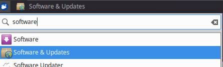
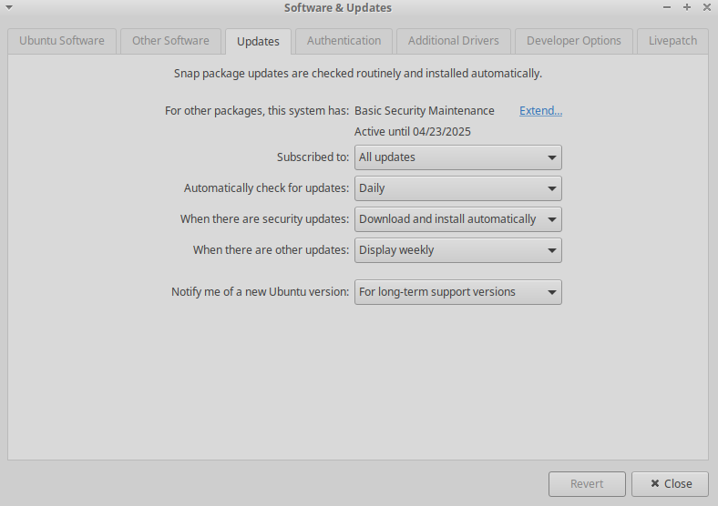
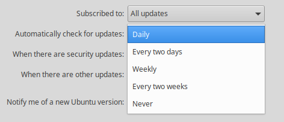
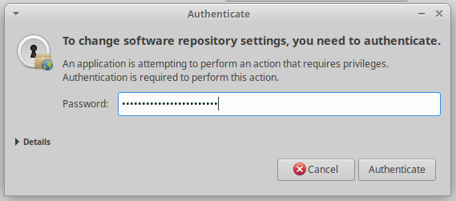

- [User Management](#managing-users-in-ubuntu)
	- [Adding User](#making-a-user)
  - [Removing User](#removing-a-user)
  - [Removing User and Backing Up Files](#removing-a-user-and-backing-up-their-files)
  - [Disable User](#disable-a-user)
  - [Make User Administrator](#make-user-an-administrator)
  - [Make User Not Administrator](#remove-administrator-privilege)
  - [Change Another User's Password](#change-the-password-of-a-user)
  - [Add User to Group](#add-user-to-group)
- [Passwords](#passwords)
	- [Set Minimum Password Requirements](#defining-minimum-password-requirements)
  - [Change Password Age Rules](#change-password-age-rules)
  - [Remember Previous Passwords](#remember-5-previous-passwords)
- [Firewall](#uncomplicated-firewall)
	- [Check State of UFW](#check-state-of-ufw)
  - [Enable UFW](#enable-ufw)
  - [Allow SSH Through UFW](#allow-ssh-through-ufw)
- [Services](#services-in-ubuntu)
	- [List Running Services](#list-running-services)
  - [Stop a Service](#stop-a-service)
  - [Start a Service](#start-a-service)
  - [Restart a Service](#restart-a-service)
  - [Disable a Service](#disable-a-service)
- [Locking Down](#locking-down)
	- [Fix Disabled sudo Auth](#fix-disabled-sudo-authentication)
  - [Disable Root Login from SSH](#disable-root-login-from-ssh)
  - [Disable ipv4 Port Forwarding](#disable-ipv4-port-forwarding)
  - [Fix Insecure Permissions on Shadow File](#fix-insecure-permissions-on-shadow-file)
  - [Turn Off Remote Desktop](#turn-off-remote-desktop)
- [General Maintenance](#general-maintenance-in-ubuntu)
	- [Automatically Check for Updates](#automatically-check-for-updates)
  - [Update Software](#update-software)
  - [Find Directory Containing Files of Type](#find-deirectory-containing-files-of-type)
  - [Delete Individual Files of Type](#delete-individual-files-of-type)
  - [Delete All Files of Type From a Directory](#delete-all-files-of-type-from-a-directory)
  - [Remove Unwanted Software](#remove-unwanted-software)

  > :page_with_curl: Currently, not *every* action that we need to perform in Ubuntu is documented using terminal commands (GUI is used instead). If you discover a command alternative please take note of it so it can be added to the documentation.

> :page_with_curl: Make sure to replace anything wrapped in `<these angle brackets>` with what you need. Ex. `<username>` change to `linda`. 

> :page_with_curl: Any time you use `sudo` you will be prompted for a password. Your password can be found in the README. Remember, Linux doesn't show passwords as you type them!
> If you are not prompted with a password refer to **Fix Disabled sudo Authentication** in [Locking Down](#locking-down).

### Managing Users in Ubuntu

- #### Making a User

	1. In the terminal, run: `sudo adduser <username>`

- #### Removing a User

	> It is recommended to [back up the user's files](#removing-a-user-and-backing-up-their-files) before deletion

	1. In the terminal, run: `sudo deluser --remove-home <username>`

- #### Removing a User and Backing Up Their Files

	1. In the terminal, run: `sudo mkdir /oldusers-data`
	2. In the terminal, run: `sudo chown root:root /oldusers-data`
	3. In the terminal, run: `sudo chmod 0700 /oldusers-data`
	4. In the terminal, run: `sudo deluser -remove-home -backup-to /oldusers-data`

- #### Disable a User

	1. In the terminal, run: `sudo usermod -L <username>`

- #### Make User an Administrator

	1. In the terminal, run: `sudo usermod –aG sudo <username>`

- #### Remove Administrator Privilege

	1. In the terminal, run: `sudo deluser <username> sudo`

- #### Change the Password of a User

	1. In the terminal, run: `sudo passwd <username>`
	2. Follow the prompts

> :page_with_curl: Remember, Linux does **not** display passwords as you type them.

- #### Add User to Group
	1. In the terminal, run: `sudo gpasswd –a <username> <group-name>`

### Passwords

- #### Defining Minimum Password Requirements

	1. In the terminal, run: `sudo nano /etc/pam.d/common-password`
	2. In the file, look for the line that contains `password requisite`
	3. Replace that line with `password requisite pam_cracklib.so retry=3 minlen=10 difok=3 ucredit=-1 lcredit=-1 dcredit=-1  ocredit=-1`
	4. Press CRTL + X to save and exit

- #### Change Password Age Rules

	1. In the terminal, run: `sudo nano /etc/login.defs`
	2. Look for the lines `PASS_MAX_DAYS`, `PASS_MIN_DAYS`, and `PASS_WARN_AGE`
	3. Edit the values to be something like the following: `PASS_MAX_DAYS   99999`, `PASS_MIN_DAYS   1`, and `PASS_WARN_AGE   7`

	> :page_with_curl: The number of days here is somewhat arbitrary - at least for the competition, however as a general
	> practice `PASS_MIN_DAYS` should be set to some number greater than zero. This prevents users from cycling through
	> new passwords to circumvent the restricition of reusing a previous password.

  5. Press CRTL + X to save and exit
  
- #### Remember 5 Previous Passwords

	1. In the terminal, run: `sudo nano /etc/pam.d/common-password`
	2. Look for the line that contains `password required`
	3. Replace the end of the line with `pam_unix.so remember=5` 

### Uncomplicated Firewall

- #### Check status of ufw

	1. In the terminal, run: `sudo ufw status`

	> :bulb: You can use this to verify whether ufw is installed, based on if the command is recognized.

- #### Enable ufw

	1. In the terminal, run: `sudo ufw enable`

- #### Allow ssh through ufw

	1. In the terminal, run: `sudo ufw allow ssh`

	> :page_with_curl: Only do this if ssh is a critical service in the specifications and that it is written explicity that you should allow ssh through ufw.

### Services in Ubuntu

- #### List Running Services

	1. In the terminal, run: `systemctl list-units --type=service --state=active`

	> :bulb: You can use this to search for any suspect services or services you *thought* you turned off.

- #### Stop a Service

	1. In the terminal, run: `sudo systemctl stop <service-name>`

- #### Start a Service

	1. In the terminal, run: `sudo systemctl start <service-name>`

- #### Restart a Service

	1. In the terminal, run: `sudo systemctl restart <service-name>`

- #### Disable a Service

	1. In the terminal, run: `sudo systemctl disable <service-name>`

### Locking Down

- #### Fix Disabled sudo Authentication

	> :bulb: If you've been running sudo commands, but you aren't being prompted for a password, sudo authentication is *probably* disabled. :smiley:

	1. In the terminal, run: `sudo nano /etc/sudoers`
	2. Search for the line `Defaults !authenticate`
	3. Remove the `!`
	4. Press CRTL + X to save and exit

- #### Disable Root Login From ssh

	1. In the terminal, run: `sudo nano /etc/ssh/sshd_config`
	2. Look for `PermitRootLogin`
	3. Change `yes` to `no`
	4. Press CRTL + X to save and exit

- #### Disable ipv4 Port Forwarding

	1. In the terminal, run: `sudo nano /etc/sysctl.conf`
	2. Change the line `net.ipv4.ip_forward=1` to `net.ipv4.ip_forward=0`
	3. Press CRTL + X to save and exit

	> :question: Enabling port forwarding basically makes the device act as a router. Unless we absolutely
	> need it, keeping port forwarding enabled just means the device is more vulnerable as any packets or
	> data could be passed into it.

- #### Fix Insecure Permissions on Shadow File

	1. In the terminal, run: `sudo chmod 0640 /etc/shadow`

	> :question: `/etc/shadow` is a file that contains information about each user's password,
	> and is used for authentication purposes. Normally, the file *should* have 640 permissions,
	> which means the owner (which is root) can read, write, but not execute,
	> the group (administrators) can read, can't write nor execute, and everyone else can't read,
	> write nor execute. Allowing anyone with less authority to have full access to this file presents
	> a security risk as it would be extremely easy to gather hashed passwords.

- #### Turn Off Remote Desktop

	> :page_with_curl: Currently missing our own documentation, for now
	> visit [this website.](https://geekrewind.com/how-to-enable-or-disable-remote-desktop-in-ubuntu-linux/)

	> :question: Having remote desktop enabled for no real reason presents a security risk in that
	> unauthorized people can control the device, mostly if a user is signed in and has the
	> remote desktop service running unknowingly (or knowingly with malicious intent). 

### General Maintenance in Ubuntu

- #### Automatically Check for Updates

	1. Open "Software and Updates"

	

	2. Navigate to the "Updates" tab

	

	3. Select the dropdown menu next to "Automatically check for updates" and select daily

	

	4. Enter the password for your user account, if prompted

	

	5. Press "Authenticate"

- #### Update Software

	1. In the terminal, run: `sudo apt update`

- #### Find Directory Containing Files of Type

	1. In the terminal, run: `locate *<file-extenstion>`, for example: `locate *.mp3`

- #### Delete Individual Files of Type

	1. In the terminal, run: `sudo find . -type f -name "*<file-extension>" -exec rm -i {} \;`
	2. You will be prompted to delete each file that is found, type `y` to delete or `n` to keep it

- #### Delete All Files of Type From a Directory

	1. In the terminal, run: `sudo rm /home/<directory>/*.mp3`

- #### Remove Unwanted Software

	1. In the terminal, run: `sudo apt remove <package-name>`
	2. In the terminal, run: `sudo apt autoremove`
