# Windows 10

## Contents

### Other Pages
- [Main Page](README.md)
- [Windows Server](Server.md)
- [Ubuntu](Ubuntu.md)
- [Debian](Debian.md)

### Sub Headings
- [General Security](#general-security)
	- [Update Windows](#update-windows)
  - [Set Security Settings](#set-security-settings)
  - [Open Control Panel](#open-control-panel)
  - [Enable Firewall](#enable-firewall)
  - [Disable Remote Assistance](#disable-remote-assistance)
  - [Remove Unwanted Software](#remove-unwanted-software)
- [User Management](#managing-users)
	- [Open User Manager](#open-user-manager)
  - [Add User](#add-user)
  - [Delete User](#delete-user)
  - [Change Password](#change-user-password)
  - [Create Group](#create-group)
  - [Add User to Group](#add-user-to-group)
  - [Remove User from Group](#remove-user-from-group)
  - [Delete Group](#delete-group)
- [Security Policies](#security-policies)
	- [Open Security Policy Manager](#open-security-policy-manager)
  - [Secure Password Settings](#set-secure-password-settings)
  - [Set Password Lockout](#set-password-lockout)
  - [Limit Blank Passwords](#limit-local-use-of-blank-passwords-to-console-only)
  - [Disable Anonymous Enumeration of SAM Accounts](#disable-anonymous-enumeration-of-sam-accounts)

## 1. Account wPolicies 
### 1.1 Password Policies
#### 1.1.1 (L1) Ensure 'Enforce password history' is set to '24 or more password(s)' (Automated)
``` 
Computer Configuration\Policies\Windows Settings\Security Settings\Account 
Policies\Password Policy\Enforce password history 
``` 
Setting: 24  
Links:  [1](https://www.cisecurity.org/white-papers/cis-password-policy-guide/),
[2](https://docs.microsoft.com/en-us/windows/security/threat-protection/security-policy-settings/password-policy)
<br></br>


#### 1.1.2 (L1) Ensure 'Maximum password age' is set to '365 or fewer days, but not 0' (Automated)
```
Computer Configuration\Policies\Windows Settings\Security Settings\Account 
Policies\Password Policy\Maximum password age
```

Setting: 42  
Links:  [1](https://www.cisecurity.org/insights/white-papers/cis-password-policy-guide), 
[2](https://learn.microsoft.com/en-us/previous-versions/windows/it-pro/windows-10/security/threat-protection/security-policy-settings/password-policy)
<br></br>

#### 1.1.3 (L1) Ensure 'Minimum password age' is set to '1 or more day(s)' (Automated)
```
Computer Configuration\Policies\Windows Settings\Security Settings\Account 
Policies\Password Policy\Minimum password age
```
Setting: 1      
Links: [1](https://www.cisecurity.org/insights/white-papers/cis-password-policy-guide),
[2](https://learn.microsoft.com/en-us/previous-versions/windows/it-pro/windows-10/security/threat-protection/security-policy-settings/password-policy)
<br></br>


#### 1.1.4 (L1) Ensure 'Minimum password length' is set to '14 or more character(s)' (Automated)
```
Computer Configuration\Policies\Windows Settings\Security Settings\Account 
Policies\Password Policy\Minimum password length
```
Setting: 7  
Links: [1](https://www.cisecurity.org/insights/white-papers/cis-password-policy-guide),
[2](https://learn.microsoft.com/en-us/previous-versions/windows/it-pro/windows-10/security/threat-protection/security-policy-settings/password-policy)
<br></br>


#### 1.1.5 (L1) Ensure 'Password must meet complexity requirements' is set to 'Enabled' (Automated)
```
Computer Configuration\Policies\Windows Settings\Security Settings\Account 
Policies\Password Policy\Password must meet complexity requirements
```
Setting: Not contain the user's account name, have at least six characters in length, contain characters that are uppercase, lowercase, base 10 digits (0 through 9), non-alphabetic characters(i.e. !,$,#,%)  
Links: [1](https://www.cisecurity.org/insights/white-papers/cis-password-policy-guide),
[2](https://learn.microsoft.com/en-us/previous-versions/windows/it-pro/windows-10/security/threat-protection/security-policy-settings/password-policy)
<br></br>

---

## Windows Defender Firewall with Advanced Security

### Private Profile

### (L1) Ensure 'Windows Firewall: Private: Firewall state' is set to 'On (recommended)' (Automated)
<br></br>
It's reccomended that Windows Defender Firewall is on. Simply type "Windows defender firewall with advanced security" Then turn it on.

To turn the Windows Defender Firewall With Advanced Security on search up group policy, Computer configuration , then Windows Settings, Security Settings, Windows Defender Firewall, click the drop down arrow go into Windows Defender Firewall With Advanced Security, Windows Firewall Properties, Private Profile, Firewall state.

<br></br>

### How to turn on firewall in enterprise version of windows


 Computer Configuration\Policies\Windows Settings\Security Settings\Windows 
Defender Firewall with Advanced Security\Windows Defender Firewall with 
Advanced Security\Windows Firewall Properties\Private Profile\Firewall state

### Ensure 'Windows Firewall: Private: Inbound connections' is set to 'Block (default)' (Automated)

<br></br>

Computer Configuration\Policies\Windows Settings\Security Settings\Windows 
Defender Firewall with Advanced Security\Windows Defender Firewall with 
Advanced Security\Windows Firewall Properties\Private Profile\Inbound 
connections


Set it to ***Block(Default)***


### (L1) Ensure 'Windows Firewall: Private: Outbound connections' is set to 'Allow (default)' (Automated)
<br></br>

Computer Configuration\Policies\Windows Settings\Security Settings\Windows 
Defender Firewall with Advanced Security\Windows Defender Firewall with 
Advanced Security\Windows Firewall Properties\Private Profile\Outbound 
connections

This should be set to ***Allow(Defautlt)***

###  Ensure 'Windows Firewall: Private: Settings: Display a notification' is set to 'No' (Automated)

Computer Configuration\Policies\Windows Settings\Security Settings\Windows 
Defender Firewall with Advanced Security\Windows Defender Firewall with 
Advanced Security\Windows Firewall Properties\Private Profile\Settings 
Customize\Display a notification

This setting should be set to ***No***


## General Security

#### Update Windows

1. Open Windows settings
2. Navigate to update and security

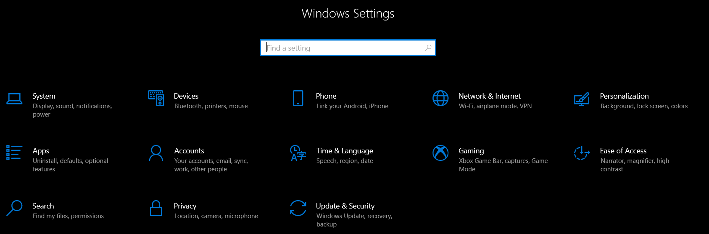
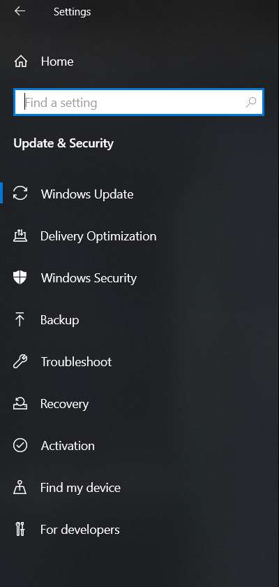

4. Check for updates
5. Select "Install now"


6. When prompted restart the computer

#### Set Security Settings

1. Open Windows settings
2. Navigate to update and security


3. Select Windows Security

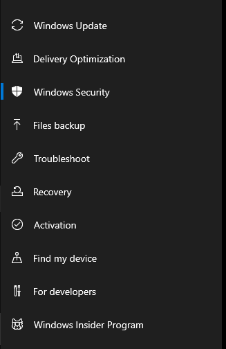

4. If any red exclaimation marks appear select the section and resolve the issue

> The section requiring a Microsoft Login is unnecessary

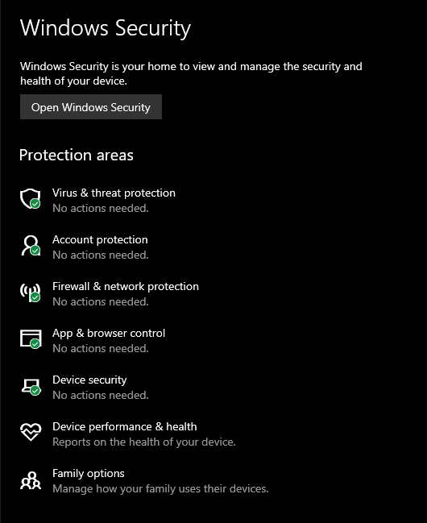

#### Open Control Panel

1. Win + R
2. Type `control`

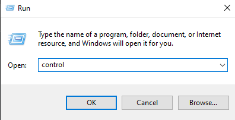

3. Press Enter

#### Enable Firewall

1. Navigate to `Control Panel>System and Security>Windows Defender Firewall`
2. Select `Turn Windows Defender on or off`

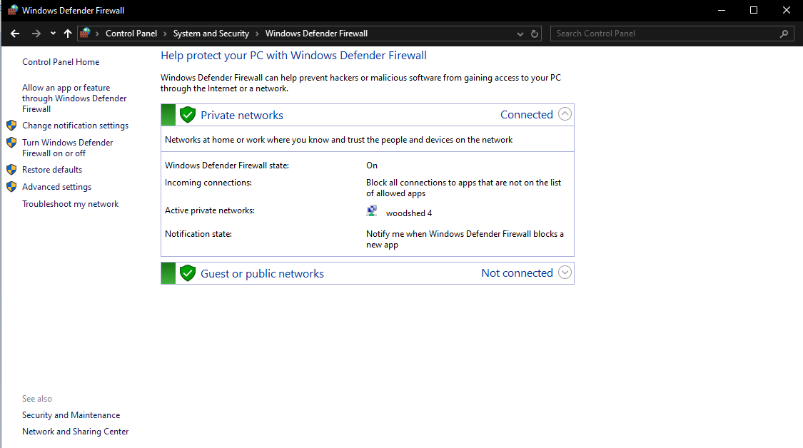

3. Turn both firewalls on


#### Disable Remote Assistance

1. Navigate to `Control Panel>System and Security`
2. Select `Allow remote access` under `System`

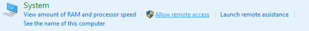

3. Uncheck "Allow Remote Assistance connections to this computer"

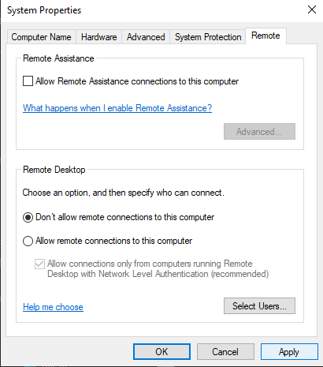

4. Select "Apply"

#### Remove Unwanted Software

> :bulb: Examples of unwanted software are PC Cleaner, Wireshark, Net Stumbler, and Ophcrack
1. Navigate to `Control Panel>Programs>Programs and Features`

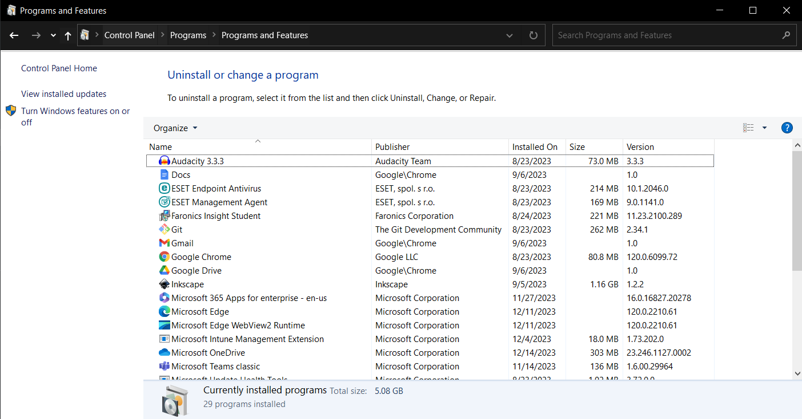

2. Right click on the unwanted software and select "Uninstall"
3. Follow the steps of the uninstaller and remove everything

## Managing Users

#### Open User Manager

1. Win + R 
2. Type `lusrmgr.msc`

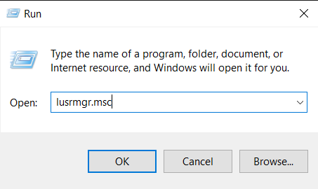

3. Press enter
4. Open Users

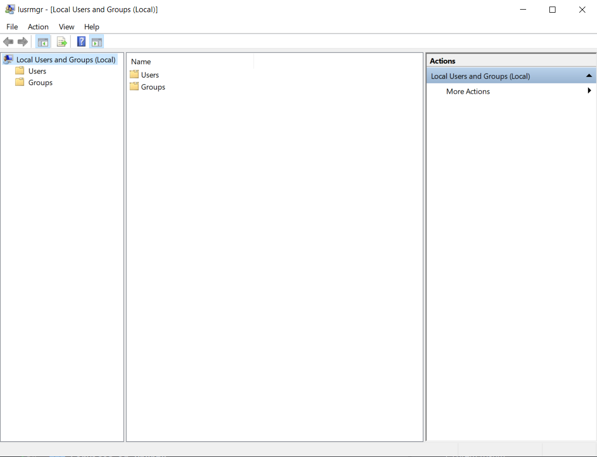
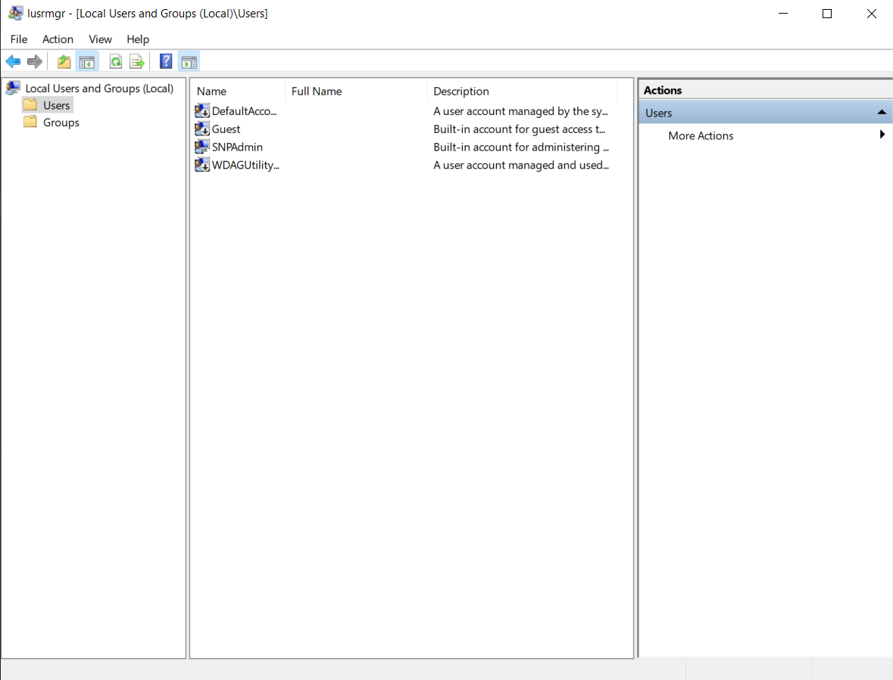

#### Add User

1. Right click in the middle of the window
2. Select new user

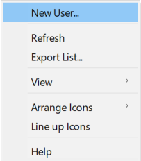

4. Give a username and password
5. Ensure the "User must change password at next logon" box is checked

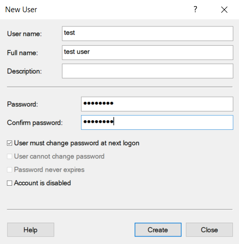

#### Delete User

1. Right click on an existing user
2. Select delete

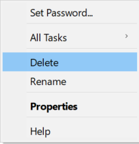

3. Select "yes" on the dialogue box

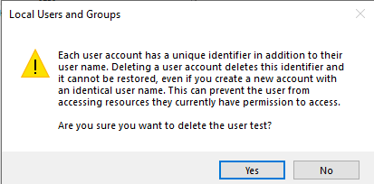

#### Change User Password

1. Right click on existing user
2. Select set password

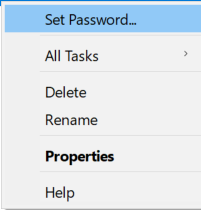

3. Select "Proceed" on the popup

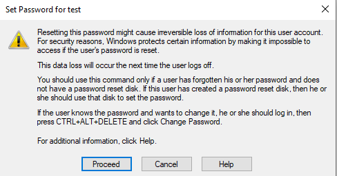

4. Enter a new password and select "OK"

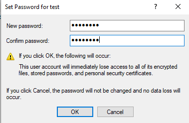

#### Create Group
 
> :page_with_curl: Nearly identical to user creation
1. Open the "Groups" tab of the user manager

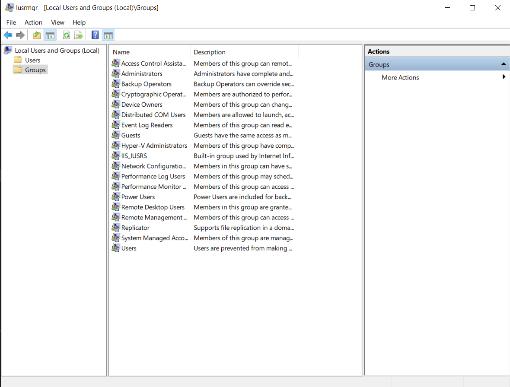

2. Right click in the middle of the window
3. Select new group

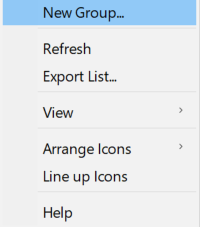

4. Add group name

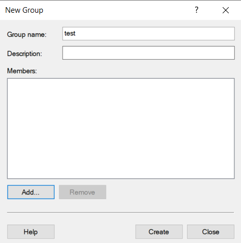

5. To add users right away follow the steps in **Add User to Group**
6. Select "Create" to create the group

#### Add User to Group

> :bulb: Can be used to add user to group "Administrators"

1. Double click on the group to open it
2. Select "Add"

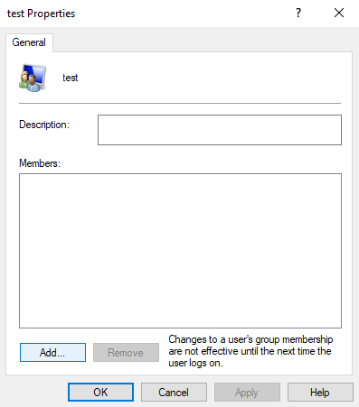

3. Type the username in the text field
4. select "OK"

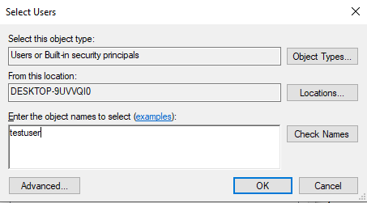

5. The Group should now populate with the created user

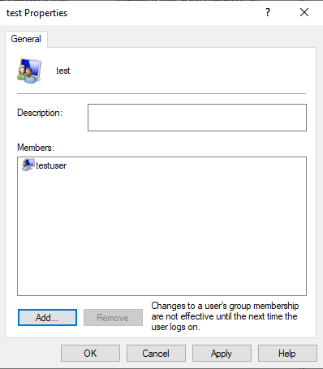

#### Remove User from Group

> :bulb: Can be used to remove user from group "Administrators"

1. Double click on the group to open it
2. Select the user you want to remove
3. Select "Remove"

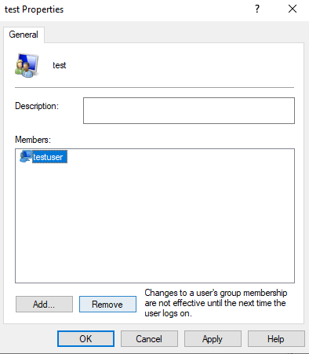

#### Delete Group

1. Right click on the desired group
2. Select "Delete"

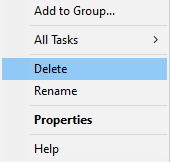

3. Select "Yes" on the popup

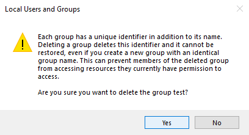

## Security Policies

#### Open Security Policy Manager
	
1. Win + R 
2. Type `secpol.msc`

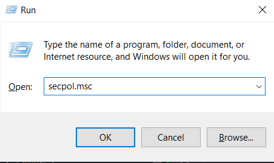

3. Press enter

#### Set Secure Password Settings

1. Navigate to `Security Settings>Account Policies>Password Policy`

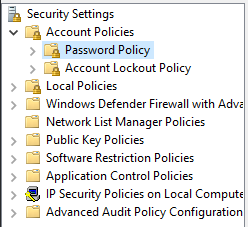

2. Set the password settings to be more secure
3. Set the settings by double clicking, entering the value, then selecting "Apply"

> Examples of secure settings are in the below image.
The amount of time for most things are subject to change

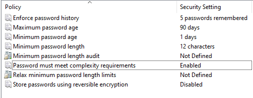

#### Set Password Lockout

1. Navigate to `Security Settings>Account Policies>Account Lockout Policy`

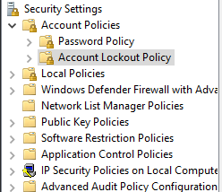

2. Select "Account lockout threshold"

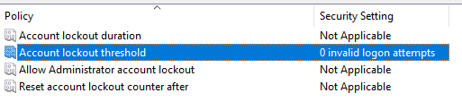

3. Set the value to a secure number \(somewhere around 5\)

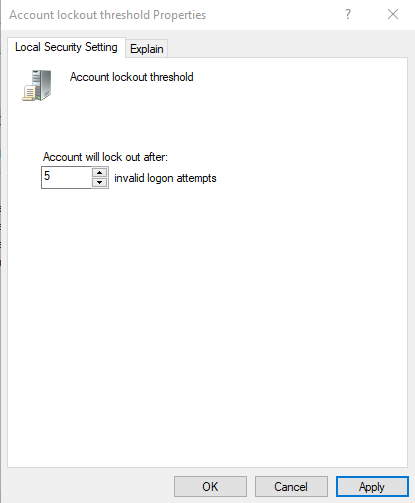

4. Changing the threshold will propmt with suggested changes
5. Select "OK"

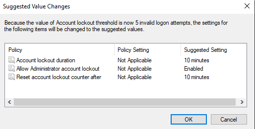

> :page_with_curl: The lockout timer can be changed based on preference

#### Limit Local Use of Blank Passwords to Console Logon Only

1. Navigate to `Security Settings>Local Policies>Security Options`

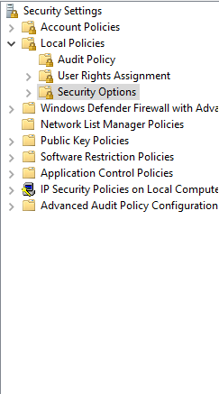

2. Find "Accounts: Limit local account use of blank password to console logon only"

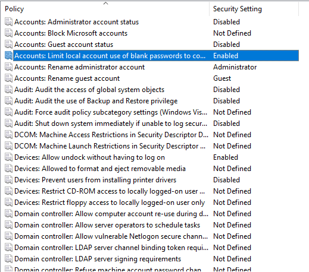

3. Select "Enabled"

#### Disable Anonymous Enumeration of SAM Accounts
1. Navigate to `Security Settings>Local Policies>Security Options`


2. Find "Network access: Do not allow anonymous enumeration of SAM accounts"

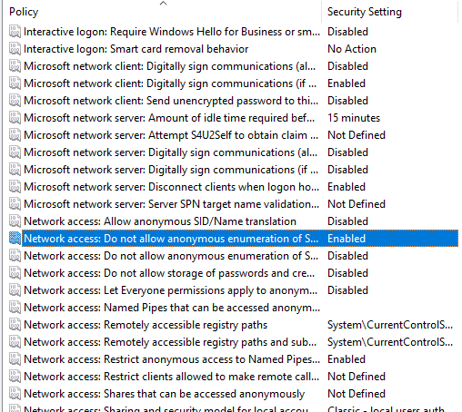

3. Select "Enabled"