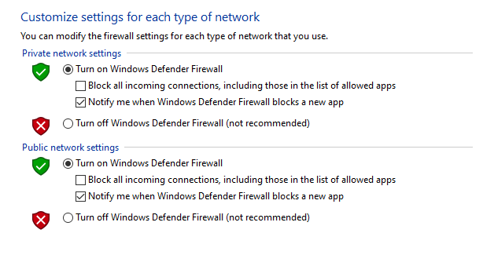

# Windows 10

## Contents

### Other Pages
- [Main Page](README.md)
- [Windows Server](Server.md)
- [Ubuntu](Ubuntu.md)
- [Debian](Debian.md)

### Sub Headings
- [General Security](#general-security)
	- [Update Windows](#update-windows)
  - [Set Security Settings](#set-security-settings)
  - [Open Control Panel](#open-control-panel)
  - [Enable Firewall](#enable-firewall)
  - [Disable Remote Assistance](#disable-remote-assistance)
  - [Remove Unwanted Software](#remove-unwanted-software)
- [User Management](#managing-users)
	- [Open User Manager](#open-user-manager)
  - [Add User](#add-user)
  - [Delete User](#delete-user)
  - [Change Password](#change-user-password)
  - [Create Group](#create-group)
  - [Add User to Group](#add-user-to-group)
  - [Remove User from Group](#remove-user-from-group)
  - [Delete Group](#delete-group)
- [Security Policies](#security-policies)
	- [Open Security Policy Manager](#open-security-policy-manager)
  - [Secure Password Settings](#set-secure-password-settings)
  - [Set Password Lockout](#set-password-lockout)
  - [Limit Blank Passwords](#limit-local-use-of-blank-passwords-to-console-only)
  - [Disable Anonymous Enumeration of SAM Accounts](#disable-anonymous-enumeration-of-sam-accounts)

## 1. Account Policies 
### 1.1 Password Policies
#### 1.1.1 (L1) Ensure 'Enforce password history' is set to '24 or more password(s)' (Automated)
``` 
Computer Configuration\Policies\Windows Settings\Security Settings\Account 
Policies\Password Policy\Enforce password history 
``` 
Setting: 24  
Links:  [1](https://www.cisecurity.org/white-papers/cis-password-policy-guide/),
[2](https://docs.microsoft.com/en-us/windows/security/threat-protection/security-policy-settings/password-policy)
<br></br>


#### 1.1.2 (L1) Ensure 'Maximum password age' is set to '365 or fewer days, but not 0' (Automated)
```
Computer Configuration\Policies\Windows Settings\Security Settings\Account 
Policies\Password Policy\Maximum password age
```

Setting: 42  
Links:  [1](https://www.cisecurity.org/insights/white-papers/cis-password-policy-guide), 
[2](https://learn.microsoft.com/en-us/previous-versions/windows/it-pro/windows-10/security/threat-protection/security-policy-settings/password-policy)
<br></br>

#### 1.1.3 (L1) Ensure 'Minimum password age' is set to '1 or more day(s)' (Automated)
```
Computer Configuration\Policies\Windows Settings\Security Settings\Account 
Policies\Password Policy\Minimum password age
```
Setting: 1      
Links: [1](https://www.cisecurity.org/insights/white-papers/cis-password-policy-guide),
[2](https://learn.microsoft.com/en-us/previous-versions/windows/it-pro/windows-10/security/threat-protection/security-policy-settings/password-policy)
<br></br>


#### 1.1.4 (L1) Ensure 'Minimum password length' is set to '14 or more character(s)' (Automated)
```
Computer Configuration\Policies\Windows Settings\Security Settings\Account 
Policies\Password Policy\Minimum password length
```
Setting: 7  
Links: [1](https://www.cisecurity.org/insights/white-papers/cis-password-policy-guide),
[2](https://learn.microsoft.com/en-us/previous-versions/windows/it-pro/windows-10/security/threat-protection/security-policy-settings/password-policy)
<br></br>


#### 1.1.5 (L1) Ensure 'Password must meet complexity requirements' is set to 'Enabled' (Automated)
```
Computer Configuration\Policies\Windows Settings\Security Settings\Account 
Policies\Password Policy\Password must meet complexity requirements
```
Setting: Not contain the user's account name, have at least six characters in length, contain characters that are uppercase, lowercase, base 10 digits (0 through 9), non-alphabetic characters(i.e. !,$,#,%)  
Links: [1](https://www.cisecurity.org/insights/white-papers/cis-password-policy-guide),
[2](https://learn.microsoft.com/en-us/previous-versions/windows/it-pro/windows-10/security/threat-protection/security-policy-settings/password-policy)
<br><br>


# Windows 10

## Contents

### Other Pages
- [Main Page](README.md)
- [Windows Server](Server.md)
- [Ubuntu](Ubuntu.md)
- [Debian](Debian.md)

### Sub Headings
- [General Security](#general-security)
	- [Update Windows](#update-windows)
  - [Set Security Settings](#set-security-settings)
  - [Open Control Panel](#open-control-panel)
  - [Enable Firewall](#enable-firewall)
  - [Disable Remote Assistance](#disable-remote-assistance)
  - [Remove Unwanted Software](#remove-unwanted-software)
- [User Management](#managing-users)
	- [Open User Manager](#open-user-manager)
  - [Add User](#add-user)
  - [Delete User](#delete-user)
  - [Change Password](#change-user-password)
  - [Create Group](#create-group)
  - [Add User to Group](#add-user-to-group)
  - [Remove User from Group](#remove-user-from-group)
  - [Delete Group](#delete-group)
- [Security Policies](#security-policies)
	- [Open Security Policy Manager](#open-security-policy-manager)
  - [Secure Password Settings](#set-secure-password-settings)
  - [Set Password Lockout](#set-password-lockout)
  - [Limit Blank Passwords](#limit-local-use-of-blank-passwords-to-console-only)
  - [Disable Anonymous Enumeration of SAM Accounts](#disable-anonymous-enumeration-of-sam-accounts)

## 1. Account wPolicies 
### 1.1 Password Policies
#### 1.1.1 (L1) Ensure 'Enforce password history' is set to '24 or more password(s)' (Automated)
``` 
Computer Configuration\Policies\Windows Settings\Security Settings\Account 
Policies\Password Policy\Enforce password history 
``` 
Setting: 24  
Links:  [1](https://www.cisecurity.org/white-papers/cis-password-policy-guide/),
[2](https://docs.microsoft.com/en-us/windows/security/threat-protection/security-policy-settings/password-policy)
<br></br>


#### 1.1.2 (L1) Ensure 'Maximum password age' is set to '365 or fewer days, but not 0' (Automated)
```
Computer Configuration\Policies\Windows Settings\Security Settings\Account 
Policies\Password Policy\Maximum password age
```

Setting: 42  
Links:  [1](https://www.cisecurity.org/insights/white-papers/cis-password-policy-guide), 
[2](https://learn.microsoft.com/en-us/previous-versions/windows/it-pro/windows-10/security/threat-protection/security-policy-settings/password-policy)
<br></br>

#### 1.1.3 (L1) Ensure 'Minimum password age' is set to '1 or more day(s)' (Automated)
```
Computer Configuration\Policies\Windows Settings\Security Settings\Account 
Policies\Password Policy\Minimum password age
```
Setting: 1      
Links: [1](https://www.cisecurity.org/insights/white-papers/cis-password-policy-guide),
[2](https://learn.microsoft.com/en-us/previous-versions/windows/it-pro/windows-10/security/threat-protection/security-policy-settings/password-policy)
<br></br>


#### 1.1.4 (L1) Ensure 'Minimum password length' is set to '14 or more character(s)' (Automated)
```
Computer Configuration\Policies\Windows Settings\Security Settings\Account 
Policies\Password Policy\Minimum password length
```
Setting: 7  
Links: [1](https://www.cisecurity.org/insights/white-papers/cis-password-policy-guide),
[2](https://learn.microsoft.com/en-us/previous-versions/windows/it-pro/windows-10/security/threat-protection/security-policy-settings/password-policy)
<br></br>


#### 1.1.5 (L1) Ensure 'Password must meet complexity requirements' is set to 'Enabled' (Automated)
```
Computer Configuration\Policies\Windows Settings\Security Settings\Account 
Policies\Password Policy\Password must meet complexity requirements
```
Setting: Not contain the user's account name, have at least six characters in length, contain characters that are uppercase, lowercase, base 10 digits (0 through 9), non-alphabetic characters(i.e. !,$,#,%)  
Links: [1](https://www.cisecurity.org/insights/white-papers/cis-password-policy-guide),
[2](https://learn.microsoft.com/en-us/previous-versions/windows/it-pro/windows-10/security/threat-protection/security-policy-settings/password-policy)
<br><br>
## 17. Advanced Audit Policy Configuration
### 17.1. Account Logon
#### 17.1.1.  Ensure 'Audit Credential Validation' is set to 'Success 
and Failure' (Automated)

<br></br>
  


---

## 9 Windows Defender Firewall with Advanced Security

### Private Profile

### 9.2.1 (L1) Ensure 'Windows Firewall: Private: Firewall state' is set to 'On (recommended)' (Automated)
<br></br>
It's reccomended that Windows Defender Firewall is on. Simply type "Windows defender firewall with advanced security" Then turn it on.

**To turn the Windows Defender Firewall With Advanced Security on search up group policy, Computer configuration , then Windows Settings, Security Settings, Windows Defender Firewall, click the drop down arrow go into Windows Defender Firewall With Advanced Security, Windows Firewall Properties, Private Profile, Firewall state.**

<br></br>

### How to turn on firewall in enterprise version of windows

```
 Computer Configuration\Policies\Windows Settings\Security Settings\Windows 
Defender Firewall with Advanced Security\Windows Defender Firewall with 
Advanced Security\Windows Firewall Properties\Private Profile\Firewall state
```
### 9.2.2 Ensure 'Windows Firewall: Private: Inbound connections' is set to 'Block (default)' (Automated)

<br></br>
```
Computer Configuration\Policies\Windows Settings\Security Settings\Windows 
Defender Firewall with Advanced Security\Windows Defender Firewall with 
Advanced Security\Windows Firewall Properties\Private Profile\Inbound 
connections
```

Set it to ***Block(Default)***


### 9.2.3 (L1) Ensure 'Windows Firewall: Private: Outbound connections' is set to 'Allow (default)' (Automated)
<br></br>
```
Computer Configuration\Policies\Windows Settings\Security Settings\Windows 
Defender Firewall with Advanced Security\Windows Defender Firewall with 
Advanced Security\Windows Firewall Properties\Private Profile\Outbound 
connections
```
This should be set to ***Allow(Defautlt)***

### 9.2.4 Ensure 'Windows Firewall: Private: Settings: Display a notification' is set to 'No' (Automated)
```
Computer Configuration\Policies\Windows Settings\Security Settings\Windows 
Defender Firewall with Advanced Security\Windows Defender Firewall with 
Advanced Security\Windows Firewall Properties\Private Profile\Settings 
Customize\Display a notification
```
This setting should be set to ***No***

### (L1) 9.2.5 Ensure 'Windows Firewall: Private: Logging: Name' is set to'%SystemRoot%\System32\logfiles\firewall\privatefw.log' (Automated)

```
Computer Configuration\Policies\Windows Settings\Security Settings\Windows 
Defender Firewall with Advanced Security\Windows Defender Firewall with 
Advanced Security\Windows Firewall Properties\Private Profile\Logging 
Customize\Name
```
To establish the recommended configuration via GP, set the following UI path to 
%SystemRoot%\System32\logfiles\firewall\privatefw.log:

### 9.2.6 (L1) Ensure 'Windows Firewall: Private: Logging: Size limit (KB)' is set to '16,384 KB or greater' (Automated)

```
Computer Configuration\Policies\Windows Settings\Security Settings\Windows 
Defender Firewall with Advanced Security\Windows Defender Firewall with 
Advanced Security\Windows Firewall Properties\Private Profile\Logging 
Customize\Size limit (KB)
```
To establish the recommended configuration via GP, set the following UI path to 16,384 
KB or greater:

 ### 9.2.7 (L1) Ensure 'Windows Firewall: Private: Logging: Log dropped packets' is set to 'Yes' (Automated)

```
 Computer Configuration\Policies\Windows Settings\Security Settings\Windows 
 Defender Firewall with Advanced Security\Windows Defender Firewall with 
 Advanced Security\Windows Firewall Properties\Private Profile\Logging 
 Customize\Log dropped packets
```
 To establish the recommended configuration via GP, set the following UI path to Yes

 ### 9.2.8 (L1) Ensure 'Windows Firewall: Private: Logging: Log successful connections' is set to 'Yes' (Automated)

```
Computer Configuration\Policies\Windows Settings\Security Settings\Windows 
Defender Firewall with Advanced Security\Windows Defender Firewall with 
Advanced Security\Windows Firewall Properties\Private Profile\Logging 
Customize\Log successful connections

```
To establish the recommended configuration via GP, set the following UI path to Yes

https://docs.microsoft.com/en-us/windows/security/threat-protection/windows-firewall/configure-the-windows-firewall-log

### 9.3.1 (L1) Ensure 'Windows Firewall: Public: Firewall state' is set to 'On (recommended)' (Automated)

```
Computer Configuration\Policies\Windows Settings\Security Settings\Windows 
Defender Firewall with Advanced Security\Windows Defender Firewall with 
Advanced Security\Windows Firewall Properties\Public Profile\Firewall state

```
**REMIDIATION:** To establish the recommended configuration via GP, set the following UI path to On 
(recommended):

https://docs.microsoft.com/en-us/windows/security/threat-protection/windows-firewall/best-practices-configuring

### 9.3.2 (L1) Ensure 'Windows Firewall: Public: Inbound connections' is set to 'Block (default)' (Automated)

```
Computer Configuration\Policies\Windows Settings\Security Settings\Windows 
Defender Firewall with Advanced Security\Windows Defender Firewall with 
Advanced Security\Windows Firewall Properties\Public Profile\Inbound 
connections
```

**REMIDIATION:** To establish the recommended configuration via GP, set the following UI path to Block 
(default):

https://docs.microsoft.com/en-us/windows/security/threat-protection/windows-firewall/best-practices-configuring


### 9.3.3 (L1) Ensure 'Windows Firewall: Public: Outbound connections' is set to 'Allow (default)' (Automated)

```
Computer Configuration\Policies\Windows Settings\Security Settings\Windows 
Defender Firewall with Advanced Security\Windows Defender Firewall with 
Advanced Security\Windows Firewall Properties\Public Profile\Outbound 
connections
```

**REMEDIATION:** To establish the recommended configuration via GP, set the following UI path to Allow 
(default):

https://docs.microsoft.com/en-us/windows/security/threat-protection/windows-firewall/best-practices-configuring


### 9.3.4 (L1) Ensure 'Windows Firewall: Public: Settings: Display a notification' is set to 'No' (Automated)

```
Computer Configuration\Policies\Windows Settings\Security Settings\Windows 
Defender Firewall with Advanced Security\Windows Defender Firewall with 
Advanced Security\Windows Firewall Properties\Public Profile\Settings 
Customize\Display a notification
```

**REMIDIATION:** To establish the recommended configuration via GP, set the following UI path to 'No'

### 9.3.5 (L1) Ensure 'Windows Firewall: Public: Settings: Apply local firewall rules' is set to 'No' (Automated)

```
Computer Configuration\Policies\Windows Settings\Security Settings\Windows 
Defender Firewall with Advanced Security\Windows Defender Firewall with 
Advanced Security\Windows Firewall Properties\Public Profile\Settings 
Customize\Apply local firewall rules
```

**REMIDIATION:** To establish the recommended configuration via GP, set the following UI path to No

### 9.3.6 (L1) Ensure 'Windows Firewall: Public: Settings: Apply local connection security rules' is set to 'No' (Automated)

```
Computer Configuration\Policies\Windows Settings\Security Settings\Windows 
Defender Firewall with Advanced Security\Windows Defender Firewall with 
Advanced Security\Windows Firewall Properties\Public Profile\Settings 
Customize\Apply local connection security rules
```

**REMIDIATION:** To establish the recommended configuration via GP, set the following UI path to No


### 9.3.7 (L1) Ensure 'Windows Firewall: Public: Logging: Name' is set to '%SystemRoot%\System32\logfiles\firewall\publicfw.log' (Automated)

```
Computer Configuration\Policies\Windows Settings\Security Settings\Windows 
Defender Firewall with Advanced Security\Windows Defender Firewall with 
Advanced Security\Windows Firewall Properties\Public Profile\Logging 
Customize\Name
```

**REMIDIATION:** To establish the recommended configuration via GP, set the following UI path to 
%SystemRoot%\System32\logfiles\firewall\publicfw.log:

https://docs.microsoft.com/en-us/windows/security/threat-protection/windows-firewall/configure-the-windows-firewall-log

### 9.3.8 (L1) Ensure 'Windows Firewall: Public: Logging: Size limit (KB)' is set to '16,384 KB or greater' (Automated)

```
Computer Configuration\Policies\Windows Settings\Security Settings\Windows 
Defender Firewall with Advanced Security\Windows Defender Firewall with 
Advanced Security\Windows Firewall Properties\Public Profile\Logging 
Customize\Size limit (KB)
```

**REMIDIATION:** To establish the recommended configuration via GP, set the following UI path to 16,384 
KB or greater:


### 9.3.9 (L1) Ensure 'Windows Firewall: Public: Logging: Log dropped packets' is set to 'Yes' (Automated)


```
Computer Configuration\Policies\Windows Settings\Security Settings\Windows 
Defender Firewall with Advanced Security\Windows Defender Firewall with 
Advanced Security\Windows Firewall Properties\Public Profile\Logging 
Customize\Log dropped packets
```

**REMIDIATION:** To establish the recommended configuration via GP, set the following UI path to Yes

### 9.3.10 (L1) Ensure 'Windows Firewall: Public: Logging: Log successful connections' is set to 'Yes' (Automated)

```
Computer Configuration\Policies\Windows Settings\Security Settings\Windows 
Defender Firewall with Advanced Security\Windows Defender Firewall with 
Advanced Security\Windows Firewall Properties\Public Profile\Logging 
Customize\Log successful connections
```

**REMIDIATION:** To establish the recommended configuration via GP, set the following UI path to Yes


#### 1.1.6 (L1) Ensure 'Relax minimum password length limits' is set to 'Enabled' (Automated)
```
Audit: HKEY_LOCAL_MACHINE\System\CurrentControlSet\Control\SAM:RelaxMinimumPasswordL
engthLimits

Remediation: Computer Configuration\Policies\Windows Settings\Security Settings\Account 
Policies\Password Policy\Relax minimum password length limits
```
Setting: minimum password length can be configured to a max of 14 chars

Links: [1](https://www.cisecurity.org/insights/white-papers/cis-password-policy-guide), 
[2](https://support.microsoft.com/en-us/topic/minimum-password-length-auditing-and-enforcement-on-certain-versions-of-windows-5ef7fecf-3325-f56b-cc10-4fd565aacc59),  [3](https://learn.microsoft.com/en-us/previous-versions/windows/it-pro/windows-10/security/threat-protection/security-policy-settings/password-policy)
<br></br>

#### 1.1.7 (L1) Ensure 'Store passwords using reversible encryption' is set to 'Disabled' (Automated)
```
Computer Configuration\Policies\Windows Settings\Security Settings\Account 
Policies\Password Policy\Store passwords using reversible encryption
```
Setting: Disabled     
Links: [1](https://www.cisecurity.org/insights/white-papers/cis-password-policy-guide), [2](https://learn.microsoft.com/en-us/previous-versions/windows/it-pro/windows-10/security/threat-protection/security-policy-settings/password-policy)
<br></br>

## 1.2 Account Lockout Policy
#### 1.2.1 (L1) Ensure 'Account lockout duration' is set to '15 or more minute(s)' (Automated)
```
Computer Configuration\Policies\Windows Settings\Security Settings\Account 
Policies\Account Lockout Policy\Account lockout duration
```
Setting: None, because this policy setting only has meaning if the account lockout threshold is specified    
Link: [1](https://www.cisecurity.org/insights/white-papers/cis-password-policy-guide)
<br></br>

#### 1.2.2 (L1) Ensure 'Account lockout threshold' is set to '5 or fewer invalid logon attempt(s), but not 0' (Automated)
```
Computer Configuration\Policies\Windows Settings\Security Settings\Account 
Policies\Account Lockout Policy\Account lockout threshold
```
Setting: 0 failed logon attempts    
Link: [1](https://www.cisecurity.org/insights/white-papers/cis-password-policy-guide)
<br></br>

#### 1.2.3 (L1) Ensure 'Allow Administrator account lockout' is set to 'Enabled' (Manual)
```
Computer Configuration\Policies\Windows Settings\Security Settings\Account 
Policies\Account Lockout Policies\Allow Administrator account lockout
```
Setting: Disabled   
Link: [1](https://support.microsoft.com/en-us/topic/kb5020282-account-lockout-available-for-built-in-local-administrators-bce45c4d-f28d-43ad-b6fe-70156cb2dc00)
<br></br>

#### 1.2.4 (L1) Ensure 'Reset account lockout counter after' is set to '15 or more minute(s)' (Automated)
```
Computer Configuration\Policies\Windows Settings\Security Settings\Account 
Policies\Account Lockout Policy\Reset account lockout counter after
```
Setting: None, because this policy setting only has meaning if the account lockout threshold is specified   
Link: [1](https://www.cisecurity.org/insights/white-papers/cis-password-policy-guide)
<br></br>

## 2. Local Policies
### 2.1 Audit Policy (this is left blank and exists to ensure the structure of Windows benchmarks is consistent.)
#### 2.2.1 (L1) Ensure 'Access Credential Manager as a trusted caller' is set to 'No One' (Automated)
```
Computer Configuration\Policies\Windows Settings\Security Settings\Local 
Policies\User Rights Assignment\Access Credential Manager as a trusted caller
```
Setting: No one   
Link: [1](https://learn.microsoft.com/en-us/previous-versions/windows/it-pro/windows-10/security/threat-protection/security-policy-settings/access-credential-manager-as-a-trusted-caller)
<br></br>

#### 2.2.2 (L1) Ensure 'Access this computer from the network' is set to 'Administrators, Remote Desktop Users' (Automated)
```
Computer Configuration\Policies\Windows Settings\Security Settings\Local 
Policies\User Rights Assignment\Access this computer from the network
```
Setting: Administrators, backup operators, everyone, users    
Link: [1](https://learn.microsoft.com/en-us/previous-versions/windows/it-pro/windows-10/security/threat-protection/security-policy-settings/access-credential-manager-as-a-trusted-caller)
<br></br>

#### 2.2.3 (L1) Ensure 'Act as part of the operating system' is set to 'No One' (Automated)
```
Computer Configuration\Policies\Windows Settings\Security Settings\Local 
Policies\User Rights Assignment\Act as part of the operating system
```
Setting: No one   
Link: [1](https://learn.microsoft.com/en-us/previous-versions/windows/it-pro/windows-10/security/threat-protection/security-policy-settings/act-as-part-of-the-operating-system)
<br></br>

#### 2.2.4 (L1) Ensure 'Adjust memory quotas for a process' is set to 'Administrators, LOCAL SERVICE, NETWORK SERVICE' (Automated)
```
Computer Configuration\Policies\Windows Settings\Security Settings\Local 
Policies\User Rights Assignment\Adjust memory quotas for a process
```
Setting: Administrators, LOCAL SERVICE, NETWORK SERVICE   
Link: [1](https://learn.microsoft.com/en-us/previous-versions/windows/it-pro/windows-10/security/threat-protection/security-policy-settings/adjust-memory-quotas-for-a-process)
<br></br>

#### 2.2.5 (L1) Ensure 'Allow log on locally' is set to 'Administrators, Users' (Automated)
```
Computer Configuration\Policies\Windows Settings\Security Settings\Local 
Policies\User Rights Assignment\Allow log on locally
```
Setting: Administrators, backup operators, guest, users   
Link: [1](https://learn.microsoft.com/en-us/previous-versions/windows/it-pro/windows-10/security/threat-protection/security-policy-settings/allow-log-on-locally)
<br></br>

#### 2.2.6 (L1) Ensure 'Allow log on through Remote Desktop Services' is set to 'Administrators, Remote Desktop Users' (Automated)
```
Computer Configuration\Policies\Windows Settings\Security Settings\Local 
Policies\User Rights Assignment\Allow log on through Remote Desktop Services
```
Setting: Administrators, remote desktop users   
Link: [1](https://learn.microsoft.com/en-us/previous-versions/windows/it-pro/windows-10/security/threat-protection/security-policy-settings/allow-log-on-through-remote-desktop-services)
<br></br>

#### 2.2.7 (L1) Ensure 'Back up files and directories' is set to 'Administrators' (Automated)
```
Computer Configuration\Policies\Windows Settings\Security Settings\Local 
Policies\User Rights Assignment\Back up files and directories
```
Setting: Administrators, backup operators   
Link: [1](https://learn.microsoft.com/en-us/previous-versions/windows/it-pro/windows-10/security/threat-protection/security-policy-settings/back-up-files-and-directories)
<br></br>

#### 2.2.8 (L1) Ensure 'Change the system time' is set to 'Administrators, LOCAL SERVICE' (Automated)
```
Computer Configuration\Policies\Windows Settings\Security Settings\Local 
Policies\User Rights Assignment\Change the system time
```
Setting: Administrators, LOCAL SERVICE    
Link: [1](https://learn.microsoft.com/en-us/previous-versions/windows/it-pro/windows-10/security/threat-protection/security-policy-settings/change-the-system-time)
<br></br>

#### 2.2.9 (L1) Ensure 'Change the time zone' is set to 'Administrators, LOCAL SERVICE, Users' (Automated)
```
Computer Configuration\Policies\Windows Settings\Security Settings\Local 
Policies\User Rights Assignment\Change the time zone
```
Setting: Administrators, LOCAL SERVICE, users   
Link: [1](https://docs.microsoft.com/en-us/windows/security/threat-protection/security-policy-settings/change-the-time-zone)
<br></br>

#### 2.2.10 (L1) Ensure 'Create a pagefile' is set to 'Administrators' (Automated)
```
2.2.10 (L1) Ensure 'Create a pagefile' is set to 'Administrators' 
(Automated
```
Setting: Administrators   
Link: [1](https://docs.microsoft.com/en-us/windows/security/threat-protection/security-policy-settings/create-a-pagefile)
<br></br>

#### 2.2.11 (L1) Ensure 'Create a token object' is set to 'No One' (Automated)
```
Computer Configuration\Policies\Windows Settings\Security Settings\Local 
Policies\User Rights Assignment\Create a token object
```
Setting: No one   
Link: [1](https://learn.microsoft.com/en-us/previous-versions/windows/it-pro/windows-10/security/threat-protection/security-policy-settings/create-a-token-object)
<br></br>

#### 2.2.12 (L1) Ensure 'Create global objects' is set to 'Administrators, LOCAL SERVICE, NETWORK SERVICE, SERVICE' (Automated)
```
2.2.12 (L1) Ensure 'Create global objects' is set to 'Administrators, 
LOCAL SERVICE, NETWORK SERVICE, SERVICE' (Automated
```
Setting: Administrators, LOCAL SERVICE, NETWORK SERVICE, SERVICE    
Link: [1](https://learn.microsoft.com/en-us/previous-versions/windows/it-pro/windows-10/security/threat-protection/security-policy-settings/create-global-objects)
<br></br>

#### 2.2.13 (L1) Ensure 'Create permanent shared objects' is set to 'No One' (Automated)
```
Computer Configuration\Policies\Windows Settings\Security Settings\Local 
Policies\User Rights Assignment\Create permanent shared objects
```
Setting: No one   
Link: [1](https://learn.microsoft.com/en-us/previous-versions/windows/it-pro/windows-10/security/threat-protection/security-policy-settings/create-permanent-shared-objects)
<br></br>

#### 2.2.14 (L1) Configure 'Create symbolic links' (Automated)
```
Computer Configuration\Policies\Windows Settings\Security Settings\Local 
Policies\User Rights Assignment\Create symbolic links
```
Setting: Administrators   
Link: [1](https://learn.microsoft.com/en-us/previous-versions/windows/it-pro/windows-10/security/threat-protection/security-policy-settings/create-symbolic-links)
<br></br>

#### 2.2.15 (L1) Ensure 'Debug programs' is set to 'Administrators' (Automated)
```
Computer Configuration\Policies\Windows Settings\Security Settings\Local 
Policies\User Rights Assignment\Debug programs
```
Setting: Administrators   
Link: [1](https://learn.microsoft.com/en-us/previous-versions/windows/it-pro/windows-10/security/threat-protection/security-policy-settings/debug-programs)
<br></br>

#### 2.2.16 (L1) Ensure 'Deny access to this computer from the network' to include 'Guests' (Automated)
```
Computer Configuration\Policies\Windows Settings\Security Settings\Local 
Policies\User Rights Assignment\Deny access to this computer from the network
```
Setting: Guest    
Link: [1](https://learn.microsoft.com/en-us/previous-versions/windows/it-pro/windows-10/security/threat-protection/security-policy-settings/deny-access-to-this-computer-from-the-network)
<br></br>

#### 2.2.17 (L1) Ensure 'Deny log on as a batch job' to include 'Guests' (Automated)
```
Computer Configuration\Policies\Windows Settings\Security Settings\Local 
Policies\User Rights Assignment\Deny log on as a batch job
```
Setting: No one   
Link: [1](https://learn.microsoft.com/en-us/previous-versions/windows/it-pro/windows-10/security/threat-protection/security-policy-settings/deny-log-on-as-a-batch-job)
<br></br>

#### 2.2.18 (L1) Ensure 'Deny log on as a service' to include 'Guests' (Automated)
```
Computer Configuration\Policies\Windows Settings\Security Settings\Local 
Policies\User Rights Assignment\Deny log on as a service
```
Setting: No one   
Link: [1](https://learn.microsoft.com/en-us/previous-versions/windows/it-pro/windows-10/security/threat-protection/security-policy-settings/deny-log-on-as-a-service)
<br></br>

#### 2.2.19 (L1) Ensure 'Deny log on locally' to include 'Guests' (Automated)
```
Computer Configuration\Policies\Windows Settings\Security Settings\Local 
Policies\User Rights Assignment\Deny log on locally
```
Setting: Guest    
Link: [1](https://learn.microsoft.com/en-us/previous-versions/windows/it-pro/windows-10/security/threat-protection/security-policy-settings/deny-log-on-locally)
<br></br>

#### 2.2.20 (L1) Ensure 'Deny log on through Remote Desktop Services' to include 'Guests' (Automated)
```
Computer Configuration\Policies\Windows Settings\Security Settings\Local 
Policies\User Rights Assignment\Deny log on through Remote Desktop Services
```
Setting: No one   
Link: [1](https://learn.microsoft.com/en-us/previous-versions/windows/it-pro/windows-10/security/threat-protection/security-policy-settings/deny-log-on-through-remote-desktop-services)
<br></br>

#### 2.2.21 (L1) Ensure 'Enable computer and user accounts to be trusted for delegation' is set to 'No One' (Automated)
```
Computer Configuration\Policies\Windows Settings\Security Settings\Local 
Policies\User Rights Assignment\Enable computer and user accounts to be trusted for delegation
```
Setting: No one   
Link: [1](https://learn.microsoft.com/en-us/previous-versions/windows/it-pro/windows-10/security/threat-protection/security-policy-settings/enable-computer-and-user-accounts-to-be-trusted-for-delegation)
<br></br>

#### 2.2.22 (L1) Ensure 'Force shutdown from a remote system' is set to 'Administrators' (Automated)
```
Computer Configuration\Policies\Windows Settings\Security Settings\Local 
Policies\User Rights Assignment\Force shutdown from a remote system
```
Setting: Administrators   
Link: [1](https://docs.microsoft.com/en-us/windows/security/threat-protection/security-policy-settings/force-shutdown-from-a-remote-system)
<br></br>

#### 2.2.23 (L1) Ensure 'Generate security audits' is set to 'LOCAL SERVICE, NETWORK SERVICE' (Automated)
```
Computer Configuration\Policies\Windows Settings\Security Settings\Local 
Policies\User Rights Assignment\Generate security audits
```
Setting: LOCAL SERVICE, NETWORK SERVICE   
Link: [1](https://learn.microsoft.com/en-us/previous-versions/windows/it-pro/windows-10/security/threat-protection/security-policy-settings/generate-security-audits)
<br></br>

#### 2.2.24 (L1) Ensure 'Impersonate a client after authentication' is set to 'Administrators, LOCAL SERVICE, NETWORK SERVICE, SERVICE' (Automated)
```
Computer Configuration\Policies\Windows Settings\Security Settings\Local 
Policies\User Rights Assignment\Impersonate a client after authentication
```
Setting: Administrators, LOCAL SERVICE, NETWORK SERVICE, SERVICE    
Link: [1](https://learn.microsoft.com/en-us/previous-versions/windows/it-pro/windows-10/security/threat-protection/security-policy-settings/impersonate-a-client-after-authentication)
<br></br>

#### 2.2.25 (L1) Ensure 'Increase scheduling priority' is set to 'Administrators, Window Manager\Window Manager Group' (Automated)
```
Computer Configuration\Policies\Windows Settings\Security Settings\Local 
Policies\User Rights Assignment\Increase scheduling priority
```
Setting: On Windows 10 R1607 or older: Administrators
On Windows 10 R1703 or newer: Administators, Window Manager/Window Manager Group    
Link: [1](https://learn.microsoft.com/en-us/previous-versions/windows/it-pro/windows-10/security/threat-protection/security-policy-settings/increase-scheduling-priority)
<br></br>

#### 2.2.26 (L1) Ensure 'Load and unload device drivers' is set to 'Administrators' (Automated)
```
Computer Configuration\Policies\Windows Settings\Security Settings\Local 
Policies\User Rights Assignment\Load and unload device drivers
```
Setting: Administrators   
Link: [1](https://learn.microsoft.com/en-us/previous-versions/windows/it-pro/windows-10/security/threat-protection/security-policy-settings/load-and-unload-device-drivers)
<br></br>

#### 2.2.27 (L1) Ensure 'Lock pages in memory' is set to 'No One' (Automated)
```
Computer Configuration\Policies\Windows Settings\Security Settings\Local 
Policies\User Rights Assignment\Lock pages in memory
```
Setting: No one   
Link: [1](https://learn.microsoft.com/en-us/previous-versions/windows/it-pro/windows-10/security/threat-protection/security-policy-settings/lock-pages-in-memory)
<br></br>

#### 2.2.28 (L2) Ensure 'Log on as a batch job' is set to 'Administrators' (Automated)
```
Computer Configuration\Windows Settings\Security Settings\Local Policies\User 
Rights Assignment\Log on as a batch job
```
Setting: Administrators, backup operators, performance log users    
Link: [1](https://learn.microsoft.com/en-us/previous-versions/windows/it-pro/windows-10/security/threat-protection/security-policy-settings/log-on-as-a-batch-job)
<br></br>

#### 2.2.29 (L2) Configure 'Log on as a service' (Automated)
```
Computer Configuration\Windows Settings\Security Settings\Local Policies\User 
Rights Assignment\Log on as a service
```
Setting: NT SERVICE\ALL SERVICES    
Link:[1](https://learn.microsoft.com/en-us/previous-versions/windows/it-pro/windows-10/security/threat-protection/security-policy-settings/log-on-as-a-batch-job), [2](https://learn.microsoft.com/en-us/windows/security/application-security/application-isolation/microsoft-defender-application-guard/faq-md-app-guard#what-is-the-wdagutilityaccount-local-account-)
<br></br>

#### 2.2.30 (L1) Ensure 'Manage auditing and security log' is set to 'Administrators' (Automated)
```
Computer Configuration\Policies\Windows Settings\Security Settings\Local 
Policies\User Rights Assignment\Manage auditing and security log
``` 
Setting: Administrators   
Link: [1](https://learn.microsoft.com/en-us/previous-versions/windows/it-pro/windows-10/security/threat-protection/security-policy-settings/manage-auditing-and-security-log)
<br></br>

#### 2.2.31 (L1) Ensure 'Modify an object label' is set to 'No One' (Automated)
```
Computer Configuration\Policies\Windows Settings\Security Settings\Local 
Policies\User Rights Assignment\Modify an object label
```
Setting: No one   
Link: [1](https://learn.microsoft.com/en-us/previous-versions/windows/it-pro/windows-10/security/threat-protection/security-policy-settings/modify-an-object-label)
<br></br>

#### 2.2.32 (L1) Ensure 'Modify firmware environment values' is set to 'Administrators' (Automated)
```
Computer Configuration\Policies\Windows Settings\Security Settings\Local 
Policies\User Rights Assignment\Modify firmware environment values
```
Setting: Administrators   
Link: [1](https://learn.microsoft.com/en-us/previous-versions/windows/it-pro/windows-10/security/threat-protection/security-policy-settings/modify-firmware-environment-values)
<br></br>

#### 2.2.33 (L1) Ensure 'Perform volume maintenance tasks' is set to 'Administrators' (Automated)
```
Computer Configuration\Policies\Windows Settings\Security Settings\Local 
Policies\User Rights Assignment\Perform volume maintenance tasks
```
Setting: Administrators   
Link: [1](https://learn.microsoft.com/en-us/previous-versions/windows/it-pro/windows-10/security/threat-protection/security-policy-settings/perform-volume-maintenance-tasks)
<br></br>

#### 2.2.34 (L1) Ensure 'Profile single process' is set to 'Administrators' (Automated)
```
Computer Configuration\Policies\Windows Settings\Security Settings\Local 
Policies\User Rights Assignment\Profile single process
```
Setting: Administrators   
Link: [1](https://learn.microsoft.com/en-us/previous-versions/windows/it-pro/windows-10/security/threat-protection/security-policy-settings/profile-single-process)
<br></br>

#### 2.2.35 (L1) Ensure 'Profile system performance' is set to 'Administrators, NT SERVICE\WdiServiceHost' (Automated)
```
Computer Configuration\Policies\Windows Settings\Security Settings\Local 
Policies\User Rights Assignment\Profile system performance
```
Setting: Windows 7 or newer, NT SERVICE\WdiServiceHost
Link: [1](https://learn.microsoft.com/en-us/previous-versions/windows/it-pro/windows-10/security/threat-protection/security-policy-settings/profile-system-performance)
<br></br>

#### 2.2.36 (L1) Ensure 'Replace a process level token' is set to 'LOCAL SERVICE, NETWORK SERVICE' (Automated)
```
Computer Configuration\Policies\Windows Settings\Security Settings\Local 
Policies\User Rights Assignment\Replace a process level token
```
Setting: LOCAL SERVICE, NETWORK SERVICE   
Link: [1](https://learn.microsoft.com/en-us/previous-versions/windows/it-pro/windows-10/security/threat-protection/security-policy-settings/replace-a-process-level-token)
<br></br>

#### 2.2.37 (L1) Ensure 'Restore files and directories' is set to 'Administrators' (Automated)
```
Computer Configuration\Policies\Windows Settings\Security Settings\Local 
Policies\User Rights Assignment\Restore files and directories
```
Setting: Administrators, backup operators   
Link: [1](https://learn.microsoft.com/en-us/previous-versions/windows/it-pro/windows-10/security/threat-protection/security-policy-settings/restore-files-and-directories)
<br></br>

#### 2.2.38 (L1) Ensure 'Shut down the system' is set to 'Administrators, Users' (Automated)
```
Computer Configuration\Policies\Windows Settings\Security Settings\Local 
Policies\User Rights Assignment\Shut down the system
```
Setting: Administrators, backup operators, users    
Link: [1](https://learn.microsoft.com/en-us/previous-versions/windows/it-pro/windows-10/security/threat-protection/security-policy-settings/shut-down-the-system)
<br></br>

#### 2.2.39 (L1) Ensure 'Take ownership of files or other objects' is set to 'Administrators' (Automated)
```
Computer Configuration\Policies\Windows Settings\Security Settings\Local 
Policies\User Rights Assignment\Take ownership of files or other objects
```
Setting: Administrators   
Link: [1](https://learn.microsoft.com/en-us/previous-versions/windows/it-pro/windows-10/security/threat-protection/security-policy-settings/take-ownership-of-files-or-other-objects)
<br></br>

## 2.3 Security Options
This Section contans recommendations for security options.
### 2.3.1 Accounts
This sections contains recommendations related to default accounts.
<br></br>

#### 2.3.1.1 (L1) Ensure 'Accounts: Block Microsoft accounts' is set to 'Users can't add or log on with Microsoft accounts' (Automated)
Audit shown below:
```
HKEY_LOCAL_MACHINE\SOFTWARE\Microsoft\Windows\CurrentVersion\Policies\System:
NoConnectedUser
```
Remediation shown below:
```
Computer Configuration\Policies\Windows Settings\Security Settings\Local 
Policies\Security Options\Accounts: Block Microsoft accounts
```
Setting: Users are able to use Microsoft accounts with Windows    
Link: [1](https://learn.microsoft.com/en-us/previous-versions/windows/it-pro/windows-10/security/threat-protection/security-policy-settings/accounts-block-microsoft-accounts)
<br></br>

#### 2.3.1.2 (L1) Ensure 'Accounts: Guest account status' is set to 'Disabled' (Automated)
```
Computer Configuration\Policies\Windows Settings\Security Settings\Local 
Policies\Security Options\Accounts: Guest account status
```
Setting: Disabled   
Link: [1](https://learn.microsoft.com/en-us/previous-versions/windows/it-pro/windows-10/security/threat-protection/security-policy-settings/accounts-guest-account-status)
<br></br>

#### 2.3.1.3 (L1) Ensure 'Accounts: Limit local account use of blank passwords to console logon only' is set to 'Enabled' (Automated)
Audit shown below:
```
HKEY_LOCAL_MACHINE\SYSTEM\CurrentControlSet\Control\Lsa:LimitBlankPasswordUse
```
Remediation shown below:
```
Computer Configuration\Policies\Windows Settings\Security Settings\Local 
Policies\Security Options\Accounts: Limit local account use of blank 
passwords to console logon only
```
Setting: Enabled    
Link: [1](https://learn.microsoft.com/en-us/previous-versions/windows/it-pro/windows-10/security/threat-protection/security-policy-settings/accounts-limit-local-account-use-of-blank-passwords-to-console-logon-only)
<br></br>

#### 2.3.1.4 (L1) Configure 'Accounts: Rename administrator account' (Automated)
```
Computer Configuration\Policies\Windows Settings\Security Settings\Local 
Policies\Security Options\Accounts: Rename administrator account
```
Setting: Administrator    
Link: [1](https://learn.microsoft.com/en-us/previous-versions/windows/it-pro/windows-10/security/threat-protection/security-policy-settings/accounts-rename-administrator-account)
<br></br>

#### 2.3.1.5 (L1) Configure 'Accounts: Rename guest account' (Automated)
```
Computer Configuration\Policies\Windows Settings\Security Settings\Local 
Policies\Security Options\Accounts: Rename guest account
```
Setting: Guest    
Link: [1](https://learn.microsoft.com/en-us/previous-versions/windows/it-pro/windows-10/security/threat-protection/security-policy-settings/accounts-rename-guest-account)
<br></br>

### 2.3.2 Audit
This section contains recommendations related to auditing controls
<br></br>

#### 2.3.2.1 (L1) Ensure 'Audit: Force audit policy subcategory settings (Windows Vista or later) to override audit policy category settings' is set to 'Enabled' (Automated)
Audit shown below:
```
HKEY_LOCAL_MACHINE\SYSTEM\CurrentControlSet\Control\Lsa:SCENoApplyLegacyAudit
Policy
```
Remediation shown below:
```
Computer Configuration\Policies\Windows Settings\Security Settings\Local 
Policies\Security Options\Audit: Force audit policy subcategory settings 
(Windows Vista or later) to override audit policy category settings
```
Setting: Enabled    
Links: [1](https://learn.microsoft.com/en-us/previous-versions/windows/it-pro/windows-10/security/threat-protection/security-policy-settings/audit-force-audit-policy-subcategory-settings-to-override), [2](https://learn.microsoft.com/en-us/windows-server/identity/ad-ds/manage/component-updates/command-line-process-auditing#to-ensure-that-advanced-audit-policy-configuration-settings-are-not-overwritten)
<br></br>

#### 2.3.2.2 (L1) Ensure 'Audit: Shut down system immediately if unable to log security audits' is set to 'Disabled' (Automated)
Audit shown below:
```
HKEY_LOCAL_MACHINE\SYSTEM\CurrentControlSet\Control\Lsa:CrashOnAuditFail
```
Remediation shown below:
```
Computer Configuration\Policies\Windows Settings\Security Settings\Local 
Policies\Security Options\Audit: Shut down system immediately if unable to 
log security audits
```
Setting: Disabled   
Link: [1](https://learn.microsoft.com/en-us/previous-versions/windows/it-pro/windows-10/security/threat-protection/security-policy-settings/audit-shut-down-system-immediately-if-unable-to-log-security-audits)
<br></br>

## 2.3.3 DCOM
This section is intentionally blank and exists to ensure the structure of Windows 
benchmarks is consistent.
### 2.3.4 Devices
This section contains recommendations related to managing devices.
<br></br>

#### 2.3.4.1 (L2) Ensure 'Devices: Prevent users from installing printer drivers' is set to 'Enabled' (Automated)
Audit shown below:
```
HKEY_LOCAL_MACHINE\SYSTEM\CurrentControlSet\Control\Print\Providers\LanMan 
Print Services\Servers:AddPrinterDrivers
```
Remediation shown below:
```
Computer Configuration\Policies\Windows Settings\Security Settings\Local 
Policies\Security Options\Devices: Prevent users from installing printer 
drivers
```
Setting: Disabled   
Link: [1](https://learn.microsoft.com/en-us/previous-versions/windows/it-pro/windows-10/security/threat-protection/security-policy-settings/devices-prevent-users-from-installing-printer-drivers)
<br></br>

#### 2.3.5 Domain controller
This section is intentionally blank and exists to ensure the structure of Windows 
benchmarks is consistent.
#### 2.3.6 Domain Member
This section is intentionally blank and exists to ensure the structure of Windows 
benchmarks is consistent.
#### 2.3.7 Interactive logon
<br></br>

#### 2.3.7.1 (L1) Ensure 'Interactive logon: Do not require CTRL+ALT+DEL' is set to 'Disabled' (Automated)
Audit shown below:
```
HKEY_LOCAL_MACHINE\SOFTWARE\Microsoft\Windows\CurrentVersion\Policies\System:
DisableCAD
```
Remediation shown below:
```
Computer Configuration\Policies\Windows Settings\Security Settings\Local 
Policies\Security Options\Interactive logon: Do not require CTRL+ALT+DEL
```
Setting:    
On Windows 7 or older: Disabled   
On Windows 10 or newer: Enabled   
Link: [1](https://learn.microsoft.com/en-us/previous-versions/windows/it-pro/windows-10/security/threat-protection/security-policy-settings/interactive-logon-do-not-require-ctrl-alt-del)
<br></br>

#### 2.3.7.2 (L1) Ensure 'Interactive logon: Don't display last signed-in' is set to 'Enabled' (Automated)
Audit shown below:
```
HKEY_LOCAL_MACHINE\SOFTWARE\Microsoft\Windows\CurrentVersion\Policies\System:
DontDisplayLastUserName

```
Remediation shown below:
```
Computer Configuration\Policies\Windows Settings\Security Settings\Local 
Policies\Security Options\Interactive logon: Don't display last signed-in
```
Setting: Disabled     
Link: [1](https://learn.microsoft.com/en-us/previous-versions/windows/it-pro/windows-10/security/threat-protection/security-policy-settings/interactive-logon-do-not-display-last-user-name)
<br></br>

#### 2.3.7.3 (BL) Ensure 'Interactive logon: Machine account lockout threshold' is set to '10 or fewer invalid logon attempts, but not 0' (Automated)
Audit shown below:
```
HKEY_LOCAL_MACHINE\SOFTWARE\Microsoft\Windows\CurrentVersion\Policies\System:
MaxDevicePasswordFailedAttempts
```
Remediation shown below:
```
Computer Configuration\Policies\Windows Settings\Security Settings\Local 
Policies\Security Options\Interactive logon: Machine account lockout 
threshold
```
Default: 0 logon attempts     
Link: [1](https://learn.microsoft.com/en-us/previous-versions/windows/it-pro/windows-10/security/threat-protection/security-policy-settings/interactive-logon-machine-account-lockout-threshold)
<br></br>

#### 2.3.7.4 (L1) Ensure 'Interactive logon: Machine inactivity limit' is set to '900 or fewer second(s), but not 0' (Automated)
Audit shown below:
```
HKEY_LOCAL_MACHINE\SOFTWARE\Microsoft\Windows\CurrentVersion\Policies\System:
InactivityTimeoutSecs

```
Remediation shown below:
```
Computer Configuration\Policies\Windows Settings\Security Settings\Local 
Policies\Security Options\Interactive logon: Machine inactivity limit
```
Setting: 0 seconds    
Link: [1](https://learn.microsoft.com/en-us/previous-versions/windows/it-pro/windows-10/security/threat-protection/security-policy-settings/interactive-logon-machine-inactivity-limit)
<br></br>

#### 2.3.7.5 (L1) Configure 'Interactive logon: Message text for users attempting to log on' (Automated)
Audit shown below:
```
HKEY_LOCAL_MACHINE\SOFTWARE\Microsoft\Windows\CurrentVersion\Policies\System:
LegalNoticeText
```
Remediation shown below:
```
Computer Configuration\Policies\Windows Settings\Security Settings\Local 
Policies\Security Options\Interactive logon: Message text for users 
attempting to log on
```
Setting: No message     
Link: [1](https://learn.microsoft.com/en-us/previous-versions/windows/it-pro/windows-10/security/threat-protection/security-policy-settings/interactive-logon-message-text-for-users-attempting-to-log-on)
<br></br>

#### 2.3.7.6 (L1) Configure 'Interactive logon: Message title for users attempting to log on' (Automated)
Audit shown below:
```
HKEY_LOCAL_MACHINE\SOFTWARE\Microsoft\Windows\CurrentVersion\Policies\System:
LegalNoticeCaption
```
Remediation shown below:
```
Computer Configuration\Policies\Windows Settings\Security Settings\Local 
Policies\Security Options\Interactive logon: Message title for users 
attempting to log on
```
Setting: No message     
Link: [1](https://learn.microsoft.com/en-us/previous-versions/windows/it-pro/windows-10/security/threat-protection/security-policy-settings/interactive-logon-message-title-for-users-attempting-to-log-on)
<br></br>

#### 2.3.7.7 (L1) Ensure 'Interactive logon: Prompt user to change password before expiration' is set to 'between 5 and 14 days' (Automated)
Audit shown below:
```
HKEY_LOCAL_MACHINE\SOFTWARE\Microsoft\Windows 
NT\CurrentVersion\Winlogon:PasswordExpiryWarning
```
Remediation shown below:
```
Computer Configuration\Policies\Windows Settings\Security Settings\Local 
Policies\Security Options\Interactive logon: Prompt user to change password 
before expiration
```
Setting: 5 days   
Link: [1](https://learn.microsoft.com/en-us/previous-versions/windows/it-pro/windows-10/security/threat-protection/security-policy-settings/interactive-logon-prompt-user-to-change-password-before-expiration)
<br></br>

#### 2.3.7.8 (L1) Ensure 'Interactive logon: Smart card removal behavior' is set to 'Lock Workstation' or higher (Automated)
Audit shown below:
```
HKEY_LOCAL_MACHINE\SOFTWARE\Microsoft\Windows 
NT\CurrentVersion\Winlogon:ScRemoveOption
```
Remediation shown below:
```
Computer Configuration\Policies\Windows Settings\Security Settings\Local 
Policies\Security Options\Interactive logon: Smart card removal behavior
```
Setting: No action    
Link: [1](https://learn.microsoft.com/en-us/previous-versions/windows/it-pro/windows-10/security/threat-protection/security-policy-settings/interactive-logon-smart-card-removal-behavior)
<br></br>

### 2.3.8 Microsoft network client
This section contains recommendations related to configuring the Microsoft network 
client.
<br></br>

#### 2.3.8.1 (L1) Ensure 'Microsoft network client: Digitally sign communications (always)' is set to 'Enabled' (Automated)
Audit shown below:
```
HKEY_LOCAL_MACHINE\SYSTEM\CurrentControlSet\Services\LanmanWorkstation\Parame
ters:RequireSecuritySignature
```
Remediation shown below:
```
Computer Configuration\Policies\Windows Settings\Security Settings\Local 
Policies\Security Options\Microsoft network client: Digitally sign 
communications (always)
```
Setting: Disabled     
Link: [1](https://learn.microsoft.com/en-us/previous-versions/windows/it-pro/windows-10/security/threat-protection/security-policy-settings/microsoft-network-client-digitally-sign-communications-always)
<br></br> 

#### 2.3.8.2 (L1) Ensure 'Microsoft network client: Digitally sign communications (if server agrees)' is set to 'Enabled' (Automated)
Audit shown below:
```
HKEY_LOCAL_MACHINE\SYSTEM\CurrentControlSet\Services\LanmanWorkstation\Parame
ters:EnableSecuritySignature
```
Remediation shown below:
```
Computer Configuration\Policies\Windows Settings\Security Settings\Local 
Policies\Security Options\Microsoft network client: Digitally sign 
communications (if server agrees)
```
Setting: Enabled    
Link: [1](https://learn.microsoft.com/en-us/previous-versions/windows/it-pro/windows-server-2012-R2-and-2012/jj852251(v=ws.11))
<br></br>

#### 2.3.8.3 (L1) Ensure 'Microsoft network client: Send unencrypted password to third-party SMB servers' is set to 'Disabled' (Automated)
Audit shown below:
```
HKEY_LOCAL_MACHINE\SYSTEM\CurrentControlSet\Services\LanmanWorkstation\Parame
ters:EnablePlainTextPassword
```
Remediation shown below:
```
Computer Configuration\Policies\Windows Settings\Security Settings\Local 
Policies\Security Options\Microsoft network client: Send unencrypted password 
to third-party SMB servers
```
Setting: Disabled     
Link: [1](https://learn.microsoft.com/en-us/previous-versions/windows/it-pro/windows-10/security/threat-protection/security-policy-settings/microsoft-network-client-send-unencrypted-password-to-third-party-smb-servers)
<br></br>

### 2.3.9 Microsoft network server
This section contains recommendations related to configuring the Microsoft network 
server.
<br></br>

#### 2.3.9.1 (L1) Ensure 'Microsoft network server: Amount of idle time required before suspending session' is set to '15 or fewer minute(s)' (Automated)
Audit shown below:
```

```
Remediation shown below:
```
Computer Configuration\Policies\Windows Settings\Security Settings\Local 
Policies\Security Options\Microsoft network server: Amount of idle time 
required before suspending session
```
Setting: 15 minutes   
Link: [1](https://learn.microsoft.com/en-us/previous-versions/windows/it-pro/windows-10/security/threat-protection/security-policy-settings/microsoft-network-server-amount-of-idle-time-required-before-suspending-session)
<br></br>

#### 2.3.9.2 (L1) Ensure 'Microsoft network server: Digitally sign communications (always)' is set to 'Enabled' (Automated)
Audit shown below:
```
HKEY_LOCAL_MACHINE\SYSTEM\CurrentControlSet\Services\LanManServer\Parameters:
RequireSecuritySignature
```
Remediation shown below:
```
Computer Configuration\Policies\Windows Settings\Security Settings\Local 
Policies\Security Options\Microsoft network server: Digitally sign 
communications (always)
```
Setting: Disabled   
Link: [1](https://docs.microsoft.com/en-us/windows/security/threat-protection/security-policy-settings/microsoft-network-server-digitally-sign-communications-always)
<br></br>

#### 2.3.9.3 (L1) Ensure 'Microsoft network server: Digitally sign communications (if client agrees)' is set to 'Enabled' (Automated)
Audit shown below:
```
HKEY_LOCAL_MACHINE\SYSTEM\CurrentControlSet\Services\LanManServer\Parameters:
EnableSecuritySignature
```
Remediation shown below:
```
Computer Configuration\Policies\Windows Settings\Security Settings\Local 
Policies\Security Options\Microsoft network server: Digitally sign 
communications (if client agrees)
```
Setting: Disabled     
Link: [1](https://learn.microsoft.com/en-us/previous-versions/windows/it-pro/windows-10/security/threat-protection/security-policy-settings/microsoft-network-server-digitally-sign-communications-always)
<br></br>

#### 2.3.9.4 (L1) Ensure 'Microsoft network server: Disconnect clients when logon hours expire' is set to 'Enabled' (Automated)
Audit shown below:
```
HKEY_LOCAL_MACHINE\SYSTEM\CurrentControlSet\Services\LanManServer\Parameters:
enableforcedlogoff
```
Remediation shown below:
```
Computer Configuration\Policies\Windows Settings\Security Settings\Local 
Policies\Security Options\Microsoft network server: Disconnect clients when 
logon hours expire
```
Setting: Enabled    
Link [1](https://learn.microsoft.com/en-us/previous-versions/windows/it-pro/windows-10/security/threat-protection/security-policy-settings/microsoft-network-server-disconnect-clients-when-logon-hours-expire)
<br></br>

#### 2.3.9.5 (L1) Ensure 'Microsoft network server: Server SPN target name validation level' is set to 'Accept if provided by client' or higher (Automated)
Audit shown below:
```
HKEY_LOCAL_MACHINE\SYSTEM\CurrentControlSet\Services\LanManServer\Parameters:
SMBServerNameHardeningLevel
```
Remediation shown below:
```
Computer Configuration\Policies\Windows Settings\Security Settings\Local 
Policies\Security Options\Microsoft network server: Server SPN target name 
validation level
```
Setting: Off    
Link: [1](https://learn.microsoft.com/en-us/previous-versions/windows/it-pro/windows-10/security/threat-protection/security-policy-settings/microsoft-network-server-server-spn-target-name-validation-level)
<br></br>

### 2.3.10 Network access
This section contains recommendations related to network access.
<br></br>

#### 2.3.10.1 (L1) Ensure 'Network access: Allow anonymous SID/Name translation' is set to 'Disabled' (Automated)
```
Computer Configuration\Policies\Windows Settings\Security Settings\Local 
Policies\Security Options\Network access: Allow anonymous SID/Name 
translation
```
Setting: Disabled     
Link: [1](https://learn.microsoft.com/en-us/previous-versions/windows/it-pro/windows-10/security/threat-protection/security-policy-settings/network-access-allow-anonymous-sidname-translation)
<br></br>

#### 2.3.10.2 (L1) Ensure 'Network access: Do not allow anonymous enumeration of SAM accounts' is set to 'Enabled' (Automated)
Audit shown below:
```
HKEY_LOCAL_MACHINE\SYSTEM\CurrentControlSet\Control\Lsa:RestrictAnonymousSAM
```
Remediation shown below:
```
Computer Configuration\Policies\Windows Settings\Security Settings\Local 
Policies\Security Options\Network access: Do not allow anonymous enumeration 
of SAM accounts
```
Setting: Enabled    
Link: [1](https://learn.microsoft.com/en-us/previous-versions/windows/it-pro/windows-10/security/threat-protection/security-policy-settings/network-access-do-not-allow-anonymous-enumeration-of-sam-accounts)
<br></br>

#### 2.3.10.3 (L1) Ensure 'Network access: Do not allow anonymous enumeration of SAM accounts and shares' is set to 'Enabled' (Automated)
Audit shown below:
```
HKEY_LOCAL_MACHINE\SYSTEM\CurrentControlSet\Control\Lsa:RestrictAnonymous
```
Remediation shown below:
```
Computer Configuration\Policies\Windows Settings\Security Settings\Local 
Policies\Security Options\Network access: Do not allow anonymous enumeration 
of SAM accounts and shares
```
Setting: Disabled   
Link: [1](https://learn.microsoft.com/en-us/previous-versions/windows/it-pro/windows-10/security/threat-protection/security-policy-settings/network-access-do-not-allow-anonymous-enumeration-of-sam-accounts-and-shares)
<br></br>

#### 2.3.10.4 (L1) Ensure 'Network access: Do not allow storage of passwords and credentials for network authentication' is set to 'Enabled' (Automated)
Audit shown below:
```
HKEY_LOCAL_MACHINE\SYSTEM\CurrentControlSet\Control\Lsa:DisableDomainCreds
```
Remediation shown below:
```
Computer Configuration\Policies\Windows Settings\Security Settings\Local 
Policies\Security Options\Network access: Do not allow storage of passwords 
and credentials for network authentication
```
Setting: Disabled   
Link: [1](https://learn.microsoft.com/en-us/previous-versions/windows/it-pro/windows-10/security/threat-protection/security-policy-settings/network-access-do-not-allow-storage-of-passwords-and-credentials-for-network-authentication)
<br></br>

#### 2.3.10.5 (L1) Ensure 'Network access: Let Everyone permissions apply to anonymous users' is set to 'Disabled' (Automated)
Audit shown below:
```
HKEY_LOCAL_MACHINE\SYSTEM\CurrentControlSet\Control\Lsa:EveryoneIncludesAnony
mous
```
Remediation shown below:
```
Computer Configuration\Policies\Windows Settings\Security Settings\Local 
Policies\Security Options\Network access: Let Everyone permissions apply to 
anonymous users
```
Setting: Disabled     
Link: [1](https://learn.microsoft.com/en-us/previous-versions/windows/it-pro/windows-10/security/threat-protection/security-policy-settings/network-access-let-everyone-permissions-apply-to-anonymous-users)
<br></br>

#### 2.3.10.6 (L1) Ensure 'Network access: Named Pipes that can be accessed anonymously' is set to 'None' (Automated)
Audit shown below:
```
HKEY_LOCAL_MACHINE\SYSTEM\CurrentControlSet\Services\LanManServer\Parameters:
NullSessionPipes
```
Remediation shown below:
```
Computer Configuration\Policies\Windows Settings\Security Settings\Local 
Policies\Security Options\Network access: Named Pipes that can be accessed 
anonymously
```
Setting: None   
Link: [1](https://learn.microsoft.com/en-us/previous-versions/windows/it-pro/windows-10/security/threat-protection/security-policy-settings/network-access-named-pipes-that-can-be-accessed-anonymously)
<br></br>

#### 2.3.10.7 (L1) Ensure 'Network access: Remotely accessible registry paths' is configured (Automated)
Audit shown below:
```
HKEY_LOCAL_MACHINE\SYSTEM\CurrentControlSet\Control\SecurePipeServers\Winreg\
AllowedExactPaths:Machine
```
Remediation shown below:
```
Computer Configuration\Policies\Windows Settings\Security Settings\Local 
Policies\Security Options\Network access: Remotely accessible registry paths
```
Setting:    
System\CurrentControlSet\Control\ProductOptions 
System\CurrentControlSet\Control\Server Applications
Software\Microsoft\Windows NT\CurrentVersion    
Link: [1](https://docs.microsoft.com/en-us/windows/security/threat-protection/security-policy-settings/network-access-remotely-accessible-registry-paths)
<br></br>

#### 2.3.10.8 (L1) Ensure 'Network access: Remotely accessible registry paths and sub-paths' is configured (Automated)
Audit shown below:
```
HKEY_LOCAL_MACHINE\SYSTEM\CurrentControlSet\Control\SecurePipeServers\Winreg\
AllowedPaths:Machine

```
Remediation shown below:
```
Computer Configuration\Policies\Windows Settings\Security Settings\Local 
Policies\Security Options\Network access: Remotely accessible registry paths 
and sub-paths
```
Setting:    
System\CurrentControlSet\Control\Print\Printers 
System\CurrentControlSet\Services\Eventlog
Software\Microsoft\OLAP Server
Software\Microsoft\Windows NT\CurrentVersion\Print
Software\Microsoft\Windows NT\CurrentVersion\Windows 
System\CurrentControlSet\Control\ContentIndex 
System\CurrentControlSet\Control\Terminal Server 
System\CurrentControlSet\Control\Terminal Server\UserConfig 
System\CurrentControlSet\Control\Terminal Server\DefaultUserConfiguration 
Software\Microsoft\Windows NT\CurrentVersion\Perflib 
System\CurrentControlSet\Services\SysmonLog   
Link: [1](https://learn.microsoft.com/en-us/previous-versions/windows/it-pro/windows-10/security/threat-protection/security-policy-settings/network-access-remotely-accessible-registry-paths-and-subpaths)
<br></br>

#### 2.3.10.9 (L1) Ensure 'Network access: Restrict anonymous access to Named Pipes and Shares' is set to 'Enabled' (Automated)
Audit shown below:
```
HKEY_LOCAL_MACHINE\SYSTEM\CurrentControlSet\Services\LanManServer\Parameters:
RestrictNullSessAccess
```
Remediation shown below:
```
Computer Configuration\Policies\Windows Settings\Security Settings\Local
Policies\Security Options\Network access: Restrict anonymous access to Named 
Pipes and Shares
```
Setting: Enabled    
Link: [1](https://learn.microsoft.com/en-us/previous-versions/windows/it-pro/windows-10/security/threat-protection/security-policy-settings/network-access-restrict-anonymous-access-to-named-pipes-and-shares)
<br></br>

#### 2.3.10.10 (L1) Ensure 'Network access: Restrict clients allowed to make remote calls to SAM' is set to 'Administrators: Remote Access: Allow' (Automated)
Audit shown below:
```
HKEY_LOCAL_MACHINE\SYSTEM\CurrentControlSet\Control\Lsa:restrictremotesam
```
Remediation shown below:
```
Computer Configuration\Policies\Windows Settings\Security Settings\Local 
Policies\Security Options\Network access: Restrict clients allowed to make 
remote calls to SAM
```
Setting: Administrators (Allow Remote Access)   
Link: [1](https://learn.microsoft.com/en-us/previous-versions/windows/it-pro/windows-10/security/threat-protection/security-policy-settings/network-access-restrict-clients-allowed-to-make-remote-sam-calls)
<br></br>

#### 2.3.10.11 (L1) Ensure 'Network access: Shares that can be accessed anonymously' is set to 'None' (Automated)
Audit shown below:
```
HKEY_LOCAL_MACHINE\SYSTEM\CurrentControlSet\Services\LanManServer\Parameters:
NullSessionShares
```
Remediation shown below:
```
Computer Configuration\Policies\Windows Settings\Security Settings\Local 
Policies\Security Options\Network access: Shares that can be accessed 
anonymously
```
Setting: None     
Link: [1](https://learn.microsoft.com/en-us/previous-versions/windows/it-pro/windows-10/security/threat-protection/security-policy-settings/network-access-shares-that-can-be-accessed-anonymously)
<br></br>

#### 2.3.10.12 (L1) Ensure 'Network access: Sharing and security model for local accounts' is set to 'Classic - local users authenticate as themselves' (Automated)
Audit shown below:
```
HKEY_LOCAL_MACHINE\SYSTEM\CurrentControlSet\Control\Lsa:ForceGuest
```
Remediation shown below:
```
Computer Configuration\Policies\Windows Settings\Security Settings\Local 
Policies\Security Options\Network access: Sharing and security model for 
local accounts
```
Setting:    
On domain-joined computers: Classic
On stand-alone computers: Guest only    
Link: [1](https://learn.microsoft.com/en-us/previous-versions/windows/it-pro/windows-10/security/threat-protection/security-policy-settings/network-access-sharing-and-security-model-for-local-accounts)
<br></br>

### 2.3.11 Network security
This section contains recommendations related to network security.
<br></br>

#### 2.3.11.1 (L1) Ensure 'Network security: Allow Local System to use computer identity for NTLM' is set to 'Enabled' (Automated)
Audit shown below:
```
HKEY_LOCAL_MACHINE\SYSTEM\CurrentControlSet\Control\Lsa:UseMachineId
```
Remediation shown below:
```
Computer Configuration\Policies\Windows Settings\Security Settings\Local 
Policies\Security Options\Network security: Allow Local System to use 
computer identity for NTLM
```
Setting: Disabled     
Link: [1](https://learn.microsoft.com/en-us/previous-versions/windows/it-pro/windows-10/security/threat-protection/security-policy-settings/network-security-allow-local-system-to-use-computer-identity-for-ntlm)
<br></br>

#### 2.3.11.2 (L1) Ensure 'Network security: Allow LocalSystem NULL session fallback' is set to 'Disabled' (Automated)
Audit shown below:
```
HKEY_LOCAL_MACHINE\SYSTEM\CurrentControlSet\Control\Lsa\MSV1_0:AllowNullSessi
onFallback
```
Remediation shown below:
```
Computer Configuration\Policies\Windows Settings\Security Settings\Local 
Policies\Security Options\Network security: Allow LocalSystem NULL session 
fallback
```
Setting: Disabled     
Link: [1](https://learn.microsoft.com/en-us/previous-versions/windows/it-pro/windows-10/security/threat-protection/security-policy-settings/network-security-allow-localsystem-null-session-fallback)
<br></br>

#### 2.3.11.3 (L1) Ensure 'Network Security: Allow PKU2U authentication requests to this computer to use online identities' is set to 'Disabled' (Automated)
Audit shown below:
```
HKEY_LOCAL_MACHINE\SYSTEM\CurrentControlSet\Control\Lsa\pku2u:AllowOnlineID
```
Remediation shown below:
```
Computer Configuration\Policies\Windows Settings\Security Settings\Local 
Policies\Security Options\Network Security: Allow PKU2U authentication 
requests to this computer to use online identities
```
Setting: Disabled     
Link: [1](https://learn.microsoft.com/en-us/previous-versions/windows/it-pro/windows-10/security/threat-protection/security-policy-settings/network-security-allow-pku2u-authentication-requests-to-this-computer-to-use-online-identities)
<br></br>

#### 2.3.11.4 (L1) Ensure 'Network security: Configure encryption types allowed for Kerberos' is set to 'AES128_HMAC_SHA1, AES256_HMAC_SHA1, Future encryption types' (Automated)
Audit shown below:
```
HKEY_LOCAL_MACHINE\SOFTWARE\Microsoft\Windows\CurrentVersion\Policies\System\
Kerberos\Parameters:SupportedEncryptionTypes
```
Remediation shown below:
```
Computer Configuration\Policies\Windows Settings\Security Settings\Local 
Policies\Security Options\Network security: Configure encryption types 
allowed for Kerberos
```
Setting: RC4_HMAC_MD5, AES128_HMAC_SHA1, AES256_HMAC_SHA1, Future encryption types    
Link: [1](https://learn.microsoft.com/en-us/previous-versions/windows/it-pro/windows-10/security/threat-protection/security-policy-settings/network-security-configure-encryption-types-allowed-for-kerberos)
<br></br>

#### 2.3.11.5 (L1) Ensure 'Network security: Do not store LAN Manager hash value on next password change' is set to 'Enabled' (Automated)
Audit shown below:
```
HKEY_LOCAL_MACHINE\SYSTEM\CurrentControlSet\Control\Lsa:NoLMHash
```
Remediation shown below:
```
Computer Configuration\Policies\Windows Settings\Security Settings\Local 
Policies\Security Options\Network security: Do not store LAN Manager hash 
value on next password change
```
Setting: Enabled    
Link: [1](https://learn.microsoft.com/en-us/previous-versions/windows/it-pro/windows-10/security/threat-protection/security-policy-settings/network-security-do-not-store-lan-manager-hash-value-on-next-password-change)
<br></br>

#### 2.3.11.6 (L1) Ensure 'Network security: Force logoff when logon hours expire' is set to 'Enabled' (Manual)
```
Computer Configuration\Policies\Windows Settings\Security Settings\Local 
Policies\Security Options\Network security: Force logoff when logon hours 
expire
```
Setting: Enabled    
Link: [1](https://learn.microsoft.com/en-us/previous-versions/windows/it-pro/windows-10/security/threat-protection/security-policy-settings/network-security-force-logoff-when-logon-hours-expire)
<br></br>

#### 2.3.11.7 (L1) Ensure 'Network security: LAN Manager authentication level' is set to 'Send NTLMv2 response only. Refuse LM & NTLM' (Automated)
Audit shown below:
```
HKEY_LOCAL_MACHINE\SYSTEM\CurrentControlSet\Control\Lsa:LmCompatibilityLevel
```
Remediation shown below:
```
Computer Configuration\Policies\Windows Settings\Security Settings\Local 
Policies\Security Options\Network security: LAN Manager authentication level
```
Setting: Send NTLMv2 response only    
Link: [1](https://learn.microsoft.com/en-us/previous-versions/windows/it-pro/windows-10/security/threat-protection/security-policy-settings/network-security-lan-manager-authentication-level)
<br></br>

#### 2.3.11.8 (L1) Ensure 'Network security: LDAP client signing requirements' is set to 'Negotiate signing' or higher (Automated)
Audit shown below:
```
HKEY_LOCAL_MACHINE\SYSTEM\CurrentControlSet\Services\LDAP:LDAPClientIntegrity
```
Remediation shown below:
```
Computer Configuration\Policies\Windows Settings\Security Settings\Local 
Policies\Security Options\Network security: LDAP client signing requirements
```
Setting: Negotiate Signing    
Link: [1](https://learn.microsoft.com/en-us/previous-versions/windows/it-pro/windows-10/security/threat-protection/security-policy-settings/network-security-ldap-client-signing-requirements)
<br></br>

#### 2.3.11.9 (L1) Ensure 'Network security: Minimum session security for NTLM SSP based (including secure RPC) clients' is set to 'Require NTLMv2 session security, Require 128-bit encryption' (Automated)
Audit shown below:
```
HKEY_LOCAL_MACHINE\SYSTEM\CurrentControlSet\Control\Lsa\MSV1_0:NTLMinClientSec
```
Remediation shown below:
```
Computer Configuration\Policies\Windows Settings\Security Settings\Local Policies\Security Options\Network security: Minimum session security for NTLM SSP based (including secure RPC) clients
```
Setting: Require 128-bit encryption   
Link: [1](https://learn.microsoft.com/en-us/previous-versions/windows/it-pro/windows-10/security/threat-protection/security-policy-settings/network-security-minimum-session-security-for-ntlm-ssp-based-including-secure-rpc-clients)
<br></br>

#### 2.3.11.10 (L1) Ensure 'Network security: Minimum session security for NTLM SSP based (including secure RPC) servers' is set to 'Require NTLMv2 session security, Require 128-bit encryption' (Automated)
Audit shown below:
```
HKEY_LOCAL_MACHINE\SYSTEM\CurrentControlSet\Control\Lsa\MSV1_0:NTLMMinServerSec
```
Remediation shown below:
```
Computer Configuration\Policies\Windows Settings\Security Settings\Local Policies\Security Options\Network security: Minimum session security for NTLM SSP based (including secure RPC) servers
```
Setting: Require 128-bit encryption   
Link: [1](https://learn.microsoft.com/en-us/previous-versions/windows/it-pro/windows-10/security/threat-protection/security-policy-settings/network-security-minimum-session-security-for-ntlm-ssp-based-including-secure-rpc-servers)
<br></br>

#### 2.3.12 Recovery console
This section is intentionally blank and exists to ensure the structure of Windows benchmarks is consistent.
<br></br>

#### 2.3.13 Shutdown
This section is intentionally blank and exists to ensure the structure of Windows benchmarks is consistent.
<br></br>

#### 2.3.14 System cryptography
This section contains recommendations related to system cryptography
<br></br>

#### 2.3.14.1 (L2) Ensure 'System cryptography: Force strong key protection for user keys stored on the computer' is set to 'User is prompted when the key is first used' or higher (Automated)
Audit shown below:
```
HKEY_LOCAL_MACHINE\SOFTWARE\Policies\Microsoft\Cryptography:ForceKeyProtection
```
Remediation shown below:
```
Computer Configuration\Policies\Windows Settings\Security Settings\Local Policies\Security Options\System cryptography: Force strong key protection for user keys stored on the computer
```
Setting: User input is not required when new keys are stored and used   
Link: [1](https://learn.microsoft.com/en-us/previous-versions/windows/it-pro/windows-10/security/threat-protection/security-policy-settings/system-cryptography-force-strong-key-protection-for-user-keys-stored-on-the-computer)
<br></br>

### 2.3.15 System Objects
This section contains recommendations related to system objects.
<br></br>

#### 2.3.15.1 (L1) Ensure 'System objects: Require case insensitivity for non-Windows subsystems' is set to 'Enabled' (Automated)
Audit shown below:
```
HKEY_LOCAL_MACHINE\SYSTEM\CurrentControlSet\Control\Session Manager\Kernel:ObCaseInsensitive
```
Remediation shown below:
```
Computer Configuration\Policies\Windows Settings\Security Settings\Local Policies\Security Options\System objects: Require case insensitivity for non-Windows subsystems
```
Setting: Enabled    
Link: [1](https://learn.microsoft.com/en-us/previous-versions/windows/it-pro/windows-10/security/threat-protection/security-policy-settings/system-objects-require-case-insensitivity-for-non-windows-subsystems)
<br></br>

#### 2.3.15.2 (L1) Ensure 'System objects: Strengthen default permissions of internal system objects (e.g. Symbolic Links)' is set to 'Enabled' (Automated)
Audit shown below:
```
HKEY_LOCAL_MACHINE\SYSTEM\CurrentControlSet\Control\Session Manager:ProtectionMode
```
Remediation shown below:
```
Computer Configuration\Policies\Windows Settings\Security Settings\Local Policies\Security Options\System objects: Strengthen default permissions of internal system objects (e.g. Symbolic Links)
```
Setting: Enabled    
Link: [1](https://learn.microsoft.com/en-us/previous-versions/windows/it-pro/windows-10/security/threat-protection/security-policy-settings/system-objects-strengthen-default-permissions-of-internal-system-objects)
<br></br>

#### 2.3.16 System settings
This section is intentionally blank and exists to ensure the structure of Windows 
benchmarks is consistent.
<br></br>

#### 2.3.17 User Account Control
This section contains recommendations related to User Account Control.
<br></br>

#### 2.3.17.1 (L1) Ensure 'User Account Control: Admin Approval Mode for the Built-in Administrator account' is set to 'Enabled' (Automated)
Audit shown below:
```
HKEY_LOCAL_MACHINE\SOFTWARE\Microsoft\Windows\CurrentVersion\Policies\System:FilterAdministratorToken
```
Remediation shown below:
```
Computer Configuration\Policies\Windows Settings\Security Settings\Local Policies\Security Options\User Account Control: Admin Approval Mode for the Built-in Administrator account
```
Setting: Disabled   
Link: [1](https://learn.microsoft.com/en-us/previous-versions/windows/it-pro/windows-10/security/threat-protection/security-policy-settings/user-account-control-admin-approval-mode-for-the-built-in-administrator-account)
<br></br>

#### 2.3.17.2 (L1) Ensure 'User Account Control: Behavior of the elevation prompt for administrators in Admin Approval Mode' is set to 'Prompt for consent on the secure desktop' or higher (Automated)
Audit shown below:
```
HKEY_LOCAL_MACHINE\SOFTWARE\Microsoft\Windows\CurrentVersion\Policies\System:ConsentPromptBehaviorAdmin

```
Remediation shown below:
```
Computer Configuration\Policies\Windows Settings\Security Settings\Local 
Policies\Security Options\User Account Control: Behavior of the elevation 
prompt for administrators in Admin Approval Mode
```
Setting: Prompt for consent for non-Windows binaries    
Link: [1](https://learn.microsoft.com/en-us/previous-versions/windows/it-pro/windows-10/security/threat-protection/security-policy-settings/user-account-control-behavior-of-the-elevation-prompt-for-administrators-in-admin-approval-mode)
<br></br>

#### 2.3.17.3 (L1) Ensure 'User Account Control: Behavior of the elevation prompt for standard users' is set to 'Automatically deny elevation requests' (Automated)
Audit shown below:
```
HKEY_LOCAL_MACHINE\SOFTWARE\Microsoft\Windows\CurrentVersion\Policies\System:
ConsentPromptBehaviorUser
```
Remediation shown below:
```
Computer Configuration\Policies\Windows Settings\Security Settings\Local 
Policies\Security Options\User Account Control: Behavior of the elevation 
prompt for standard users
```
Setting: Prompt for credentials     
Link: [1](https://learn.microsoft.com/en-us/previous-versions/windows/it-pro/windows-10/security/threat-protection/security-policy-settings/user-account-control-behavior-of-the-elevation-prompt-for-standard-users)
<br></br>

#### 2.3.17.4 (L1) Ensure 'User Account Control: Detect application installations and prompt for elevation' is set to 'Enabled' (Automated)
Audit shown below:
```
HKEY_LOCAL_MACHINE\SOFTWARE\Microsoft\Windows\CurrentVersion\Policies\System:
EnableInstallerDetection
```
Remediation shown below:
```
Computer Configuration\Policies\Windows Settings\Security Settings\Local 
Policies\Security Options\User Account Control: Detect application 
installations and prompt for elevation
```
Setting: Disabled     
Link: [1](https://learn.microsoft.com/en-us/previous-versions/windows/it-pro/windows-10/security/threat-protection/security-policy-settings/user-account-control-detect-application-installations-and-prompt-for-elevation)
<br></br>

#### 2.3.17.5 (L1) Ensure 'User Account Control: Only elevate UIAccess applications that are installed in secure locations' is set to 'Enabled' (Automated)
Audit shown below:
```
HKEY_LOCAL_MACHINE\SOFTWARE\Microsoft\Windows\CurrentVersion\Policies\System:
EnableSecureUIAPaths
```
Remediation shown below:
```
Computer Configuration\Policies\Windows Settings\Security Settings\Local 
Policies\Security Options\User Account Control: Only elevate UIAccess 
applications that are installed in secure locations
```
Setting: Enabled       
Link: [1](https://learn.microsoft.com/en-us/previous-versions/windows/it-pro/windows-10/security/threat-protection/security-policy-settings/user-account-control-only-elevate-uiaccess-applications-that-are-installed-in-secure-locations)
<br></br>

#### 2.3.17.6 (L1) Ensure 'User Account Control: Run all administrators in Admin Approval Mode' is set to 'Enabled' (Automated)
Audit shown below:
```
HKEY_LOCAL_MACHINE\SOFTWARE\Microsoft\Windows\CurrentVersion\Policies\System:
EnableLUA
```
Remediation shown below:
```
Computer Configuration\Policies\Windows Settings\Security Settings\Local 
Policies\Security Options\User Account Control: Run all administrators in 
Admin Approval Mode
```
Setting: Enabled   
Link: [1](https://learn.microsoft.com/en-us/previous-versions/windows/it-pro/windows-10/security/threat-protection/security-policy-settings/user-account-control-run-all-administrators-in-admin-approval-mode)
<br></br>

#### 2.3.17.7 (L1) Ensure 'User Account Control: Switch to the secure desktop when prompting for elevation' is set to 'Enabled' (Automated)
Audit shown below:
```
HKEY_LOCAL_MACHINE\SOFTWARE\Microsoft\Windows\CurrentVersion\Policies\System:
PromptOnSecureDesktop
```
Remediation shown below:
```
Computer Configuration\Policies\Windows Settings\Security Settings\Local 
Policies\Security Options\User Account Control: Switch to the secure desktop 
when prompting for elevation
```
Setting: Enabled   
Link: [1](https://learn.microsoft.com/en-us/previous-versions/windows/it-pro/windows-10/security/threat-protection/security-policy-settings/user-account-control-switch-to-the-secure-desktop-when-prompting-for-elevation)
<br></br>

#### 2.3.17.8 (L1) Ensure 'User Account Control: Virtualize file and registry write failures to per-user locations' is set to 'Enabled' (Automated)
Audit shown below:
```
HKEY_LOCAL_MACHINE\SOFTWARE\Microsoft\Windows\CurrentVersion\Policies\System:
EnableVirtualization
```
Remediation shown below:
```
Computer Configuration\Policies\Windows Settings\Security Settings\Local 
Policies\Security Options\User Account Control: Virtualize file and registry 
write failures to per-user locations
```
Setting: Enabled   
Link: [1](https://learn.microsoft.com/en-us/previous-versions/windows/it-pro/windows-10/security/threat-protection/security-policy-settings/user-account-control-virtualize-file-and-registry-write-failures-to-per-user-locations)
<br></br>

### 3 Event Log
This section is intentionally blank and exists to ensure the structure of Windows 
benchmarks is consistent.
<br></br>

### 4 Restricted Groups
This section is intentionally blank and exists to ensure the structure of Windows 
benchmarks is consistent.
<br></br>

### 5 System Services
This section contains recommendations for system services.
<br></br>

#### 5.1 (L2) Ensure 'Bluetooth Audio Gateway Service (BTAGService)' is set to 'Disabled' (Automated)
Audit shown below:
```
HKEY_LOCAL_MACHINE\SYSTEM\CurrentControlSet\Services\BTAGService:Start
```
Remediation shown below:
```
Computer Configuration\Policies\Windows Settings\Security Settings\System 
Services\Bluetooth Audio Gateway Service
```
Setting: Manual (Trigger Start)   
<br></br>

#### 5.2 (L2) Ensure 'Bluetooth Support Service (bthserv)' is set to 'Disabled' (Automated)
Audit shown below:
```
HKEY_LOCAL_MACHINE\SYSTEM\CurrentControlSet\Services\bthserv:Start
```
Remediation shown below:
```
Computer Configuration\Policies\Windows Settings\Security Settings\System 
Services\Bluetooth Support Service
```
Setting: Windows 7 = Manual, Windows 8.0 or newer = Manual (Trigger Start)
<br></br>

#### 5.3 (L1) Ensure 'Computer Browser (Browser)' is set to 'Disabled' or 'Not Installed' (Automated)
Audit shown below:
```
HKEY_LOCAL_MACHINE\SYSTEM\CurrentControlSet\Services\Browser:Start
```
Remediation shown below:
```
Computer Configuration\Policies\Windows Settings\Security Settings\System 
Services\Computer Browser
```
Setting: Windows 7 = Manual, Windows 8.0 through Windows 10 R1703 = Manual (Trigger Start), Windows 10 R1709 or newer = Not Installed (Manual (Trigger Start) when installed)   
Link: [1](https://techcommunity.microsoft.com/t5/storage-at-microsoft/stop-using-smb1/ba-p/425858)
<br></br>

#### 5.4 (L2) Ensure 'Downloaded Maps Manager (MapsBroker)' is set to 'Disabled' (Automated)
Audit shown below:
```
HKEY_LOCAL_MACHINE\SYSTEM\CurrentControlSet\Services\MapsBroker:Start
```
Remediation shown below:
```
Computer Configuration\Policies\Windows Settings\Security Settings\System 
Services\Downloaded Maps Manager
```
Setting: Automatic (Delayed Start)
<br></br>

#### 5.5 (L2) Ensure 'Geolocation Service (lfsvc)' is set to 'Disabled' (Automated)
Audit shown below:
```
HKEY_LOCAL_MACHINE\SYSTEM\CurrentControlSet\Services\lfsvc:Start
```
Remediation shown below:
```
Computer Configuration\Policies\Windows Settings\Security Settings\System 
Services\Geolocation Service

```
Setting: Manual (Trigger Start)
<br></br>

#### 5.6 (L1) Ensure 'IIS Admin Service (IISADMIN)' is set to 'Disabled' or 'Not Installed' (Automated)
Audit shown below:
```
HKEY_LOCAL_MACHINE\SYSTEM\CurrentControlSet\Services\IISADMIN:Start
```
Remediation shown below:
```
Computer Configuration\Policies\Windows Settings\Security Settings\System 
Services\IIS Admin Service
```
Setting: Not installed    
<br></br>

#### 5.7 (L1) Ensure 'Infrared monitor service (irmon)' is set to 'Disabled' or 'Not Installed' (Automated)
Audit shown below:
```
HKEY_LOCAL_MACHINE\SYSTEM\CurrentControlSet\Services\irmon:Start
```
Remediation shown below:
```
Computer Configuration\Policies\Windows Settings\Security Settings\System 
Services\Infrared monitor service
```
Setting: Windows 10 R1607 through Windows 10 R809 = Manual, Windows 10 R1903 or newer = Not installed     
<br></br>

#### 5.8 (L1) Ensure 'Internet Connection Sharing (ICS) (SharedAccess)' is set to 'Disabled' (Automated)
Audit shown below:
```
HKEY_LOCAL_MACHINE\SYSTEM\CurrentControlSet\Services\SharedAccess:Start
```
Remediation shown below:
```
Computer Configuration\Policies\Windows Settings\Security Settings\System 
Services\Internet Connection Sharing (ICS)
```
Setting: Windows 7 through Windows 8.1 = Disabled, Windows 10 R1507 and R1511 = Manual, Windows 10 1607 or newer = Manual (Trigger Start)
<br></br>

#### 5.9 (L2) Ensure 'Link-Layer Topology Discovery Mapper (lltdsvc)' is set to 'Disabled' (Automated)
Audit shown below:
```
HKEY_LOCAL_MACHINE\SYSTEM\CurrentControlSet\Services\lltdsvc:Start
```
Remediation shown below:
```
Computer Configuration\Policies\Windows Settings\Security Settings\System 
Services\Link-Layer Topology Discovery Mapper
```
Setting: Manual
<br></br>

#### 5.10 (L1) Ensure 'LxssManager (LxssManager)' is set to 'Disabled' or 'Not Installed' (Automated)
Audit shown below:
```
HKEY_LOCAL_MACHINE\SYSTEM\CurrentControlSet\Services\LxssManager:Start
```
Remediation shown below:
```
Computer Configuration\Policies\Windows Settings\Security Settings\System 
Services\LxssManager
```
Setting: Not installed (Manual when installed)
<br></br>

#### 5.11 (L1) Ensure 'Microsoft FTP Service (FTPSVC)' is set to 'Disabled' or 'Not Installed' (Automated)
Audit shown below:
```
HKEY_LOCAL_MACHINE\SYSTEM\CurrentControlSet\Services\FTPSVC:Start
```
Remediation shown below:
```
Computer Configuration\Policies\Windows Settings\Security Settings\System 
Services\Microsoft FTP Service
```
Setting: Not installed (Automatic when installed)
<br></br>

#### 5.12 (L2) Ensure 'Microsoft iSCSI Initiator Service (MSiSCSI)' is set to 'Disabled' (Automated)
Audit Shown below:
```
HKEY_LOCAL_MACHINE\SYSTEM\CurrentControlSet\Services\MSiSCSI:Start
```
Remediation shown below:
```
Computer Configuration\Policies\Windows Settings\Security Settings\System 
Services\Microsoft iSCSI Initiator Service
```
Setting: Manual
<br></br>

#### 5.13 (L1) Ensure 'OpenSSH SSH Server (sshd)' is set to 'Disabled' or 'Not Installed' (Automated)
Audit shown below:
```
HKEY_LOCAL_MACHINE\SYSTEM\CurrentControlSet\Services\sshd:Start
```
Remediation shown below:
```
Computer Configuration\Policies\Windows Settings\Security Settings\System 
Services\OpenSSH SSH Server
```
Setting: Not installed (Manual when installed)
<br></br>

#### 5.14 (L2) Ensure 'Peer Name Resolution Protocol (PNRPsvc)' is set to 'Disabled' (Automated)
Audit shown below:
```
HKEY_LOCAL_MACHINE\SYSTEM\CurrentControlSet\Services\PNRPsvc:Start
```
Remediation shown below:
```
Computer Configuration\Policies\Windows Settings\Security Settings\System 
Services\Peer Name Resolution Protocol
```
Setting: Manual
<br></br>

#### 5.15 (L2) Ensure 'Peer Networking Grouping (p2psvc)' is set to 'Disabled' (Automated)
Audit shown below:
```
HKEY_LOCAL_MACHINE\SYSTEM\CurrentControlSet\Services\p2psvc:Start
```
Remediation shown below:
```
Computer Configuration\Policies\Windows Settings\Security Settings\System 
Services\Peer Networking Grouping
```
Setting: Manual
<br></br>

#### 5.16 (L2) Ensure 'Peer Networking Identity Manager (p2pimsvc)' is set to 'Disabled' (Automated)
Audit shown below:
```
HKEY_LOCAL_MACHINE\SYSTEM\CurrentControlSet\Services\p2pimsvc:Start
```
Remediation shown below:
```
Computer Configuration\Policies\Windows Settings\Security Settings\System 
Services\Peer Networking Identity Manager
```
Setting: Manual
<br></br>

#### 5.17 (L2) Ensure 'PNRP Machine Name Publication Service (PNRPAutoReg)' is set to 'Disabled' (Automated)
Audit shown below:
```
HKEY_LOCAL_MACHINE\SYSTEM\CurrentControlSet\Services\PNRPAutoReg:Start
```
Remediation shown below:
```
Computer Configuration\Policies\Windows Settings\Security Settings\System 
Services\PNRP Machine Name Publication Service
```
Setting: Manual
<br></br>

#### 5.18 (L2) Ensure 'Print Spooler (Spooler)' is set to 'Disabled' (Automated)
Audit shown below:
```
HKEY_LOCAL_MACHINE\SYSTEM\CurrentControlSet\Services\Spooler:Start
```
Remediation shown below:
```
Computer Configuration\Policies\Windows Settings\Security Settings\System 
Services\Print Spooler
```
Setting: Automatic    
Link: [1](https://msrc.microsoft.com/update-guide/vulnerability/CVE-2021-34527)
<br></br>

#### 5.19 (L2) Ensure 'Problem Reports and Solutions Control Panel Support (wercplsupport)' is set to 'Disabled' (Automated)
Audit shown below:
```
HKEY_LOCAL_MACHINE\SYSTEM\CurrentControlSet\Services\wercplsupport:Start
```
Remediation shown below:
```
Computer Configuration\Policies\Windows Settings\Security Settings\System 
Services\Problem Reports and Solutions Control Panel Support
```
Setting: Manual
<br></br>

#### 5.20 (L2) Ensure 'Remote Access Auto Connection Manager (RasAuto)' is set to 'Disabled' (Automated)
Audit shown below:
```
HKEY_LOCAL_MACHINE\SYSTEM\CurrentControlSet\Services\RasAuto:Start
```
Remediation shown below:
```
Computer Configuration\Policies\Windows Settings\Security Settings\System 
Services\Remote Access Auto Connection Manager
```
Setting: Manual
<br></br>

#### 5.21 (L2) Ensure 'Remote Desktop Configuration (SessionEnv)' is set to 'Disabled' (Automated)
Audit shown below:
```
HKEY_LOCAL_MACHINE\SYSTEM\CurrentControlSet\Services\SessionEnv:Start
```
Remediation shown below:
```
Computer Configuration\Policies\Windows Settings\Security Settings\System 
Services\Remote Desktop Configuration
```
Setting: Manual
<br></br>

#### 5.22 (L2) Ensure 'Remote Desktop Services (TermService)' is set to 'Disabled' (Automated)
Audit shown below:
```
HKEY_LOCAL_MACHINE\SYSTEM\CurrentControlSet\Services\TermService:Start
```
Remediation shown below:
```
Computer Configuration\Policies\Windows Settings\Security Settings\System 
Services\Remote Desktop Services
```
Setting: Manual
<br></br>

#### 5.23 (L2) Ensure 'Remote Desktop Services UserMode Port Redirector (UmRdpService)' is set to 'Disabled' (Automated)
Audit shown below:
```
HKEY_LOCAL_MACHINE\SYSTEM\CurrentControlSet\Services\UmRdpService:Start
```
Remediation shown below:
```
Computer Configuration\Policies\Windows Settings\Security Settings\System 
Services\Remote Desktop Services UserMode Port Redirector
```
Setting: Manual
<br></br>

#### 5.24 (L1) Ensure 'Remote Procedure Call (RPC) Locator (RpcLocator)' is set to 'Disabled' (Automated)
Audit shown below:
```
HKEY_LOCAL_MACHINE\SYSTEM\CurrentControlSet\Services\RpcLocator:Start
```
Remediation shown below:
```
Computer Configuration\Policies\Windows Settings\Security Settings\System 
Services\Remote Procedure Call (RPC) Locator
```
Setting: Manual
<br></br>

#### 5.25 (L2) Ensure 'Remote Registry (RemoteRegistry)' is set to 'Disabled' (Automated)
Audit shown below:
```
HKEY_LOCAL_MACHINE\SYSTEM\CurrentControlSet\Services\RemoteRegistry:Start
```
Remediation shown below:
```
Computer Configuration\Policies\Windows Settings\Security Settings\System 
Services\Remote Registry
```
Setting: Windows 7 - Manual, Windows 8.0 or newer - Disabled
<br></br>

#### 5.26 (L1) Ensure 'Routing and Remote Access (RemoteAccess)' is set to 'Disabled' (Automated)
Audit shown below:
```
HKEY_LOCAL_MACHINE\SYSTEM\CurrentControlSet\Services\RemoteAccess:Start
```
Remediation shown below:
```
Computer Configuration\Policies\Windows Settings\Security Settings\System 
Services\Routing and Remote Access
```
Setting: Disabled
<br></br>

#### 5.27 (L2) Ensure 'Server (LanmanServer)' is set to 'Disabled' (Automated)
Audit shown below:
```
HKEY_LOCAL_MACHINE\SYSTEM\CurrentControlSet\Services\LanmanServer:Start
```
Remediation shown below:
```
Computer Configuration\Policies\Windows Settings\Security Settings\System 
Services\Server
```
Setting: Windows 7 through Windows 10 R1703 - Automatic, Windows 10 R1709 or newer - Automatic (Trigger Start)
<br></br>

#### 5.28 (L1) Ensure 'Simple TCP/IP Services (simptcp)' is set to 'Disabled' or 'Not Installed' (Automated)
Audit shown below:
```
HKEY_LOCAL_MACHINE\SYSTEM\CurrentControlSet\Services\simptcp:Start
```
Remediation shown below:
```
Computer Configuration\Policies\Windows Settings\Security Settings\System 
Services\Simple TCP/IP Services
```
Setting: Not installed (Automatic when installed)   
Link: [1](https://learn.microsoft.com/en-us/previous-versions/windows/it-pro/windows-server-2008-r2-and-2008/cc725973(v=ws.10))
<br></br>

#### 5.29 (L2) Ensure 'SNMP Service (SNMP)' is set to 'Disabled' or 'Not Installed' (Automated)
Audit shown below:
```
HKEY_LOCAL_MACHINE\SYSTEM\CurrentControlSet\Services\SNMP:Start
```
Remediation shown below:
```
Computer Configuration\Policies\Windows Settings\Security Settings\System 
Services\SNMP Service
```
Setting: Not installed (Automatic when installed)
<br></br>

#### 5.30 (L1) Ensure 'Special Administration Console Helper (sacsvr)' is set to 'Disabled' or 'Not Installed' (Automated)
Audit shown below:
```
HKEY_LOCAL_MACHINE\SYSTEM\CurrentControlSet\Services\sacsvr:Start
```
Remediation shown below:
```
Computer Configuration\Policies\Windows Settings\Security Settings\System 
Services\Special Administration Console Helper
```
Setting: Not installed (Manual when installed)
<br></br>

#### 5.31 (L1) Ensure 'SSDP Discovery (SSDPSRV)' is set to 'Disabled' (Automated)
Audit shown below:
```
HKEY_LOCAL_MACHINE\SYSTEM\CurrentControlSet\Services\SSDPSRV:Start
```
Remediation shown below:
```
Computer Configuration\Policies\Windows Settings\Security Settings\System 
Services\SSDP Discovery
```
Setting: Manual
<br></br>

#### 5.32 (L1) Ensure 'UPnP Device Host (upnphost)' is set to 'Disabled' (Automated)
Audit shown below:
```
HKEY_LOCAL_MACHINE\SYSTEM\CurrentControlSet\Services\upnphost:Start
```
Remediation shown below:
```
Computer Configuration\Policies\Windows Settings\Security Settings\System 
Services\UPnP Device Host
```
Setting: Manual
<br></br>

#### 5.33 (L1) Ensure 'Web Management Service (WMSvc)' is set to 'Disabled' or 'Not Installed' (Automated)
Audit shown below:
```
HKEY_LOCAL_MACHINE\SYSTEM\CurrentControlSet\Services\WMSvc:Start
```
Remediation shown below:
```
Computer Configuration\Policies\Windows Settings\Security Settings\System 
Services\Web Management Service
```
Setting: Not installed (Manual when installed)
<br></br>

#### 5.34 (L2) Ensure 'Windows Error Reporting Service (WerSvc)' is set to 'Disabled' (Automated)
Audit shown below:
```
HKEY_LOCAL_MACHINE\SYSTEM\CurrentControlSet\Services\WerSvc:Start
```
Remediation shown below:
```
Computer Configuration\Policies\Windows Settings\Security Settings\System 
Services\Windows Error Reporting Service
```
Setting: Windows 7 - Manual, Windows 8.0 or newer: Manual (Trigger start)
<br></br>

#### 5.35 (L2) Ensure 'Windows Event Collector (Wecsvc)' is set to 'Disabled' (Automated)
Audit shown below:
```
HKEY_LOCAL_MACHINE\SYSTEM\CurrentControlSet\Services\Wecsvc:Start
```
Remediation shown below:
```
Computer Configuration\Policies\Windows Settings\Security Settings\System 
Services\Windows Event Collector
```
Setting: Manual
<br></br>

#### 5.36 (L1) Ensure 'Windows Media Player Network Sharing Service (WMPNetworkSvc)' is set to 'Disabled' or 'Not Installed' (Automated)
Audit shown below:
```
HKEY_LOCAL_MACHINE\SYSTEM\CurrentControlSet\Services\WMPNetworkSvc:Start
```
Remediation shown below:
```
Computer Configuration\Policies\Windows Settings\Security Settings\System 
Services\Windows Media Player Network Sharing Service
```
Setting: Manual
<br></br>

#### 5.37 (L1) Ensure 'Windows Mobile Hotspot Service (icssvc)' is set to 'Disabled' (Automated)
Audit shown below:
```
HKEY_LOCAL_MACHINE\SYSTEM\CurrentControlSet\Services\icssvc:Start
```
Remediation shown below:
```
Computer Configuration\Policies\Windows Settings\Security Settings\System 
Services\Windows Mobile Hotspot Service
```
Setting: Manual (Trigger start)
<br></br>

#### 5.38 (L2) Ensure 'Windows Push Notifications System Service (WpnService)' is set to 'Disabled' (Automated)
Audit shown below:
```
HKEY_LOCAL_MACHINE\SYSTEM\CurrentControlSet\Services\WpnService:Start
```
Remediation shown below:
```
Computer Configuration\Policies\Windows Settings\Security Settings\System 
Services\Windows Push Notifications System Service
```
Setting: Automatic
<br></br>

#### 5.39 (L2) Ensure 'Windows PushToInstall Service (PushToInstall)' is set to 'Disabled' (Automated)
Audit shown below:
```
HKEY_LOCAL_MACHINE\SYSTEM\CurrentControlSet\Services\PushToInstall:Start
```
Remediation shown below:
```
Computer Configuration\Policies\Windows Settings\Security Settings\System 
Services\Windows PushToInstall Service (PushToInstall)
```
Setting: Manual (Trigger start)
<br></br>

#### 5.40 (L2) Ensure 'Windows Remote Management (WSManagement) (WinRM)' is set to 'Disabled' (Automated)
Audit shown below:
```
HKEY_LOCAL_MACHINE\SYSTEM\CurrentControlSet\Services\WinRM:Start
```
Remediation shown below:
```
Computer Configuration\Policies\Windows Settings\Security Settings\System 
Services\Windows Remote Management (WS-Management)
```
Setting: Manual
<br></br>

#### 5.41 (L1) Ensure 'World Wide Web Publishing Service (W3SVC)' 
is set to 'Disabled' or 'Not Installed' (Automated)
Audit shown below:
```
HKEY_LOCAL_MACHINE\SYSTEM\CurrentControlSet\Services\W3SVC:Start
```
Remediation shown below:
```
Computer Configuration\Policies\Windows Settings\Security Settings\System 
Services\World Wide Web Publishing Service
```
Setting: Not installed (Automatic when installed)
<br></br>

#### 5.42 (L1) Ensure 'Xbox Accessory Management Service (XboxGipSvc)' is set to 'Disabled' (Automated)
Audit shown below:
```
HKEY_LOCAL_MACHINE\SYSTEM\CurrentControlSet\Services\XboxGipSvc:Start
```
Remediation shown below:
```
Computer Configuration\Policies\Windows Settings\Security Settings\System 
Services\Xbox Accessory Management Service
```
Setting: Windows 10 R1703 - Manual, Windows 10 R1709 or newer - Manual (Trigger start)    
Link: [1](https://www.cisecurity.org/insights/blog/update-cis-microsoft-windows-10-enterprise-release-1703-benchmark-v1-0-0)
<br></br>

#### 5.43 (L1) Ensure 'Xbox Live Auth Manager (XblAuthManager)' is set to 'Disabled' (Automated)
Audit shown below:
```
HKEY_LOCAL_MACHINE\SYSTEM\CurrentControlSet\Services\XblAuthManager:Start
```
Remediation shown below:
```
Computer Configuration\Policies\Windows Settings\Security Settings\System 
Services\Xbox Live Auth Manager
```
Setting: Manual    
Link: [1](https://www.cisecurity.org/insights/blog/update-cis-microsoft-windows-10-enterprise-release-1703-benchmark-v1-0-0)
<br></br>

#### 5.44 (L1) Ensure 'Xbox Live Game Save (XblGameSave)' is set to 'Disabled' (Automated)
Audit shown below:
```
HKEY_LOCAL_MACHINE\SYSTEM\CurrentControlSet\Services\XblGameSave:Start
```
Remediation shown below:
```
Computer Configuration\Policies\Windows Settings\Security Settings\System 
Services\Xbox Live Game Save
```
Setting: Windows 10 R1507 and R1511 - Manual, Windows 10 R1607 or newer - Manual (Trigger start)
Link: [1](https://www.cisecurity.org/insights/blog/update-cis-microsoft-windows-10-enterprise-release-1703-benchmark-v1-0-0)
<br></br>

#### 5.45 (L1) Ensure 'Xbox Live Networking Service (XboxNetApiSvc)' is set to 'Disabled' (Automated)
Audit shown below:
```
HKEY_LOCAL_MACHINE\SYSTEM\CurrentControlSet\Services\XboxNetApiSvc:Start
```
Remediation shown below:
```
Computer Configuration\Policies\Windows Settings\Security Settings\System 
Services\Xbox Live Networking Service
```
Setting: Manual     
Link: [1](https://www.cisecurity.org/insights/blog/update-cis-microsoft-windows-10-enterprise-release-1703-benchmark-v1-0-0)
<br></br>

### 6 Registry
This section is intentionally blank and exists to ensure the structure of Windows benchmarks is consistent.

---

## Windows Defender Firewall with Advanced Security

### Private Profile

### (L1) Ensure 'Windows Firewall: Private: Firewall state' is set to 'On (recommended)' (Automated)
<br></br>
It's reccomended that Windows Defender Firewall is on. Simply type "Windows defender firewall with advanced security" Then turn it on.

**To turn the Windows Defender Firewall With Advanced Security on search up group policy, Computer configuration , then Windows Settings, Security Settings, Windows Defender Firewall, click the drop down arrow go into Windows Defender Firewall With Advanced Security, Windows Firewall Properties, Private Profile, Firewall state.**

<br></br>

### How to turn on firewall in enterprise version of windows

```
 Computer Configuration\Policies\Windows Settings\Security Settings\Windows 
Defender Firewall with Advanced Security\Windows Defender Firewall with 
Advanced Security\Windows Firewall Properties\Private Profile\Firewall state
```
### Ensure 'Windows Firewall: Private: Inbound connections' is set to 'Block (default)' (Automated)

<br></br>
```
Computer Configuration\Policies\Windows Settings\Security Settings\Windows 
Defender Firewall with Advanced Security\Windows Defender Firewall with 
Advanced Security\Windows Firewall Properties\Private Profile\Inbound 
connections
```

Set it to ***Block(Default)***


### (L1) Ensure 'Windows Firewall: Private: Outbound connections' is set to 'Allow (default)' (Automated)
<br></br>
```
Computer Configuration\Policies\Windows Settings\Security Settings\Windows 
Defender Firewall with Advanced Security\Windows Defender Firewall with 
Advanced Security\Windows Firewall Properties\Private Profile\Outbound 
connections
```
This should be set to ***Allow(Defautlt)***

###  Ensure 'Windows Firewall: Private: Settings: Display a notification' is set to 'No' (Automated)
```
Computer Configuration\Policies\Windows Settings\Security Settings\Windows 
Defender Firewall with Advanced Security\Windows Defender Firewall with 
Advanced Security\Windows Firewall Properties\Private Profile\Settings 
Customize\Display a notification
```
This setting should be set to ***No***

### (L1) Ensure 'Windows Firewall: Private: Logging: Name' is set to'%SystemRoot%\System32\logfiles\firewall\privatefw.log' (Automated)

```
Computer Configuration\Policies\Windows Settings\Security Settings\Windows 
Defender Firewall with Advanced Security\Windows Defender Firewall with 
Advanced Security\Windows Firewall Properties\Private Profile\Logging 
Customize\Name
```
To establish the recommended configuration via GP, set the following UI path to 
%SystemRoot%\System32\logfiles\firewall\privatefw.log:

### (L1) Ensure 'Windows Firewall: Private: Logging: Size limit (KB)' is set to '16,384 KB or greater' (Automated)

```
Computer Configuration\Policies\Windows Settings\Security Settings\Windows 
Defender Firewall with Advanced Security\Windows Defender Firewall with 
Advanced Security\Windows Firewall Properties\Private Profile\Logging 
Customize\Size limit (KB)
```
To establish the recommended configuration via GP, set the following UI path to 16,384 
KB or greater:

 ### Ensure 'Windows Firewall: Private: Logging: Log dropped packets' is set to 'Yes' (Automated)

```
 Computer Configuration\Policies\Windows Settings\Security Settings\Windows 
 Defender Firewall with Advanced Security\Windows Defender Firewall with 
 Advanced Security\Windows Firewall Properties\Private Profile\Logging 
 Customize\Log dropped packets
```
 To establish the recommended configuration via GP, set the following UI path to Yes

 ### (L1) Ensure 'Windows Firewall: Private: Logging: Log successful connections' is set to 'Yes' (Automated)

```
Computer Configuration\Policies\Windows Settings\Security Settings\Windows 
Defender Firewall with Advanced Security\Windows Defender Firewall with 
Advanced Security\Windows Firewall Properties\Private Profile\Logging 
Customize\Log successful connections

```
To establish the recommended configuration via GP, set the following UI path to Yes

https://docs.microsoft.com/en-us/windows/security/threat-protection/windows-firewall/configure-the-windows-firewall-log

### (L1) Ensure 'Windows Firewall: Public: Firewall state' is set to 'On (recommended)' (Automated)

```
Computer Configuration\Policies\Windows Settings\Security Settings\Windows 
Defender Firewall with Advanced Security\Windows Defender Firewall with 
Advanced Security\Windows Firewall Properties\Public Profile\Firewall state

```
**REMEDIATION:** To establish the recommended configuration via GP, set the following UI path to On 
(recommended):

https://docs.microsoft.com/en-us/windows/security/threat-protection/windows-firewall/best-practices-configuring

### (L1) Ensure 'Windows Firewall: Public: Inbound connections' is set to 'Block (default)' (Automated)

```
Computer Configuration\Policies\Windows Settings\Security Settings\Windows 
Defender Firewall with Advanced Security\Windows Defender Firewall with 
Advanced Security\Windows Firewall Properties\Public Profile\Inbound 
connections
```

**REMEDIATION:** To establish the recommended configuration via GP, set the following UI path to Block 
(default):

https://docs.microsoft.com/en-us/windows/security/threat-protection/windows-firewall/best-practices-configuring


### (L1) Ensure 'Windows Firewall: Public: Outbound connections' is set to 'Allow (default)' (Automated)

```
Computer Configuration\Policies\Windows Settings\Security Settings\Windows 
Defender Firewall with Advanced Security\Windows Defender Firewall with 
Advanced Security\Windows Firewall Properties\Public Profile\Outbound 
connections
```

**REMEDIATION:** To establish the recommended configuration via GP, set the following UI path to Allow 
(default):

https://docs.microsoft.com/en-us/windows/security/threat-protection/windows-firewall/best-practices-configuring


### (L1) Ensure 'Windows Firewall: Public: Settings: Display a notification' is set to 'No' (Automated)

```
Computer Configuration\Policies\Windows Settings\Security Settings\Windows 
Defender Firewall with Advanced Security\Windows Defender Firewall with 
Advanced Security\Windows Firewall Properties\Public Profile\Settings 
Customize\Display a notification
```

**REMEDIATION:** To establish the recommended configuration via GP, set the following UI path to 'No'

### (L1) Ensure 'Windows Firewall: Public: Settings: Apply local firewall rules' is set to 'No' (Automated)

```
Computer Configuration\Policies\Windows Settings\Security Settings\Windows 
Defender Firewall with Advanced Security\Windows Defender Firewall with 
Advanced Security\Windows Firewall Properties\Public Profile\Settings 
Customize\Apply local firewall rules
```

**REMEDIATION:** To establish the recommended configuration via GP, set the following UI path to No

###  (L1) Ensure 'Windows Firewall: Public: Settings: Apply local connection security rules' is set to 'No' (Automated)

```
Computer Configuration\Policies\Windows Settings\Security Settings\Windows 
Defender Firewall with Advanced Security\Windows Defender Firewall with 
Advanced Security\Windows Firewall Properties\Public Profile\Settings 
Customize\Apply local connection security rules
```

**REMEDIATION:** To establish the recommended configuration via GP, set the following UI path to No


###  (L1) Ensure 'Windows Firewall: Public: Logging: Name' is set to '%SystemRoot%\System32\logfiles\firewall\publicfw.log' (Automated)

```
Computer Configuration\Policies\Windows Settings\Security Settings\Windows 
Defender Firewall with Advanced Security\Windows Defender Firewall with 
Advanced Security\Windows Firewall Properties\Public Profile\Logging 
Customize\Name
```

**REMEDIATION:** To establish the recommended configuration via GP, set the following UI path to 
%SystemRoot%\System32\logfiles\firewall\publicfw.log:

https://docs.microsoft.com/en-us/windows/security/threat-protection/windows-firewall/configure-the-windows-firewall-log

###  (L1) Ensure 'Windows Firewall: Public: Logging: Size limit (KB)' is set to '16,384 KB or greater' (Automated)

```
Computer Configuration\Policies\Windows Settings\Security Settings\Windows 
Defender Firewall with Advanced Security\Windows Defender Firewall with 
Advanced Security\Windows Firewall Properties\Public Profile\Logging 
Customize\Size limit (KB)
```

**REMEDIATION:** To establish the recommended configuration via GP, set the following UI path to 16,384 
KB or greater:


### (L1) Ensure 'Windows Firewall: Public: Logging: Log dropped packets' is set to 'Yes' (Automated)


```
Computer Configuration\Policies\Windows Settings\Security Settings\Windows 
Defender Firewall with Advanced Security\Windows Defender Firewall with 
Advanced Security\Windows Firewall Properties\Public Profile\Logging 
Customize\Log dropped packets
```

**REMEDIATION:** To establish the recommended configuration via GP, set the following UI path to Yes


###  (L1) Ensure 'Windows Firewall: Public: Logging: Log successful connections' is set to 'Yes' (Automated)

```
Computer Configuration\Policies\Windows Settings\Security Settings\Windows 
Defender Firewall with Advanced Security\Windows Defender Firewall with 
Advanced Security\Windows Firewall Properties\Public Profile\Logging 
Customize\Log successful connections
```

**REMEDIATION:** To establish the recommended configuration via GP, set the following UI path to Yes


---


## 17. Advanced Audit Policy Configuration
### 17.1. Account Logon
#### 17.1.1.  Ensure 'Audit Credential Validation' is set to 'Success and Failure' (Automated)

<br></br>

---


## 19. Administrative Templates (User) 
### 19.1 Control Panel
#### 19.1.3 Personalization (formerly Desktop Themes)
##### 19.1.3.1 (L1) Ensure 'Enable screen saver' is set to 'Enabled' (Automated)
``` 
User Configuration\Policies\Administrative Templates\Control 
Panel\Personalization\Enable screen saver
``` 
Setting: Enabled  
<br></br>

##### 19.1.3.2 (L1) Ensure 'Password protect the screen saver' is set to 
'Enabled' (Automated)
``` 
User Configuration\Policies\Administrative Templates\Control 
Panel\Personalization\Password protect the screen saver
``` 
Setting: Enabled  
<br></br>

##### 19.1.3.3 (L1) Ensure 'Screen saver timeout' is set to 'Enabled: 900 seconds or fewer, but not 0' (Automated)
``` 
User Configuration\Policies\Administrative Templates\Control 
Panel\Personalization\Screen saver timeout
``` 
Setting: Enabled: 900 or fewer, but not 0  
<br></br>

#### 19.5.1 Notifications
##### 19.5.1.1 (L1) Ensure 'Turn off toast notifications on the lock screen' is set to 'Enabled' (Automated)

``` 
User Configuration\Policies\Administrative Templates\Start Menu and 
Taskbar\Notifications\Turn off toast notifications on the lock screen 
``` 
Setting: Enabled  

<br></br>

#### 19.6.6.1 Internet Communication settings
##### 19.6.6.1.1 (L2) Ensure 'Turn off Help Experience Improvement Program' is set to 'Enabled' (Automated)
``` 
User Configuration\Policies\Administrative Templates\System\Internet 
Communication Management\Internet Communication Settings\Turn off Help 
Experience Improvement Program 
``` 
Setting: Enabled 
<br></br>

#### 19.7.4 Attachment Manager
##### 19.7.4.1 (L1) Ensure 'Do not preserve zone information in file attachments' is set to 'Disabled' (Automated)
``` 
User Configuration\Policies\Administrative Templates\Windows 
Components\Attachment Manager\Do not preserve zone information in file 
attachments
``` 
Setting: Disabled 
<br></br>

##### 19.7.4.2 (L1) Ensure 'Notify antivirus programs when opening attachments' is set to 'Enabled' (Automated)
``` 
User Configuration\Policies\Administrative Templates\Windows 
Components\Attachment Manager\Notify antivirus programs when opening 
attachments
``` 
Setting: Enabled 
<br></br>

#### 19.7.7 Cloud Content
##### 19.7.7.1 (L1) Ensure 'Configure Windows spotlight on lock screen' is set to Disabled' (Automated)
``` 
User Configuration\Policies\Administrative Templates\Windows Components\Cloud 
Content\Configure Windows spotlight on lock screen 
``` 
Setting: Disabled  
<br></br>

##### 19.7.7.2 (L1) Ensure 'Do not suggest third-party content in Windows spotlight' is set to 'Enabled' (Automated)

``` 
User Configuration\Policies\Administrative Templates\Windows Components\Cloud 
Content\Do not suggest third-party content in Windows spotlight
``` 
Setting: Enabled  
<br></br>

##### 19.7.7.3 (L2) Ensure 'Do not use diagnostic data for tailored experiences' is set to 'Enabled' (Automated)
``` 
User Configuration\Policies\Administrative Templates\Windows Components\Cloud 
Content\Do not use diagnostic data for tailored experiences
``` 
Setting: Enabled  
<br></br>

##### 19.7.7.4 (L2) Ensure 'Turn off all Windows spotlight features' is set to 'Enabled' (Automated)

``` 
User Configuration\Policies\Administrative Templates\Windows Components\Cloud 
Content\Turn off all Windows spotlight features
``` 
Setting: Enabled  
<br></br>

##### 19.7.7.5 (L1) Ensure 'Turn off Spotlight collection on Desktop' is 
set to 'Enabled' (Automated)

``` 
User Configuration\Policies\Administrative Templates\Windows Components\Cloud 
Content\Turn off Spotlight collection on Desktop
``` 
Setting: Enabled  
 
Links:  [1](https://docs.microsoft.com/en-us/windows/configuration/windows-spotlight)
<br></br>

#### 19.7.25 Network Sharing
##### 19.7.25.1 (L1) Ensure 'Prevent users from sharing files within their profile.' is set to 'Enabled' (Automated)

``` 
User Configuration\Policies\Administrative Templates\Windows 
Components\Network Sharing\Prevent users from sharing files within their 
profile.
``` 
Setting: Enabled  
<br></br>

#### 19.7.40 Windows Installer
##### 19.7.40.1 (L1) Ensure 'Always install with elevated privileges' is set to 'Disabled' (Automated)
``` 
User Configuration\Policies\Administrative Templates\Windows 
Components\Windows Installer\Always install with elevated privileges
``` 
Setting: Disabled:
Links:  [1](https://docs.microsoft.com/en-us/windows/win32/msi/alwaysinstallelevated)
<br></br>

#### 19.7.42.2 Playback
##### 19.7.42.2.1 (L2) Ensure 'Prevent Codec Download' is set to 'Enabled' (Automated)
``` 
User Configuration\Policies\Administrative Templates\Windows 
Components\Windows Media Player\Playback\Prevent Codec Download
``` 
Setting: Enabled  
<br></br>

## General Security

#### Update Windows

1. Open Windows settings
2. Navigate to update and security


4. Check for updates
5. Select "Install now"


6. When prompted restart the computer

#### Set Security Settings

1. Open Windows settings
2. Navigate to update and security


3. Select Windows Security


4. If any red exclaimation marks appear select the section and resolve the issue

> The section requiring a Microsoft Login is unnecessary


#### Open Control Panel

1. Win + R
2. Type `control`


3. Press Enter

#### Enable Firewall

1. Navigate to `Control Panel>System and Security>Windows Defender Firewall`
2. Select `Turn Windows Defender on or off`


3. Turn both firewalls on



#### Disable Remote Assistance

1. Navigate to `Control Panel>System and Security`
2. Select `Allow remote access` under `System`


3. Uncheck "Allow Remote Assistance connections to this computer"


4. Select "Apply"

#### Remove Unwanted Software

> :bulb: Examples of unwanted software are PC Cleaner, Wireshark, Net Stumbler, and Ophcrack
1. Navigate to `Control Panel>Programs>Programs and Features`


2. Right click on the unwanted software and select "Uninstall"
3. Follow the steps of the uninstaller and remove everything

## Managing Users

#### Open User Manager

1. Win + R 
2. Type `lusrmgr.msc`


3. Press enter
4. Open Users


#### Add User

1. Right click in the middle of the window
2. Select new user


4. Give a username and password
5. Ensure the "User must change password at next logon" box is checked


#### Delete User

1. Right click on an existing user
2. Select delete


3. Select "yes" on the dialogue box


#### Change User Password

1. Right click on existing user
2. Select set password


3. Select "Proceed" on the popup


4. Enter a new password and select "OK"


#### Create Group
 
> :page_with_curl: Nearly identical to user creation
1. Open the "Groups" tab of the user manager


2. Right click in the middle of the window
3. Select new group


4. Add group name


5. To add users right away follow the steps in **Add User to Group**
6. Select "Create" to create the group

#### Add User to Group

> :bulb: Can be used to add user to group "Administrators"

1. Double click on the group to open it
2. Select "Add"


3. Type the username in the text field
4. select "OK"


5. The Group should now populate with the created user


#### Remove User from Group

> :bulb: Can be used to remove user from group "Administrators"

1. Double click on the group to open it
2. Select the user you want to remove
3. Select "Remove"


#### Delete Group

1. Right click on the desired group
2. Select "Delete"


3. Select "Yes" on the popup


## Security Policies

#### Open Security Policy Manager
	
1. Win + R 
2. Type `secpol.msc`


3. Press enter

#### Set Secure Password Settings

1. Navigate to `Security Settings>Account Policies>Password Policy`


2. Set the password settings to be more secure
3. Set the settings by double clicking, entering the value, then selecting "Apply"

> Examples of secure settings are in the below image.
The amount of time for most things are subject to change


#### Set Password Lockout

1. Navigate to `Security Settings>Account Policies>Account Lockout Policy`


2. Select "Account lockout threshold"


3. Set the value to a secure number \(somewhere around 5\)


4. Changing the threshold will propmt with suggested changes
5. Select "OK"


> :page_with_curl: The lockout timer can be changed based on preference

#### Limit Local Use of Blank Passwords to Console Logon Only

1. Navigate to `Security Settings>Local Policies>Security Options`


2. Find "Accounts: Limit local account use of blank password to console logon only"


3. Select "Enabled"

#### Disable Anonymous Enumeration of SAM Accounts
1. Navigate to `Security Settings>Local Policies>Security Options`


2. Find "Network access: Do not allow anonymous enumeration of SAM accounts"


3. Select "Enabled"
## General Security

#### Update Windows

1. Open Windows settings
2. Navigate to update and security


4. Check for updates
5. Select "Install now"


6. When prompted restart the computer

#### Set Security Settings

1. Open Windows settings
2. Navigate to update and security


3. Select Windows Security


4. If any red exclaimation marks appear select the section and resolve the issue

> The section requiring a Microsoft Login is unnecessary


#### Open Control Panel

1. Win + R
2. Type `control`


3. Press Enter

#### Enable Firewall

1. Navigate to `Control Panel>System and Security>Windows Defender Firewall`
2. Select `Turn Windows Defender on or off`


3. Turn both firewalls on


#### Disable Remote Assistance

1. Navigate to `Control Panel>System and Security`
2. Select `Allow remote access` under `System`


3. Uncheck "Allow Remote Assistance connections to this computer"


4. Select "Apply"

#### Remove Unwanted Software

> :bulb: Examples of unwanted software are PC Cleaner, Wireshark, Net Stumbler, and Ophcrack
1. Navigate to `Control Panel>Programs>Programs and Features`


2. Right click on the unwanted software and select "Uninstall"
3. Follow the steps of the uninstaller and remove everything

## Managing Users

#### Open User Manager

1. Win + R 
2. Type `lusrmgr.msc`


3. Press enter
4. Open Users


#### Add User

1. Right click in the middle of the window
2. Select new user


4. Give a username and password
5. Ensure the "User must change password at next logon" box is checked


#### Delete User

1. Right click on an existing user
2. Select delete


3. Select "yes" on the dialogue box


#### Change User Password

1. Right click on existing user
2. Select set password


3. Select "Proceed" on the popup


4. Enter a new password and select "OK"


#### Create Group
 
> :page_with_curl: Nearly identical to user creation
1. Open the "Groups" tab of the user manager


2. Right click in the middle of the window
3. Select new group


4. Add group name


5. To add users right away follow the steps in **Add User to Group**
6. Select "Create" to create the group

#### Add User to Group

> :bulb: Can be used to add user to group "Administrators"

1. Double click on the group to open it
2. Select "Add"


3. Type the username in the text field
4. select "OK"


5. The group should now populate with the created user


#### Remove User from Group

> :bulb: Can be used to remove user from group "Administrators"

1. Double click on the group to open it
2. Select the user you want to remove
3. Select "Remove"


#### Delete Group

1. Right click on the desired group
2. Select "Delete"


3. Select "Yes" on the popup


## Security Policies

#### Open Security Policy Manager
	
1. Win + R 
2. Type `secpol.msc`


3. Press enter

#### Set Secure Password Settings

1. Navigate to `Security Settings>Account Policies>Password Policy`


2. Set the password settings to be more secure
3. Set the settings by double clicking, entering the value, then selecting "Apply"

> Examples of secure settings are in the below image.
The amount of time for most things are subject to change


#### Set Password Lockout

1. Navigate to `Security Settings>Account Policies>Account Lockout Policy`


2. Select "Account lockout threshold"


3. Set the value to a secure number \(somewhere around 5\)


4. Changing the threshold will propmt with suggested changes
5. Select "OK"


> :page_with_curl: The lockout timer can be changed based on preference

#### Limit Local Use of Blank Passwords to Console Logon Only

1. Navigate to `Security Settings>Local Policies>Security Options`


2. Find "Accounts: Limit local account use of blank password to console logon only"


3. Select "Enabled"

#### Disable Anonymous Enumeration of SAM Accounts
1. Navigate to `Security Settings>Local Policies>Security Options`


2. Find "Network access: Do not allow anonymous enumeration of SAM accounts"


3. Select "Enabled"